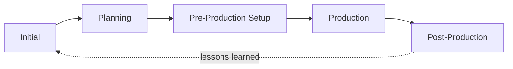
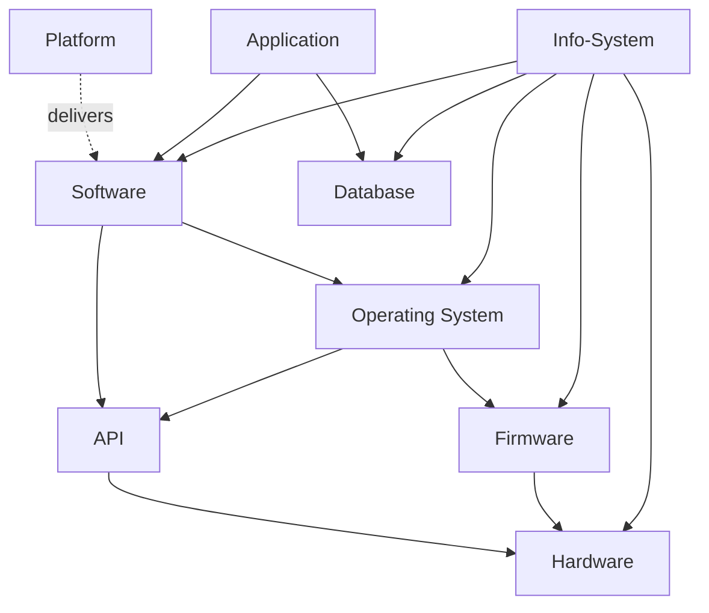
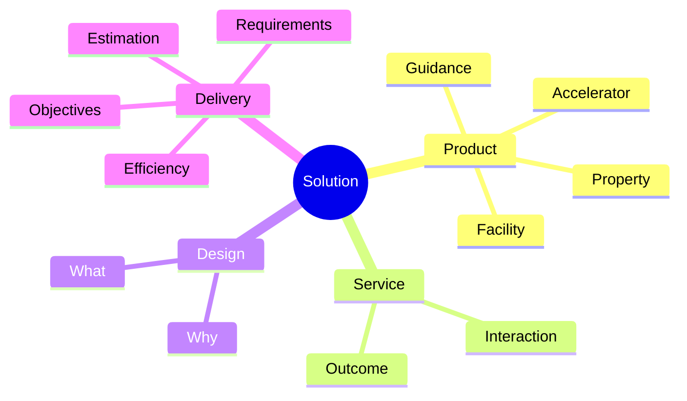

# Engineering Fundamentals

### Solutions and Delivery

| Concept | Definition |
| --------- | ------------ |
| **Solution** | An artificial phenomenon (product or service) that brings real value to a Stakeholder; intentionally designed by Team; can be defined formally, measured, and verified |
| **Product** | Any kind of tangible objects or phenomena (property/facility/guidance/accelerator) |
| **Service** | Facilities that allow getting some outcome from interaction |
| **Design** | (Abstract/usage view) Inventing, innovation, and research of WHAT product/service should be and WHY |
| **Estimation** | Anticipated amount of resources needed, made in certain assumptions about constraints, complexity, risks, and contingency |
| **Metric** | A formalized and measurable criteria applicable to state |
| **Requirements** | Defined boundaries on metrics enabling verification of success |
| **Objectives** | Intermediate achievable states supporting reaching goals |
| **Efficiency** | Ratio of measured values of gain per resources spent |

### Delivery Phases

| Phase | Activities |
| ------- | ------------ |
| **Initial** | Identifying context; defining customer problems; analyzing situation; acquiring domain knowledge; refining terminology; marketing research; defining strategy; business analysis |
| **Planning** | Product design and innovation; architecture vision; proof of model; challenging from viewpoints; choosing platforms/paradigms/technologies; estimation; risk assessment |
| **Pre-Production Setup** | Team staffing; infrastructure setup; defining processes and procedures |
| **Production** | Crafting/implementation; system integration; task coordination; research; problem solving; QA; security; optimization; documentation |
| **Post-Production** | Deployment; training; maintenance and support; tracking/measuring; adoption and evolution; lessons learned |

### Engineering and Management

| Concept | Definition |
| --------- | ------------ |
| **Engineering** | The disciplined art of delivering solutions grounded in the scientific method, applied science, math, and domain expertise, through appropriate methodologies, technologies, tools, and frameworks |
| **Paradigm** | A method of using `Knowledge` that enables evaluating and directing the Future for practical success in a given `System`.|
| **Technology** | A defined way to setup and control processes ensuring effective, reproducible, verified success |
| **Software Engineering** | Engineering in the field of software delivery on top of computer science and applied math |
| **Project** | A managed endeavor where the Team pursues Success reaching predefined Goals on top of given paradigms, technologies, and methodology |
| **Management** | A process of organizing/optimizing teams to ensure reaching goals through Governance, Control, Organization, Securing, Tracking, and Growth |
| **Team** | An interpersonal creature built on top of a group of individuals around specific goals |

### Information System Components

| Component | Definition |
| ----------- | ------------ |
| **Info-System** | An artificial system designed to perform various complex data transformation flows (hardware, firmware, OS, software, data sources) |
| **Hardware (Hw)** | Physically tangible circuits performing transformation and exchange of binary data |
| **Software (Sw)** | Executable code, configurations, and metadata defining data processing |
| **Firmware (Fw)** | Code embedded into hardware that directly controls it |
| **API** | Higher-level abstractions on top of hardware/firmware for software use |
| **Operating System** | Comprehensive set of protocol implementations and utilities providing interfaces for application programming |
| **Database** | Means to store, access, and represent structured data |
| **Application** | Software created with specific purpose providing particular functionality |
| **Platform** | Comprehensive set of technology facilities (languages, protocols, environments, tools, ecosystems) to deliver software |
| **SDLC** | One-pass or iterative cycle of interdependent phases and processes (Software Development Lifecycle) |

### Computing and Information Sciences Fields

- Information Theory
- Theory of Computation
- Systems Theory
- Operations Research
- Algorithms
- Information Systems
- Software and Systems Engineering
- Computer Networking
- Telecommunications
- Cryptography
- Internet
- Media Content and Visualization
- Graphic and Web Design
- Gaming and Metaverses

