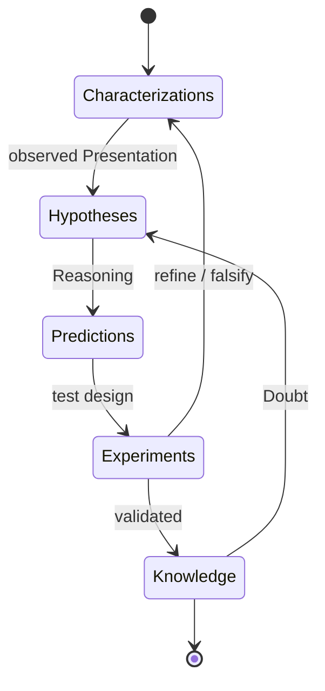

# Fundamental definitions

## Formal Language

**`Alphabet`**  
:= A finite set of endemic elements (`Symbol`).
:= `{ Symbolᵢ :: endemic }`

**`Word<Alphabet>`**
:= A `Tuple` of `Symbol`s of given `Alphabet`.
:= `[Symbolᵢ,...] :: Symbolᵢ ∈ Alphabet`

**`Dictionary<Alphabet>`** := `{ Word<Alphabet> }`
:= A `Set` of `Word`s of the same `Alphabet`.

---

**`Rule<Dictionary>`** := `(S → S') :: S, S' ∈ Dictionary`
:= An `Arrow` from/to `Word`s of the same `Dictionary`.

**`Grammar<Dictionary>`** := `{ Rule × Rule :: Rule<Dictionary>}`
:= A `Graph` on `Rule`s over the `Dictionary`.

**`Conclusion<Grammar>`** := (*Rule₁ . … . Ruleₙ) :: [Rule₁,…,Ruleₙ] ∈ Path<Grammar>`
:= A `Composition` over `Rule`s from some`Path` in the `Grammar`.

**`Expression<Word, Grammar>`** := `Conclusion<Grammar>(Word)`
:= the `Value` of some `Conclusion` within the `Grammar` for some input `Word`.

**`Theory<Word, Grammar>`** := `{ Expression<Word, Grammar> }`
:= the `Dictionary` of all `Expression`s that may be derived from the input `Word` within the `Grammar`.

---

**`Axiom<Grammar>`** := `¬∃ Word :: Expression<Word, Grammar> = Axiom`
:= `Word` that cannot be expressed in the `Grammar`.

**`Termin<Grammar>`** := `Word :: Theory<Termin, Grammar> = Zero`
:= A terminal `Expression` from which nothing more can be derived.

**`Formal-Language<Axiom,Grammar>`** := `{ Termin :: Termin ∈ Theory<Axiom, Grammar> }`
:= A `Dictionary` of all `Termin`s, expressed from given `Axiom` and `Grammar`.

## Knowledge

**`Opinion`** := An `Expression` of `Language` associated with an evaluation of whether `Presentation` belongs to `Place`.

> `Opinion :: Expression → (Presentation × Place → {0, 1})`

*NOTE*: The atomic unit of belief — a proposition asserting membership of entities in categories.

---

**`Thesis`** := A `Set` of `Opinion` in Logic.

> `Thesis := {Opinion}` in Logic

*NOTE*: `Knowledge` derived from pure reason alone — a heuristic conjecture awaiting `Validation`.

---

**`Theory`** := A set of Terms — `Name` and `Concept` — for `Opinion` over a `Language` (Logic) and an `Attribute-Space` (`Reality`).

> `Theory := ({Name}, {Concept}, Language, Attribute-Space)`

*NOTE*: A *coordinated vocabulary plus the inferential machinery* that lets `Opinion` combine into `Thesis`.

---

**`Name`** := An `Expression` of `Language` associated with `Presentation` (Entities) of the `Attribute-Space`.

> `Name :: Expression → Presentation`

*NOTE*: Picks out particular instances. Complement: `Concept`.

---

**`Concept`** := An `Expression` of `Language` associated with `Place` (regions) of the `Attribute-Space`.

> `Concept :: Expression → Place`

*NOTE*: Denotes categories rather than instances. Aligns with Frege's distinction between Sense and Reference.

---
**`Knowledge`** := A `Set` of `Opinion`s that a `Mind` uses to predict and act upon `Reality`.

> `Knowledge := {Theory, Concept, Opinion}_validated`

*NOTE*: The four properties of well-formed `Knowledge`: **adequate** (matches observed `Presentation`), **accessible** (retrievable from `Memory`), **coherent** (internally non-contradictory), **predictive** (allows anticipation of future `State`). `Knowledge` is not Being itself — only its representation.

**`Paradigm`** := A method of using `Knowledge` that enables evaluating and directing the Future for practical success in a given `System`.

> `Paradigm :: Knowledge → Solution under System`

*NOTE*: Based on empirical `Knowledge`, scientific method, and proven `Experience`. The integrated apparatus that converts `Knowledge` into `Solution` — and the central object of `Evolution`.

## Computation

**`Reasoning`** := The process of generating new *a priori* `Knowledge` (conclusions) from existing `Knowledge` (premises).

---

**`Data`** := A sequence of words of defined length that a runtime can operate on.

---

**`Inference`** := A path of `Reasoning` that either validates a given `Opinion` or constructs a new valid `Opinion`.

*NOTE*: The mechanism by which `Proof` is assembled.

---

**`Logic`** := A constructive way of inferencing based on an *a priori* foundation.

*NOTE*: The discursive machinery of a `Theory`'s `Language`.

**`Code`** := An `Azon` that responds with specific `Thought`s (Meanings) to specific `Signal`s (Messages) for a `Mind`.

> `Code :: Signal → Thought`

*NOTE*: Maps `Signal`-patterns to `Thought`-patterns — the `Message` → `Meaning` relation for a cognitive system.

---

**`Meaning`** := The `Thought` evoked in a receiver by a `Message` under a shared `Code`.

> `Meaning := Code(Message)`

*NOTE*: The output side of a `Code`'s response.

---

**`Information`** := A `Message` that has precise influence on a receiver's `Thought`.

> `Information := Message under shared Code`

*NOTE*: Distinguished from `Signal`: `Information` presupposes a shared `Code`. A `Signal` without `Code` is noise, not `Information`.

---

**`Transformation`** := Replacing input data with output data in some deterministic way.

---

**`Equational Reasoning`** := Ability to infer truths about a system from its parts; possible when composed of expressions devoid of side effects.

**`Proof`** := A `Derivation` of `Thesis` according to a `Theory`.

> `Proof := Derivation(Thesis) under Theory`

*NOTE*: Subjects themselves remain inaccessible; we form `Opinion` about their `Presentation` within specific Logics.

**`Algorithm`** := A prescription for how to apply certain transformations on data pursuing a specific goal; may halt with terminal output or never halt.

---

**`Specification`** := Formal properties used to outline expected output of an algorithm in correspondence to its input.

---

**`Correctness`** := Satisfaction of an algorithm's actual computation with respect to a priori defined specification.

---

**`Data Transformer`** := A specific circuit that deterministically consumes input, transforms it, and provides output under some `Algorithm`.

---

**`Dataflow`** := Interdependent exchange of computed data between Transformers over time.

---

**`Runtime`** := A system of transformers able to execute dataflow - recognize, store, access, interpret, and transform data.

---

**`Computation`** := The process of `Reasoning` by executiong `Dataflow` on given input by some real runtime until outcome is evaluated.

## The Scientific Method

`ScientificMethod` IS a generalized empirical ***a posteriori*** approach to earning `ScientificKnowledge` from experimental data, with awareness of cognitive abilities and `Bias`.

`Scientific Knowledge` IS a `Knowledge` that definitely meets `Scientific Criteria`.

`Scientific Criteria` IS set of principles over `Knowledge`, to accept it in terms of consistency, adequacy, reliability, predictability, completeness, and non-redundancy.

---

**`Inner Correctness`** := Should not break the axioms of logic.

---

**`Occam's Razor`** := Be minimalistic in concepts used.

---

**`Critical Resistance`** := Withstand comprehensive questioning from other points of view: be able to answer *why*, *what if not*, *what is the alternative*, *what about edge cases*.

---

**`Fair Principle`** := Highlight weaknesses of theory; look for incorrectness.

---

**`Popper Principle`** := Find ways to dismiss theory (falsifiability); keep the door open for future development, rejection, or mind-changing.

---

**`Objectiveness`** := Stand apart from subjective prejudice and preferences. Subjective claims cannot be proved true or false by any generally accepted criteria.

---

**`External Consistency`** := Be correlated with (not contradict) all existing `Knowledge` in the context.

---

**`Predictability`** := Be able to predict the behavior of the object in question.

---

**`Reproducibility`** := Should be stable when reproduced under described conditions and steps.

`Scientific process` IS an iterative process to acquire NEW *a posteriori* `Knowledge` in four phases:

1. **Characterizations** — observations, definitions, and measurements of the subject of inquiry.
2. **Hypotheses** — theoretical, hypothetical explanations of observations and measurements.
3. **Predictions** — inductive and deductive `Reasoning` from the hypothesis or theory.
4. **Experiments** — peer review and tests of all of the above.

