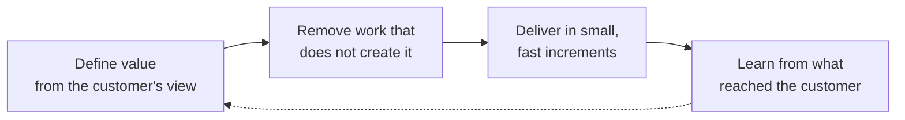

# Lean Software Development

**Lean Software Development** applies the ideas of Lean manufacturing — maximize value, remove waste, improve continuously — to building software. Mary and Tom Poppendieck set it out as seven principles in *Lean Software Development: An Agile Toolkit* (2003). It is an [agile method](02-agile.md) rather than an architectural style: it governs how a team works, not how a system is structured.

## The Seven Principles

| Principle | What it means |
| --------- | ------------- |
| **Eliminate Waste** | Remove whatever does not add value for the customer — unused features, partial work, handoffs, delays, defects, task switching; complexity past what the need requires is waste too |
| **Amplify Learning** | Treat development as a learning process: short cycles, frequent feedback, and experiments in place of arguments about what will work |
| **Decide as Late as Possible** | Keep irreversible decisions open until the last responsible moment, when the most is known; this only works if the design stays modular enough to absorb the decision when it comes |
| **Deliver as Fast as Possible** | Shorten the path from request to working software, so feedback arrives while it can still change the outcome |
| **Empower the Team** | Give the people doing the work the authority to decide how it is done, the context to decide well, and direct communication with everyone the decision touches |
| **Build Quality In** | Prevent defects rather than test them out, so quality is a property of the process instead of a phase after it |
| **Optimize the Whole** | Measure and improve the flow end to end; a local optimum in one team or stage usually costs more somewhere downstream |

## Lean Manufacturing Roots

| Idea | What it means |
| ---- | ------------- |
| **Focus on Value** | Value is defined by the customer, not by the people building — Lean Thinking's starting point |
| **Respect for People** | One of the Toyota Way's two pillars: the people closest to the work understand it best, so decisions belong near them |
| **Continuous Improvement** | The other pillar, *kaizen* — many small improvements made constantly, rather than occasional large ones |
