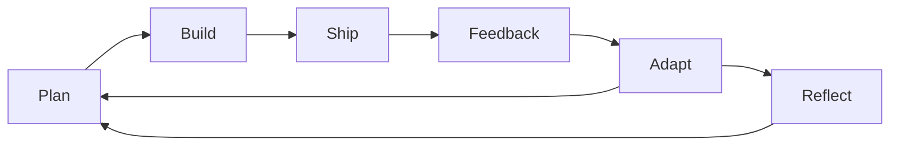
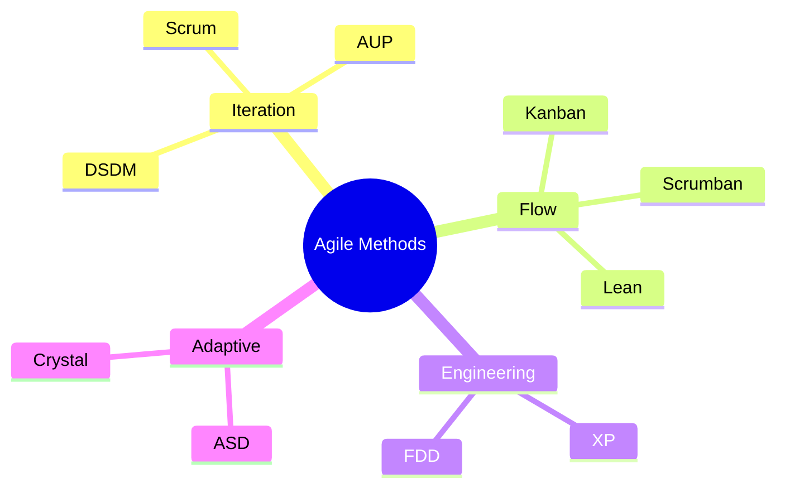

# Agile

**Agile** is an approach to organizing software development around rapid, flexible response to change rather than adherence to an up-front plan. It relies on self-organizing, cross-functional teams delivering working software in short cycles, so value reaches the customer while their needs are still current.

## Core Concepts

Requirements Volatility
: Unpredicted challenges during production: customers changing their minds, evolving technologies, shifting markets

Empirical Approach
: Accepting that the problem cannot be fully understood before starting, and maximizing the ability to deliver while adapting to feedback

Method Tailoring
: Adapting the development approach to the situation of a specific project rather than adopting a process whole

## The Manifesto Values

| Value | What it means |
| ------- | ------------- |
| **Individuals and Interactions** | Over processes and tools — a motivated, self-organizing team produces more than a well-defined process does |
| **Working Software** | Over comprehensive documentation — running software tells you more than a document describing it |
| **Customer Collaboration** | Over contract negotiation — requirements cannot be collected in full up front, so the stakeholder stays involved throughout |
| **Responding to Change** | Over following a plan — the plan is an early estimate, and what the work teaches should be allowed to change it |

## The Twelve Principles

These summarize the twelve principles published alongside the Manifesto; the authoritative wording is at [agilemanifesto.org](https://agilemanifesto.org/principles.html).

1. Satisfy the customer through early and continuous delivery of valuable software
2. Welcome changing requirements, even late in development
3. Deliver working software frequently — from a couple of weeks to a couple of months, favoring the shorter
4. Business people and developers work together daily throughout the project
5. Build projects around motivated individuals, give them what they need, and trust them
6. Face-to-face conversation is the most effective way to convey information within a team
7. Working software is the primary measure of progress
8. Sustainable development — sponsors, developers, and users can maintain a constant pace indefinitely
9. Continuous attention to technical excellence and good design enhances agility
10. Simplicity — the art of maximizing the amount of work not done — is essential
11. The best architectures, requirements, and designs emerge from self-organizing teams
12. At regular intervals the team reflects on how to become more effective, then tunes its behavior accordingly

## Agile Practices

| Practice | What it is |
| ---------- | ------------- |
| **Acceptance Test-Driven Development (ATDD)** | Agreeing acceptance criteria as executable tests before the work starts, written by business and developers together |
| **[Behavior-Driven Development (BDD)](../04-development-process/05-testing.md#behavior-driven-development-bdd)** | Specification by example: describing behavior in a shared language that doubles as the test |
| **Iterative and Incremental Development (IID)** | Building in repeated cycles, each adding working functionality rather than one more partial layer |
| **[Test-Driven Development (TDD)](../04-development-process/05-testing.md#test-driven-development-tdd)** | Writing a failing test before the code that satisfies it, in short red-green-refactor cycles |
| **[Pair Programming](../04-development-process/02-code-review.md#review-types)** | Two developers at one keyboard, so the code is reviewed as it is written |
| **Agile Modeling** | Keeping models and documents only as detailed as the work in hand requires |
| **Cross-Functional Team** | One team holding every skill needed to deliver, so work does not queue between departments |
| **[Continuous Integration (CI)](../04-development-process/03-ci-cd.md)** | Merging to a shared mainline frequently, with an automated build and test on every merge |
| **Information Radiators** | Displays that make progress visible without anyone asking: scrum board, task board, burndown chart |
| **[Refactoring](../04-development-process/05-testing.md#test-driven-development-tdd)** | Changing the structure of code without changing its behavior, to keep it workable as it grows |
| **Agile Testing** | Testing continuously through the iteration rather than as a separate phase after it |
| **Timeboxing** | Fixing the time available and adjusting scope to fit, rather than moving the deadline |
| **User Story** | A requirement stated from the user's point of view, small enough to finish inside one iteration |

## Agile Methods

- [Scrum](03-scrum.md)
- Kanban
- Scrumban
- Agile Unified Process (AUP)
- Dynamic Systems Development Method (DSDM)
- [Lean Software Development](01-lean.md)
- [Extreme Programming (XP)](04-extreme-programming.md)
- Feature-Driven Development (FDD)
- Adaptive Software Development (ASD)
- Crystal Clear Methods

