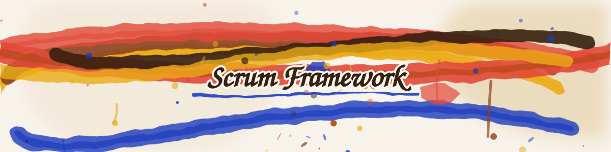
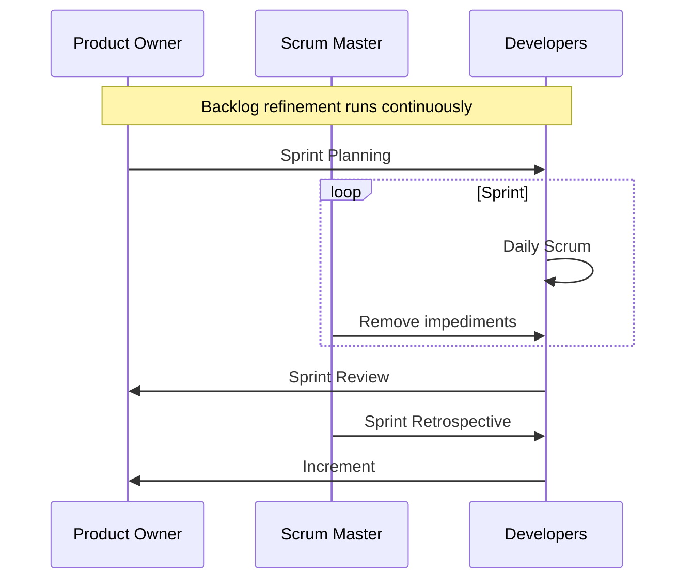
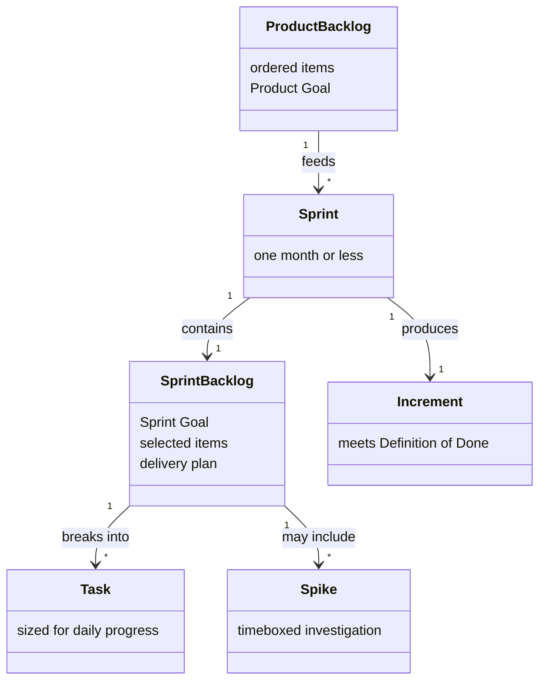

# Scrum

**Scrum** is a lightweight framework for generating value through adaptive solutions to complex problems. It works [empirically](02-agile.md): the team inspects a real product Increment at short, fixed intervals and adapts, instead of committing to a plan written when the least was known. This guide follows the 2020 Scrum Guide, whose terms differ from the ones still in wide circulation.

## Pillars and Values

| Pillar | What it requires |
| ------ | ---------------- |
| **Transparency** | The work and its outcome are visible to everyone doing it and everyone receiving it |
| **Inspection** | Progress toward the agreed goals is checked frequently and against something real |
| **Adaptation** | The plan or the process is adjusted as soon as inspection shows it is off track |

The Guide names five values the team is expected to live by: commitment, focus, openness, respect, and courage.

## The Scrum Team

One Product Owner, one Scrum Master, and the Developers — a single team with no sub-teams and no hierarchy inside it. The 2020 Guide replaced the earlier **Development Team** with **Developers**, an accountability within the Scrum Team rather than a team inside a team; older material uses the retired term.

| Accountability | What it covers |
| -------------- | -------------- |
| **Product Owner** | Maximizing the value of the product; owns the Product Backlog and the order of its items |
| **Scrum Master** | The team's effectiveness, and Scrum being understood and practiced as the Guide defines it |
| **Developers** | Creating a usable Increment each Sprint, and holding themselves to the Definition of Done |

## Scrum Events

The Sprint contains the other four. Each is a formal opportunity to inspect and adapt, which is why skipping one removes an inspection point rather than saving time.

| Event | Purpose | Timebox |
| ----- | ------- | ------- |
| **Sprint** | Fixed-length cycle that holds all other events; the next begins as soon as one ends | One month or less |
| **Sprint Planning** | Agree the Sprint Goal, select Product Backlog items, and plan how to deliver them | Eight hours for a one-month Sprint |
| **Daily Scrum** | Developers inspect progress toward the Sprint Goal and adapt the plan for the coming day | 15 minutes |
| **Sprint Review** | Inspect the Increment with stakeholders and adapt the Product Backlog accordingly | Four hours for a one-month Sprint |
| **Sprint Retrospective** | Inspect how the Sprint went and pick the most useful improvements to act on | Three hours for a one-month Sprint |

Backlog refinement is an ongoing activity, not an event: the Product Owner and Developers add detail, order, and size to Product Backlog items as the work ahead becomes clearer.

## Scrum Artifacts

Scrum defines three, each paired with a commitment that gives it focus. Anything else a team tracks is a local practice, not an artifact.

| Artifact | What it holds | Commitment |
| -------- | ------------- | ---------- |
| **Product Backlog** | Ordered list of everything known to be needed to improve the product | **Product Goal** — the long-term objective the team plans toward |
| **Sprint Backlog** | The Sprint Goal, the items chosen for this Sprint, and the plan to deliver them | **Sprint Goal** — the single objective that makes the Sprint coherent |
| **Increment** | A usable step toward the Product Goal, added to every Increment before it | **Definition of Done** — the quality bar an item must meet to count as complete |

## Supporting Practices

Widely used alongside Scrum, and absent from the Guide — a team can drop any of them and still be doing Scrum.

| Practice | What it is |
| -------- | ---------- |
| **Task** | A unit a Sprint Backlog item is broken into, small enough that its progress is visible at the Daily Scrum |
| **Spike** | A timeboxed investigation that answers a question or prototypes an approach before the work is estimated |
| **Story Point** | Relative unit for the overall size of a backlog item — effort, complexity, and uncertainty together, deliberately not hours |
| **Velocity** | Story Points a team completes per Sprint, averaged over recent Sprints to inform how much to plan for the next one |
| **Sprint Burn-down Chart** | Remaining Sprint Backlog work plotted day by day across the Sprint |
| **Release Burn-down Chart** | Remaining work across a release, tracked at Product Backlog item level |

