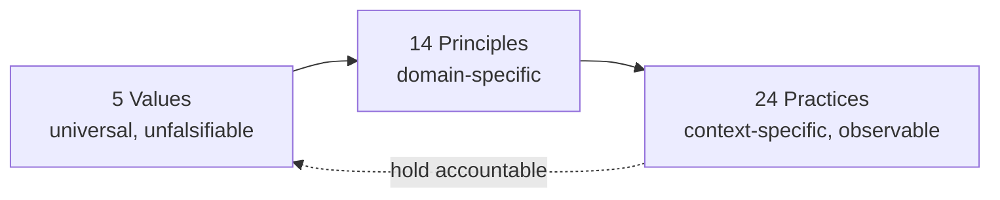
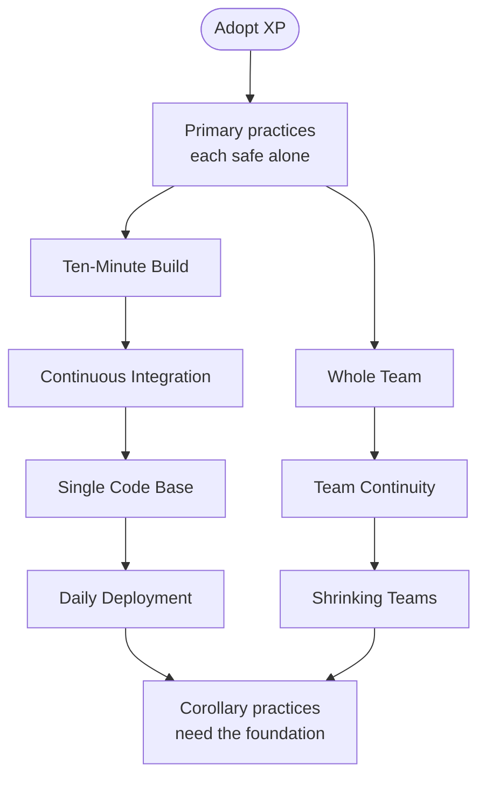

**Extreme Programming (XP)** is an [agile method](02-agile.md) that organizes a team around a fixed set of engineering practices rather than around a planning ceremony.

Kent Beck set it out in *Extreme Programming Explained: Embrace Change* (1999), and rewrote it substantially with Cynthia Andres for the second edition (2004). The name comes from the method's construction rule: take a practice that is already known to help, and apply it at a level most teams would call excessive.

Reviewing code helps, so XP reviews continuously by having two people write it together. Restructuring code helps, so XP restructures a little every day instead of scheduling a redesign.

Where [Scrum](03-scrum.md) defines a container — roles, events, artifacts — and leaves the engineering to the team, XP prescribes the engineering and leaves the container mostly implicit. The two are often run together for that reason.

## Core Concepts

XP is built in three layers, and the second edition argues that all three are needed.

A Value alone is unfalsifiable.
A Practice alone is context-free and cargo-cults easily.
Principles connect them.

Value
: Criterion a team judges its own behavior against, stated without reference to any situation and therefore never directly actionable

Principle
: Domain-specific bridging rule that turns a Value into a choice a team can make in a concrete situation

Practice
: Behavior a team either performs or does not, observable from outside the team and therefore checkable

 **Primary Practice**  safe to adopt on its own, before any other part of the method is in place.**Corollary Practice**  depends on several Primary Practices already working, and is difficult or dangerous to adopt first

A Practice in this sense is a *behavior*, not a recommendation. The evaluative sense — an approach accepted as superior for a given context — is defined as [Best Practice](index.md#core-concepts) in the chapter overview.

## The Five Values

| Value | What it means |
| --- | --- |
| **Communication** | When a problem appears, ask what communication would have prevented it and what communication resolves it now |
| **Simplicity** | Ask what the simplest thing is that could possibly work, then build that and no more |
| **Feedback** | Seek the shortest loop between a decision and evidence about it, because the sooner you know, the cheaper the correction |
| **Courage** | Act effectively in the face of fear — say the unwelcome thing, throw away the failing design; dangerous alone, useful with the other four |
| **Respect** | Care about the other members of the team and about the work itself; without it the other values are performances |

## The Fourteen Principles

| Principle | What it means |
| --- | --- |
| **Humanity** | People have needs — safety, accomplishment, belonging, growth — and a process that requires them to be permanently sacrificed will not be followed |
| **Economics** | Somebody pays for the work; a technical success that meets no business need is a hollow one |
| **Mutual Benefit** | Every activity should benefit everyone it touches, now and later — the hardest principle to hold to, and the one most often traded away |
| **Self-Similarity** | Copy the structure of a solution that works into a new context, including at a different scale |
| **Improvement** | "Perfect" is a verb, not an adjective: there is no perfect process or design, only the act of perfecting one |
| **Diversity** | Every team has conflict; a team with varied skills and perspectives has the raw material to resolve it productively |
| **Reflection** | Good teams think about how and why they are working, not only about the work |
| **Flow** | Deliver value in smaller increments, more often, rather than in phases |
| **Opportunity** | Treat each problem as an occasion to change how the team works, not merely something to survive |
| **Redundancy** | Overlapping practices catch the same defects by different routes; no single practice solves the defect problem |
| **Failure** | When you do not know what to do, failing teaches faster than talking — this excuses ignorance, not carelessness |
| **Quality** | Quality is not a control variable: raising it usually delivers sooner, and lowering it usually delivers later and less predictably |
| **Baby Steps** | Ask what the smallest step is that is recognizably in the right direction, because a reverted small step costs little |
| **Accepted Responsibility** | Responsibility can only be accepted, never assigned; work given to someone who has not accepted it does not become theirs |

Mutual Benefit is the principle that most often decides whether a practice is worth adopting. Beck's own example is exhaustive internal documentation: one person suffers now so a hypothetical person benefits later, which fails the test. The same test applies to any artifact one person produces for another to consume.

## The 24 Practices

The second edition splits the practices into thirteen primary and eleven corollary. The split is an adoption order, not a ranking: primary practices are individually safe to start with, while corollary ones assume a foundation.

### 13 Primary Practices

| Practice | What it is |
| --- | --- |
| **Sit Together** | Develop in a space large enough for the whole team, with room to pair |
| **Whole Team** | Put every skill the project needs on one team, so work does not queue between departments |
| **Informative Workspace** | Make the state of the project readable from the room in about fifteen seconds |
| **Energized Work** | Work only the hours you can be productive and can sustain indefinitely |
| **[Pair Programming](../04-development-process/02-code-review.md#review-types)** | Write all production code with two people at one machine |
| **Stories** | Plan in units of customer-visible functionality, named early and estimated early |
| **Weekly Cycle** | Plan a week at a time, starting with a review of what the last week actually produced |
| **Quarterly Cycle** | Plan a quarter at a time, and use the boundary to check alignment with larger goals |
| **Slack** | Include work in every plan that can be dropped without breaking the commitment |
| **Ten-Minute Build** | Build the whole system and run every test automatically in ten minutes |
| **[Continuous Integration](../04-development-process/03-ci-cd.md)** | Integrate and test changes after no more than a couple of hours |
| **[Test-First Programming](../04-development-process/05-testing.md#test-driven-development-tdd)** | Write a failing automated test before changing any code |
| **Incremental Design** | Invest in design every day, fitting the design to what the system needs that day |

### 11 Corollary Practices

| Practice | What it is |
| --- | --- |
| **Real Customer Involvement** | Put people whose business the system affects on the team, with a share of capacity to spend as they choose |
| **Incremental Deployment** | When replacing a legacy system, take over its workload gradually, starting early |
| **Team Continuity** | Keep effective teams together; value lives in relationships as much as in individual skill |
| **Shrinking Teams** | As a team's capability grows, hold its workload constant and reduce its size, freeing people to form new teams |
| **[Root-Cause Analysis](../04-development-process/04-quality-assurance.md#root-cause-analysis)** | For every defect found after development, remove the defect and the cause that let it in |
| **Shared Code** | Anyone on the team may improve any part of the system at any time |
| **Code and Tests** | Keep only code and tests as permanent artifacts, and generate other documents from them |
| **[Single Code Base](../04-development-process/01-version-control.md#branch-lifetime)** | One code stream; temporary branches are allowed but must not outlive a few hours |
| **Daily Deployment** | Put new software into production every night |
| **Negotiated Scope Contract** | Fix time, cost, and quality in the contract, and negotiate scope continuously |
| **Pay-Per-Use** | Charge for use rather than per version or per upgrade, so revenue tracks the value actually delivered |

## How the Practices Have Held Up

XP's practices did not survive as a package. Some became industry defaults and stopped being attributed to XP at all; others are still argued about. One useful recent reading is Anton Zaides' *Extreme Programming 1999→2026* (Manager.dev, August 2026), written after rereading the book against current conditions. He sorts the twenty-four into four groups. This is one practitioner's reading, not a measured result, but the grouping is a fair map of where the disagreement sits.

| Group | Practices | The argument |
| --- | --- | --- |
| **More critical than ever** | Whole Team, Team Continuity, Shrinking Teams, Energized Work, Real Customer Involvement | These are all about people, and the pressures that erode them — reorgs, treating engineers as interchangeable capacity, productivity gains absorbed rather than returned — have grown, not shrunk |
| **Contested** | Pair Programming, Code and Tests, Incremental Design, Test-First Programming | Each is defensible; the word that draws the objection is the absolute one — *all* production code paired, *only* code and tests kept |
| **Absorbed as common sense** | Single Code Base, Daily Deployment, Ten-Minute Build, Continuous Integration, Root-Cause Analysis, Negotiated Scope Contract, Shared Code | Now ordinary engineering hygiene, and mostly discussed without reference to XP |
| **Reshaped by remote work and tooling** | Stories, Weekly Cycle, Quarterly Cycle, Slack, Incremental Deployment, Sit Together, Informative Workspace, Pay-Per-Use | The intent survives but the mechanism assumed a physical room and a slower cadence; Sit Together and Informative Workspace in particular need a different implementation |

Two of the contested four are worth stating precisely, because they are the ones most often used to dismiss the method as a whole:

- **Pair Programming.** The objection is to *all*, not to pairing. Beck himself notes that most programmers cannot pair more than five or six hours a day, which is already a limit on the practice. A team that pairs on unfamiliar or high-risk work and not on routine work has kept the Feedback and Communication values while dropping the absolute.
- **Code and Tests.** The objection is to *only*. The practice assumes social mechanisms carry project history, which fails on long-lived systems and on teams that turn over. The [Move Humans to the Left](05-move-humans-to-the-left.md) approach is a way to keep the intent — no artifact maintained by hand that a machine could derive — without the claim that nothing but code and tests should exist.

XP's own principles are the right tool for judging a practice, including practices XP never named. Ask of any proposed way of working: does it satisfy Mutual Benefit, or does one party absorb the cost so another gains? Does it respect Humanity, or does it assume people are elastic? Does it treat Quality as a control variable? A practice that fails those tests will not hold, whatever its short-term numbers look like.

## Relationship to Other Methods

| Method | How it relates |
| --- | --- |
| **[Agile](02-agile.md)** | XP predates the 2001 Manifesto and Beck was a signatory; several Manifesto principles restate XP values |
| **[Scrum](03-scrum.md)** | Complementary — Scrum defines the container and leaves engineering practice open, which is the part XP specifies |
| **[Lean Software Development](01-lean.md)** | Shares the small-batch and fast-feedback reasoning; Lean argues it from flow economics, XP from defect cost |
| **[Technical Debt](../04-development-process/07-technical-debt.md)** | Incremental Design and Root-Cause Analysis are XP's answer to debt: pay it continuously rather than schedule repayment |

## References

- Kent Beck, *Extreme Programming Explained: Embrace Change*, 1st edition (Addison-Wesley, 1999)
- Kent Beck with Cynthia Andres, *Extreme Programming Explained: Embrace Change*, 2nd edition (Addison-Wesley, 2004) — the source of the five values, fourteen principles, and twenty-four practices above
- Anton Zaides, [Extreme Programming 1999→2026](https://www.manager.dev/newsletter/extreme-programming-1999-2026), Manager.dev, August 2026
