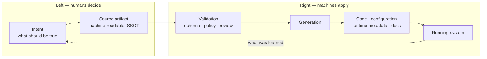

# Move Humans to the Left

## Idea

The core idea of the approach is:

- to allow humans to work collaboratively on machine-readable artifacts as SSOT
- those artifacts are then transformed by code generation into software code, runtime metadata, or configuration
- that covers the gaps in the process where humans have to do things by hand, keep them in sync, and apply the same change repeatedly, when a program could do it instead

> To move Humans to the Left!

## Explanation

*Left* and *right* describe a pipeline running from intent to a running system. On the left, someone
decides what should be true. On the right, that decision takes effect — a service answers a request,
a queue exists, a dashboard shows a number.

This approach moves the *humans themselves*, and then removes them from the right entirely.

A person still makes every decision that needs judgement, but makes it once, in one place, in a form a machine can read.

> Everything downstream is derived.

Moving humans left lowers the number of places a defect can be *introduced*: every manual step right of the source is an opportunity to mistype, forget an environment, or apply a change nobody reviewed.

In [Lean](01-lean.md) terms this is *Eliminate Waste* aimed at a specific kind of waste — handoffs, partial work, and task switching — and *Build Integrity In*, because everything downstream is generated from one source that can be checked before anything is built from it, so the derived pieces cannot drift out of agreement with each other.

### What Moves

The unit of change is the *human touchpoint*: any step that cannot advance until a person reads
something, decides, and applies the decision somewhere by hand. Each one costs latency (it waits for
a person), attention (a person must hold the context), and correctness (a person can apply it wrong,
partially, or not at all).

| Touchpoint on the right | Where it moves to | What the machine does instead |
| --- | --- | --- |
| Hand-writing a client to match a documented endpoint | Editing the contract | Generates client, server stubs, validators, and mocks from it |
| Clicking through a cloud console to add a resource | Editing the infrastructure definition | Plans the diff, then reconciles the account to match |
| Repeating one config change across three environments | Editing a single declaration | Renders every environment from it |
| Updating a spreadsheet after an event name changes | Editing the event schema | Regenerates SDK types, warehouse tables, and dashboard queries |
| Writing prose that describes what the code does | Annotating the code or schema | Generates the reference documentation |

### What Makes It Work

The approach fails quietly when any one of these is missing.

| Precondition | Why it is required |
| --- | --- |
| **Authoritative source** | Nothing to the right may be hand-edited; the moment generated output becomes editable, the source stops being the source |
| **Deterministic transformation** | The same input must always produce the same output, or the result cannot be reviewed, diffed, or trusted |
| **Cheap regeneration** | Generation runs on every build, not once at project setup; output generated once is a template, not a single source of truth |
| **Right altitude** | The notation must express the decision at the level of the people who own it, or it stops being somewhere they can collaborate |
| **Escape hatches** | Defined extension points for what the model does not cover, so nobody has to patch generated output to ship |

## Key Concepts

| Concept | Definition |
| --- | --- |
| **Left** | The point in a pipeline where a decision is first expressed, before anything derives from it |
| **Right** | The point where a decision takes effect in a running system |
| **Human Touchpoint** | A step that cannot advance without a person reading, deciding, and applying the result by hand |
| **Source Artifact** | The machine-readable file people author and review; the one representation the pipeline treats as authoritative |
| **Generator** | The deterministic, repeatable transformation that turns a Source Artifact into what a machine actually runs |
| **Derived Artifact** | Anything a Generator produces — code, configuration, runtime metadata, schemas, documentation |
| **Collaboration Surface** | A Source Artifact written so every role with a stake in the decision can read and change it, not only engineers |
| **Authoring-time Validation** | Schema, lint, and policy checks applied to a Source Artifact as it is written; the leftmost point at which a defect can be caught |
| **Manual Gap** | A step that exists only because nobody automated it — the thing this approach looks for |
| **Drift** | Divergence between a Source Artifact and what is actually running; it appears wherever a Derived Artifact can be edited independently |
| **Regeneration** | Re-running every Generator from unchanged sources; an empty diff is the evidence that there is no Drift |

## Benefits and Trade-offs

### Benefits

| Benefit | Why it follows |
| --- | --- |
| **Contradiction becomes impossible** | Two representations cannot disagree when only one is written and the rest are regenerated from it |
| **Change cost stops scaling with fan-out** | A fourth environment or a fifth client language costs one generator run, not four more edits |
| **Review moves to the decision** | The diff people argue over is the intent itself, not its transcription into YAML across six repositories |
| **Defects surface at authoring time** | A schema or policy check on the source runs before anything is built from it, which is the cheapest point in the pipeline |
| **Non-engineers can hold the pen** | A well-chosen notation lets the person who owns the decision make it directly, removing a handoff instead of speeding one up |
| **Onboarding shrinks** | A newcomer reads one artifact per concern instead of reconstructing intent from its scattered consequences |

### Costs

| Cost | Note |
| --- | --- |
| **A build step to own** | The generator becomes production infrastructure, needing its own versioning, tests, and rollback story |
| **Coupling to one cadence** | Every consumer inherits the source's release schedule, and a breaking change to the notation breaks all of them at once |
| **Debugging through a layer** | Stack traces, editor navigation, and refactoring land in generated code that nobody wrote |
| **Modeling paid upfront** | The notation must be designed before it returns anything, and a wrong abstraction spreads everywhere once it is canonical |
| **An expensive tail** | The last few percent the model cannot express often costs more than the automation saved on the rest |

### Failure Modes

| Failure mode | What it looks like |
| --- | --- |
| **Scaffolding mistaken for generation** | Output generated once at setup, then hand-edited forever; the source is now a stale template |
| **Inner platform** | The notation grows conditionals, loops, and variables until it is a worse programming language than the one it replaced |
| **Wrong altitude** | The artifact encodes implementation detail, so only engineers can read it and no handoff was actually removed |
| **Bidirectional sync** | Source and output are both writable and something tries to merge them; conflict resolution becomes an unbounded problem |
| **Leaky generator** | Errors are reported against generated line numbers, so a mistake in the source surfaces in a file nobody recognizes |
| **Ceremony without derivation** | A machine-readable artifact that nothing consumes — a specification kept beside the code, agreeing with it only by discipline |

### When It Pays

Worth doing when the same decision is expressed in more than two places, when the artifact crosses a
team boundary, or when inconsistency between copies is a correctness bug rather than a cosmetic one.
Not worth doing for a decision made once, held in one place, and unlikely to fan out — there the
generator costs more than the touchpoint it removes.

## Examples

| Domain | Humans author on the left | Machines derive on the right | Manual gap it closes |
| --- | --- | --- | --- |
| **Service contracts** | OpenAPI, Protobuf, or GraphQL SDL | Server stubs, typed clients, request validation, mocks, reference docs | Hand-written clients drifting from the endpoint they call |
| **Infrastructure** | Terraform or CDK definitions | Provisioned cloud resources, reconciled continuously | Console clicks nobody reviewed and nobody can reproduce |
| **Cluster state** | Kubernetes manifests held in Git | Applied workloads, kept converged by a controller | Ad-hoc `kubectl apply` from a laptop, with no record of who changed what |
| **Database schema** | Migration files or a schema definition | Tables, indexes, ORM entities, typed query results | Entity classes edited to match a schema someone else already changed |
| **Configuration** | One typed declaration per concern | Rendered environment files, secret references, feature-flag accessors | The same value copied into three environments and updated in two |
| **Analytics** | An event taxonomy with typed properties | Tracking SDK types, warehouse tables, dashboard queries | A spreadsheet of event names that stops matching what is emitted |
| **Design system** | Design tokens | CSS custom properties, native theme files, editor variables | Hex codes retyped per platform and re-diverged at the next redesign |
| **Authorization** | Policy as code | Enforcement at the gateway, inside services, and in CI checks | Permission rules restated per service, each version slightly different |
| **Architecture docs** | A model written in a diagram DSL | Rendered diagrams embedded wherever they are needed | Diagrams exported as images, last accurate two releases ago |

### A Worked Example

A team adds one field to an order record. Without a source artifact, that field has to appear in a
migration, an entity class, a DTO, a serializer, an API document, two client SDKs, a test fixture,
and a dashboard query — nine edits, spread across four people, taking as long as the slowest handoff
between them. Any one can be missed, and a missed one becomes a defect discovered in production
rather than in review.

With the record declared once, the same change is a single edit to the schema plus a regeneration.
The nine artifacts still exist; nobody writes them. What remains for a person is whether the field
belongs at all, which was the only part that ever needed judgement.

## Tools

| Concern | Source notation | Generators and appliers |
| --- | --- | --- |
| **HTTP contracts** | OpenAPI, TypeSpec, Smithy | openapi-generator, oapi-codegen, orval |
| **RPC and messaging contracts** | Protobuf, Avro, AsyncAPI | protoc language plugins, Buf, AsyncAPI Generator |
| **Graph contracts** | GraphQL SDL | GraphQL Code Generator, Apollo tooling |
| **Infrastructure** | Terraform HCL, AWS CDK, Pulumi | Terraform, OpenTofu, `cdk synth`, Crossplane |
| **Cluster state** | Kubernetes manifests, custom resources | Helm, Kustomize, Argo CD, Flux, operators |
| **Database** | Prisma schema, SQL migrations, dbt models | Prisma Client, sqlc, Flyway, Liquibase, dbt |
| **Typed configuration** | CUE, Dhall, Jsonnet, JSON Schema | `cue export`, dhall-to-yaml, jsonnet, schema-derived types |
| **Policy** | Rego, Cedar, Kyverno policies | OPA, Conftest, admission controllers |
| **Design tokens** | A token file in the DTCG format | Style Dictionary, platform theme exporters |
| **Developer portal** | Catalog entries and software templates | Backstage catalog and scaffolder |
| **Architecture and docs** | C4 DSL, PlantUML, Mermaid, ADR files | Structurizr, docs-as-code site builders |
| **In-language generation** | Annotations and attributes | Java annotation processors, Kotlin KSP, C# source generators, `go:generate` |

### Where Generation Is Not Deterministic

A language model can turn a specification into code no template could produce, which widens what is
worth expressing as a Source Artifact. It also breaks the property the rest of this page rests on:
the same input no longer yields the same output, so the result cannot be treated as a cache that
Regeneration will restore.

The workable position is to treat model output as human-authored code that a machine drafted —
commit it, review it, test it — while keeping the specification as the artifact people actually
argue over. What moves left is the writing. What stays is the judgement.

*Guidance*: look for the Manual Gaps first, not for something to generate. The gap is the evidence
that a decision is being applied by hand; the notation and the generator are only how it gets
closed.

*See also*: [Single Source of Truth](../05-coding/02-design-principles.md#single-source-of-truth-ssot)
for the design principle this rests on, [Metaprogramming](../05-coding/01-programming-paradigms.md#metaprogramming)
for the generation mechanisms, and [Quality Assurance](../04-development-process/04-quality-assurance.md)
for the classic shift left it extends.
