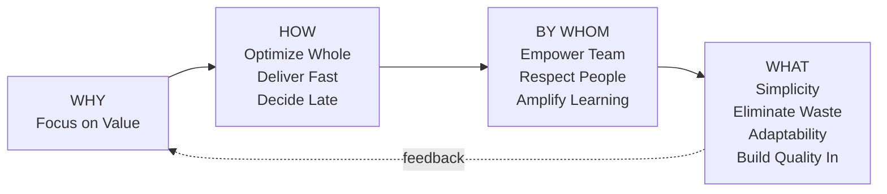

## Lean Architecture

Lean Architecture is derived from principles of Lean Thinking and Lean Manufacturing,
primarily used in software development, systems design, and enterprise architecture.

**Focus**: Maximizing value, minimizing waste, creating systems that are adaptable, scalable, and aligned with business goals.

> *"Think big, act small, fail fast; learn rapidly"*

### Key Principles

#### WHY

| Principle | Description |
| ----------- | ------------- |
| **Focus on Value** | Prioritize delivery of value to end-user; ensure every aspect of design adds value |

#### HOW

| Principle | Description |
| ----------- | ------------- |
| **Optimize the Whole** | Architecture should not be optimized in isolation but as part of a larger system |
| **Deliver as Fast as Possible** | Deliver customer value early and continuously; shorten time to market; enable fast feedback loops |
| **Decide as Late as Possible** | Avoid making decisions too early; remain open to change and new information (Last Responsible Moment) |

#### BY WHOM

| Principle | Description |
| ----------- | ------------- |
| **Empower the Team** | Trust collective wisdom; foster collaboration between architects, developers, operations, and stakeholders |
| **Respect for People and Culture** | People are at the heart; foster continuous improvement; respect insights of all involved |
| **Collaboration and Communication** | Promote close collaboration and open communication among all stakeholders |
| **Integrated Project Delivery (IPD)** | Integrate people, systems, business structures to optimize results and reduce waste |
| **Amplify Learning** | Build architecture encouraging fast feedback and learning; involve stakeholders early |
| **Continuous Improvement** | Encourage culture where feedback and lessons enhance future processes |

#### WHAT

| Principle | Description |
| ----------- | ------------- |
| **Simplicity** | Design systems as simple as possible while meeting business needs; reduce complexity |
| **Eliminate Waste** | Identify and remove wasteful elements: unnecessary features, redundant systems, overly complex structures |
| **Flexibility and Adaptability** | Design for change; systems should be modular, decoupled, able to evolve with minimal disruption |
| **Build Quality In** | Quality embedded from the beginning; systems designed to be robust, maintainable, easy to evolve |
