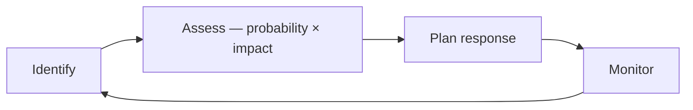

# Methodology

This chapter covers how engineering work gets organized: the vocabulary for turning a goal into executed work, and the named approaches built on top of it. 

The vocabulary lives on this page; each approach has its own guide. Terms the whole book shares, such as Solution, Goals, Objectives, and Success, are defined once in the [Glossary](../00-software-engineering/01-glossary.md) and used here without redefinition.

---

## In This Chapter

| Doc | What it covers |
| --- | --- |
| **[Lean Software Development](01-lean.md)** | Seven principles for maximizing customer value and removing waste, adapted from Lean manufacturing |
| **[Agile](02-agile.md)** | The values and twelve principles of the Agile Manifesto |
| **[Scrum](03-scrum.md)** | The team, events, and artifacts of Scrum, as the 2020 Scrum Guide defines them |
| **[Extreme Programming](04-extreme-programming.md)** | The five values, fourteen principles, and twenty-four engineering practices of XP, and which have held up |
| **[Move Humans to the Left](05-move-humans-to-the-left.md)** | Authoring machine-readable artifacts as the single source of truth, so machines apply every downstream change |
| **[Engineering Management](06-engineering-management.md)** | Planning, prioritization, estimation, risk, delegation, and the metrics that show whether the loops are closing |

## Core Concepts

Strategy
: The chosen direction for reaching a Goal under bounded resources — which Objectives to pursue, in what order, and what to forgo; Analysis justifies it, a Plan realizes it

Method
: An organized set of predefined decisions, triggers, and choices that control how a process runs

Framework
: A Method made executable — predefined options a user chooses from, constrained so the resulting state stays valid

Best Practice
: A Method accepted as superior for a given context because it reliably produces better outcomes there; context-bound, not absolute

A Framework in this sense runs a process, not code. The software sense — a component that owns the control flow and calls the application through the extension points it defines — is defined as [Software Framework](../03-system-design/index.md#information-system) in System Design.

Strategy here is the chosen direction itself. The planning cadence that produces and corrects it is the Strategy stage of the [Management Flow](06-engineering-management.md#management-flow).

## Solution Stages

The stages by which a goal becomes executed work.

Analysis
: Survey of internal resources and external conditions, partitioned as a SWOT

Plan
: Ordered sequence of work with the resources, roles, and schedule that realize an objective

Task
: Atomic unit of a Plan, carrying a purpose, a definition of done, required resources, an owner, a timeline, dependencies, and a status

Monitoring
: Continuous evaluation of progress against the Plan and adaptation when conditions shift; failure to monitor is failure to act

## Planning Concepts

The variables a Plan is negotiated with, and the conditions that constrain it.

Scope
: Set of work items accepted as in-bounds for an objective\
  *The cheapest planning variable to change; time and quality are not*

Capacity
: Effort realistically available in a period, once meetings, support, and leave are taken out\
  *Always below headcount multiplied by working hours*

Priority
: Total ordering of work items by value against cost and risk\
  *If everything is priority one, nothing is*

Commitment
: Promise made with known Scope, known Capacity, and accepted Risk\
  *Without capacity data it is a wish*

Risk
: Uncertain event that would affect an objective, sized as probability multiplied by impact

Dependency
: Work whose completion is required by other work, inside or outside the team\
  *Cross-team ones sit outside the team's control, so track them explicitly*

Constraint
: Fixed boundary — budget, deadline, compliance, headcount — that planning must respect rather than optimize away

These are the terms [Engineering Management](06-engineering-management.md) plans with; that guide applies them, and does not redefine them.

### SWOT Analysis

**SWOT**: Four-cell partition of a situation into Strengths, Weaknesses, Opportunities, and Threats.

Strengths
: Internal factors that give an advantage — resources, expertise, processes, relationships

Weaknesses
: Internal factors that hold back — missing resources, skills, or capabilities

Opportunities
: External factors worth exploiting — market trends, emerging technologies, unserved segments

Threats
: External factors that can cause harm — competition, downturns, shifting preferences, disruption

### SMART Goals

**SMART**: Five criteria that make a goal *actionable*: Specific, Measurable, Achievable, Relevant, and Time-bound.

Specific
: Clear and well-defined enough to answer who, what, when, where, and why

Measurable
: Quantifiable, so progress can be tracked by Monitoring

Achievable
: Realistic given the resources and conditions in play

Relevant
: Aligned with the higher-level aims it serves, so local wins do not cost more elsewhere

Time-bound
: Anchored to a defined timeframe or deadline

## Problem Solving

Problem
: A factor that prevents or impedes progress toward a goal: conflicting interests, missing resources, a runtime failure, or a misunderstanding

Failure
: An attempt that does not reach its goal, or reaches it at a cost that outweighs the gain; informative, because it narrows what the next attempt must account for

Trade-off
: A choice in which one need is met at a measurable cost to another; unavoidable whenever resources are bounded and needs are multiple

Contingency
: Buffer reserved for Problems that cannot be anticipated, as distinct from the risks that can be

### Solving Approaches

The four stances a team can take toward a Problem, as set out by Russell Ackoff, plus one decomposition tactic.

Absolving
: Ignoring a Problem in the hope that it resolves itself; valid when acting costs more than the Problem does

Resolving
: Settling for a good-enough answer drawn from past experience, trial and error, or common sense; fast, not optimal

Solving
: Studying the Problem deeply enough to build a predictable model and choose the best available answer

Dissolving
: Redesigning the surrounding system so the conditions that produced the Problem no longer exist

Dividing and Conquer
: Breaking a Problem into sub-problems until each is trivial, then composing the results; a tactic rather than a stance, so it combines with any of the four

## Risk Management

| Response | When to use |
| --- | --- |
| **Avoid** | Impact unacceptable, alternative path exists |
| **Mitigate** | Reduce probability or impact (spike, prototype, phased rollout) |
| **Transfer** | Another party is better positioned (vendor, insurance, platform team) |
| **Accept** | Cost of response exceeds expected loss — record the decision |

Keep the risk list short and live. Each entry: description, probability, impact, owner, response, review date. A risk without an owner is not managed.
