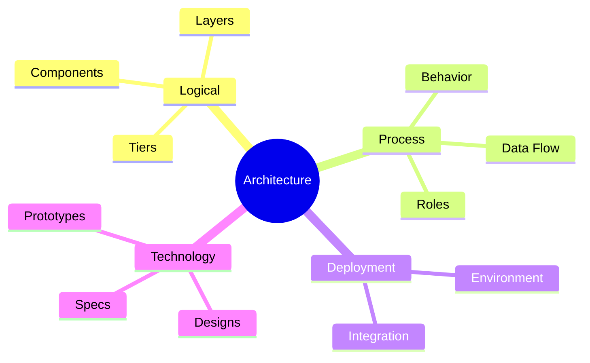
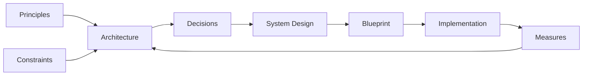

# System Architecture

**System Architecture** is the fundamental high-level holistic vision of a system, its structure, and entire data flow.

SA incorporates, captures, and conveys:

- **Principles** guiding design and evolution
- **Aspects** that make a system function as it should
- Significant **Decisions** against business expectations
- General goals, constraints, technical characteristics
- **Measures** to ensure the system satisfies its intended purpose

> *"SA as a discipline is an art of choosing the cheapest options from acceptable ones."*

### Architectural Views

| View | Description |
| ------ | ------------- |
| **Logical View** | Composition of components, units, layers, tiers in environment context; relations between components and agents |
| **Process View** | Relations, roles, behavior, interoperability, data flow of system components; integration with external systems |
| **Deployment View** | System integration with external environment |
| **Technology View** | Detailed design documents, prototypes, technical specifications |

### System Design

**System Design** is the process of creating a detailed architectural specification that can be implemented by developers.

It works at a lower level of abstraction:

- Fleshing out specifics of how architecture will be realized (database schema, API endpoints)
- Translating high-level requirements into concrete implementation plans
- Diving into details: algorithms, data structures, interfaces, specific technologies

### Key Quality Attributes

#### Design Qualities

| Quality | Description |
| --------- | ------------- |
| **Conceptual Integrity** | Consistency, simplicity, and coherence of overall design including component design, coding style, and naming |
| **Changeability** | Ability to undergo changes with ease; includes maintainability for updates, debugging, and extensions |
| **Reusability** | Suitability for use in other applications and scenarios; minimizes duplication |

#### Runtime Qualities

| Quality | Description |
| --------- | ------------- |
| **Scalability** | Ability to handle load increases without performance impact, or to be readily enlarged (vertical vs. horizontal scaling, load balancing, database sharding) |
| **Performance** | Responsiveness measured in latency or throughput (caching, database indexing, asynchronous processing, optimizations) |
| **Availability** | Proportion of time the system is functional; affected by errors, infrastructure problems, attacks, and load |
| **Reliability** | Ability to remain operational over time (fault tolerance, high availability, disaster recovery, data replication) |
| **Security** | Capability to prevent malicious actions and protect assets (authentication, authorization, encryption, HTTPS, firewalls) |

#### System Qualities

| Quality | Description |
| --------- | ------------- |
| **Interoperability** | Ability to operate successfully by communicating with other external systems |
| **Manageability** | Ease for administrators to manage through instrumentation for monitoring, debugging, and tuning |
| **Monitoring** | Logging, metrics, alerting, distributed tracing, health checks |
| **Supportability** | Ability to provide information for identifying and resolving issues |
| **Testability** | Ease of creating and executing test criteria |

#### User Qualities

| Quality | Description |
| --------- | ------------- |
| **Usability** | Meeting user requirements by being intuitive, easy to localize/globalize |
| **L18N/I10N** | Internationalization and localization |
| **Accessibility** | Providing good access for disabled users |

## Fundamental System Design Concepts

| Area | Key Concepts |
| ------ | -------------- |
| **IT Infrastructure** | OS basics (processes, threads, concurrency, memory), Network protocols (TCP/IP, HTTP) |
| **Data Storage** | Codd Normalization, ACID, SQL vs. NoSQL, Object Storage, File Systems, Data Warehousing |
| **Distributed Systems** | Consensus, leader election, CAP theorem, Circuit Breaker |
| **Microservices** | SOA, API Gateway, Service Discovery, Saga pattern |
| **Cloud Services** | IaaS vs. PaaS vs. SaaS, Serverless, Containers (Docker, Kubernetes) |
| **Rendering** | SSR, SSG, ISR, CSR |
| **Event-Driven** | Event Sourcing, Pub/Sub |
| **Architecture Patterns** | Monolithic, Layered, Component-based, Microservice, Client-Server, MVC, RESTful, CQRS, Bulkhead |
