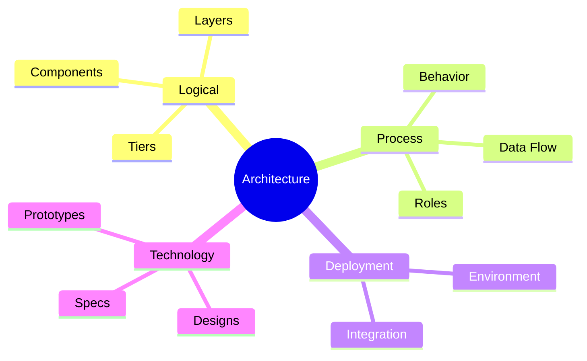

# System Architecture

**System architecture** is the practice of making the decisions about a solution that are expensive to reverse: what its parts are, how they interact, and how it is expected to change. This chapter covers those decisions, the quality attributes they are judged against, and the security constraints that shape them. Architecture stops at the decisions — turning them into schemas, endpoints, and algorithms is [System Design](../03-system-design/00-system-design.md).

## In This Section

| Doc | What it covers |
| --- | --- |
| **[Key Quality Attributes](01-quality-attributes.md)** | The design, runtime, system, and user properties an architecture is evaluated against |
| **[Web Application Security](02-security-web.md)** | Core web security principles and the OWASP Top 10 categories |

## What Architecture Captures

| Element | What it records |
| ------- | --------------- |
| **Decisions** | The significant choices made against business expectations, and what each one costs |
| **Principles** | The rules that guide design and evolution once the decisions are made |
| **Constraints** | Goals, limits, and technical characteristics the system must respect |
| **Measures** | How the system is checked against its intended purpose |

## Architectural Levels

| Level | Answers | Example |
| ------- | --------- | --------- |
| **Value** | Why we care | Changeable software costs less to own |
| **Principle** | What must hold | Separation of Concerns — cut along axes of change |
| **Pattern** | A reusable solution shape | Strategy, Repository, Observer |
| **Best Practice** | A repeatable action | Code review, refactoring, TDD |
| **Idiom** | A language-local form | RAII, context managers, `defer` |

Confusing the levels is the usual failure: a pattern applied where no principle demanded it is accidental complexity, and a principle restated as a rule loses the trade-off that justified it.

## Architectural Views

| View | What it describes |
| ------ | ------------- |
| **Logical View** | Components, units, layers, and tiers, and the relations between them |
| **Process View** | Roles, behavior, data flow, and integration with external systems |
| **Deployment View** | How the system is placed in its runtime environment |
| **Technology View** | Detailed design documents, prototypes, and technical specifications |

