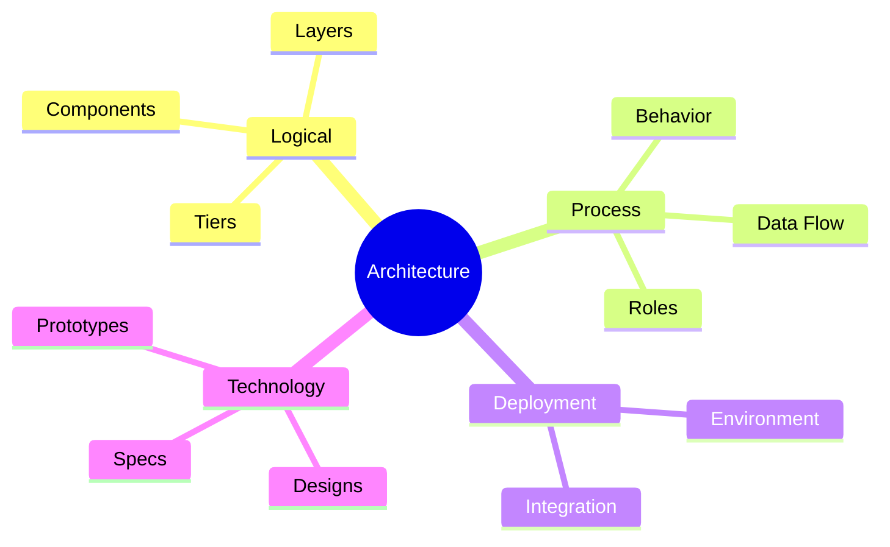

# Architectural Views

A **view** is the architecture described for one set of concerns at a time: the components and their relations, or the runtime behaviour, or the machines the system runs on. No single diagram holds all of these at once — a picture that shows components, threads, servers, and technology choices together is unreadable, and a picture that shows only one of them answers only the questions that concern it. Splitting the description into views is the standard response to that problem.

The split is not an invention of this book. Kruchten's "4+1" model (1995) describes an architecture through logical, process, development, and physical views, tied together by scenarios. ISO/IEC/IEEE 42010 generalizes the idea: a *viewpoint* fixes the concerns and notation, and a *view* is the resulting description of the system. The four views used here map onto that tradition, with technology standing in for the development view.

## The Four Views

| View | Answers | Primary reader | Typical artifacts |
| ---- | ------- | -------------- | ----------------- |
| **Logical View** | What are the parts, and how do they relate? | Developers, architects | Component and layer diagrams, module maps, domain models |
| **Process View** | What happens at runtime, and in what order? | Developers, integrators | Sequence and activity diagrams, data flow, integration contracts |
| **Deployment View** | Where does it run, and on what? | Operations, SRE, security | Topology diagrams, environment maps, network and trust boundaries |
| **Technology View** | What is it built from, and how exactly? | Implementers, reviewers | Specifications, ADRs, prototypes, API and schema definitions |

## Logical View

The logical view is the static structure: components, units, layers, and tiers, and the dependencies between them. It is the view most people mean by "the architecture diagram", and the one the [architectural levels](index.md#architectural-levels) are visible in — a layer boundary is a principle made concrete, a repository is a pattern made concrete.

| Records | Detail |
| ------- | ------ |
| **Components** | Named units with a responsibility and an interface |
| **Relations** | Which component depends on which, and in which direction |
| **Layers and tiers** | Grouping by level of abstraction, and the rules about crossing between them |
| **Boundaries** | Where a change stops propagating; where ownership changes hands |

The failure mode is a diagram of boxes with no rule about the arrows. If the view does not say which dependencies are forbidden, it cannot be violated, and so it cannot be checked. State the direction rule explicitly — "the domain layer depends on nothing outward" — and the view becomes testable, by review or by a dependency linter.

## Process View

The process view is the system in motion: what runs concurrently, what calls what, in what order, and what crosses the boundary to an external system. It is where [performance, availability, and reliability](01-quality-attributes.md#runtime-qualities) are argued for or lost, because those attributes are properties of behaviour, not of structure.

| Records | Detail |
| ------- | ------ |
| **Roles** | Who or what initiates each interaction — user, scheduler, upstream service |
| **Behavior** | The order of steps in a scenario, including the failure paths |
| **Data flow** | What data moves, in which direction, and where it is persisted |
| **Integration** | Protocols, contracts, retries, timeouts, and idempotency expectations for external systems |

One process diagram per significant scenario is worth more than one diagram covering all of them. Scenarios are what tie the views together in the 4+1 model: a scenario walked through the logical view proves the components are sufficient, and walked through the deployment view proves the topology supports it.

## Deployment View

The deployment view places the system in its runtime environment: processes on hosts, containers in clusters, regions, networks, and the boundaries between them. It is the view operations and security work from, and the one that makes cost and blast radius visible.

| Records | Detail |
| ------- | ------ |
| **Placement** | Which artifact runs where, and how many instances of it |
| **Environments** | How development, staging, and production differ, and what stays identical |
| **Network** | Routes, load balancers, and which links cross a public network |
| **Trust boundaries** | Where credentials change, where data is encrypted, what is exposed to the internet |

A deployment view that shows only production hides the most common class of incident, which is a difference between environments. Show what differs, or state that nothing does.

## Technology View

The technology view is the detail the other three deliberately omit: the chosen frameworks and services, the API and schema definitions, the prototypes that settled an open question, and the records of why each choice was made. It is closest to [System Design](../03-system-design/index.md), and the boundary between them is one of ownership rather than subject — architecture records the decision and its cost, system design works out the specification that follows from it.

| Records | Detail |
| ------- | ------ |
| **Choices** | The technologies selected, with the alternatives considered and rejected |
| **Specifications** | Interface, schema, and protocol definitions precise enough to implement against |
| **Prototypes** | The experiments run to reduce a risk, and what they measured |
| **Decision records** | One ADR per significant choice: context, decision, consequences |

This is the view that goes stale first, because it is the one the code moves fastest against. Keep the parts that cannot be derived from the code — the alternatives rejected and the reasons — and let the rest be generated from the source where possible.

## Choosing What to Draw

Views cost effort to write and more to keep current, so produce the ones with a reader waiting.

| Situation | Views that earn their place |
| --------- | --------------------------- |
| A new service in an established system | Logical, plus one process view per external integration |
| A performance or availability problem | Process and deployment |
| A security or compliance review | Deployment, with trust boundaries marked |
| A build-versus-buy or framework decision | Technology, as an ADR |
| Onboarding a new team | Logical first, then one end-to-end process view |

Two rules keep a set of views usable. Name the same component identically in every view it appears in, or the views cannot be read against each other. And when a decision changes, update the view it belongs to and delete the others' copies of it — the same fact stated in three diagrams goes wrong in two of them.
