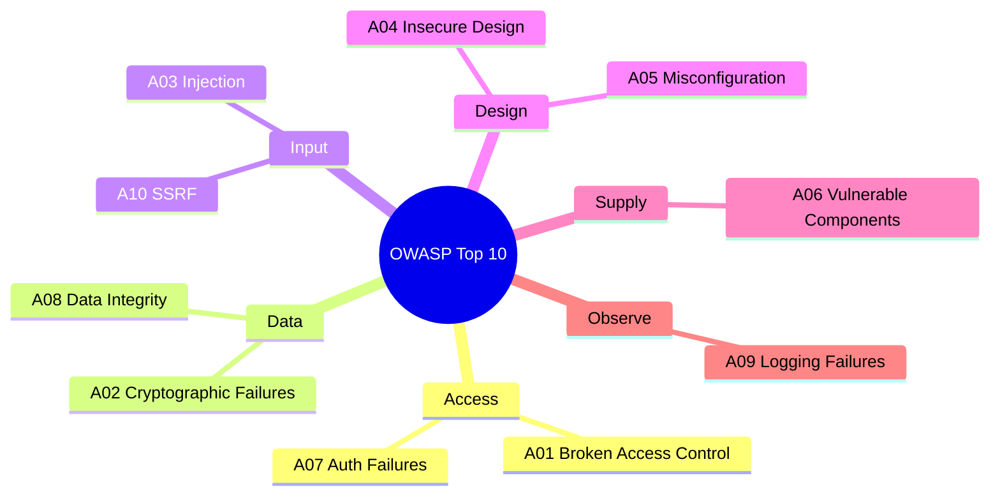
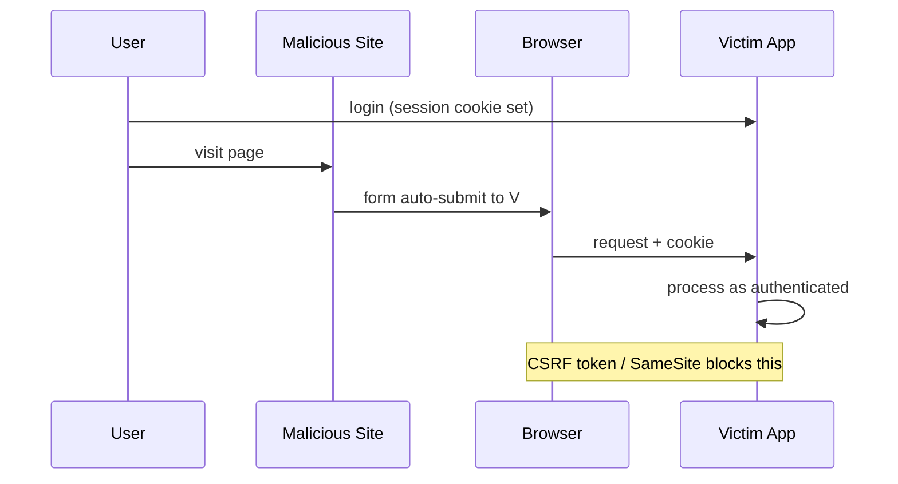

# Web Application Security

## Security Principles

| Principle | Implementation |
| --- | --- |
| **Least Privilege** | Minimum permissions; scope tokens narrowly |
| **Defense in Depth** | Multiple layers: validation + sanitization + CSP |
| **Fail Secure** | Default to blocking access on error |
| **Input Validation** | Whitelist approach |
| **Secure by Default** | HTTPS, secure cookies out of the box |

---

## OWASP Top 10 (2021)

| Rank | Category | Description |
| --- | --- | --- |
| A01 | Broken Access Control | Unauthorized resource access |
| A02 | Cryptographic Failures | Weak or missing encryption |
| A03 | Injection | Malicious input interpreted as code |
| A04 | Insecure Design | Missing security in design phase |
| A05 | Security Misconfiguration | Insecure defaults |
| A06 | Vulnerable Components | Outdated dependencies |
| A07 | Authentication Failures | Weak passwords, no rate limiting |
| A08 | Data Integrity Failures | Software/serialization vulnerabilities |
| A09 | Logging Failures | Missing or inadequate logging |
| A10 | SSRF | Server-side request forgery |



---

## Common Vulnerabilities

### Cross-Site Scripting (XSS)

Malicious scripts injected into pages viewed by other users.

**Three types:** Stored (persisted in DB), Reflected (in URL), DOM-based (client JS).

```javascript
// React escapes by default - SAFE
<div>{userInput}</div>

// Bypasses escaping - DANGEROUS with unsanitized input
<div dangerouslySetInnerHTML={{ __html: userInput }} />

// Safe when required
import DOMPurify from 'dompurify';
<div dangerouslySetInnerHTML={{ __html: DOMPurify.sanitize(userInput) }} />
```

| Technique | Priority |
| --- | --- |
| Content escaping (React default) | Always |
| Input validation (whitelist) | High |
| CSP headers | High |
| Sanitization with DOMPurify | When rendering HTML |

### Cross-Site Request Forgery (CSRF)

Tricks authenticated users into submitting unintended requests via their active session.

**Attack:** user visits malicious page → browser sends cookies to the victim's bank → bank processes request.



```javascript
// 1. CSRF Token
const csrfToken = document.querySelector('meta[name="csrf-token"]').content;
fetch('/api/action', {
    method: 'POST',
    headers: { 'X-CSRF-Token': csrfToken, 'Content-Type': 'application/json' },
    body: JSON.stringify({ data })
});

// 2. SameSite Cookie
// Set-Cookie: sessionid=abc123; SameSite=Strict; Secure; HttpOnly

// 3. Custom header (browsers can't set these cross-origin)
fetch('/api/action', {
    method: 'POST',
    headers: { 'X-Requested-With': 'XMLHttpRequest' }
});
```

### Same-Origin Policy and CORS

Browsers restrict how pages from one origin access resources from another.

Origin = protocol + host + port. Any difference = different origin.

| URL | Same Origin? | Reason |
| --- | --- | --- |
| `https://example.com/other` | Yes | Different path only |
| `http://example.com/page` | No | Different protocol |
| `https://api.example.com/page` | No | Different subdomain |
| `https://example.com:8080/page` | No | Different port |

```javascript
// Express CORS setup
app.use((req, res, next) => {
    res.header('Access-Control-Allow-Origin', 'https://trusted-site.com');
    res.header('Access-Control-Allow-Methods', 'GET, POST, PUT, DELETE');
    res.header('Access-Control-Allow-Headers', 'Content-Type, Authorization');
    if (req.method === 'OPTIONS') return res.sendStatus(200);
    next();
});
```

### SQL Injection

```javascript
// Bad - string concatenation
const query = "SELECT * FROM users WHERE id = " + userId;

// Good - parameterized
const query = "SELECT * FROM users WHERE id = ?";
db.execute(query, [userId]);

// Good - ORM
const user = await User.findById(userId);
```

---

## Authentication and Sessions

### Token-Based Authentication

```javascript
// JWT structure: header.payload.signature
const token = {
    payload: {
        sub: "user123",
        exp: 1516242622,
        scope: "read write"
    }
};

// Storage preference:
// Best: HTTP-only Secure cookie (not accessible via JS)
// Acceptable: In-memory variable
// Never: localStorage (XSS exposes all data)

// Set-Cookie: token=eyJhbGci...; HttpOnly; Secure; SameSite=Lax; Path=/; Max-Age=3600
```

**Password rules:**

| Practice | Implementation |
| --- | --- |
| Minimum length | 8+ characters |
| Hashing | bcrypt with appropriate work factor |
| Rate limiting | Prevent brute force |
| Account lockout | Temporary lock after failures |
| 2FA | Multi-factor authentication |

### Session Configuration

```javascript
const sessionConfig = {
    name: 'session_id',
    secret: 'strong-random-secret',
    resave: false,
    saveUninitialized: false,
    cookie: {
        httpOnly: true,
        secure: true,
        sameSite: 'strict',
        maxAge: 3600000
    }
};
```

---

## Transport Layer Security

### Security Headers

```http
Strict-Transport-Security: max-age=31536000; includeSubDomains; preload
X-Content-Type-Options: nosniff
X-Frame-Options: DENY
Content-Security-Policy: default-src 'self'; script-src 'self'
Referrer-Policy: strict-origin-when-cross-origin
Permissions-Policy: geolocation=(), microphone=(), camera=()
```

**HSTS:** After the first HTTPS visit, the browser enforces HTTPS automatically for `max-age` seconds, preventing downgrade attacks. Preload lists enforce this even on the first visit.

### Certificate Requirements

| Aspect | Recommendation |
| --- | --- |
| Algorithm | RSA 2048+ or ECDSA 256+ |
| Validity | 90 days (automate with ACME/Let's Encrypt) |
| CA | Trusted CA (Let's Encrypt, DigiCert) |

---

## Content Security Policy (CSP)

Restricts which content sources the browser may load.

| Directive | Purpose | Example |
| --- | --- | --- |
| `default-src` | Fallback | `'self'` |
| `script-src` | JavaScript | `'self' 'nonce-abc123'` |
| `style-src` | CSS | `'self' 'unsafe-inline'` |
| `img-src` | Images | `'self' data: https:` |
| `connect-src` | Fetch/XHR targets | `'self' https://api.example.com` |
| `frame-ancestors` | Who can embed this page | `'none'` |

```http
Content-Security-Policy:
    default-src 'self';
    script-src 'self' 'nonce-abc123';
    img-src 'self' data: https:;
    connect-src 'self' https://api.example.com;
    frame-ancestors 'none';
    upgrade-insecure-requests;
```

**Nonce for inline scripts:**

```javascript
const nonce = crypto.randomBytes(16).toString('base64');
res.setHeader('Content-Security-Policy', `script-src 'self' 'nonce-${nonce}'`);
```

```html
<script nonce="abc123">console.log('Allowed');</script>
```

**Violation reporting:**

```javascript
document.addEventListener('securitypolicyviolation', (e) => {
    console.error('CSP Violation:', {
        blockedURI: e.blockedURI,
        violatedDirective: e.violatedDirective
    });
});
```

---

## Dependency Security

```bash
npm audit          # Check for vulnerabilities
npm audit fix      # Auto-fix
npm ci             # Reproducible installs
npm outdated       # Check for updates
```

| Tool | Purpose |
| --- | --- |
| npm audit | Built-in vulnerability scanner |
| Snyk | Comprehensive database, CLI + IDE |
| Dependabot | GitHub automatic updates |

**Third-party scripts — use Subresource Integrity (SRI):**

```html
<script
    src="https://cdn.example.com/script.js"
    integrity="sha384-oqVuAfXRKap7fdgcCY5uykM6+R9GqQ8K/uxy9sr7RgN"
    crossorigin="anonymous"
></script>
```

---

## Client-Side Security

### Storage

```javascript
// Never store sensitive data in localStorage - XSS exposes everything

// In-memory only (cleared on page unload)
const sensitiveData = new Map();

// sessionStorage (cleared on tab close)
sessionStorage.setItem('tempData', data);
```

### Iframe Security

```html
<!-- Restrict iframe capabilities with sandbox -->
<iframe
    src="https://external-site.com"
    sandbox="allow-scripts allow-same-origin allow-forms"
    loading="lazy"
></iframe>

<!-- Prevent clickjacking -->
<!-- X-Frame-Options: DENY -->
<!-- Content-Security-Policy: frame-ancestors 'none' -->
```
### JSON Vulnerabilities

| Vulnerability | Prevention |
| --- | --- |
| JSON Injection | Input validation |
| DoS via large payload | Size limits |
| Prototype Pollution | Deep clone, freeze objects |
| XSS via `eval()` | Always use `JSON.parse()` |

Use CORS instead of JSONP (JSONP is XSS-vulnerable).
