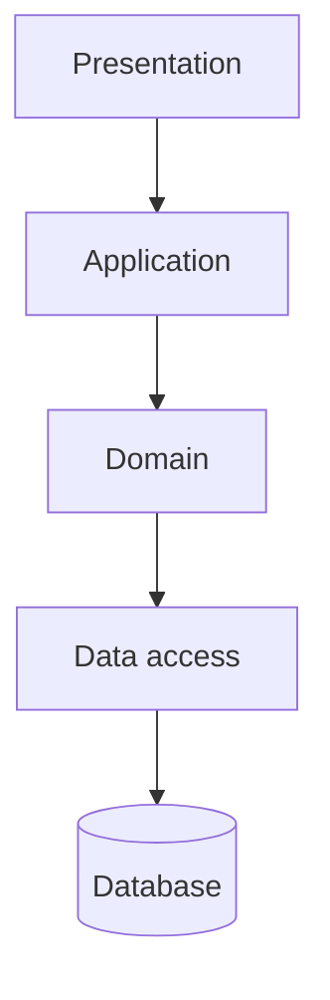
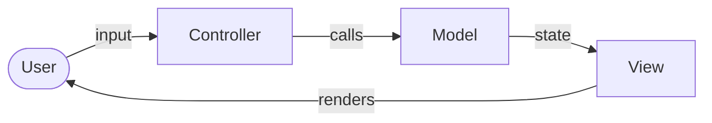
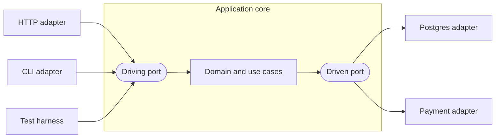

# Architectural Patterns

An **architectural pattern** is a reusable solution shape for a whole system or a whole deployable unit, sitting at the pattern level of the [architectural levels](index.md#architectural-levels): below the principle that justifies it, above the idiom that expresses it in one language. It is the same kind of thing as a [design pattern](../05-coding/03-design-patterns.md), scaled up — the unit of reuse is a component boundary rather than a class.

The patterns here answer three different questions, and confusing them is the usual mistake. Layered, MVC, and hexagonal architecture describe how one unit is organized on the inside. Monolith and microservices describe how many units there are and how they are released. Event-driven architecture describes how those units reach each other once there is more than one. "MVC or microservices" is not a choice; a microservice organized internally as MVC and fed by events is ordinary.

| Axis | Question | Patterns | Visible in |
| ---- | -------- | -------- | ---------- |
| **Internal structure** | How is one deployable unit divided, and which way do its dependencies point? | Layered, MVC, Hexagonal | [Logical view](02-architectural-views.md#logical-view) |
| **Deployment shape** | How many units ship, and can each ship alone? | Monolith, Microservices | [Deployment view](02-architectural-views.md#deployment-view) |
| **Interaction style** | How does one unit reach another — by asking, or by announcing? | Request-driven, Event-driven | [Process view](02-architectural-views.md#process-view) |

One more pattern belongs to none of the three and touches all of them: the strangler fig, which is how a system moves from one shape to another without a rewrite. It closes the page.

## Layered Architecture

The oldest of these, and the default most systems arrive at without deciding to: divide a unit into horizontal layers by level of abstraction, each depending on the one beneath it. Four is the common count, but the count is not the pattern — the direction rule is.

| Layer | Holds | Depends on |
| ----- | ----- | ---------- |
| **Presentation** | Controllers, rendering, request and response types | Application |
| **Application** | Use cases as sequences: orchestration and transaction boundaries, no business rules of its own | Domain |
| **Domain** | Entities, values, and the rules that govern them | Data access, in the classic form |
| **Data access** | Persistence, external system clients, message publishing | The database driver or SDK |

Two decisions make a layered design meaningful, and leaving either implicit is what produces a diagram nobody can violate. The first is **strict or relaxed**: a strict layering forbids skipping, so presentation may not call data access directly, while a relaxed one permits it. Both are defensible; only one of them can be checked, and only if it is written down. The second is **which way the bottom arrow points**. In the classic form the domain depends downward on data access, which is why the rules end up knowing about the ORM. Hexagonal architecture is, in effect, layering with that one arrow inverted.

The failure mode has a name — the sinkhole, from Mark Richards' description — where a request passes through every layer untouched and each layer only forwards it. The check is concrete: if adding one field means editing an equivalent type in four layers and no layer transforms it, those layers are ceremony, not structure.

Layers are not tiers. A layer is a logical grouping in the [logical view](02-architectural-views.md#logical-view); a tier is a physical placement in the [deployment view](02-architectural-views.md#deployment-view). A four-layer application running as one process on one host is normal, and calling it three-tier because it has a database is a confusion of the two.

## MVC

Model–View–Controller comes from Trygve Reenskaug's work on Smalltalk-80 in 1979, where it separated the thing being represented from its representation on screen. It splits a unit by what changes for different reasons: the rules change when the business changes, the screen changes when users or devices change, and the wiring between them changes when neither does.

| Part | Responsibility | Changes when |
| ---- | -------------- | ------------ |
| **Model** | Domain state and the rules that govern it | The business rules change |
| **View** | Rendering the model for a user or a client | The presentation or the device changes |
| **Controller** | Turning an input into a call on the model, and choosing the next view | The interaction or the route changes |

Two variants are worth naming because their names are used loosely. **MVP** replaces the controller with a presenter that pushes prepared data into a passive view, so the view holds no logic and needs no UI toolkit to test. **MVVM** binds the view to a view model declaratively, so the update path is a data binding rather than a call — the shape most modern UI frameworks assume.

Server-side MVC, as used by Rails, Django, Laravel, or Spring MVC, differs from the 1979 original: the view is rendered once per request rather than kept in sync by observation, so the model never notifies anyone. The vocabulary survived the change; the mechanism did not.

The failure mode is the fat controller. Validation, authorization, and business rules drift into the controller because it is the first place that has all the request data, and the model becomes a set of records with no behaviour — an anemic model. The check is mechanical: if a business rule cannot be exercised without constructing an HTTP request, it is in the wrong part.

## Hexagonal Architecture

Hexagonal architecture, also called ports and adapters, was described by Alistair Cockburn in 2005 with an explicit goal: allow an application to be driven equally by users, by other programs, by automated tests, or by batch scripts, and to be developed and tested in isolation from the devices and databases it eventually runs against. The hexagon is not meaningful — it is a shape with room for several sides, drawn to avoid implying a top and a bottom.

| Element | What it is | Example |
| ------- | ---------- | ------- |
| **Application core** | Domain model plus use cases, holding every business rule | Pricing rules, order state machine |
| **Driving port** | An interface the outside world calls to use the application | `PlaceOrder` use-case interface |
| **Driving adapter** | Something that calls a driving port | HTTP controller, CLI command, test |
| **Driven port** | An interface the application calls to reach the outside world | `OrderRepository`, `PaymentGateway` |
| **Driven adapter** | An implementation of a driven port for one technology | Postgres repository, Stripe client |

The whole pattern rests on one rule: every arrow points inward, so the core names the interfaces and the adapters implement them. That is what makes it checkable, in exactly the way the [logical view](02-architectural-views.md#logical-view) demands — an import of a web framework, an ORM, or an SDK inside the core package is a violation a dependency linter can fail the build on. It is the [Dependency Inversion Principle](../05-coding/02-design-principles.md#solid-principles-of-object-oriented-design) applied at the component boundary rather than between classes.

Onion architecture and Clean Architecture state the same dependency rule with different vocabulary and more prescribed layers. Where they agree — dependencies point toward the domain — is the part that matters.

The cost is indirection: an interface for every outside collaborator, and mapping between domain types and the DTOs the adapters speak. It pays when the core holds real rules, when a second adapter genuinely arrives, or when tests would otherwise need a database. It does not pay for a service whose logic is a validated pass-through to one table, where the ports only rename the ORM.

## Monolith

A monolith is one deployable unit holding the whole application: calls between modules are in-process, one release ships every part, and one database serves all of it. Internally it may still be well divided — a **modular monolith** enforces module boundaries in code, with only a published interface visible across each one, so the structure is that of separate services without the network between them.

| You get | You pay |
| ------- | ------- |
| In-process calls: no serialization, no partial failure, no retry logic | One release train — an unrelated change can block yours |
| One transaction across the whole operation | Scaling is all-or-nothing: the whole unit is replicated to relieve one hot part |
| One place to debug, one log, one deploy pipeline | A crash or a memory leak takes down every capability at once |
| Refactoring across a boundary is a compiler-checked rename | Boundaries erode unless something enforces them |

The last row is the one that decides whether a monolith stays workable. Module boundaries hold only if a check enforces them — a dependency linter, an ArchUnit-style test, or the compiler where the language has real module visibility. Without one, boundaries decay silently and the option of splitting later is lost.

Monolith describes deployment, not quality, and it is the correct starting shape for most systems: it costs nothing operationally and it keeps boundaries cheap to move while they are still being guessed at.

## Microservices

A microservice owns one capability and the data behind it, and is released on its own schedule. The defining property is independent deployability — not size, not the number of endpoints, not whether it fits in one repository. The trade-offs are catalogued under [Service Decomposition](../03-system-design/01-common-concepts.md#service-decomposition); what follows is the architectural decision itself.

| You get | You pay |
| ------- | ------- |
| Independent release: a team ships without coordinating a train | Every in-process call that crosses a boundary becomes slow, separately failable, and possibly repeated |
| Independent scaling of the parts that are actually hot | No shared transaction — consistency across units needs sagas and compensating actions |
| Fault isolation, if callers degrade rather than propagate the failure | Operational surface per unit: pipeline, monitoring, on-call, secrets, schema |
| Technology choice per unit | Debugging spans processes, so distributed tracing stops being optional |

Four conditions have to hold before the split returns anything. Each unit deploys without coordinating with another; each owns its data, with no second unit reading its tables; a request can be followed end to end through tracing and correlated logs; and a developer can run one unit locally without the rest. Split without them and the result is a **distributed monolith** — units deployed separately but coupled tightly enough that none ships alone, paying the network cost without collecting the independence.

The forces that justify a split are usually organizational or operational rather than technical: more teams than one release train can serve, one capability whose load or availability requirement differs by an order of magnitude from the rest, or a compliance boundary that has to be isolated. Conway's law is the practical guide — the boundaries that survive are the ones matching how teams communicate.

## Event-Driven Architecture

The other two axes decide what the units are. This one decides how they reach each other. A request names its handler and waits for an answer, so the caller has to know who serves it and be up at the same time. An **event** names only a fact that has already happened — "order 42 was placed" — and is published without knowing who will act on it. The publisher stops depending on the list of consumers, and adding a consumer becomes a deploy of that consumer alone.

What the event carries is the decision underneath the pattern, and the three usual answers have very different costs. The taxonomy is Martin Fowler's.

| Flavor | The event carries | The consumer | Cost |
| ------ | ----------------- | ------------ | ---- |
| **Event notification** | An identifier and a type, nothing more | Calls back for the details it needs | Chatty: every event turns into a fan-out of callbacks, and the publisher is back in the request path |
| **Event-carried state transfer** | Enough state for a consumer to act alone | Keeps its own copy and never calls back | Duplicated state that can go stale, and coupling to the payload's schema instead of to an endpoint |
| **Event sourcing** | Every change, as the system of record | Rebuilds state by replaying the log | Events are permanent, so a schema change means keeping old versions readable forever |

The second decision is who holds the sequence when several units take part in one business operation.

| | Choreography | Orchestration |
| --- | --- | --- |
| **Control** | Each unit reacts to events; no unit holds the whole sequence | A coordinator issues the steps and tracks progress |
| **Adding a step** | Deploy a new consumer; no existing unit changes | Change the coordinator |
| **Answering "where is order 42?"** | Reconstruct it from logs across every unit | Ask the coordinator |
| **Failure handling** | Each consumer's own retries and compensation | A central [saga](../03-system-design/01-common-concepts.md#distributed-transactions) with compensating actions |

Choreography couples less and observes worse. The practical rule is to choreograph what is genuinely independent — notifications, projections, analytics — and orchestrate what has a business meaning as a whole, such as a payment that must either complete or be compensated.

Every version pays the same three prices, and none of them is optional. State is eventually consistent, so a read taken right after a write can legitimately be stale. Delivery is at-least-once in most brokers, so handlers have to be [idempotent](../03-system-design/01-common-concepts.md#idempotency) — the guarantees are set out under [delivery semantics](../03-system-design/04-messaging.md#delivery-semantics). And ordering holds only within a partition, so a consumer must survive events arriving in an order the publisher never intended.

**CQRS** — Command Query Responsibility Segregation — is the read-side companion: the write model keeps the rules and the invariants, and one or more read models are shaped for the queries and kept current from events. It is worth the second model when reads and writes genuinely diverge in shape, load, or storage, and it is overhead when the same table serves both. Neither pattern requires the other: CQRS works against a plain database, and event sourcing works without separate read models, though the pair fits together well enough that they are often mistaken for one idea.

The claim to check is the one the pattern exists for: a new consumer should be addable without modifying or redeploying the publisher. If it cannot be, the coupling that events were supposed to remove is still there, moved into the broker.

## Choosing

| Situation | Shape that fits |
| --------- | --------------- |
| A new product with unsettled boundaries | Modular monolith, with boundary checks in the build |
| One team, one release cadence | Monolith; a split adds cost and returns nothing |
| Several teams blocked on each other's releases | Extract along team boundaries, one unit at a time |
| One capability with load or availability needs unlike the rest | Extract that capability only |
| A unit with real domain rules and several I/O technologies | Hexagonal core inside whatever the deployment shape is |
| A unit that is mostly rendering and routing | Layered or MVC; a hexagon around a form handler is overhead |
| Downstream work that the caller does not need an answer to | Events, choreographed |
| A multi-unit operation that must complete or be undone as a whole | Events, orchestrated by a saga |
| A read load or shape that has diverged from the write side | CQRS, with read models fed by events |

## How They Combine

The internal patterns are independent of the deployment shape, and choosing them well is what keeps the deployment shape changeable.

| Combination | What it looks like |
| ----------- | ------------------ |
| **Monolith + MVC** | The classic web framework layout: routes to controllers, controllers to models, templates as views |
| **Monolith + Hexagonal** | Modules with domain cores and their own adapters; the framework is an adapter, not the structure |
| **Microservice + Hexagonal** | Each unit an application core with HTTP and message-consumer adapters driving it, and repository and client adapters driven by it |
| **Microservice + MVC** | Common where a unit is a thin API over storage, and honest about holding little domain logic |
| **Microservices + events** | Units request each other only where an answer is needed now, and announce everything else |

A hexagonal core is what makes extracting a service later cheap: the driving port is already the service interface, and the driven adapters already isolate the storage. Extracting from a fat-controller monolith means finding the rules first, which is the expensive part of every migration that stalls.

## Moving Between Shapes

Every pattern above describes a destination, and most real work is a journey between two of them. The **strangler fig** is the pattern for that journey, named by Martin Fowler after the fig that grows around a host tree until it stands on its own and the host is gone. It replaces a system one capability at a time, with a working release at every point in between.

| Step | What it means |
| ---- | ------------- |
| **Put a seam in front** | Route every call through one place that can choose an implementation — a gateway, a proxy, or an interface in code |
| **Move one capability** | Build the replacement, point that capability's traffic at it, and leave everything else untouched |
| **Verify against the original** | Run both on live traffic and compare results before the new one becomes the source of truth |
| **Delete the old path** | Remove the replaced code and its route, then start the next capability |

The fourth step is the one that gets skipped, and skipping it is what turns a migration into a permanent state: two implementations of the same rule, no evidence they agree, and a team that now maintains both. Deletion is also what makes progress measurable — the honest metric is how many capabilities still run on the old path, not how many exist on the new one.

The alternative is a parallel rewrite, which needs the old system's features frozen while the new one catches up, or both maintained at once. It is the right choice occasionally, when the old system is small enough to finish quickly or so badly understood that a seam cannot be found. It fails in the usual way: the freeze does not hold, the new system chases a moving target, and nothing ships.

Two properties tell you the migration is being run as a strangler and not as a rewrite with a facade in front. The system is releasable at every commit, with no long-lived migration branch. And the seam carries a routing decision that can be reversed for one capability without reverting anyone else's work.
