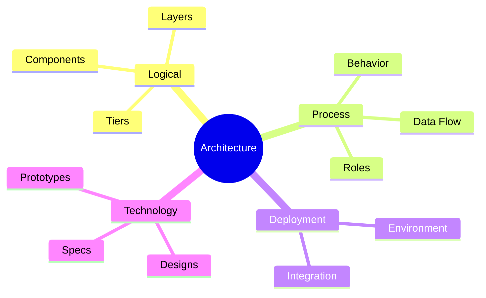
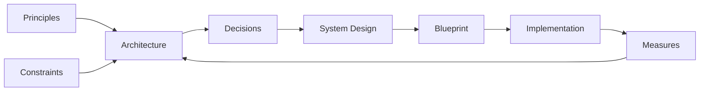

# System Architecture

**`System Architecture`** as a discipline is 
:= an art of making *fundamental* *decisions* about a *solution* 
in way to *effectively* and *efficiently* satisfy business *expectations* in *given* context
by choosing the *optimal* options from *available* ones.

An *outcome* of **System Architecture** is 
the a fundamental high-level holistic *vision* of a solution, its: 
- design (inner components structure and dependencies, exteranal integration), 
- functioning (matching quality attributes, conforming constraints)
- and evolution over time.

SA incorporates, captures, and conveys:

- Significant **Decisions** against business *expectations*
- **Principles** guiding design and evolution
- **Aspects** that make a system function as it should
- General **goals**, **constraints**, technical **characteristics**
- **Measures** to ensure the system satisfies its intended purpose

### Architectural Views

| View | Description |
| ------ | ------------- |
| **Logical View** | Composition of components, units, layers, tiers in environment context; relations between components and agents |
| **Process View** | Relations, roles, behavior, interoperability, data flow of system components; integration with external systems |
| **Deployment View** | System integration with external environment |
| **Technology View** | Detailed design documents, prototypes, technical specifications |

### System Design

**System Design** is the process of creating a detailed architectural specification that can be implemented by developers.

It works at a lower level of abstraction:

- Fleshing out specifics of how architecture will be realized (database schema, API endpoints)
- Translating high-level requirements into concrete implementation plans
- Diving into details: algorithms, data structures, interfaces, specific technologies

