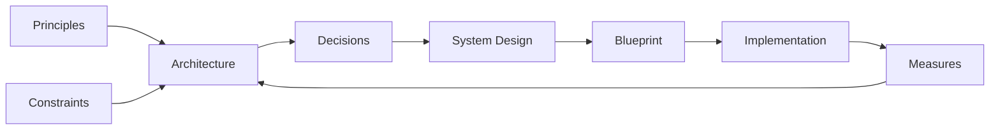

# System Design

**InformationSystem**: An artificial system designed to perform various complex data transformation flows (hardware, firmware, OS, software, data sources) 

**System Design** is the *process* of creating a detailed specifications of InformationSystem that can be directly implemented by developers.

It works at a lower level of abstraction:

- Fleshing out specifics of how architecture will be realized (database schema, API endpoints)
- Translating high-level requirements into concrete implementation plans
- Diving into details: algorithms, data structures, interfaces, specific technologies

## Information System Components

System Design is about choosing, adopting and properly tying up a set of Components:

| Component | Definition |
| ----------- | ------------ |
| **Component** | A named separated piece of code/data that is *composable* - can be combined/used with others to build larger Components.|
| **Library** | Reusable Component the Application *calls*; it owns no control flow, so the Application decides when, whether, and in what order it runs |
| **Framework** | Component that owns the control flow and *calls* the Application's code through the extension points it defines (*inversion of control*); it dictates structure, so it is chosen once and swapped rarely |
| **API** | Higher-level abstractions on top of hardware/firmware for software use |
| **Application** | Deliverable Software providing functional scope in some business domain |
| **Configuration** | Data that *parameterizes* Software without changing it — what varies per environment, tenant, or deployment; versioned like code, but applied without rebuilding |

Commonly-known kinds of Information System Components:

| Component | Definition |
| ----------- | ------------ |
| **Hardware (Hw)** | Physically tangible *circuit* performing transformation and exchange of binary data |
| **Software (Sw)** | Executable code, configurations, and metadata defining data processing |
| **Firmware (Fw)** | Code embedded into hardware that directly controls it |
| **Network** | The *fabric* (links, addressing, protocols) that carries data between Hardware nodes; it is unreliable by nature, so latency, loss, and partition are design inputs, not edge cases |
| **Operating System** | Comprehensive set of protocol implementations and utilities providing interfaces for application programming |
| **Virtual Machine (VM)** | *Emulated* Hardware — a hypervisor slices one physical host into several machines, each running its own Operating System kernel; the unit of isolation is the machine, so it boots and is patched like one |
| **Container** | An Application packaged with its userspace dependencies as an immutable *image*, isolated by the host's kernel instead of by emulation; the unit of isolation is the process, so it starts in milliseconds and many share one Operating System |
| **Database** | Separate component about to store, access, and represent structured data |
| **Data Warehouse** | Database shaped for *analytics*: historical, modeled, read-heavy — schema fixed on write |
| **Data Lake** | Storage of *raw* data in its original form at scale; the schema is applied on read, by whoever consumes it |
| **Object Storage** | Component storing immutable *blobs* (files, media, backups) addressed by key, without structure or query over their content |
| **Cache** | Component holding *derived copies* of data closer to its consumer to trade freshness for speed; never a source of truth |
| **Message Broker** | Component that transfers data between Components *asynchronously*, decoupling producer from consumer in time and availability |
| **Search Index** | Component storing a *query-optimized projection* of data to answer lookups a Database cannot serve efficiently |
| **Content Management System (CMS)** | Application for authoring, storing, and publishing *unstructured* content (text, media, layout) by non-engineers, separately from the code that renders it |
| **Identity Provider (IdP)** | Component that authenticates *principals* and issues verifiable *claims* about them, so other Components authorize instead of authenticate |
