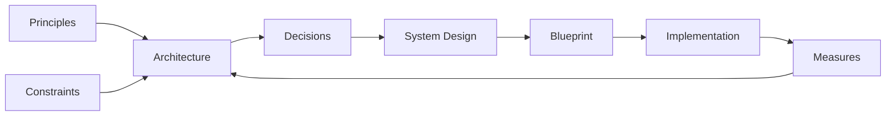

# System Design

System design is the process that turns architectural decisions into a specification developers can implement directly: database schemas, API endpoints, algorithms, data structures, and the components chosen to run them. It works one level below [System Architecture](../02-architecture/00-architecture.md), which decides what the parts are and stops there. This chapter covers the storage, caching, messaging, and packaging choices that specification makes, the vocabulary those choices use, and worked designs of well-known systems.

## Chapter Contents

| Doc | What it covers |
| --- | --- |
| **[Databases — core concepts](01-database-basics.md)** | Storage models, indexing, transactions, and isolation levels |
| **[Redis — core concepts and workflow](02-caching-with-redis.md)** | Data structures, eviction, and the caching patterns Redis is used for |
| **[Kafka — core concepts and workflow](03-messaging-with-kafka.md)** | Partitions, consumer groups, delivery guarantees, and ordering |
| **[Containers — core concepts and orchestration](04-containers.md)** | Images, isolation, resource limits, and orchestration |
| **[System Design Glossary](05-concepts.md)** | The vocabulary this chapter uses, grouped by the problem each set of terms addresses |
| **[Canonical Systems](06-canonical-systems.md)** | Eleven worked problems, each filed under the bottleneck it tests |

## Information System

| Component | Definition |
| --- | --- |
| **Information System** | An artificial system that performs data transformation flows across Hardware, Software, and the data sources they reach |
| **Component** | A named separated piece of code/data that is *composable* - can be combined/used with others to build larger Components.|
| **Application** | Deliverable Software providing functional scope in some business domain |
| **Library** | Reusable Component the Application *calls*; it owns no control flow, so the Application decides when, whether, and in what order it runs |
| **Framework** | Component that owns the control flow and *calls* the Application's code through the extension points it defines (*inversion of control*); it dictates structure, so it is chosen once and swapped rarely |
| **API** | The contract a Component exposes for others to call — operations, inputs, outputs, and errors — stated independently of how it is implemented; see [Client-Server Communication](../06-frontend/03-client-server-communication.md) |
| **Configuration** | Data that *parameterizes* Software without changing it — what varies per environment, tenant, or deployment; versioned like code, but applied without rebuilding |

## Hardware

| Component | Definition |
| --- | --- |
| **Hardware** | Physically tangible *circuit* performing transformation and exchange of binary data |
| **Firmware** | Code embedded into Hardware that directly controls it |
| **Network** | The *fabric* (links, addressing, protocols) that carries data between Hardware nodes; it is unreliable by nature, so latency, loss, and partition are design inputs, not edge cases |
| **Virtual Machine (VM)** | *Emulated* Hardware — a hypervisor slices one physical host into several machines, each running its own Operating System kernel; the unit of isolation is the machine, so it boots and is patched like one |

## Software

| Component | Definition |
| --- | --- |
| **Software** | Executable code, configurations, and metadata defining data processing |
| **Operating System** | Software that manages a machine's Hardware and schedules the processes running on it, exposing a stable interface the Application is programmed against |
| **Container** | An Application packaged with its userspace dependencies as an immutable *image*, isolated by the host's kernel instead of by emulation; the unit of isolation is the process, so many share one Operating System |

## Database

| Component | Definition |
| --- | --- |
| **Database** | Component that stores structured data and answers queries over it under transactional guarantees |
| **Data Warehouse** | Database shaped for *analytics*: historical, modeled, read-heavy — schema fixed on write |
| **Data Lake** | Storage of *raw* data in its original form at scale; the schema is applied on read, by whoever consumes it |
| **Object Storage** | Component storing immutable *blobs* (files, media, backups) addressed by key, without structure or query over their content |
| **Cache** | Component holding *derived copies* of data closer to its consumer to trade freshness for speed; never a source of truth — see [Redis](02-caching-with-redis.md) |
| **Search Index** | Component storing a *query-optimized projection* of data to answer lookups a Database cannot serve efficiently |

## Service

| Component | Definition |
| --- | --- |
| **Service** | Component deployed and operated on its own, reached over the Network rather than linked into the Application |
| **Message Broker** | Service that transfers data between Components *asynchronously*, decoupling producer from consumer in time and availability — see [Kafka](03-messaging-with-kafka.md) |
| **Content Management System (CMS)** | Application for authoring, storing, and publishing *unstructured* content (text, media, layout) by non-engineers, separately from the code that renders it |
| **Identity Provider (IdP)** | Service that authenticates *principals* and issues verifiable *claims* about them, so other Components authorize instead of authenticate |
