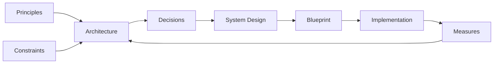

# System Design

**System design** is the *process* that turns architectural decisions into a specification developers can implement directly: database schemas, API endpoints, algorithms, data structures, and the components chosen to run them. 

It works one level below [System Architecture](../02-architecture/index.md), which decides what the parts are and stops there.

This chapter covers the storage, caching, messaging, and packaging choices that specification makes, the vocabulary those choices use, and worked designs of well-known systems.

## In This Chapter

| Doc | What it covers |
| --- | --- |
| **[System Design Glossary](01-common-concepts.md)** | The vocabulary this chapter uses, grouped by the problem each set of terms addresses |
| **[Databases — Core Concepts](02-databases.md)** | Storage models, indexing, transactions, and isolation levels |
| **[Caching — Core Concepts](03-caching.md)** | Caching vocabulary, CDNs, and the Redis data structures, eviction, and patterns behind them |
| **[Kafka — Core Concepts and Workflow](04-messaging.md)** | Partitions, consumer groups, delivery guarantees, and ordering |
| **[Containers — Core Concepts and Orchestration](05-containers.md)** | Images, isolation, resource limits, and orchestration |
| **[Client-Server Communication](06-client-server-communication.md)** | HTTP semantics, REST and GraphQL design, and the transports that keep a connection open |
| **[Data Formats](07-data-formats.md)** | JSON, YAML, XML, CSV, Markdown, and Parquet, and the parsing traps each one carries |
| **[Canonical Systems](08-canonical-systems.md)** | Eleven worked problems, each filed under the bottleneck it tests |

## Information System

Information System
: An artificial system that performs data transformation flows across Hardware, Software, and the data sources they reach

Component
: A named unit of code or data with a declared interface, replaceable by any other unit honoring that interface without changing its callers

Application
: Deliverable Software providing functional scope in some business domain

Library
: Reusable Component the Application *calls*; it owns no control flow, so the Application decides when, whether, and in what order it runs

Software Framework
: Component that owns the control flow and *calls* the Application's code through the extension points it defines (*inversion of control*); it dictates structure, so it is chosen once and swapped rarely

API
: The contract a Component exposes for others to call — operations, inputs, outputs, and errors — stated independently of how it is implemented; see [Client-Server Communication](06-client-server-communication.md)

Configuration
: Data that *parameterizes* Software without changing it — what varies per environment, tenant, or deployment; versioned like code, but applied without rebuilding

This chapter says **Software Framework**, never plain *Framework*, because the book already uses that word for something else: [Methodology](../01-methodology/index.md#core-concepts) defines a Framework as a Method made executable. One is a piece of code, the other a way of running a process.

## Hardware

Hardware
: Physically tangible *circuit* performing transformation and exchange of binary data

Firmware
: Code embedded into Hardware that directly controls it

Network
: The *fabric* (links, addressing, protocols) that carries data between Hardware nodes; it is unreliable by nature, so latency, loss, and partition are design inputs, not edge cases

Virtual Machine (VM)
: *Emulated* Hardware — a hypervisor slices one physical host into several machines, each running its own Operating System kernel; the unit of isolation is the machine, so it boots and is patched like one

## Software

Software
: Executable code, configurations, and metadata defining data processing

Operating System
: Software that manages a machine's Hardware and schedules the processes running on it, exposing a stable interface the Application is programmed against

Container
: An Application packaged with its userspace dependencies as an immutable *image*, isolated by the host's kernel instead of by emulation; the unit of isolation is the process, so many share one Operating System

## Database

Database
: Component that stores structured data and answers queries over it under transactional guarantees

Data Warehouse
: Database shaped for *analytics*: historical, modeled, read-heavy — schema fixed on write

Data Lake
: Storage of *raw* data in its original form at scale; the schema is applied on read, by whoever consumes it

Object Storage
: Component storing immutable *blobs* (files, media, backups) addressed by key, without structure or query over their content

Cache
: Component holding *derived copies* of data closer to its consumer to trade freshness for speed; never a source of truth — see [Caching](03-caching.md)

Search Index
: Component storing a *query-optimized projection* of data to answer lookups a Database cannot serve efficiently

## Service

Service
: Component deployed and operated on its own, reached over the Network rather than linked into the Application

Message Broker
: Service that transfers data between Components *asynchronously*, decoupling producer from consumer in time and availability — see [Kafka](04-messaging.md)

Content Management System (CMS)
: Application for authoring, storing, and publishing *unstructured* content (text, media, layout) by non-engineers, separately from the code that renders it

Identity Provider (IdP)
: Service that authenticates *principals* and issues verifiable *claims* about them, so other Components authorize instead of authenticate
