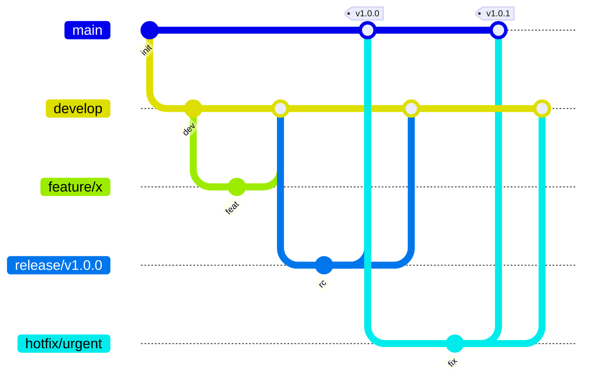

# Version Control

A version control system records every change made to a codebase and lets a team work on it at once without overwriting each other. This chapter covers what such a system does, how centralized and distributed ones differ, and how to choose a branching strategy.

## Version Control Systems

**Version control system (VCS)**: a system that tracks and controls changes to a document or codebase over time.

A VCS supports six core tasks:

- **Synchronization** — several developers work on the same project at the same time
- **Reversal** — return the code to an earlier version
- **Change tracking** — know who changed what, and when
- **Sandboxing** — isolated space for development and test work
- **Branching** — keep variations of the same base code
- **Backup** — restorable copies of the source

Two components hold the code:

- **Repository** — the shared storage that holds reviewed and edited code
- **Working copy** — a developer's local copy, where edits are made

A developer **commits** finished edits from the working copy to the repository, and **updates** the working copy by pulling in the latest repository changes.

### Centralized Version Control

A single shared repository holds the history. Developers keep local working copies but must upload their edits to that one repository before anyone else can see them, so most operations need a connection to the server. Team Foundation Version Control (TFVC) is an example.

### Distributed Version Control

Every developer's machine holds a full local repository — the complete history — alongside the working copy. Two actions are added to commit and update:

- **Pull** — bring changes from the remote repository into the local repository and working copy
- **Push** — send committed local changes to the remote repository

Git is the most widely used distributed system.

### CVCS vs. DVCS

| Aspect | CVCS | DVCS |
| --- | --- | --- |
| **Focus** | Synchronizing and backing up files | Tracking and sharing changes |
| **Learning curve** | Easier to learn | Requires more practice |
| **Offline work** | Most operations need connectivity | Most work possible offline |
| **Resilience** | Losing the central server risks losing history | Every clone preserves the full history |
| **Configurability** | Simpler, more rigid | Flexible, more complex |

## Branching

**Branching**: copying code from the mainline so a developer can edit it without disrupting the work of others.

| Term | Meaning |
| --- | --- |
| **Mainline** | The authoritative codebase, named `main` or `master`, that working copies are taken from |
| **Branch** | An isolated copy of the mainline, created for a change and expected to pass quality checks before it returns |
| **Merge** | Integration of a finished, tested branch back into the mainline |
| **Fork** | A branch that is not intended to be merged back |

A **merge conflict** happens when two branches change the same code in incompatible ways — one developer edits lines that another is deleting. Individually they are quick to resolve; at scale they delay delivery, and the branching strategy is what controls how often they occur.

### Branch Lifetime

How long a branch stays open shapes the cost of merging it more than any naming convention does.

**Long-lived branches** stay open for weeks and carry the full history of a feature's development. They suit complex work and distributed teams, but the longer a branch runs, the further it drifts from the mainline, and the larger the eventual merge and any rollback become.

**Short-lived branches** are merged back within days. They suit [CI/CD](03-ci-cd.md) workflows and encourage small, frequent commits, at the cost of more discipline around partly finished work, which usually means keeping it behind feature flags.

| Aspect | Long-Lived | Short-Lived |
| --- | --- | --- |
| **Merge size** | Larger, harder to review | Smaller, easier to review |
| **Rollback** | Harder, since more changes unwind together | Easier, since each merge carries less |
| **Merge conflicts** | More frequent and more demanding | Fewer and smaller |
| **Automation fit** | Integration is exercised late | Every merge exercises the pipeline |

### Branching Strategies

A branching strategy is the team's rule for when branches are created and when they are merged. The choice follows the release model: a team shipping on a fixed schedule and a team deploying continuously need different rules.

| Strategy | Rule | Suits |
| --- | --- | --- |
| **GitFlow** | A fixed role per branch: `feature`, `develop`, `release`, `hotfix`, and `main` | Explicitly versioned software, or several versions supported at once |
| **Trunk-based development** | The whole team works from one shared trunk; branches, where used, are short-lived and merged back quickly | Continuous delivery, with review through small pull requests |
| **Feature isolation** | One branch per feature, held until the feature is ready to merge | Work that must be kept out of the mainline as a unit |
| **Release isolation** | A release branch is locked and accepts only critical hotfixes, while servicing branches carry patches for versions already released | Supporting software that is already in customers' hands |

Record the strategy the team follows somewhere the whole team can find it — see [Knowledge Sharing](../10-management/05-knowledge-sharing.md).

### GitFlow

GitFlow gives each branch a fixed role. Its author, Vincent Driessen, later added a note to the original post advising teams that practice continuous delivery to adopt a simpler workflow instead of forcing GitFlow onto it; he still considers the model a fit for software that is explicitly versioned or that must support several released versions at once.

| Branch | Purpose | Lifetime |
| --- | --- | --- |
| **`main`** | Production-ready code | Permanent |
| **`develop`** | Integration of finished features | Permanent |
| **`feature/*`** | New features | Until merged |
| **`release/*`** | Release preparation | Until released |
| **`hotfix/*`** | Urgent production fixes | Until merged |



```bash
# Start a new feature
git checkout develop && git checkout -b feature/new-feature

# Update with latest
git fetch origin && git rebase origin/develop

# Complete feature
git checkout develop
git merge --no-ff feature/new-feature
git branch -d feature/new-feature

# Create release
git checkout -b release/v1.0.0
git checkout main && git merge --no-ff release/v1.0.0
git tag -a v1.0.0 -m "Release v1.0.0"
git checkout develop && git merge --no-ff release/v1.0.0
```

## References

1. [A Successful Git Branching Model](https://nvie.com/posts/a-successful-git-branching-model/) — Vincent Driessen
