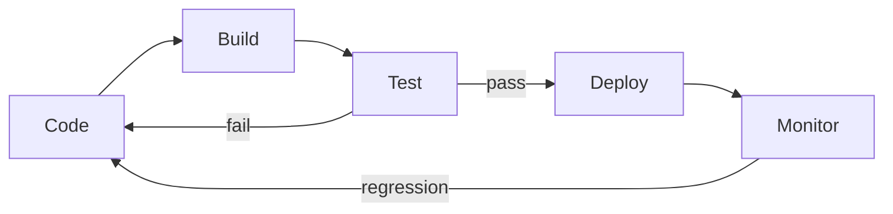

# CI/CD

Continuous integration (CI) verifies every commit against the shared mainline; continuous delivery (CD) moves each verified build toward production. This page covers both, and the environment stages a change passes through before it reaches users.

| Aspect | CI | CD |
| --- | --- | --- |
| **Focus** | Code integration | Automated deployment |
| **Goal** | Detect integration issues | Deploy to production |
| **Frequency** | Every commit | After CI passes |
| **Tools** | GitHub Actions, Jenkins | Argo CD, Spinnaker |

## Environment Stages

| Environment | Purpose | Data | Promotion |
| --- | --- | --- | --- |
| **Local** | Individual development | Mocked/sample | Push to a shared branch |
| **Development** | Integration testing | Test database | Promote once CI passes |
| **Staging** | Pre-production and user acceptance testing | Production-like | Release to production |
| **Production** | End users | Real data | None — telemetry feeds the next change |

## References

1. [GitHub Actions Documentation](https://docs.github.com/en/actions)
