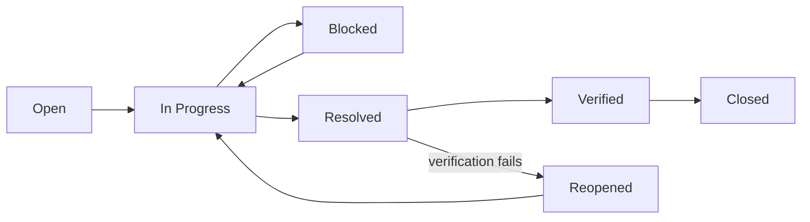

Quality assurance is the process, mostly run by test engineers, that gives confidence a product meets what clients and users expect. It costs time, money, and people, so its value has to be argued to stakeholders rather than assumed. This guide covers how QA is organized — its vocabulary, the life cycle it follows, test cases, defects, non-functional requirements, metrics, and automation. The practices that carry it out, including test principles, TDD, BDD, and unit testing, are in [Testing](05-testing.md).

## QA, Quality Control, and Testing

The three terms are used interchangeably in conversation and mean different things in practice.

Quality Assurance
: Process-level work spanning the whole lifecycle, aimed at stopping defects from being introduced at all

Quality Control
: Product-level work that inspects what was actually built and drives the issues it finds to resolution

Testing
: The activity of exercising a build to confirm it behaves as specified and carries no known faults

They nest rather than compete: testing is one activity inside quality control, and quality control is one activity inside quality assurance. The distinction matters when a team says it "has QA" because someone runs tests before release. That is testing. The outermost ring — designing the process so that fewer defects arrive at all — is the part most often missing.

What quality means on a given project has to be pinned to attributes someone can actually evaluate: functionality, availability, performance, testability, security, usability, and reliability. Agreeing that list early is what makes everything below possible, because test cases verify the first of them and the [non-functional suites](#testing-of-non-functional-requirements) cover the rest.

### Error, Defect, and Failure

Error
: A mistake a person makes while writing code or interpreting a requirement

Defect
: Code that does not do what its specification says, whether or not anyone has run it yet; also called a bug

Failure
: The event a user sees when the running system cannot do what it was built to do

The three are a chain, and each link can break. An error only becomes a defect if it reaches the code; a defect only becomes a failure when something executes the affected path. That is why the counts never match, and why a report of zero failures in production says nothing about how many defects shipped.

## Testing Types and Methods

Every test sits at one point on each of three independent axes: who runs it, what it asserts, and how much of the internals the tester can see.

The first axis is who runs the test. Manual and automated testing answer different needs rather than competing for the same work.

| Approach | Strengths | Costs |
| --- | --- | --- |
| **Manual Testing** | Flexible — a person can follow a hunch, change course mid-session, and judge whether a result merely looks wrong | Slow, and the cost is paid again on every repetition, so it scales badly across a large regression suite |
| **Automated Testing** | Fast and repeatable, and the same suite can run on every commit for almost no marginal cost | Needs upfront investment in framework, environment, and ongoing maintenance before it returns anything |

The second axis is what the test asserts. Functional testing asks what the system does; non-functional testing asks how well it does it, and is treated at length in [Testing of Non-Functional Requirements](#testing-of-non-functional-requirements).

The third axis is how much of the internals the tester can see. The three box methods differ in the access the tester is granted, which decides what the tester is able to reason about.

| Method | What the Tester Sees | Typical Use |
| --- | --- | --- |
| **White Box** | The internal structure of the code under test | Verifying paths and branches, which is why it sits at the unit level |
| **Black Box** | Only the interface — inputs in, outputs out | Verifying behavior against the specification, with no assumption about how it is built |
| **Grey Box** | A hybrid: interface plus enough design and database access to construct inputs and confirm side effects | Integration and end-to-end work, where a result is only checkable by looking at stored state |

## Software Testing Life Cycle

The Software Testing Life Cycle (STLC) is the sequence QA work moves through, from reading a requirement to closing out a release.

| Phase | What Happens |
| --- | --- |
| **Requirement Analysis** | Testers read the requirements and decide which of them are testable and what would count as evidence |
| **Test Planning** | Scope, schedule, resources, and estimates are agreed and written down |
| **Test Case Design** | Cases are written, reviewed, and traced to the requirements they cover; test data is prepared |
| **Test Environment Setup** | The environment and tooling are made ready, independently of whether the cases are finished |
| **Test Execution** | Cases are run, results recorded, defects logged, and fixes retested |
| **Test Closure** | Results are reported, the suite is tidied, and what was learned is fed back into the next iteration |

The order is one of dependency, not a timetable. The phases are not always strictly sequential: environment setup usually runs in parallel with case design, and in an iterative team all six repeat inside every iteration rather than once per project.

### Test Plan and Test Strategy

Two documents come out of planning, and teams routinely merge them into one file and then lose track of which question they were answering.

Test Plan
: The document fixing scope, schedule, and resources — what gets verified and when

Test Strategy
: The document fixing the approach and the types of verification used — how the work gets done

The plan changes when the release changes; the strategy changes when the team changes how it works. Keeping them separate makes it obvious which of those has happened.

### QA in the Iteration

QA fails quietly when it is treated as a phase at the end rather than as work planned alongside everything else. These practices are what keep it inside the iteration:

- **Keep one documented test process** — where each tester follows a private version, results cannot be compared across people or releases, and a new joiner inherits an oral tradition instead of a process.
- **Take part in planning, refinement, stand-up, and retrospective** — a tester in refinement can say a requirement is untestable while it is still cheap to reword, which is the earliest and cheapest defect any team catches.
- **Put test estimates into iteration planning** — work that is not estimated is not scheduled, and testing that is not scheduled is what gets compressed when the iteration runs late.
- **Keep the Test Plan and Test Strategy current** — a plan nobody has updated since project initiation stops being a reference and becomes a thing people work around.
- **Publish a test report every release** — the go/no-go decision needs something to stand on, and the report is also the only record of what was and was not covered.
- **Verify non-functional requirements too** — they are the ones most easily assumed to be someone else's job, and the ones most expensive to fix after release.

## Testing Pyramid

Layers, bottom to top: Unit → Integration → UI/E2E tests. Width is the number of tests, height is scope, complexity, and instability. The pyramid prescribes a shape, not a ratio: many fast unit tests, fewer integration tests, and a thin layer of end-to-end tests. The proportion that fits a given system is a team decision, not a constant.

| Level | Speed | Isolation | Purpose |
| --- | --- | --- | --- |
| **Unit Tests** | Milliseconds | Full | Component/function logic |
| **Integration Tests** | Seconds | Partial | Component interactions |
| **E2E Tests** | Minutes | None | User journeys |

The principle underneath the shape is to verify everything at the lowest level that can verify it, and to push a test down the pyramid whenever it can be moved. A test that runs lower is faster, cheaper to maintain, and points at a smaller piece of code when it fails. That is also what keeps the feedback cycle short enough to run the unit suite on every code addition, where a failure is still cheap to fix.

### Unit vs. Integration Tests

A unit test runs in isolation with every external dependency mocked or stubbed, which makes it fast, cheap, and precise: when it fails, it names the faulty code. An integration test involves the real dependency — a database, the network, a device — which makes it slower and costlier to run and maintain, and narrows a failure only as far as a module or component. The trade is diagnostic precision against realism, and it is the reason both layers exist rather than one.

## Test Case Management

Test Case
: A single verification: one set of preconditions and inputs, and the one result they should produce

Test Suite
: A named group of cases run together for one purpose, such as a sanity, smoke, regression, UI, performance, or API run

Cases group into suites, and suites are scheduled by the [Test Plan](#test-plan-and-test-strategy). A case is well formed when someone who did not write it can run it and reach the same verdict, and when it can be traced back to the requirement that justifies it. That is what the fields are for: ID, priority, title, description, steps, prerequisites, test data, expected result, requirement ID, environment, comments, defect ID, and automation status.

### Design Techniques

Writing a case for every possible input is not an option, so the techniques below are ways of choosing which inputs are worth spending a case on.

| Technique | What It Does |
| --- | --- |
| **Boundary Value Analysis** | Tests values at and immediately around the edges of an allowed range, where off-by-one mistakes live |
| **Equivalence Partitioning** | Divides the input space into classes whose members should be handled identically, then tests one member per class |
| **Decision Table Testing** | Enumerates combinations of conditions and the outcome each combination should produce, so no combination is left unconsidered |
| **State Transition Diagrams** | Model the states the system can be in and the legal moves between them, covering both the permitted transitions and the forbidden ones |
| **Use Case Testing** | Derives cases from end-to-end user flows, catching the gaps that appear only when steps are combined |
| **KISS** | Keeps each case to one simple verifiable thing, because a case that tests several things at once cannot report which of them broke |

### Test Case Life Cycle

A case is a maintained artifact, not a one-time write-up. It moves through: analyze the requirement, set up the environment and tools, write the case and self-review it, map it to the requirement it covers, put it through peer review, automate it where that pays, execute it, fold it into regression, and eventually retire it or merge it with a duplicate. The last step is the one teams skip, and skipping it is how a suite fills with cases that verify behavior the product no longer has.

Three levels of review apply, in increasing distance from the author: self-review against the SRS or FRD, peer review on the maker-checker principle, and supervisor review. The recurring problems they look for are missing coverage, spelling and grammar, non-standard templates, jargon a reader outside the team will not follow, duplication, and cases that have gone obsolete.

Coverage itself is tracked in a Requirement Test Coverage Report or a Requirement Traceability Matrix, which is the artifact that answers "which requirements have no case at all" — a question no count of passing tests can answer.

### Regression Suites

A regression suite grows until running it costs more than the confidence it returns, so it needs curating. Categorize the cases into those still reusable and those now obsolete, prioritize what remains by business impact, and select for the run the cases covering critical, frequently used, core, and recently changed functionality. The last of these matters most: recently changed code is where the next regression is.

**Practices:**

- Design each case as a discrete, verifiable action rather than a tour of the product.
- Keep cases in one specialized tool, so that coverage and results are countable.
- Prioritize and order regression execution, so a truncated run still covers the important cases.
- Organize cases into suites that match how they will be run.
- Trace every case to a requirement.
- Have business analysts review cases, since they are the ones who can say a case verifies the wrong thing.

## Defect Management

The Defect Management Process is the path a defect takes from being noticed to being reported on.

| Step | What Happens |
| --- | --- |
| **Discovery** | The defect is found and logged, by a tester, a developer, or a user |
| **Triage** | Priority and severity are set, and duplicates and change requests are filtered out |
| **Resolution** | The defect is fixed, and its root cause analyzed rather than only its symptom |
| **Verification** | A tester confirms the fix does what the report asked for |
| **Closure** | The defect is closed once verification passes |
| **Reporting** | What was found and fixed feeds the metrics below and the release report |

Triage is the step that protects the rest: a backlog where change requests are logged as defects reports a defect count nobody can act on.

### Defect Life Cycle

The status flow is what the tracker shows, and it exists mainly to make the reopen path visible:

### Priority and Severity

Two independent scales, measuring different things:

- **Priority** is business urgency — Low, Medium, High, or Critical — and answers how soon this should be worked on.
- **Severity** is technical impact — Trivial, Minor, Major, Critical, or Blocker — and answers how badly the system is affected.

The two conflict routinely, and that is the point of having both. A typo in the company name on the landing page is trivial in severity and high in priority; a crash in a feature nobody uses yet is a blocker in severity and low in priority. A team that collapses the two into one field loses the ability to say either.

### Root Cause Analysis

Fixing a defect removes one symptom; root cause analysis is what stops the next one. It runs as: form a team, define the problem, determine the root cause, act on it, and prevent recurrence. The causes tend to fall into three groups — human error, organizational confusion such as vague instructions or poor task assignment, and mechanical or system failures. The middle group is the one worth watching, because it produces defects across unrelated parts of the product and no amount of code review will find it.

### Production Defects

A defect found in production is the same process run under time pressure and in front of an audience. Stay calm, reproduce it, gather information, find the cause, set a resolution timeframe and communicate it, verify the fix, and then analyze the root cause and act to prevent recurrence. That last part carries more weight than it does for an internal defect: this defect passed every filter the team has, so something in the process, not only in the code, did not work.

**Metrics:** defect containment, the share of defects caught before release; the defect rejection ratio; the created-versus-resolved trend; and quality debt, the risk carried by a backlog of deferred fixes. These sit alongside the wider set in [QA Metrics](#qa-metrics).

**Practices:**

- Use one specialized defect tool — Jira, Bugzilla, Azure DevOps, or Rally — and link every defect to the user story it belongs to.
- Write down what each severity and priority level means, and the workflow statuses, so two people classify the same defect the same way.
- Resolve high and critical defects within the iteration that found them, rather than carrying them.
- Hold regular triage meetings, and keep defects separate from change requests.
- Use one submission template, so every report arrives with the steps needed to reproduce it.
- Make root cause analysis and metrics reporting recurring commitments, not a response to a bad release.

## Testing of Non-Functional Requirements

Functional requirements say what the system does and are mandatory. Non-functional requirements say how well it does it — performance, usability, scalability, and the rest — and are often negotiable against time and cost, which is exactly why they are the first thing dropped and the most expensive thing to retrofit.

Non-functional testing runs through its own phases: **Planning** → **Preparation** → **Test Execution** → **Record** → **Analysis and Improvement**. The two at the end are what distinguish it. A functional case ends in pass or fail; a non-functional run ends in a number that has to be recorded and then interpreted against the target the team agreed, and the interpretation is where the value is. A response time of 400 ms is neither a pass nor a failure until someone says what it was supposed to be.

The categories to agree with stakeholders are compatibility, performance, capacity, security, reliability and availability, scalability, maintainability, usability, and accessibility. Performance alone splits into load, endurance, volume, scalability, spike, and stress testing, each of which puts a different shape of demand on the system.

This work belongs inside the SDLC continuously rather than in a block before release, which in practice means automating it: every category except usability and accessibility needs a tool to generate the load or the conditions at all — JMeter and LoadRunner among them — and a tool-driven run is one a pipeline can repeat.

**Practices:**

- Test non-functional requirements every release, not once per project.
- Factor the results into the go/no-go release decision, which is what makes running them worthwhile.
- Automate them and run them in [CI/CD](03-ci-cd.md), so a regression in performance is caught the same way a regression in behavior is.
- Define quality attributes quantitatively wherever possible: "fast" cannot be tested, and "under 200 ms at the 95th percentile" can.

## QA Metrics

Metrics fall into two groups by what they can tell you.

Result Metrics
: Absolute counts of what happened — cases passed, failed, or blocked, defects found, accepted, or rejected, planned against actual hours, post-release bugs

Predictive Metrics
: Ratios derived from those counts that flag risk early, such as defect containment efficiency, defect leakage, the defect reopen ratio, the rejection rate, and test design efficiency

Counts describe the release that just happened; ratios are what let a team act before the next one goes the same way. A rising reopen ratio says fixes are not being verified properly, and it says so while there is still time to change how they are verified.

Metrics themselves follow a cycle: **Analyze**, picking metrics that answer a question someone actually has; **Communicate**, agreeing with the team what data has to be captured to produce them; **Evaluate**, collecting the data and automating the collection; and **Report and Analyze**, sharing findings against the targets the team agreed, and dropping targets that no longer change a decision. The improvement loop around it is PDCA — Plan, Do, Check, Act — which is what turns a number that moved into a change in how the team works.

**Practices:**

- Measure on a defined, automated schedule, so the numbers are comparable between releases.
- Turn every result into a concrete action. A metric nobody acts on costs collection effort and returns nothing.

## Automated Testing

Automation speeds up repetitive verification, removes the human error that comes with running the same steps for the fiftieth time, and frees testers for the exploratory work only a person can do. It is not free: it costs maintenance, environment upkeep, training, and framework setup. Scaling a suite blindly raises all four costs without any guarantee of quality — the size of a suite is not evidence about the product.

### Feedback Time and Determinism

Two attributes decide whether an automated suite is worth having.

- **Feedback time** — the faster a suite reports, the sooner defects are fixed and the more developers trust it enough to run it. A unit suite should finish in seconds.
- **Determinism** — a good test returns the same result for the same code every time. Flaky tests erode trust in the whole suite and can hide a real defect behind a failure everyone assumes is noise.

The two reinforce each other, and both are about whether people believe the result. See [Running Tests in CI](05-testing.md#running-tests-in-ci) for how that plays out in a pipeline gate.

### Where Tests Run

Verification runs at every stage of the [CI/CD environment pipeline](03-ci-cd.md) — Local → Development → Staging → Production — with unit tests before the commit, automated integration and regression suites in Development, and manual exploratory plus user acceptance testing (UAT) in Staging. This is what shifting left means in practice, and the arithmetic behind it is simple: the cost of a missed defect and the cost of verifying it both rise the later it is caught, while the number of defects remaining should fall. Catching one earlier is therefore cheaper twice over.

The Testing Pyramid above applies to the automated suite as much as to the whole, topped by a thin layer of manual exploratory testing. Overusing UI-level automation is the common failure: it produces suites that are slow, fragile, and eventually ignored.

### Test Data

An automated suite needs data it can rely on, which comes down to three approaches: generate the data per test, maintain a dedicated test database that is backed up, or drive ingestion and preparation scripts. Whichever is chosen, the data must be reloadable and cleaned up after the run — a suite that only ever inserts will bloat the database and slow itself down until it is abandoned.

### Metrics and Reporting

The measures worth tracking for the automated suite are the share of production bugs that gain a new automated test, the share of developers writing tests, code coverage as a presence indicator rather than a quality guarantee, test coverage as the ratio of automated to total manual cases, and the flaky-test count, whose target is zero. [Coverage Types](05-testing.md#coverage-types) covers what a coverage percentage does and does not prove.

Results have to be readable to be acted on: consolidated by build or version, transparent enough for a non-engineer to read, and available to everyone rather than to whoever opened the pipeline. In practice that is a dashboard showing version, changelog, results, and links to drill into a failure.

**Practices:**

- Make automation part of the test strategy rather than a side project, and automate regression within the sprint that created it.
- Hold automated test code to the same standard as production code; it is maintained just as long.
- Run full suites at least weekly and regression suites daily.
- Gate the CI/CD pipeline with automated smoke tests, so a broken build stops before it reaches anyone.
- Use production-like test data, since defects that only appear at real data volumes will not appear at any other.
- Apply the Testing Pyramid, and revisit the shape as the system changes.
