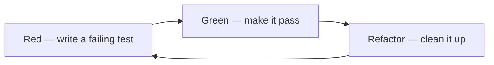

# Testing

This guide covers the practice of writing tests: the principles a good test follows, the two test-first disciplines, unit testing, the vocabulary of test doubles, what a coverage number actually proves, and where suites run in a pipeline. 

How testing is organized and reported — test case management, defect management, non-functional testing, metrics, and the automation strategy — is in [Quality Assurance](04-quality-assurance.md).

## Testing Principles (F.I.R.S.T.)

| Concept | Definition |
| --- | --- |
| **Fast** | Runs in milliseconds, so the whole suite can run on every change without anyone waiting for it |
| **Independent** | Shares no state with any other test, and sets up and tears down whatever it needs |
| **Repeatable** | Produces the same result on every run, on any machine, in any order |
| **Self-Validating** | Reports its own pass or fail, with no human reading output to decide which it was |
| **Timely** | Written alongside the code it covers, in the same change or ahead of it under TDD |

**Best practices:**

- Test behavior, not implementation details
- Use descriptive names: `it('returns correct total when items are added')`
- Follow Arrange → Act → Assert
- One assertion per test where possible
- Mock external dependencies (APIs, databases, file system)

## Test-Driven Development (TDD)

Write a failing test first, make it pass with the simplest code that works, then improve the design. The test defines the contract before the implementation exists, so the code is testable by construction and no line ships without a test that was *seen* to fail.



| Step | Goal | Rule |
| --- | --- | --- |
| **Red** | Write the smallest test that expresses the next behavior | Run it and watch it fail — a test that never failed proves nothing |
| **Green** | Make it pass as directly as possible | No speculative features; duplication is acceptable at this step |
| **Refactor** | Improve naming, structure, and duplication | Tests stay green; no new behavior is added |

**Red** — the test fails because `total()` does not exist yet:

```ts
it('returns the total of all items in the cart', () => {
  const cart = createCart();
  cart.addItem({ id: 'sku-1', price: 10, quantity: 2 });
  expect(cart.total()).toBe(20);
});
```

**Green** — the simplest code that satisfies the test:

```ts
export const createCart = () => {
  const items: CartItem[] = [];
  return {
    addItem: (item: CartItem) => items.push(item),
    total: () => items.reduce((sum, i) => sum + i.price * i.quantity, 0),
  };
};
```

**Refactor** — extract, rename, and remove duplication once the test protects you.

**Practices:**

- Keep cycles short — minutes, not hours; a long red phase means the step was too big
- Let the test drive the API: if a test is awkward to write, the design is awkward to use
- Add a failing test for every bug before fixing it, so regressions stay caught
- Refactor only on green, and never mix a refactor with a behavior change
- Assert on observable behavior so refactoring does not break the suite

**Trade-offs:** TDD pays off most on logic with real branching — pricing, validation, state machines, reducers. It pays off least on exploratory spikes and purely visual markup, where the design is not yet stable enough for a test to pin down.

TDD and BDD are complements, not alternatives: BDD frames *what* the system should do for the user, TDD drives *how* each unit is built to get there.

## Behavior-Driven Development (BDD)

Describes expected behavior from the user's perspective using natural language.

```gherkin
Feature: User Login

Scenario: Successful login with valid credentials
    Given the user is on the login page
    When the user enters valid email "user@example.com"
    And the user enters valid password "password123"
    And clicks the login button
    Then the user is redirected to the dashboard

Scenario: Failed login
    Given the user is on the login page
    When the user enters invalid credentials
    Then the user sees an error message
```

## Unit Testing

A unit test is code that asserts one or more conditions to verify another piece of code behaves as expected, in isolation, without running the full application.

### Why It Matters

- **Maintainability.** Maintainability is the ability to change, understand, and test code without fear, and unit tests support all three at once: they state what the code is supposed to do, they fail when a change breaks it, and they force the code into a shape that can be exercised on its own.
- **The cost of change over time.** Early in a project, coding without tests genuinely is faster, because there is little code to break and the whole design still fits in one person's head. As the codebase grows, the cost of changing untested code climbs — every change means re-reading more code and risking something nobody remembers — while the cost of keeping a suite stays roughly proportional to the code it covers. The two effort curves are usually said to cross, after which the tests pay for themselves. Treat that crossover as a model of how the costs behave rather than a measured date: nobody can tell you the week a given project reaches it. What the decision actually rests on is the direction, which is that the longer code lives, the worse the untested option gets.
- **Confidence to change code.** A suite is a contract recording the behavior that exists today, so a refactor that leaves the tests green is a refactor that left the behavior alone. Without that contract, restructuring is a gamble, people stop taking it, and the codebase sets.
- **A record of the edge cases.** Tests document the branches and boundary conditions no one can hold in memory months later, which makes the suite — rather than the original author — the place that knowledge survives.
- **Pressure on the design.** Code that is awkward to test is usually awkward to use, so writing the test exposes hidden dependencies and overwide interfaces while they are still cheap to change.
- **Evidence of what they catch.** Yuan et al. (OSDI '14) sampled 198 user-reported failures across five distributed data-intensive systems and found 77% of them reproducible by a unit test. That is a finding about that class of system, not about production failures in general, but it sets a high bar for what unit tests can catch.
- **The cost of skipping.** "Legacy code is code without tests" (Feathers) — untested code starts accruing that status the day it is written, because the next person to touch it has no way to change it safely.

This book's own convention, offered as a convention rather than as a finding, is that unit tests are worth skipping only for code with a known disposal date: throwaway proofs of concept and demos that exist to answer one question and are deleted once it is answered. Deciding the question by expected project length invites exactly the failure described above, because the estimate is made before anyone knows whether the code will survive, and short-lived code that turns out to be useful is precisely the code that becomes untested legacy. If the code is going to be maintained, the exception does not apply.

### Qualities of a Good Unit Test

- **Maintainable** — test code is held to the same quality bar as production code, because a suite nobody can read is a suite people ignore or delete the first time it goes red for an unclear reason.
- **Isolated** — a test that reaches a database, the filesystem, the network, or environment config fails for reasons unrelated to the code under test, and every such failure teaches the team to distrust the suite.
- **Properly targeted** — cover the domain logic, where the branching and the risk actually live; tests over trivial or incidental code cost maintenance and prove nothing.

### Common Myths, Rebutted

- **"You can't unit test legacy code."** You can, incrementally: introduce a seam, pin the current behavior down with a test, then refactor behind it. The claim is a statement about effort, not about possibility.
- **"Unit testing is expensive."** It moves cost rather than adding it. Nagappan, Maximilien, Bhat, and Williams (2008) tracked four teams at Microsoft and IBM that adopted TDD and reported 40–90% lower defect density for 15–35% longer initial development time.
- **"Production urgency excludes testing."** Urgency is the argument *for* unit tests: when there is no time for a regression pass, a suite that runs in seconds is often the only safety net that fits the window available.
- **"Testing can be done separately from implementation."** Like input validation, testing bolted on afterwards means reworking code that has already shipped, so the deferral is a loan taken against the same schedule it was meant to protect.
- **"Production code matters more than test code."** Production maintainability is gated by test quality, because a suite that is slow, flaky, or unreadable stops being consulted, and the production code is then untested in practice.

In practice this means writing the tests in the same task or story as the production code rather than as a later phase, holding them to the [F.I.R.S.T. principles](#testing-principles-first) above, and running them where they can stop a bad change — see [Running Tests in CI](#running-tests-in-ci) for where a suite sits in a pipeline, and [Coverage Types](#coverage-types) for what a coverage number does and does not prove.

## Test Doubles

The five kinds below are Gerard Meszaros's taxonomy from *xUnit Test Patterns*. The names get used loosely in practice, and most mocking libraries produce whichever kind you configure, but the distinctions are what make a test's intent readable.

| Concept | Definition |
| --- | --- |
| **Test Double** | Any stand-in a test substitutes for a real collaborator so the code under test can run in isolation |
| **Dummy** | A value passed only to satisfy a signature, never called and never asserted on |
| **Fake** | A working implementation that takes a shortcut making it unfit for production, such as an in-memory store standing in for a database |
| **Stub** | A double that returns canned answers to the calls a test makes, supplying the input the code needs to reach the case under test |
| **Spy** | A double that records the calls it receives so the test can assert on them afterwards |
| **Mock** | A double preloaded with the calls it expects to receive, which fails the test itself when the code does not call it that way |

The line that matters is between the last three. A stub is about input — it feeds the code whatever it needs to reach the case under test, and asserts nothing. A mock is about verifying interaction — it carries an expectation of how it will be called and fails the test when that expectation is not met. A spy sits between them, recording calls without judging them, so the assertion stays in the test where a reader can see it.

Reach for a stub whenever the collaborator is only a source of data, and for a mock only when the call itself is the behavior under test — sending the email, publishing the event. Mocking what is merely incidental couples the test to the implementation and breaks it on every refactor.

## Coverage Types

Coverage tools report one percentage by default, and which of these it measures changes what the number proves.

| Concept | Definition |
| --- | --- |
| **Statement Coverage** | Share of executable statements the suite ran at least once |
| **Line Coverage** | Share of source lines executed; differs from statements only where one line holds several of them |
| **Branch Coverage** | Share of decision outcomes taken, so an `if` counts only once both the true and the false path have run |
| **Function Coverage** | Share of functions or methods entered at least once, the coarsest of the four |

Branch coverage is the one that catches an untested `else`. Statement and line coverage can read 100% while a conditional is only ever exercised one way, because every statement did run — just never with the other outcome. Function coverage is weaker still: it says a function was entered, not that anything inside it was checked.

None of them measure verification. A suite with 99% coverage and no assertions proves nothing, so 100% is not a quality guarantee — the number is worth tracking as a macro trend and for spotting untested areas, and no further. See [QA Metrics](04-quality-assurance.md#qa-metrics) for how it sits among the other measures a team reports.

## Running Tests in CI

Where a suite runs decides what it can be trusted to do. The pipeline stages themselves are in [CI/CD](03-ci-cd.md); what follows is the testing side of that boundary.

- **Gating suites** run on every push and must be fast — unit tests plus a thin smoke layer. A gate slower than a few minutes stops being a gate and becomes a queue, and people start pushing around it.
- **Scheduled suites** run nightly or on a cron — full regression, long-running integration, performance and load runs. They cover what a gate cannot afford to wait for, at the price of a slower feedback loop.
- **A flaky test in a gating suite is worse than no test.** It trains everyone to hit re-run instead of reading the failure, and once that reflex exists a genuine failure gets re-run too. Quarantine a flaky test out of the gate the day it is spotted, then fix or delete it.
- **The result needs to be a machine-readable artifact**, not only lines in the log. A structured report the pipeline can parse — JUnit XML is the usual interchange format — lets the build annotate the failing case, track flakiness across runs, and enforce a coverage threshold without a human reading output.
