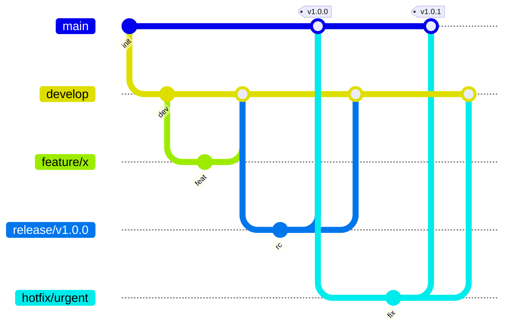

# Version Control

## GitFlow

Branching model for features, releases, and hotfixes.

```text
main (production)
  │
  │  develop (integration)
  │    │
  │    ├── feature/feature-name → merge back to develop
  │    │
  │    └── release/v1.0.0 → tag & merge to main + develop
  │
  └── hotfix/urgent-fix → merge to main + develop
```

| Branch | Purpose | Lifetime |
| --- | --- | --- |
| `main` | Production-ready code | Permanent |
| `develop` | Integration branch | Permanent |
| `feature/*` | New features | Until merged |
| `release/*` | Release preparation | Until released |
| `hotfix/*` | Urgent production fixes | Until merged |



```bash
# Start a new feature
git checkout develop && git checkout -b feature/new-feature

# Update with latest
git fetch origin && git rebase origin/develop

# Complete feature
git checkout develop
git merge --no-ff feature/new-feature
git branch -d feature/new-feature

# Create release
git checkout -b release/v1.0.0
git checkout main && git merge --no-ff release/v1.0.0
git tag -a v1.0.0 -m "Release v1.0.0"
git checkout develop && git merge --no-ff release/v1.0.0
```

## Pull Request Template

```markdown
## Description
Brief description of changes

## Type of Change
- [ ] Bug fix
- [ ] New feature
- [ ] Breaking change
- [ ] Documentation update

## Testing
Describe the testing approach

## Checklist
- [ ] Self-reviewed
- [ ] Tests pass locally
- [ ] No new warnings
- [ ] Documentation updated
```

## References

1. [GitFlow Workflow](https://nvie.com/posts/a-successful-git-branching-model/)
