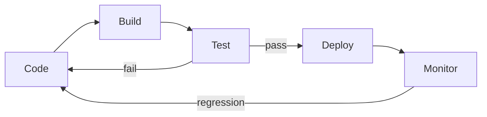
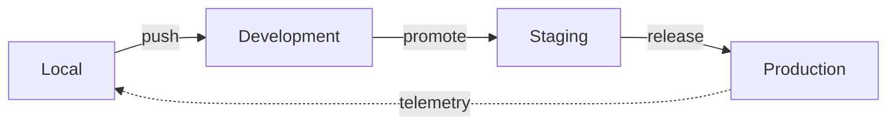

# CI/CD

Automates integration and deployment: Code → Build → Test → Deploy → Monitor.

| Aspect | CI | CD |
| --- | --- | --- |
| Focus | Code integration | Automated deployment |
| Goal | Detect integration issues | Deploy to production |
| Frequency | Every commit | After CI passes |
| Tools | GitHub Actions, Jenkins | Argo CD, Spinnaker |

## Environment Stages

| Environment | Purpose | Data |
| --- | --- | --- |
| Local | Individual development | Mocked/sample |
| Development | Integration testing | Test database |
| Staging | Pre-production testing | Production-like |
| Production | End users | Real data |

Staging mirrors production to catch environment-specific issues before release.

## References

1. [GitHub Actions Documentation](https://docs.github.com/en/actions)
