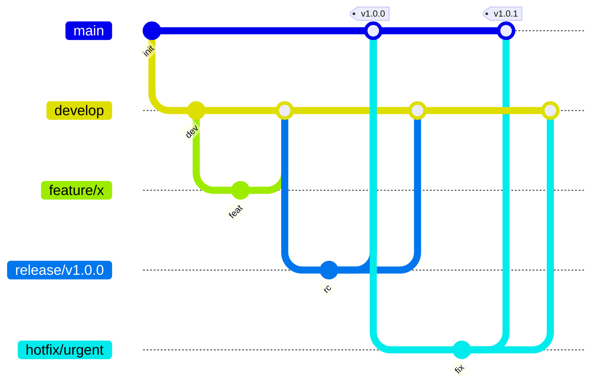

# Version Control


## 2. Version Control Systems (VCS)

**VCS**: a system that enables tracking and controlling changes to a document/codebase.

Core tasks a VCS supports:
- **Synchronization** – multiple developers working on the same project at once
- **Reversal** – reverting to earlier versions of code
- **Tracking of changes and ownership** – knowing who changed what, and when
- **Sandboxing** – isolated spaces for dev/test work
- **Branching** – creating variations of the same base code
- **Backup** – restorable copies of the source

Two fundamental components:
- **Repository** – the central storage that houses reviewed/edited code
- **Working copy** – an individual developer's local copy for making edits

Core actions: a developer **commits** finished edits from their working copy to the repository; another developer **updates** their working copy by pulling in the latest repository changes.

### Centralized VCS (CVCS)
Everything lives in one shared repository; developers still have local working copies but must upload edits to the single central repo for others to access. Example: **Team Foundation Version Control (TFVC)**.

### Distributed VCS (DVCS)
Each developer's machine holds a full copy of the codebase plus its own local repository, in addition to a working copy. Extra actions beyond commit/update:
- **Pull** – bring changes from the remote repository into a local/working copy
- **Push** – send committed local changes back to the remote repository

Example: **Git**, the most widely used DVCS today, valued for its flexibility.

### CVCS vs DVCS — comparison highlights
| Aspect | CVCS | DVCS |
|---|---|---|
| Focus | Synchronizing/backing up files | Tracking/sharing changes |
| Learning curve | Easier to learn | Requires more practice |
| Offline work | Mostly requires connectivity | Most work possible offline |
| Resilience | Central server failure risks losing history | Local copies preserve full history |
| Configurability | Simpler but more rigid | Flexible but more complex |


## Branching Strategy 

A branching strategy defines how a team approaches code branching. It works together with a **version control system (VCS)** — the tool used to edit, store, and share code — since different VCS types support different branching approaches.


**Branching**: making a duplicate copy of code from the mainline so developers can edit without disrupting others' work.

- **Mainline** ("main"/"master") – the primary, authoritative codebase that working copies are pulled from.
- **Branch** – an isolated copy created from the mainline for making changes; must pass quality checks before being reintegrated.
- **Merging** – integrating a completed, tested branch back into the mainline.
- **Fork** – a branch that isn't intended to ever be merged back.

**Merge conflicts** occur when developers make overlapping or contradictory edits (e.g., one edits code another is deleting). Usually easy to fix individually, but at scale they can cause real delays — choosing branching strategy wisely reduces their frequency.

### Branching Strategies

Strategies set the concrete rules for how/when branches are created and merged; the right choice often depends on whether the team uses a CVCS or DVCS.

- **Gitflow** – assigns dedicated roles to branches (feature, develop, release, hotfix, master). Well suited to projects with a scheduled release cycle; builds on the long-lived branching pattern and uses servicing branches to isolate releases/hotfixes.
- **Trunk-based development** – the whole team works from a shared "trunk"; short-lived branches (if used) are merged back quickly. Minimizes merge conflicts and works well with frequent code review and pull requests.

- **Feature isolation** – each feature gets its own branch, isolating development until it's ready to merge back to main. Shares the same tradeoffs as long-lived branching.
- **Servicing & release isolation** – separate branches for ongoing servicing/patches versus a "locked" release branch that should only change for critical hotfixes.

### GitFlow

Branching model for features, releases, and hotfixes.

```text
main (production)
  │
  │  develop (integration)
  │    │
  │    ├── feature/feature-name → merge back to develop
  │    │
  │    └── release/v1.0.0 → tag & merge to main + develop
  │
  └── hotfix/urgent-fix → merge to main + develop
```

| Branch | Purpose | Lifetime |
| --- | --- | --- |
| `main` | Production-ready code | Permanent |
| `develop` | Integration branch | Permanent |
| `feature/*` | New features | Until merged |
| `release/*` | Release preparation | Until released |
| `hotfix/*` | Urgent production fixes | Until merged |



```bash
# Start a new feature
git checkout develop && git checkout -b feature/new-feature

# Update with latest
git fetch origin && git rebase origin/develop

# Complete feature
git checkout develop
git merge --no-ff feature/new-feature
git branch -d feature/new-feature

# Create release
git checkout -b release/v1.0.0
git checkout main && git merge --no-ff release/v1.0.0
git tag -a v1.0.0 -m "Release v1.0.0"
git checkout develop && git merge --no-ff release/v1.0.0
```

## Branching Patterns

#### Long-lived branching
Best for complex, longer-term projects with distributed teams. A feature branch stays open for weeks and holds the full history of that feature's development. Increases risk of drift from the mainline and larger, harder merges/rollbacks.

#### Short-lived branching
Feature updates are integrated within days rather than weeks; suits continuous integration workflows. Encourages small, frequent commits and automation, which reduces integration friction and shortens time-to-production, though it requires more discipline around partially-finished work.

#### Comparison highlights
| Question | Long-lived | Short-lived |
|---|---|---|
| Integration frequency | Low (days/weeks) | High (often daily) |
| Merge size | Larger, harder | Smaller, easier |
| Rollbacks | Harder | Easier |
| Merge conflicts | Common, demanding | Minimal |

## Best Practices (Key Takeaways)
- Every team should deliberately evaluate which VCS best fits their project rather than defaulting to habit.
- Branching strategy should be chosen to match the team's VCS (CVCS vs DVCS).
- Decisions about branching strategy should be documented in a shared knowledge management system so the whole team stays aligned.


## References

1. [GitFlow Workflow](https://nvie.com/posts/a-successful-git-branching-model/)

