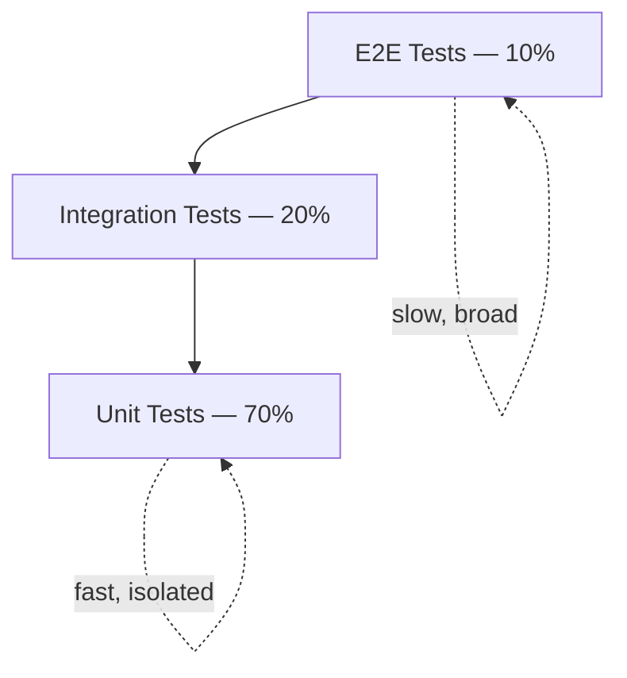
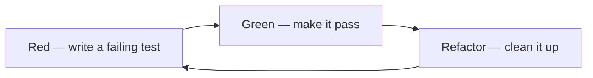

# Quality Assurance 


**Quality Assurance**is a full process (mostly run by test engineers) that gives confidence a product meets client/user expectations; 

it costs time/money/resources, so its value must be actively communicated to stakeholders.

## QA Overview

**Core distinctions**
- Quality Assurance (process-level, whole lifecycle) → Quality Control (product-level, resolves issues found) → Testing (verifies functionality/defect-free code). Testing is a sub-activity of QC, which is a sub-activity of QA.
- Quality attributes to evaluate: functionality, availability, performance, testability, security, usability, reliability.
- Error (developer mistake) → Defect/bug (code doesn't meet spec) → Failure (system can't function as intended).

**Testing types & methods**
- Manual vs. Automated testing (trade-offs: manual = flexible/slow/costly at scale; automated = fast/repeatable/needs upfront investment).
- Functional (what the system does) vs. Non-functional (how it does it).
- White box (internal structure), black box (interface only), grey box (hybrid, needs DB/design access).

**Process & practices**
- Software Testing Life Cycle (STLC): Requirement Analysis → Test Planning → Test Case Design → Test Environment Setup → Test Execution → Test Closure (not always strictly sequential).
- Key documentation: Test Plan (scope/schedule/resources — the what/when) and Test Strategy (approach/testing types — the how).
- Best practices: single documented test process; participate in planning/refinement/stand-up/retro; include test estimates in iteration planning; keep test plan & strategy updated; produce a test report per release; test non-functional requirements too.

### Testing Pyramid

Layers (bottom→top): Unit → Integration → UI/E2E tests. Width = test count, height = scope/complexity/instability.

- Unit tests: narrowest scope, cheapest, fastest, most numerous.
- Integration tests: verify interaction between components/systems (with or without network).
- UI/E2E tests: broadest scope, slowest, most expensive, most fragile.


| Level | Share | Speed | Isolation | Purpose |
| --- | --- | --- | --- | --- |
| Unit Tests | 70% | Milliseconds | Full | Component/function logic |
| Integration Tests | 20% | Seconds | Partial | Component interactions |
| E2E Tests | 10% | Minutes | None | User journeys |



- Principle: verify everything at the lowest level possible; push tests down the pyramid.
- Practical rules: keep short feedback cycles; run the unit test suite on every code addition (fail fast, cheap fixes).

### Unit vs. Integration tests

- Unit: isolated, no external dependencies (mocked/stubbed), fast/cheap, pinpoints exact faulty code.
- Integration: involves real external dependencies (DB, network, hardware), slower/costlier, only narrows fault to a module/component.

## Test Case Management

**Building blocks:** Test Case (single verification) → Test Suite (group of cases, e.g. sanity/smoke/regression/UI/performance/API testing) → Test Plan (full scope/timeline).
- Good test case fields: ID, priority, title, description, steps, prerequisites, test data, expected result, requirement ID, environment, comments, defect ID, automation status.

**Design techniques:** Boundary Value Analysis, Equivalence Partitioning, Decision Table Testing, State Transition Diagrams, Use Case Testing, KISS principle.

**Life cycle & quality control**
- Test case life cycle: analyze requirements → set up environment/tools → write & self-review → map requirements → peer review → (automate) → execute → regression → retire/merge duplicates.
- Review types: self-review (vs. SRS/FRD), peer review (maker-checker), supervisor review.
- Common defects in test cases to watch for: missing coverage, spelling/grammar, non-standard templates, jargon, duplication, obsolescence.
- Track coverage via a Requirement Test Coverage Report or Requirement Traceability Matrix.
- Regression suites: categorize (reusable vs. obsolete) → prioritize by business impact → select cases covering critical/frequent/core/recently-changed functionality.
- Recommended tools: Zephyr, Rally, Azure DevOps, TestRail, Jama, QaSpace (EPAM's own).

**Best practices:** design cases as discrete verifiable actions; use one specialized tool; prioritize/order regression execution; organize into suites; trace every case to a requirement; have BAs review cases.

## Defect Management

**Core process (Defect Management Process):** Discovery → Triage (priority/severity set, duplicates & change requests filtered out) → Resolution (root cause analysis) → Verification → Closure → Reporting.
**Defect Life Cycle (status flow):** Open → In Progress → (Blocked) → Resolved → Verified → Closed (or Reopened if verification fails).

**Classification**
- Priority (business urgency): Low / Medium / High / Critical.
- Severity (technical impact): Trivial / Minor / Major / Critical / Blocker. Priority and severity can conflict.

**Root Cause Analysis (5 steps):** form a team → define the problem → determine root cause → act on it → prevent recurrence. Common causes: human error, organizational confusion (vague instructions, poor task assignment), mechanical/system failures.

**Production bugs workflow:** stay calm → reproduce → gather info → find cause → set a resolution timeframe → verify fix → analyze root cause (weighted more heavily than internal defects) → prevent recurrence.

**Metrics:** defect containment (target ≥95%), defect rejection ratio, created-vs-resolved trend, quality debt (deferred-fix backlog risk).

**Best practices:** one specialized defect tool (Jira/Bugzilla/Azure DevOps/Rally); link defects to user stories; standard severity/priority definitions and workflow; resolve high/critical defects within the iteration; regular triage meetings; separate defects from change requests; consistent defect submission template; recurring root cause analysis and metrics reporting.

## Testing of Non-Functional Requirements

- Functional = what the system does (mandatory); Non-functional = how well it does it (performance, usability, scalability, etc. — often negotiable against time/cost).
- Non-functional testing process (5 steps): Planning → Preparation → Test Execution → Record → Analysis & Improvement — vs. 4 steps for functional testing; results need interpretation rather than a simple pass/fail.
- Categories to evaluate with stakeholders: compatibility, performance, capacity, security, reliability/availability, scalability, maintainability, usability, accessibility (150+ possible types exist — pick what's relevant).
- Performance testing sub-types: load, endurance, volume, scalability, spike, stress testing.
- Should be integrated continuously into the SDLC (shift toward automation) rather than left to the end — most non-functional testing (except usability/accessibility) needs automation tools (e.g., JMeter, LoadRunner).

**Best practices:** test non-functional requirements every release; factor results into go/no-go release decisions; automate them; include them in CI/CD; define quality attributes quantitatively wherever possible.

## QA Metrics

- Result metrics = absolute counts (test cases passed/failed/blocked, defects found/accepted/rejected, planned vs. actual hours, post-release bugs).
- Predictive metrics = derived ratios that flag risk early (e.g., defect containment efficiency, defect leakage, defect reopen ratio, rejection rate, test design efficiency).
- QA Metrics Life Cycle: Analyze (pick metrics that answer real questions) → Communicate (align data requirements with the team) → Evaluate (collect/automate data) → Report & Analyze (share findings against targets, e.g. defect containment >95%, test coverage 100%, invalid/reopen ratio <10%).
- PDCA cycle (Plan–Do–Check–Act) used to turn metrics into continuous process improvement.
- EPAM's PERF Board is cited as an example dashboard pulling data from Jira/Jenkins/SonarQube.

**Best practices:** measure metrics on a defined, automated schedule; always turn results into concrete improvement actions.

## Automated Testing

**Value proposition:** speeds up repetitive verification, reduces human error, frees testers for exploratory work; costs include maintenance, environment upkeep, training, and framework setup — scaling tests blindly increases cost without guaranteeing quality.

**Two critical quality attributes of automated tests:**
- Feedback time — the faster a suite reports results, the sooner defects are fixed and the more developers trust/run it (e.g., unit tests should complete in seconds).
- Determinism — a good test always gives the same result for the same code; non-deterministic (flaky) tests erode trust and can mask real bugs.

**Test pipeline (shift left):** Local dev → Commit → Automated Testing → Manual Testing → UAT → Production. Cost of missed defects and verification cost both rise later in the pipeline while remaining defect count should fall — so catching issues as early as possible (shift left) is far cheaper.

**Testing Pyramid (balanced suite):** Unit → Integration → API → UI tests (bottom layers = fast/cheap/run often; top layers = slow/costly/narrower use), topped by manual exploratory testing. Overusing UI-level automation makes suites slow and fragile.

**Test data management:** either generate data per test, maintain a dedicated backed-up test database, or use ingestion/preparation scripts — and ensure data is reloadable/cleaned up to avoid database bloat and slow runs.

**Automated testing metrics:** PBCNT (% of production bugs that spawn new automated tests), PDWT (% of developers writing tests), code coverage (a presence indicator, not a quality guarantee), test coverage (automated vs. total manual test cases), and flaky-test count (target: zero).

**Reporting:** results should be consolidated (by build/version), transparent (readable by non-engineers), and available to all — typically via a dashboard (version, changelog, results, drill-down links).

**Best practices:** make automation core to the test strategy; automate in-sprint regression; hold automated code to the same standards as production code; run full suites at least weekly and regression suites daily; gate CI/CD with automated smoke tests; use production-like test data; apply and regularly revisit the Testing Pyramid.

## Cross-Cutting Patterns Across the Module
- Every QA discipline follows the same rhythm: define/plan → execute → capture data/metrics → review → improve (STLC, Defect Life Cycle, Non-Functional testing steps, QA Metrics Life Cycle, PDCA all mirror this pattern).
- Documentation (test plan/strategy, test reports, defect reports, dashboards) is treated as a first-class deliverable throughout — not an afterthought.
- Shift-left and automation-first thinking recur in test case management (reusability), defect management (early discovery), non-functional testing (continuous integration), and automated testing (the pipeline itself).
- Nearly every lesson closes with an Evolving Engineering Excellence best-practices checklist — these together form EPAM's baseline QA standard for project teams.

## Testing Principles (F.I.R.S.T.)

| Principle | Description |
| --- | --- |
| **Fast** | Mock external dependencies; tests must run quickly |
| **Independent** | No shared state between tests; clean setup/teardown |
| **Repeatable** | Same result every run; no flakiness |
| **Self-Validating** | Pass or fail automatically |
| **Timely** | Write tests alongside code (TDD or same PR) |

**Best practices:**

- Test behavior, not implementation details
- Use descriptive names: `it('returns correct total when items are added')`
- Follow Arrange → Act → Assert
- One assertion per test where possible
- Mock external dependencies (APIs, databases, file system)

## Test-Driven Development (TDD)

Write a failing test first, make it pass with the simplest code that works, then improve the design. The test defines the contract before the implementation exists, so the code is testable by construction and no line ships without a test that was *seen* to fail.



| Step | Goal | Rule |
| --- | --- | --- |
| **Red** | Write the smallest test that expresses the next behavior | Run it and watch it fail — a test that never failed proves nothing |
| **Green** | Make it pass as directly as possible | No speculative features; duplication is acceptable at this step |
| **Refactor** | Improve naming, structure, and duplication | Tests stay green; no new behavior is added |

**Red** — the test fails because `total()` does not exist yet:

```ts
it('returns the total of all items in the cart', () => {
  const cart = createCart();
  cart.addItem({ id: 'sku-1', price: 10, quantity: 2 });
  expect(cart.total()).toBe(20);
});
```

**Green** — the simplest code that satisfies the test:

```ts
export const createCart = () => {
  const items: CartItem[] = [];
  return {
    addItem: (item: CartItem) => items.push(item),
    total: () => items.reduce((sum, i) => sum + i.price * i.quantity, 0),
  };
};
```

**Refactor** — extract, rename, and remove duplication once the test protects you.

**Practices:**

- Keep cycles short — minutes, not hours; a long red phase means the step was too big
- Let the test drive the API: if a test is awkward to write, the design is awkward to use
- Add a failing test for every bug before fixing it, so regressions stay caught
- Refactor only on green, and never mix a refactor with a behavior change
- Assert on observable behavior so refactoring does not break the suite

**Trade-offs:** TDD pays off most on logic with real branching — pricing, validation, state machines, reducers. It pays off least on exploratory spikes and purely visual markup, where the design is not yet stable enough for a test to pin down.

TDD and BDD are complements, not alternatives: BDD frames *what* the system should do for the user, TDD drives *how* each unit is built to get there.

## Behavior-Driven Development (BDD)

Describes expected behavior from the user's perspective using natural language.

```gherkin
Feature: User Login

Scenario: Successful login with valid credentials
    Given the user is on the login page
    When the user enters valid email "user@example.com"
    And the user enters valid password "password123"
    And clicks the login button
    Then the user is redirected to the dashboard

Scenario: Failed login
    Given the user is on the login page
    When the user enters invalid credentials
    Then the user sees an error message
```


## Unit Testing

### Core definition
- A unit test is code that asserts one or more conditions to verify another piece of code behaves as expected, in isolation, without running the full application.
- Without unit tests: no rapid feedback loop, regression bugs leak to QA or end users.

### Why it matters (maintainability)
- Maintainability = ability to change, understand, and test code easily; unit tests directly support all three.
- Early in a project, coding without tests is faster; as the codebase grows, cost of change without tests rises and eventually exceeds the cost of maintaining tests — the two effort curves cross, after which tests pay off.

### Benefits
- More confidence changing code: tests act as a "contract" of existing behavior, letting you safely rework/refactor structure.
- Better understanding of component functionality: tests document edge cases/branches the human brain can't hold in memory.
- Better design: writing testable code forces lower coupling, cleaner interfaces.

### Cost of neglecting tests
- Empirical claim: "77% of the failures can be reproduced by a unit test" (OSDI '14 study) — most production failures are catchable at unit level.
- "Legacy code is code without tests" (Feathers) — skipping tests turns fresh code into unmaintainable legacy code quickly.
- Exceptions where unit tests may be skippable: throwaway POCs/demos, projects under ~3 months.

### Other quality attributes
- Maintainable — test code held to same quality bar as production code; messy tests become a liability.
- Isolated — no dependency on DB/filesystem/network/env config; external dependencies cause false failures unrelated to the code under test.
- Properly Targeted — focus on the core domain logic, not trivial/incidental code.

### Code coverage metric
- Coverage = (lines executed during tests) / (total lines).
- Useful for: tracking macro trend, spotting untested areas.
- Limitation: measures execution, not verification — a suite with 99% coverage and zero assertions proves nothing. 100% coverage ≠ quality guarantee.

### Common myths, rebutted
- "Can't unit test legacy code" — false; legacy code can be incrementally refactored into testable code.
- "Unit testing is expensive" — empirical counter: ~62–91% fewer defects for ~15–35% more dev time (Microsoft study).
- "Production urgency excludes testing" — under urgent/no-regression-time conditions, unit tests are often the only feasible safety net.
- "Testing can be done separately from implementation" — like input validation, bolting it on later requires reworking already-shipped code (tech debt).
- "Production code matters more than test code" — test code quality directly gates production code maintainability; treat both equally.

### Best practices
- Write unit tests as part of the same task/story as the production code, not as a separate phase.
- Enforce F.I.R.S.T. principles.
- Wire test execution into CI; fail the build on test failure.
- Track code coverage in CI to flag under-tested areas (not as a quality proof).

### Scenario reinforcement (TravelerWorks case)
- Untested code causes cascading regressions: fixing one bug re-breaks a previously "working" unrelated feature — classic symptom of missing isolation/coverage.
- Stakeholder objection ("tests waste dev time") is addressed by reframing: cost shifts from maintenance-phase firefighting to development-phase investment; net time balances out over the release cycle.
- Under production-urgency pressure, the tension between "ship now" vs. "write tests" is resolved by still writing tests around the fix — not skipping them for speed.
- Overly complex/mocked tests that fail for unclear reasons signal an Isolated/FIRST violation — fix by isolating a single assertion, splitting given-when-then, and removing unnecessary mocking.
- Tests hitting a real local DB but failing in CI signal missing isolation — external-dependency tests need a dedicated test DB, data cleanup after each run, and independence between tests to avoid slow/flaky suites.
- Team's final robust-test checklist: whole suite runs in seconds, zero external dependencies, F.I.R.S.T.-compliant, same quality bar as production code, present on every mid/long-term project, built into the implementation task (not estimated separately), and run continuously in CI.

## References

1. [Jest Documentation](https://jestjs.io/)
2. [React Testing Library](https://testing-library.com/docs/react-testing-library/intro)
3. [Cypress Documentation](https://docs.cypress.io/)
4. [Playwright Documentation](https://playwright.dev/)
