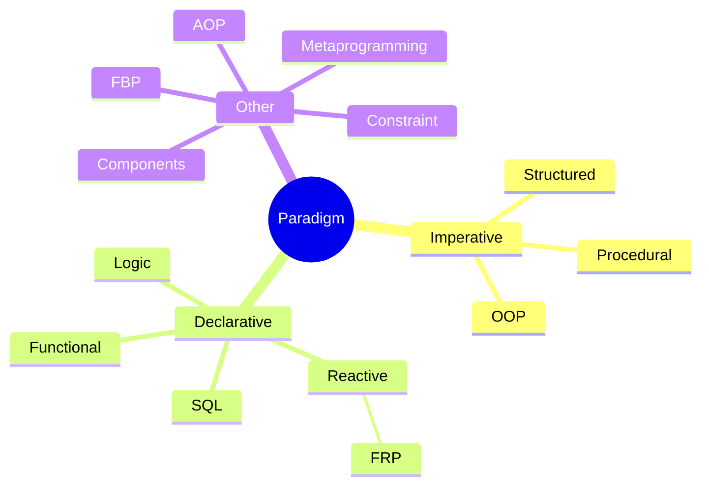
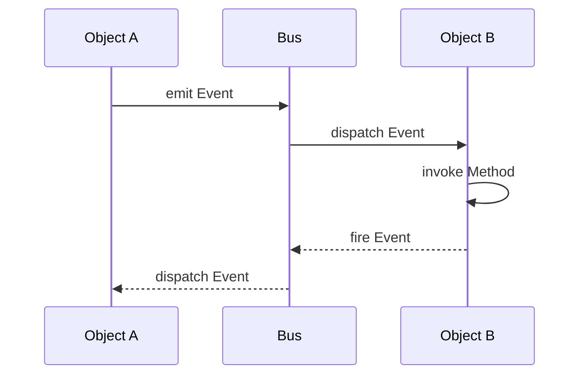
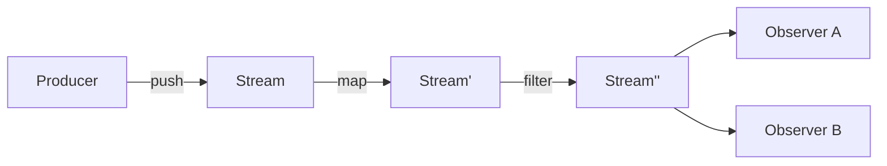
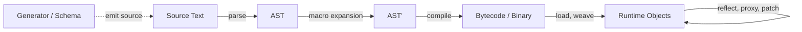

# Programming Paradigms

A **programming paradigm** is an opinionated view of what computation is, dictating how data and
code are organized, accessed, and manipulated. This guide surveys the imperative, object-oriented,
declarative, functional, reactive, and metaprogramming families, and serves engineers choosing a
style for a component or reading code written in an unfamiliar one. It is also the canonical home
for the OOP pillars.

## Imperative Programming

| Paradigm | Description |
| ---------- | ------------- |
| **Imperative** | An early approach considering computation as evaluation of statements that directly change program state (data fields). Features: direct assignments, common data structures, global variables |
| **Structured** | A style of imperative programming with more logical program structure. Features: structograms, indentation, limited use of `goto` |
| **Procedural** | Derived from structured programming, based on modular programming or the procedure call |

## Object-Oriented Programming (OOP)

A prominent approach that considers computation as a side-effect from interacting stateful objects along their lifecycle.

### OOP Pillars

| Principle | Description |
| ----------- | ------------- |
| **Abstraction** | Representing a real object by only the properties that matter to the problem |
| **Encapsulation** | Mechanism to prevent access to state of object from outside (hide internal complexity) |
| **Inheritance** | Mechanism allowing ones to borrow/extend state and behavior from a basic one |
| **Polymorphism** | Mechanism to override method implementations in descendants while preserving signatures and semantics |

For language-agnostic design heuristics such as SOLID, GRASP, and DRY, see
[Design Principles](02-design-principles.md).

### OOP Concepts

| Concept | Definition |
| --------- | ------------ |
| **Object** | A single instance in program code with its own State and Behavior |
| **Class** | Specification of State and Behavior used to create new Objects |
| **Model** | Bundle of interdependent Classes that a system consists of |
| **State** | Internal data structure private to one instance |
| **Behavior** | Set of Methods implementing logic over the State they share |
| **Method** | Named way of handling one specific input message |
| **Implementation** | Code defining how an input message is actually handled; reads input and State, and may update State, produce results, or send further messages |
| **Invocation** | Act of performing the instructions of a Method with given arguments, scope, and context |
| **Interaction** | Process of sending messages between Objects, each answered by Invocation of the matching Method |
| **Event-Driven Flow** | Indirect Interaction in which uniform events travel through a centralized dispatcher (bus) |

## Declarative Programming

A style building program structure that expresses the logic of computation without describing its control flow. Many languages minimize or eliminate side effects by describing WHAT the runtime engine must accomplish rather than HOW.

Examples: SQL, Prolog, Datalog, and regular expressions; XSLT for XML transformation; HTML, XAML, and MXML for user interfaces.

## Functional Programming

A programming paradigm promoting computation as the declarative composition of pure (mathematical) functions.

### Functions and Purity

| Concept | Definition |
| --------- | ------------ |
| **Operation** | Correspondence of input with unambiguous output: (x..., y1) & (x..., y2) => y1 ≡ y2 |
| **Parameter** | Reference to elementary piece of input data structure, by name or index |
| **Argument** | Input data value applied to the corresponding Parameter when an Operation is performed |
| **Function** | Operation providing mapping from elements of domain to elements of codomain |
| **Arity** | Dimension of domain space: unary, binary, n-ary, variadic |
| **Partial Function** | Mapping not defined for all possible values of its domain |
| **Deterministic Function** | Mapping always producing the same results for the same input |
| **Pure Function** | Deterministic Function without side effects |
| **Side Effects** | Interactions (reads/writes) with external mutable state |
| **Higher-Order Function (HOF)** | A function taking a function as argument and/or returning a function |
| **Immutability** | Inability to destructively change/mutate input parameters, context, or state |
| **Idempotent** | Property of an operation whose reapplication to its own result changes nothing; see [System Design Glossary](../03-system-design/01-common-concepts.md) |

### Function Composition

| Concept | Definition |
| --------- | ------------ |
| **Function Pipe** | Putting list of functions together where output of previous is input of next |
| **Fun-Arg Problem** | Difficulty of keeping a function's free variables alive after the scope that defined them has returned |
| **Closure** | Function retaining a reference to its free variables (from outer scope) |
| **Point-Free Style** | Writing functions where definition doesn't explicitly identify arguments used |
| **Partial Application** | Creating a new function by pre-filling some arguments to the original function |
| **Currying** | Transformation of an n-ary function into a chain of unary functions, each taking one Argument |
| **Auto Currying** | Transforming a multi-argument function into one that returns a function taking the rest if given fewer arguments |
| **Fixed-point Combinator** | Function Y returning fixed point for its argument function: Y(f) == f(Y(f)) |

### Evaluation Strategy

Evaluation order is independent of the paradigm: Haskell is lazy by default, while Standard ML, OCaml, Scheme, Clojure, and Erlang are strict.

| Concept | Definition |
| --------- | ------------ |
| **Lazy Evaluation** | Call-by-need strategy that defers computing an expression until its value is demanded, allowing infinite data structures |
| **Continuation** | The part of code yet to be executed at any given point |
| **Memoization** | Cache of previously computed results, reused instead of recomputing |
| **Recursion** | Function calling itself during execution |
| **Tail Recursion** | A function call where there is nothing to do after the function returns except return its value; essentially equivalent to looping |

## Reactive Programming

Programming as defining reactions on sequences of incoming events (data streams) that can be combined and observed asynchronously.

Control is inverted: instead of the consumer asking for the next value (pull), the producer pushes values
to whoever declared interest, and change propagates automatically through the dependency graph.

### Stream Concepts

| Concept | Definition |
| --------- | ------------ |
| **Stream (Observable)** | Time-ordered sequence of values, plus terminal completion or error signals |
| **Observer (Subscriber)** | Consumer declaring handlers for the three channels: `next`, `error`, `complete` |
| **Subscription** | The live link between producer and consumer; must be disposed to stop the flow and free resources |
| **Push vs. Pull** | Which side sets the pace: a source emitting on its own schedule, or a consumer requesting the next value (iterators, generators) |
| **Cold vs. Hot** | Whether each subscriber triggers its own execution from the beginning, or joins one already-running sequence shared by all |
| **Subject** | Object that is both observer and observable — the usual bridge from imperative code into a stream |
| **Propagation of Changes** | Automatic recomputation of every value derived from a source when that source updates |
| **Glitch** | Transient inconsistent state where a dependent observes partially updated inputs |
| **Backpressure** | Protocol for a slow consumer to limit a fast producer (request-n, buffer, drop, sample, or block) |
| **Scheduler** | Policy deciding on which thread/tick emissions and subscriptions run |

### Operator Categories

| Category | Examples | Purpose |
| ---------- | ---------- | --------- |
| **Creation** | `of`, `from`, `interval`, `fromEvent` | Turn values, collections, timers, or callbacks into streams |
| **Transformation** | `map`, `scan`, `pluck` | Reshape each value or accumulate over the sequence |
| **Filtering** | `filter`, `take`, `skip`, `distinctUntilChanged` | Drop values that should not reach the consumer |
| **Combination** | `merge`, `concat`, `zip`, `combineLatest`, `withLatestFrom` | Join several streams into one |
| **Flattening** | `switchMap`, `mergeMap`, `concatMap`, `exhaustMap` | Handle inner streams; differ in what happens to overlapping ones |
| **Timing** | `debounce`, `throttle`, `sample`, `buffer`, `delay` | Control emission rate and alignment in time |
| **Error Handling** | `catchError`, `retry`, `timeout` | Recover from or bound failures without breaking the pipeline |
| **Multicasting** | `share`, `publish`, `refCount` | Convert cold to hot, sharing one execution among subscribers |

### Rate Control

| Technique | Behavior |
| ----------- | ---------- |
| **Throttle** | Emit the first value, then ignore the rest for a fixed window (rate limiting) |
| **Debounce** | Emit only after a quiet period — the last value of a burst wins (search-as-you-type) |
| **Sample** | Emit the latest value at a fixed clock, regardless of source rate (polling a signal) |
| **Buffer / Window** | Batch values into arrays or sub-streams by count or time |

### Reactive Systems

The *Reactive Manifesto* applies the same idea at architecture scale:

| Trait | Meaning |
| ------- | --------- |
| **Responsive** | Answers in a predictable time |
| **Resilient** | Stays responsive under failure via isolation and replication |
| **Elastic** | Stays responsive under varying load by scaling resources |
| **Message-Driven** | Built on asynchronous, non-blocking message passing with explicit boundaries |

*Implementations*: RxJS/RxJava/Rx.NET, Project Reactor, Akka Streams, Kafka Streams, Reactive Streams (`java.util.concurrent.Flow`, added in Java 9)

*See also*: [Functional Reactive Programming](#functional-reactive-programming-frp) — the pure-function, time-explicit formulation of these ideas

## Functional Reactive Programming (FRP)

A combination of functional and reactive paradigms: values that change over time are modeled
as first-class citizens and transformed by pure functions, instead of being updated by callbacks
that mutate shared state.

### FRP Concepts

| Concept | Definition |
| --------- | ------------ |
| **Behavior (Signal)** | Value continuously defined over time: `Behavior a = Time -> a` |
| **Event Stream** | Discrete sequence of timestamped occurrences: `Event a = [(Time, a)]` |
| **Declarative Time** | Time is an explicit input of the model, not an implicit side effect of execution order |
| **Combinator** | Pure HOF building new behaviors/streams from existing ones (`map`, `filter`, `merge`, `scan`, `switch`) |
| **Lifting** | Applying an ordinary function to time-varying values, producing a time-varying result |
| **Sampling** | Reading a behavior's value at the moments given by an event stream |
| **Accumulation (`scan`/`fold`)** | Deriving state from a stream by folding past occurrences — the only sanctioned form of state |
| **Glitch-Freedom** | Guarantee that dependents observe a consistent snapshot; no intermediate values from partial propagation |

### Variants

| Variant | Description |
| --------- | ------------- |
| **Classical FRP** | Continuous behaviors + discrete events with denotational semantics (Fran, Reactive) |
| **Arrowized FRP** | Signal functions (`Signal a -> Signal b`) composed as arrows, avoiding space/time leaks (Yampa) |
| **Discrete / "RX-style"** | Push-based streams without continuous time; pragmatic and widely deployed (RxJS, Reactor, Combine) |
| **Signal-based UI** | Fine-grained dependency graph of signals with automatic recomputation (SolidJS, Svelte runes, Angular signals) |

### FRP Trade-offs

| Aspect | Note |
| -------- | ------ |
| **Strengths** | Explicit data flow, composability, no manual subscription bookkeeping, testable as pure transformations |
| **Costs** | Steep learning curve, hard debugging (stack traces lost in the graph), memory/space leaks from retained histories |
| **Applicability** | UI state, animation, telemetry, event processing, robotics, and simulation |

## Metaprogramming

Writing programs that treat other programs (or themselves) as data — reading, generating,
or transforming code instead of only executing it. The *metaprogram* operates on the
*object program*; the boundary between them is fixed by **when** the transformation happens.

### Metaprogramming Concepts

| Concept | Definition |
| --------- | ------------ |
| **Metalevel vs. Base Level** | The metaprogram manipulates representations of code; the object program is the code being manipulated |
| **Introspection** | Read-only examination of program structure — types, members, signatures, annotations |
| **Reflection** | Introspection plus *intercession*: invoking, defining, or altering structure dynamically |
| **Homoiconicity** | Code is represented in the language's own data structures, so manipulating code is ordinary data manipulation (Lisp s-expressions) |
| **AST** | Tree representation of parsed source; the usual currency of compile-time transformation |
| **Quoting / Quasiquotation** | Turning code into data (`quote`), with holes for splicing computed fragments back in (`unquote`) |
| **Macro** | Function from code to code, expanded before evaluation rather than called at runtime |
| **Hygiene** | Guarantee that names introduced by a macro cannot capture or collide with names at the call site |
| **Staging** | Explicit separation of computation into phases — what runs now to produce what runs later |
| **Code Generation** | Emitting source, bytecode, or binaries from a model, schema, or IDL |
| **Eval** | Evaluating data (a string, an AST) as code inside the running program |
| **DSL** | Purpose-built notation, *internal* (hosted in the language) or *external* (own parser) |

### Stages

The same goal can be reached at different points in the lifecycle, with sharply different trade-offs.

| Stage | Mechanisms | Character |
| ------- | ------------ | ----------- |
| **Compile-time** | Macros, templates, `comptime`/`constexpr`, annotation processors, source generators | No runtime cost, type-checkable, visible to tooling; errors surface as expansion failures |
| **Load / Link-time** | Bytecode weaving, custom class loaders, generated proxies, instrumentation agents | Applies to code you do not own; invisible in source, so behavior diverges from what is read |
| **Run-time** | Reflection, dynamic proxies, `eval`, metaclasses, method interception | Maximum flexibility and late binding; costs performance and defeats static analysis |

### Techniques

| Technique | Mechanism | Examples |
| ----------- | ----------- | ---------- |
| **Textual Macros** | Token substitution before parsing; unhygienic, unaware of syntax | C/C++ preprocessor |
| **Syntactic Macros** | AST-to-AST functions run by the compiler; hygiene depends on the macro system | Scheme `syntax-rules`/`syntax-case` (hygienic), Common Lisp `defmacro` (unhygienic, hence `gensym`), Rust `macro_rules!` and proc macros, Scala 3 `inline`/quotes, Elixir |
| **Compile-time Evaluation** | Ordinary code executed by the compiler to specialize or produce declarations | C++ templates and `constexpr`, Zig `comptime`, D CTFE |
| **Annotation Processing** | Declarative metadata read by a generator that emits companion code | Java APT/Lombok, Kotlin KSP, C# Source Generators, `go:generate` |
| **Reflection APIs** | Runtime access to the type system and member tables | `java.lang.reflect`, `System.Reflection`, Python `inspect`/`getattr`, JS `Reflect` |
| **Proxies & Interception** | Synthesized objects forwarding calls through a handler | JDK dynamic proxies, ByteBuddy/CGLIB, JS `Proxy` traps, Python `__getattr__` |
| **Metaclasses & Open Classes** | Controlling or rewriting class construction and dispatch | Python `type`/`__init_subclass__`, Ruby `class << self` and monkey patching, and JS decorators |
| **Bytecode Manipulation** | Rewriting compiled artifacts directly | ASM, Javassist, ByteBuddy, Mono.Cecil |
| **Schema-driven Generation** | Deriving clients, models, and serializers from an external contract | Protobuf/gRPC, OpenAPI, GraphQL codegen, ORM entities |

### Metaprogramming Trade-offs

| Aspect | Note |
| -------- | ------ |
| **Strengths** | Removes boilerplate and duplication, enforces cross-cutting concerns in one place, adapts to schemas and types unknown when the code was written, enables DSLs closer to the domain |
| **Costs** | Code that is read is no longer the code that runs — debugging, stack traces, IDE navigation, and refactoring all degrade; reflection and `eval` block dead-code elimination, AOT compilation, and security review; expansion errors are reported in generated code |
| **Applicability** | Serialization, ORM and DI wiring, mocking and test doubles, AOP concerns (logging, transactions, retries), builders and derived boilerplate, and API clients from contracts |

*Guidance*: prefer the earliest stage that solves the problem — a generic or template before a macro,
a macro before an annotation processor, an annotation processor before runtime reflection.
Push the dynamic option only when the shape of the code genuinely is not known until execution.

*See also*: [Aspect-Oriented Programming (AOP)](#aspect-oriented-programming-aop) — its join points, advice,
and weaving are built almost entirely on the load-time and run-time stages described above.

## Other Paradigms

The families above cover most production code, but a working engineer still meets the paradigms
below, usually as a specialized language or framework dropped into an otherwise conventional
system. Each is described here by the unit it treats as primitive, because that choice is what
separates it from the paradigms this chapter covers in full.

| Concept | Definition |
| --------- | ------------ |
| **Logic Programming** | Declarative style where a program is a set of facts and rules, and running it means asking the engine to search for a proof of a goal rather than prescribing the steps (Prolog, Datalog, answer-set solvers) |
| **Constraint Programming** | Close relative of Logic Programming in which the program states relations a solution must satisfy and a solver explores the feasible space, so the search strategy belongs to the engine rather than the author (MiniZinc, Choco, OR-Tools) |
| **Flow-Based Programming (FBP)** | Assembly of black-box processes that exchange fixed-format packets over bounded, named connections owned by the network rather than by any process, which makes the topology data instead of code (NoFlo, Node-RED, LabVIEW) |
| **Agent-Oriented Programming** | Autonomous entities holding their own beliefs, goals, and plans as first-class program elements, coordinating through messages rather than direct invocation, so control is genuinely decentralized (JADE, Jason/AgentSpeak) |
| **Component-Based Software Engineering** | Building systems from independently deployable units that expose only contractual interfaces, moving substitution and reuse from the Class boundary out to the packaging boundary (OSGi, COM, .NET assemblies) |
| **Modular Programming** | Splitting a program into separately compiled units with explicit exported and imported names — the discipline Procedural programming grew out of, and the one that today's packages and namespaces still implement (Modula-2, ML functors, JPMS, ES imports) |

Three names that used to sit in this list are deliberately absent, because calling them paradigms
would be wrong. SQL is a language, and it already appears above as an example of
[Declarative Programming](#declarative-programming). Domain-Driven Design is a modeling and design
approach rather than a view of what computation is, and its tactical patterns belong with
[Design Patterns](03-design-patterns.md). "Mathematical model" names no paradigm at all; the idea it
gestures at, computation as the evaluation of pure functions, is
[Functional Programming](#functional-programming).

### Aspect-Oriented Programming (AOP)

Some requirements — logging, transactions, retries, authorization, tracing — cannot be localized in
any single Class or Function. They cut across many of them, so expressing them in the dominant
decomposition means repeating the same lines at every call site and tangling them with the logic
that actually matters. AOP answers that by making the scattered requirement itself a first-class
unit, defined once and attached to the places it applies by a declarative rule instead of by an
explicit call.

| Concept | Definition |
| --------- | ------------ |
| **Cross-Cutting Concern** | Requirement whose implementation would otherwise be scattered across many unrelated units and tangled with their primary logic |
| **Join Point** | Well-defined moment in program execution where extra behavior may be attached: a method call or execution, a field access, an exception being thrown |
| **Pointcut** | Predicate selecting a set of Join Points by signature, annotation, or type hierarchy, so the targets are described rather than enumerated |
| **Advice** | Code to run at the selected moments, ordered relative to them as `before`, `after`, `after throwing`, or `around` — the last wrapping the target and free to skip or replace it |
| **Aspect** | Unit bundling one or more Pointcuts with their Advice and any state they share, playing the role a Class plays in OOP |
| **Weaving** | Act of merging that extra behavior into the target program, done at compile time, at load time, or at run time through generated proxies |
| **Introduction** | Adding members or a supertype to an existing Class from outside its own definition, also called an inter-type declaration |

*Implementations*: AspectJ (compile-time and load-time weaving), Spring AOP (runtime proxies, limited
to method execution on managed beans), PostSharp, and the interceptor chains of most DI containers.

The trade-off is the one [Metaprogramming](#metaprogramming) always carries: because an Aspect
applies without any mark at the call site, the code that is read is no longer the code that runs.
Reserve AOP for concerns that are genuinely uniform across many units, and keep the Pointcuts narrow
enough that a reader can predict where they fire.
