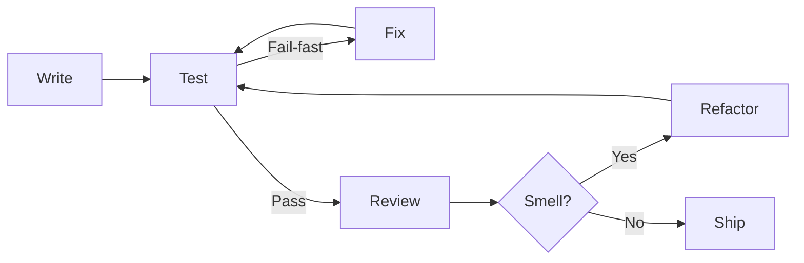

# Clean Code Principles

Clean code refers to writing code that is easy to understand and maintain by humans, not just computers.

| Principle | Description |
| ----------- | ------------- |
| **Simplicity** | Code should be as simple as possible; avoid unnecessary complexity |
| **Consistency** | Follow consistent coding style, design principles, patterns and best practices across the codebase |
| **Readability** | Code should be easily understandable using meaningful names and logical organization |
| **Comments/Documentation** | Explain WHY certain decisions were made, not HOW code works |
| **Error Handling** | Handle errors gracefully; anticipate potential failures (**Fail-fast**) |
| **Refactoring** | Regular refactoring improves structure without changing functionality |
| **Testing** | Clean code is testable; structure allows easy verification |
| **Performance/Stability** | Optimize for performance without compromising integrity |

