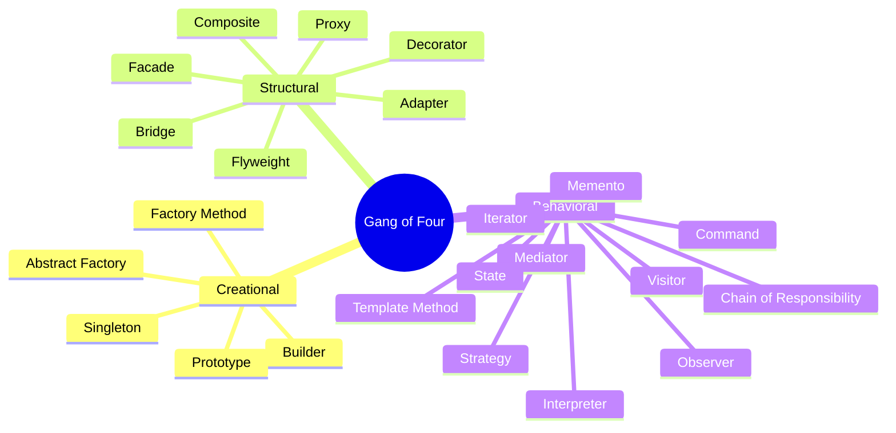

# Design Patterns

A design pattern is a named, reusable approach to a problem that keeps recurring: a template to work from, not a finished design that converts straight into code. This page catalogs the twenty-three Gang of Four patterns by family, the patterns other catalogs added around them, the common concurrency patterns, and the anti-patterns worth naming, for a developer who needs the name other engineers will recognize.

A pattern is a concrete structure; the general rules a structure is judged against live in [Design Principles](02-design-principles.md).

## Gang of Four Patterns

Erich Gamma, Richard Helm, Ralph Johnson, and John Vlissides, *Design Patterns: Elements of Reusable Object-Oriented Software* (1994), describe twenty-three patterns in three families. This is that catalog, and nothing else in this page belongs to it.

### Creational Patterns

Creational patterns hand back an object instead of having the caller name a concrete class, which leaves the choice of class open.

| Pattern | Description |
| --------- | ------------- |
| **Abstract Factory** | Create families of related objects without naming their concrete classes |
| **Builder** | Separate the construction of a complex object from its representation, so one construction process can produce several forms |
| **Factory Method** | Define an interface for creating an object, and let subclasses decide which class to instantiate |
| **Prototype** | Create new objects by copying a prototypical instance |
| **Singleton** | Ensure a class has one instance, and give callers one point of access to it |

### Structural Patterns

Structural patterns compose classes and objects into larger structures without rewriting the parts.

| Pattern | Description |
| --------- | ------------- |
| **Adapter** | Wrap a class in the interface a client expects, so classes with incompatible interfaces work together |
| **Bridge** | Separate an abstraction from its implementation so the two vary independently, instead of fixing both in a subclass |
| **Composite** | Compose objects into tree structures so clients treat a single object and a composition of objects alike |
| **Decorator** | Attach responsibilities to an object at runtime behind its existing interface, as an alternative to subclassing |
| **Facade** | Offer one simplified interface to a set of interfaces in a subsystem |
| **Flyweight** | Share fine-grained objects so large numbers of them cost little memory |
| **Proxy** | Stand in for another object with the same interface, to control access to it |

### Behavioral Patterns

Behavioral patterns assign responsibility between objects and decouple senders from receivers.

| Pattern | Description |
| --------- | ------------- |
| **Chain of Responsibility** | Pass a request along a chain of handlers until one of them handles it |
| **Command** | Encapsulate a request as an object, so it can be parameterized, queued, logged, or undone |
| **Interpreter** | Represent the grammar of a small language and interpret sentences written in it |
| **Iterator** | Traverse the elements of a collection without exposing how the collection stores them |
| **Mediator** | Route interaction between objects through one object, so they do not refer to each other directly |
| **Memento** | Capture an object's internal state so it can be restored later, without breaking encapsulation |
| **Observer** | Notify every dependent automatically when the object they observe changes |
| **State** | Let an object change its behavior when its internal state changes |
| **Strategy** | Define a family of interchangeable algorithms and select one at runtime |
| **Template Method** | Define the skeleton of an algorithm and let subclasses supply individual steps |
| **Visitor** | Represent an operation on the elements of an object structure, so new operations need no change to those elements |

## Patterns Beyond the Gang of Four

These are in wide use and often listed alongside the catalog above, but they are not part of it.

### Additional Creational Patterns

| Pattern | Description |
| --------- | ------------- |
| **Object Pool** | Reuse objects that are expensive to acquire instead of creating and destroying one per use |
| **Multiton** | Keep one instance per key, reached through a registry |
| **Lazy Initialization** | Delay creating an object until the first use |

### Additional Structural Patterns

| Pattern | Description |
| --------- | ------------- |
| **Module/Namespace** | Group related elements into one named unit with a controlled surface |
| **Twin** | Model multiple inheritance with two coupled classes in a language that has none |
| **Marker Interface** | An empty interface that tags a class with metadata a framework reads at runtime |

### Additional Behavioral Patterns

| Pattern | Description |
| --------- | ------------- |
| **Publish/Subscribe** | Observer routed through a broker or event bus, so publishers and subscribers never hold a reference to each other |
| **Servant** | Put behavior shared by several classes into one object that operates on them |
| **Null Object** | Supply an object with neutral behavior instead of a null reference |

### Patterns from Other Catalogs

- **Front Controller** — one entry point that receives every request for a web application and dispatches it to a handler. Martin Fowler, *Patterns of Enterprise Application Architecture* (2002).
- **Specification** — a business rule as an object, combinable with and, or, and not. Eric Evans, *Domain-Driven Design* (2003).
- **RAII**, resource acquisition is initialization — tie a resource to the lifetime of an object, so destroying the object releases the resource. A C++ idiom named by Bjarne Stroustrup; it manages a resource rather than creating an object, so it belongs to no Gang of Four family.

## Concurrency Patterns

Active Object, Reactor, and the Double-Checked Locking optimization are cataloged in Douglas Schmidt, Michael Stal, Hans Rohnert, and Frank Buschmann, *Pattern-Oriented Software Architecture, Volume 2: Patterns for Concurrent and Networked Objects* (2000). Doug Lea's *Concurrent Programming in Java* is the standard reference for the lock, guard, and thread-pool material.

| Pattern | Description |
| --------- | ------------- |
| **Lock** | Hold a claim on a resource so no other thread can use it at the same time |
| **Active Object** | Give an object its own thread of control and turn calls on it into messages that thread processes |
| **Balking** | Return without acting when the object is not in a state where the action makes sense |
| **Thread Pool** | Serve tasks from a queue with a fixed set of reusable worker threads |
| **Binding Properties** | Keep two properties in step by having each observe the other |
| **Double-Checked Locking** | Test the condition before and after taking the lock, so the lock is taken only when it is needed |
| **Guarded Suspension** | Block a call until the lock is held and a precondition holds |
| **Join** | Coordinate concurrent messages, so an action runs only once every message it names has arrived |
| **Reactor** | Wait on several event sources at once and dispatch each event to its handler |

## Anti-Patterns

An anti-pattern is a solution people keep choosing that reliably ends badly. Symptoms found in code that already exists — a class grown too large, structure that is hard to follow, unexplained literals, leaky encapsulation — are cataloged as [Code Smells](04-code-smells.md); duplication is covered by DRY in [Design Principles](02-design-principles.md).

### Software Design Anti-Patterns

| Anti-Pattern | Description |
| -------------- | ------------- |
| **Big Ball of Mud** | A system with no recognizable structure, named by Brian Foote and Joseph Yoder in 1997 |
| **Abstraction Inversion** | Hiding functionality that callers need, so they rebuild it on top of the abstraction |
| **Gold Plating** | Continuing work past the point where more effort adds value |
| **Inner-Platform Effect** | A system made so configurable that it becomes a poor copy of the platform it is built on |
| **Interface Bloat** | An interface made so powerful that implementing it is impractical |

### OOP Anti-Patterns

| Anti-Pattern | Description |
| -------------- | ------------- |
| **Anemic Domain Model** | A domain model that holds data only, with the business logic that belongs to it placed elsewhere |
| **Poltergeists** | Short-lived objects whose only job is to pass information or control to another object |
| **Yo-yo Problem** | An inheritance hierarchy so deep that following one behavior means jumping up and down between many classes |

### Programming Anti-Patterns

| Anti-Pattern | Description |
| -------------- | ------------- |
| **Cargo Cult Programming** | Copying patterns, tools, or rituals without understanding what they are for |
| **Lasagna Code** | So many layers of indirection that a small change has to be threaded through every one of them |
