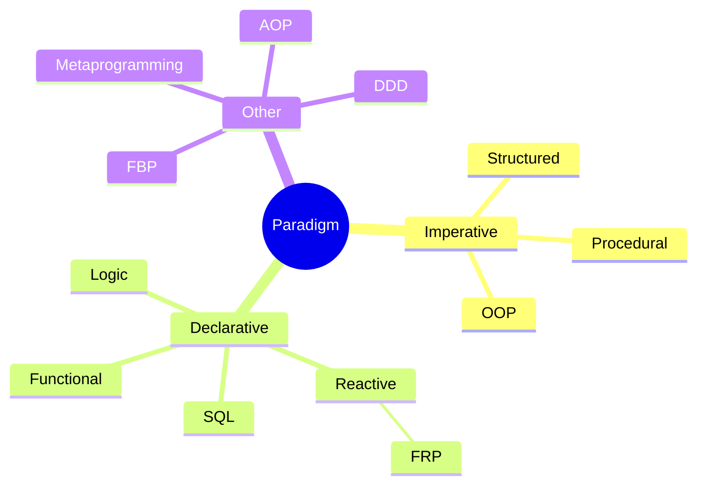
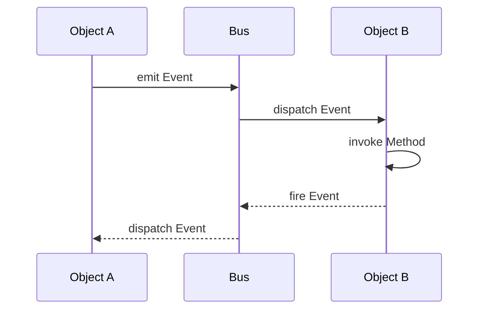
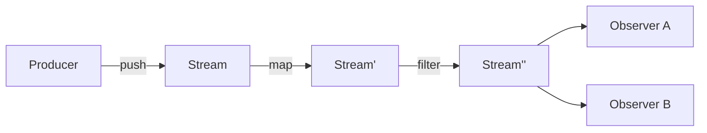

# Programming

## Programming Paradigms

A **Programming Paradigm** is an opinionated vision of
what data computation is in terms of its core concepts,
dictating how data and code are treated, organized, accessed, and manipulated.

### Imperative Programming

| Paradigm | Description |
| ---------- | ------------- |
| **Imperative** | An early approach considering computation as evaluation of statements that directly change program state (data fields). Features: direct assignments, common data structures, global variables |
| **Structured** | A style of imperative programming with more logical program structure. Features: structograms, indentation, limited use of `goto` |
| **Procedural** | Derived from structured programming, based on modular programming or the procedure call |

### Object-Oriented Programming (OOP)

A prominent approach that considers computation as a side-effect from interacting stateful objects along their lifecycle.

#### OOP Design Principles

| Principle | Description |
| ----------- | ------------- |
| **Abstraction** | Representing a real object by its particular properties only (important in matters of problem) |
| **Encapsulation** | Mechanism to prevent access to state of object from outside (hide internal complexity) |
| **Inheritance** | Mechanism allowing ones to borrow/extend state and behavior from a basic one |
| **Polymorphism** | Mechanism to override method implementations in descendants while preserving signatures and semantics |

#### OOP Concepts

| Concept | Definition |
| --------- | ------------ |
| **Object** | A single instance in program code with its own state and behavior |
| **Class** | Specification of state and behavior used to create new objects |
| **Model** | Bundle of interdependent classes that a system consists of |
| **State** | Internal data structure belonging to and accessed by a given object |
| **Behavior** | Set of methods belonging to an object implementing specific logic relied on its state |
| **Method** | Certain way to handle specific input messages received from outside |
| **Implementation** | Code defining how to actually handle input signals; has access to input and state, may update state, produce results, fire events |
| **Invocation** | Act of performing instructions of method along input arguments, scope, and context |
| **Interaction** | Process of sending signals (events) between objects, responded by invocation of appropriate methods |
| **Event-Driven Flow** | Indirect way of interaction as sending unified event messages via centralized dispatcher (bus) |

### Declarative Programming

A style building program structure that expresses the logic of computation without describing its control flow. Many languages minimize or eliminate side effects by describing WHAT the runtime engine must accomplish rather than HOW.

Examples: HTML, MXML, XAML, XSLT, and other UI markup languages.

### Functional Programming

A programming paradigm promoting computation as declarative composition and lazy-evaluation of pure (mathematical) functions.

> *"The main difference from imperative programming is the use of lazy evaluation model. Everything else - purity of functions, anonymous functions, higher-order functions, monads, parametric polymorphism - are just consequences."*

#### Key Concepts

| Concept | Definition |
| --------- | ------------ |
| **Lazy Evaluation** | Call-by-need evaluation delaying expression evaluation until value is needed; allows structures like infinite lists |
| **Operation** | Correspondence of input with unambiguous output: (x..., y1) & (x..., y2) => y1 ≡ y2 |
| **Parameter** | Reference to elementary piece of input data structure, by name or index |
| **Argument** | Input data value applied to corresponding parameter when operation is performed |
| **Function** | Operation providing mapping from elements of domain to elements of codomain |
| **Arity** | Dimension of domain space: unary, binary, n-ary, variadic |
| **Partial Function** | Function not defined for all possible values of its domain |
| **Deterministic Function** | Function always producing same results for same input |
| **Pure Function** | Deterministic function without side effects |
| **Side Effects** | Interactions (reads/writes) with external mutable state |
| **Higher-Order Function (HOF)** | A function taking a function as argument and/or returning a function |

#### Advanced FP Concepts

| Concept | Definition |
| --------- | ------------ |
| **Function Pipe** | Putting list of functions together where output of previous is input of next |
| **Fun-Arg Problem** | How to preserve references to environment variables after function is executed |
| **Closure** | Function retaining a reference to its free variables (from outer scope) |
| **Point-Free Style** | Writing functions where definition doesn't explicitly identify arguments used |
| **Partial Application** | Creating a new function by pre-filling some arguments to the original function |
| **Currying** | Generation of derived function doing same as original but with partially applied arguments |
| **Auto Currying** | Transforming a multi-argument function into one that returns a function taking the rest if given fewer arguments |
| **Continuation** | The part of code yet to be executed at any given point |
| **Memoization** | Storing and reusing results of function instead of actual re-execution |
| **Immutability** | Inability to destructively change/mutate input parameters, context, or state |
| **Idempotent** | Reapplying to result does not produce different result |
| **Recursion** | Function calling itself during execution |
| **Fixed-point Combinator** | Function Y returning fixed point for its argument function: Y(f) == f(Y(f)) |
| **Tail Recursion** | A function call where there is nothing to do after the function returns except return its value; essentially equivalent to looping |

### Reactive Programming

Programming as defining reactions on sequences of incoming events (data streams) that can be combined and observed asynchronously.

Control is inverted: instead of the consumer asking for the next value (pull), the producer pushes values
to whoever declared interest, and change propagates automatically through the dependency graph.

#### Key Concepts

| Concept | Definition |
| --------- | ------------ |
| **Stream (Observable)** | Time-ordered sequence of values, plus terminal completion or error signals |
| **Observer (Subscriber)** | Consumer declaring handlers for the three channels: `next`, `error`, `complete` |
| **Subscription** | The live link between producer and consumer; must be disposed to stop the flow and free resources |
| **Push vs Pull** | Reactive sources push values at their own pace; iterators/generators are pulled by the consumer |
| **Cold vs Hot** | Cold streams start producing per subscriber (each gets the full sequence); hot streams broadcast a shared, already-running sequence |
| **Subject** | Object that is both observer and observable — the usual bridge from imperative code into a stream |
| **Propagation of Changes** | A change in a source automatically recomputes everything derived from it |
| **Glitch** | Transient inconsistent state where a dependent observes partially updated inputs |
| **Backpressure** | Protocol for a slow consumer to limit a fast producer (request-n, buffer, drop, sample, or block) |
| **Scheduler** | Policy deciding on which thread/tick emissions and subscriptions run |

#### Operator Categories

| Category | Examples | Purpose |
| ---------- | ---------- | --------- |
| **Creation** | `of`, `from`, `interval`, `fromEvent` | Turn values, collections, timers, or callbacks into streams |
| **Transformation** | `map`, `scan`, `pluck` | Reshape each value or accumulate over the sequence |
| **Filtering** | `filter`, `take`, `skip`, `distinctUntilChanged` | Drop values that should not reach the consumer |
| **Combination** | `merge`, `concat`, `zip`, `combineLatest`, `withLatestFrom` | Join several streams into one |
| **Flattening** | `switchMap`, `mergeMap`, `concatMap`, `exhaustMap` | Handle inner streams; differ in what happens to overlapping ones |
| **Timing** | `debounce`, `throttle`, `sample`, `buffer`, `delay` | Control emission rate and alignment in time |
| **Error Handling** | `catchError`, `retry`, `timeout` | Recover from or bound failures without breaking the pipeline |
| **Multicasting** | `share`, `publish`, `refCount` | Convert cold to hot, sharing one execution among subscribers |

#### Rate Control

| Technique | Behavior |
| ----------- | ---------- |
| **Throttle** | Emit the first value, then ignore the rest for a fixed window (rate limiting) |
| **Debounce** | Emit only after a quiet period — the last value of a burst wins (search-as-you-type) |
| **Sample** | Emit the latest value at a fixed clock, regardless of source rate (polling a signal) |
| **Buffer / Window** | Batch values into arrays or sub-streams by count or time |

#### Reactive Systems

The *Reactive Manifesto* applies the same idea at architecture scale:

| Trait | Meaning |
| ------- | --------- |
| **Responsive** | Answers in a predictable time |
| **Resilient** | Stays responsive under failure via isolation and replication |
| **Elastic** | Stays responsive under varying load by scaling resources |
| **Message-Driven** | Built on asynchronous, non-blocking message passing with explicit boundaries |

*Implementations*: RxJS/RxJava/Rx.NET, Project Reactor, Akka Streams, Kafka Streams, Reactive Streams (JDK `Flow`)

*See also*: [Functional Reactive Programming](#functional-reactive-programming-frp) — the pure-function, time-explicit formulation of these ideas

### Functional Reactive Programming (FRP)

A combination of functional and reactive paradigms: values that change over time are modeled
as first-class citizens and transformed by pure functions, instead of being updated by callbacks
that mutate shared state.

#### Key Concepts

| Concept | Definition |
| --------- | ------------ |
| **Behavior (Signal)** | Value continuously defined over time: `Behavior a = Time -> a` |
| **Event Stream** | Discrete sequence of timestamped occurrences: `Event a = [(Time, a)]` |
| **Declarative Time** | Time is an explicit input of the model, not an implicit side effect of execution order |
| **Combinator** | Pure HOF building new behaviors/streams from existing ones (`map`, `filter`, `merge`, `scan`, `switch`) |
| **Lifting** | Applying an ordinary function to time-varying values, producing a time-varying result |
| **Sampling** | Reading a behavior's value at the moments given by an event stream |
| **Accumulation (`scan`/`fold`)** | Deriving state from a stream by folding past occurrences — the only sanctioned form of state |
| **Glitch-Freedom** | Guarantee that dependents observe a consistent snapshot; no intermediate values from partial propagation |

#### Variants

| Variant | Description |
| --------- | ------------- |
| **Classical FRP** | Continuous behaviors + discrete events with denotational semantics (Fran, Reactive) |
| **Arrowized FRP** | Signal functions (`Signal a -> Signal b`) composed as arrows, avoiding space/time leaks (Yampa) |
| **Discrete / "RX-style"** | Push-based streams without continuous time; pragmatic and widely deployed (RxJS, Reactor, Combine) |
| **Signal-based UI** | Fine-grained dependency graph of signals with automatic recomputation (SolidJS, Svelte runes, Angular signals) |

#### Trade-offs

| Aspect | Note |
| -------- | ------ |
| **Strengths** | Explicit data flow, composability, no manual subscription bookkeeping, testable as pure transformations |
| **Costs** | Steep learning curve, hard debugging (stack traces lost in the graph), memory/space leaks from retained histories |
| **Applicability** | UI state, animation, telemetry and event processing, robotics and simulation |

### Other Paradigms

- Metaprogramming
- Single source of truth
- Mathematical model
- Domain-driven design (DDD)
- SQL
- Component-based software engineering
- Flow-based programming (FBP)
- Constraint programming
- Logic programming
- Aspect-oriented Programming (AOP)
- Agent-oriented programming
- Modular programming
