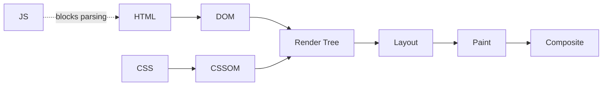

# Performance Optimization

Frontend performance work splits into three places: the render path, the network, and the bundle. This guide covers what to measure in each, what to aim for, and the techniques that move the number; it is this book's home for Core Web Vitals, budgets, caching headers, bundling, and profiling. The DevTools panels that produce these measurements are covered in [Chrome DevTools](../04-development-process/06-debugging.md#chrome-devtools).

## Core Web Vitals

Google publishes each metric with two boundaries: at or below the good value, and above the poor value. The band between them is "needs improvement".

| Metric | Measures | Good | Poor |
| --- | --- | --- | --- |
| **LCP** (Largest Contentful Paint) | Render time of the largest element visible in the viewport | ≤ 2.5 s | > 4.0 s |
| **INP** (Interaction to Next Paint) | Delay between an interaction and the next frame drawn | ≤ 200 ms | > 500 ms |
| **CLS** (Cumulative Layout Shift) | Visual stability — how much content moves on its own | ≤ 0.1 | > 0.25 |
| **FCP** (First Contentful Paint) | Time until the first text or image is painted | ≤ 1.8 s | > 3.0 s |
| **TTFB** (Time to First Byte) | Time until the first byte of the response arrives | ≤ 800 ms | > 1.8 s |

LCP, INP, and CLS are the three Core Web Vitals. FCP and TTFB are diagnostics: they tell you whether a bad LCP started at the server or in the browser.

- INP replaced FID (First Input Delay) as a Core Web Vital on 12 March 2024.
- Time to Interactive stopped counting toward the Lighthouse performance score in version 10 (February 2023), which redistributed its weight and raised CLS to 25 percent; the audit itself survived for a while as a report diagnostic and was dropped later. Do not budget against it. INP is the field measure of responsiveness, and Total Blocking Time is the lab stand-in.

## Performance Budgets

The thresholds above are published. The numbers below are not: no standard fixes them. They are common starting points, and their value comes from being chosen once and then enforced in [CI](../04-development-process/03-ci-cd.md) — a budget nobody fails is not a budget.

| Budget | Starting Target | Basis |
| --- | --- | --- |
| **JavaScript, compressed** | 200 KB | Convention; JavaScript costs more than its transfer size, because it is also parsed and executed |
| **Total page weight, compressed** | 500 KB | Convention |
| **Critical CSS, inlined** | 14 KB | Roughly what TCP sends before waiting for the first acknowledgement — the initial congestion window is 10 segments (RFC 6928) |

A request-count budget is no longer worth keeping. Under HTTP/2 one connection multiplexes many streams, bounded by `SETTINGS_MAX_CONCURRENT_STREAMS` (RFC 9113) rather than by the six-connections-per-host convention browsers apply to HTTP/1.1, so the number of requests stopped being a good proxy for latency. See [Client-Server Communication](../03-system-design/06-client-server-communication.md) for the connection model.

---

## Rendering Optimization

### Critical Rendering Path

CSS blocks rendering: nothing paints until the CSSOM is built. Scripts block parsing unless marked `async` or `defer`. The [DOM and the browser APIs](02-browser-technologies.md) themselves are covered separately.



Inline the CSS the first screen needs, and load the rest without blocking the render:

```html
<!-- Critical CSS, inlined in <head> -->
<style>
  .header { display: flex; background: #fff; }
  .hero { min-height: 100vh; }
</style>

<!-- Everything else: fetched at high priority, applied once it lands -->
<link rel="preload" href="/styles/main.css" as="style"
      onload="this.onload=null; this.rel='stylesheet'">
<noscript><link rel="stylesheet" href="/styles/main.css"></noscript>
```

### Layout Thrashing

The browser recalculates layout repeatedly because reads and writes interleave: every read after a write forces the pending layout to be flushed.

```javascript
// Bad - alternating read/write forces a reflow per iteration
elements.forEach((element) => {
    const height = element.offsetHeight;         // read, flushes layout
    element.style.height = (height + 10) + 'px'; // write, invalidates it again
});

// Good - all reads, then all writes: one layout pass
const heights = Array.from(elements, (el) => el.offsetHeight);
elements.forEach((element, i) => {
    element.style.height = (heights[i] + 10) + 'px';
});
```

| Category | Layout-Triggering Properties |
| --- | --- |
| **Dimensions** | `width`, `height`, `padding`, `margin`, `border` |
| **Position** | `top`, `right`, `bottom`, `left` |
| **Metrics read from JavaScript** | `offsetWidth`, `offsetHeight`, `getBoundingClientRect()` |

### Paint and Composite

Animate `transform` and `opacity` where you can: they skip layout and paint, and run on the compositor.

```css
/* Cheap - compositor only */
.slide-in { transform: translateX(100px); opacity: 0.5; }

/* Expensive - every frame re-runs layout and paint */
.slide-in-slow { left: 100px; width: 200px; background-color: red; }

/* Promote a layer just before a complex animation, then drop the hint */
.hero.is-animating { will-change: transform; }
```

Leaving `will-change` on an element permanently keeps its layer alive and costs memory, so scope it to a class you add and remove.

---

## Network Optimization

### Compression

Serve text — HTML, CSS, JavaScript, SVG, JSON — with `Content-Encoding: br` or `gzip`, selected from the client's `Accept-Encoding`. Already-compressed binaries (WebP, AVIF, MP4, WOFF2) do not shrink further and should be excluded: the CPU cost buys nothing. This is server or CDN configuration, not application code.

### HTTP Caching

| Resource | Example `Cache-Control` | Reason |
| --- | --- | --- |
| **HTML** | `no-cache` | Stored, but revalidated every time, so a deploy is picked up at once |
| **Versioned CSS, JS, images** | `public, max-age=31536000, immutable` | The filename changes when the bytes change, so the old URL never needs revalidating |
| **API responses** | `max-age=60, stale-while-revalidate=300` | Short freshness, then a window where the stale copy is served while the refresh runs in the background |
| **User-specific data** | `no-store` | Never written to any cache, shared or private |

- `no-cache` does not mean "do not cache". It means "cache it, but revalidate before each use". `no-store` is the directive that forbids storage.
- `s-maxage` overrides `max-age` for shared caches such as a CDN, and is ignored by the browser.
- `Vary: Accept-Encoding` stops a shared cache from handing a Brotli body to a client that only asked for gzip. `ETag` supplies the validator that revalidation compares.

Header syntax and the rest of HTTP's semantics live in [Client-Server Communication](../03-system-design/06-client-server-communication.md); caching as a system-design concept is in [System Design Concepts](../03-system-design/01-concepts.md).

A [service worker](02-browser-technologies.md) can implement stale-while-revalidate for requests the HTTP cache does not cover:

```javascript
self.addEventListener('fetch', (event) => {
    if (event.request.method !== 'GET') return; // cache.put rejects on non-GET

    event.respondWith(
        caches.open(CACHE_NAME).then(async (cache) => {
            const cached = await cache.match(event.request);
            const fresh = fetch(event.request).then((response) => {
                cache.put(event.request, response.clone());
                return response;
            });

            if (cached) {
                fresh.catch(() => {}); // a failed background refresh is not fatal
                return cached;         // ...but an unhandled rejection is noisy
            }
            return fresh;
        })
    );
});
```

### Resource Hints

```html
<!-- Preload resources this page needs but the parser finds late -->
<link rel="preload" href="/scripts/main.js" as="script">
<link rel="preload" href="/fonts/inter.woff2" as="font" crossorigin>
<!-- Preload the LCP image and raise its priority -->
<link rel="preload" href="/hero.avif" as="image" fetchpriority="high">
<!-- Resolve DNS early for a third-party domain -->
<link rel="dns-prefetch" href="https://api.example.com">
<!-- Full connection setup (DNS, TCP, TLS) for an origin used immediately -->
<link rel="preconnect" href="https://cdn.example.com" crossorigin>
<!-- Fetch a likely next page at low priority -->
<link rel="prefetch" href="/dashboard" as="document">
```

Preload what the current page needs; prefetch what the next one probably needs. Preloading something the page does not use costs bandwidth and pushes real work later.

### Script Loading

```html
<!-- Default: blocks the parser while it downloads and runs -->
<script src="main.js"></script>
<!-- async: downloads in parallel, runs as soon as it arrives, order not guaranteed -->
<script src="analytics.js" async></script>
<!-- defer: downloads in parallel, runs after parsing, in document order -->
<script src="app.js" defer></script>
<!-- Modules are deferred by default -->
<script type="module" src="module.js"></script>
```

Use `async` for scripts nothing else depends on, and `defer` for application code that must run in order.

### Image Optimization

| Format | Best For |
| --- | --- |
| **AVIF** | Photographs, where it usually compresses smallest |
| **WebP** | Photographs, where reach matters more than the last few kilobytes — both formats are in every major engine as of 2026, but WebP's support in older browsers and in image tooling is still wider |
| **SVG** | Icons, logos, and line art, which stay sharp at any size |

```html
<!-- Responsive: the browser picks a candidate using srcset and sizes.
     width and height reserve the space, which is what prevents layout shift. -->


<!-- Format fallback: the first source the browser understands wins -->
<picture>
    <source srcset="image.avif" type="image/avif">
    <source srcset="image.webp" type="image/webp">
    
</picture>
```

Never put `loading="lazy"` on the LCP image. It delays the fetch until layout has run, which is exactly the element whose render time is being measured.

---

## JavaScript Performance

### Code Splitting

A dynamic `import()` returns a promise and puts its target in a separate chunk, fetched the first time the code path runs.

```jsx
import { lazy, Suspense } from 'react';
import { Route, Routes } from 'react-router-dom';

// Static import: always in the initial bundle
import Sidebar from './Sidebar';

// Dynamic import: its own chunk, fetched on first render of the route
const Dashboard = lazy(() => import('./Dashboard'));

function App() {
    return (
        <Suspense fallback={<p>Loading…</p>}>
            <Routes>
                <Route path="/dashboard" element={<Dashboard />} />
            </Routes>
        </Suspense>
    );
}
```

Route boundaries are the natural split point, because the user has already accepted a wait there.

### Memory Leaks

```javascript
// Forgotten event listener: the listener keeps the instance reachable
class Widget {
    constructor() {
        this.handler = this.handleResize.bind(this);
        window.addEventListener('resize', this.handler);
    }
    handleResize() { /* ... */ }
    destroy() {
        window.removeEventListener('resize', this.handler); // required cleanup
    }
}

// Closure retaining large data
function createLeak() {
    const largeData = new Array(1_000_000);
    return () => console.log(largeData[0]); // holds the whole array
}
let fn = createLeak();
fn();
fn = null; // last reference dropped; the array can now be collected
```

`removeEventListener` needs the same function reference that was added, which is why the bound handler is stored on the instance rather than bound inline.

### Breaking Up Long Tasks

A task that occupies the main thread for a long time blocks input handling, which is what INP measures. Split the work and yield between the pieces.

```javascript
// Bad - one task, main thread blocked until it finishes
function processAll(data) {
    for (const item of data) heavyProcessing(item);
}

// Good - fixed-size chunks, yielding to the event loop between them
function processInChunks(data) {
    const CHUNK_SIZE = 100;
    let index = 0;

    function processChunk() {
        const end = Math.min(index + CHUNK_SIZE, data.length);
        for (; index < end; index++) heavyProcessing(data[index]);
        if (index < data.length) setTimeout(processChunk, 0);
    }

    setTimeout(processChunk, 0);
}

// Work that can wait entirely: run it in idle time.
// requestIdleCallback is in every major evergreen engine as of 2026 - WebKit was the
// last holdout and shipped it in the 2025 Safari cycle - so the detection below is
// there for older engines, not because the API is broadly missing.
function processWhenIdle(tasks) {
    let index = 0;

    const whenIdle = typeof requestIdleCallback === 'function'
        ? (callback) => requestIdleCallback(callback)
        : (callback) => setTimeout(() => {
            const start = performance.now();
            callback({ timeRemaining: () => Math.max(0, 15 - (performance.now() - start)) });
        }, 1);

    function doWork(deadline) {
        while (index < tasks.length && deadline.timeRemaining() > 1) {
            heavyProcessing(tasks[index++]);
        }
        if (index < tasks.length) whenIdle(doWork);
    }

    whenIdle(doWork);
}
```

The fallback gives `doWork` a real deadline of its own instead of a stub that always reports time remaining, because a stub would let the loop drain the whole queue in one task — the exact problem the idle scheduling is there to avoid. `requestIdleCallback` is wrapped in an arrow rather than assigned directly, since calling it detached from `window` throws in browsers.

---

## Bundle Optimization

### Tree Shaking

Tree shaking drops exports nothing imports. It needs static `import`/`export` — a `require()` call or a re-export computed at runtime defeats it.

```javascript
// webpack.config.js
module.exports = {
    // production mode already enables usedExports and sideEffects detection;
    // setting optimization.sideEffects to false turns that detection off
    mode: 'production',
    optimization: {
        splitChunks: {
            chunks: 'all',
            cacheGroups: {
                vendor: { test: /[\\/]node_modules[\\/]/, name: 'vendors', chunks: 'all' }
            }
        }
    }
};
```

The bigger win comes from the `sideEffects` flag, which lets the bundler skip a whole module instead of reasoning about individual statements:

```json
{
  "name": "your-package",
  "sideEffects": ["*.css"]
}
```

`false` claims no module in the package does anything on import. That is a claim about your own code, and it is wrong the moment a file registers a polyfill or imports a stylesheet for effect — list those files instead, as above.

### Minification

Minifiers strip whitespace and comments and shorten local identifiers; they run automatically in a production build and need no configuration. Removing unused CSS is the manual one: the tool scans your templates for the selectors actually used, so class names assembled at runtime through string concatenation are invisible to it and get deleted. Either safelist them or stop building class names by concatenation.

---

## Performance Monitoring

### Performance API

```javascript
// Navigation timing. PerformanceNavigationTiming has startTime === 0,
// so every field is already a duration from the start of navigation;
// there is no navigationStart property to subtract.
const nav = performance.getEntriesByType('navigation')[0];
console.log('DNS:', nav.domainLookupEnd - nav.domainLookupStart);
console.log('Page load:', nav.loadEventEnd); // same as nav.duration

// LCP: the last entry before the first interaction is the final value
new PerformanceObserver((list) => {
    const last = list.getEntries().at(-1);
    console.log('LCP:', last.startTime);
}).observe({ type: 'largest-contentful-paint', buffered: true });

// CLS
let clsValue = 0;
new PerformanceObserver((list) => {
    for (const entry of list.getEntries()) {
        if (!entry.hadRecentInput) clsValue += entry.value;
    }
}).observe({ type: 'layout-shift', buffered: true });
```

`buffered: true` replays entries recorded before the observer existed, which matters because LCP and the first layout shifts happen before your script runs. The CLS snippet sums every shift, whereas the reported metric is the largest burst within a session window — use Google's `web-vitals` library when the number has to match what field tools report. To read the same data interactively, use the Performance panel described in [Chrome DevTools](../04-development-process/06-debugging.md#chrome-devtools).

### Lighthouse CI

Lighthouse runs in a lab, on a simulated network and device, so its numbers are reproducible but not what real users see. It reports no INP; Total Blocking Time is its stand-in. Wire it into the [pipeline](../04-development-process/03-ci-cd.md) so a regression fails the build:

```javascript
// .lighthouserc.js
module.exports = {
    ci: {
        collect: { numberOfRuns: 3, url: ['http://localhost:3000'] },
        assert: {
            assertions: {
                'categories:performance': ['error', { minScore: 0.9 }],
                'first-contentful-paint': ['error', { maxNumericValue: 1800 }],
                'largest-contentful-paint': ['error', { maxNumericValue: 2500 }],
                'cumulative-layout-shift': ['error', { maxNumericValue: 0.1 }]
            }
        }
    }
};
```

The timing assertions are in milliseconds and CLS is unitless; all three are set to the published "good" thresholds. `numberOfRuns: 3` is there because a single run is noisy — Lighthouse reports the median.
