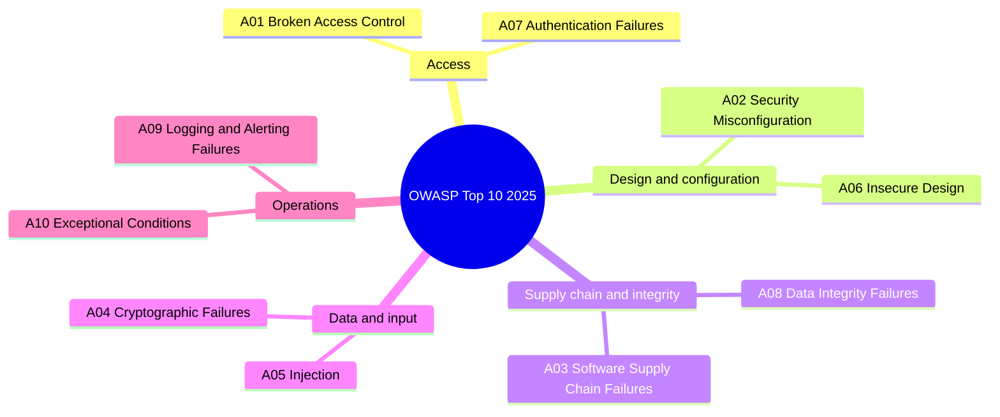
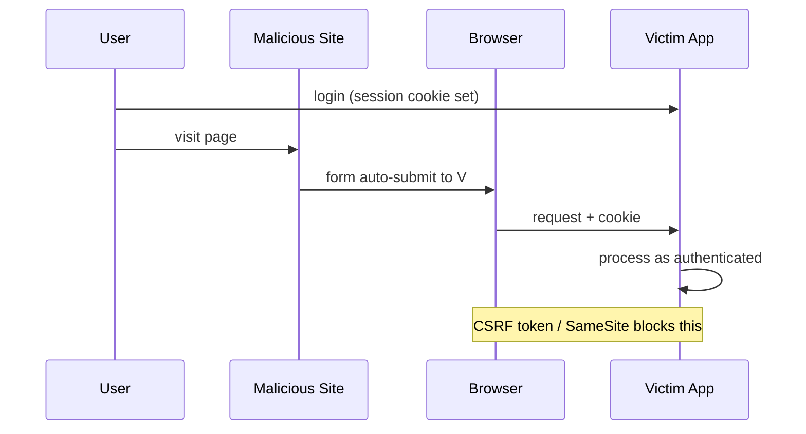

# Web Application Security

Web application security is the work of keeping an application's data and actions reachable only by the people entitled to them. This guide covers the principles that hold across attack classes, the OWASP Top 10 as of its 2025 edition, and the concrete defenses that implement them.


## OWASP Top 10 (2025)

| Rank | Category | Description |
| --- | --- | --- |
| **A01** | Broken Access Control | Users reach resources or actions their permissions do not cover |
| **A02** | Security Misconfiguration | Insecure defaults, unnecessary features, missing hardening |
| **A03** | Software Supply Chain Failures | Compromised or unvetted dependencies, build systems, and distribution |
| **A04** | Cryptographic Failures | Weak, missing, or misapplied encryption |
| **A05** | Injection | Untrusted input interpreted as code or query syntax |
| **A06** | Insecure Design | Security controls missing or inadequate in the design itself |
| **A07** | Authentication Failures | Weak credentials, missing rate limiting, broken session handling |
| **A08** | Software or Data Integrity Failures | Unverified updates, insecure deserialization, tampered artifacts |
| **A09** | Security Logging and Alerting Failures | Logging that is missing, inadequate, or never monitored |
| **A10** | Mishandling of Exceptional Conditions | Errors and edge cases handled in ways that leak data or fail open |

The 2025 edition retired SSRF as a standalone category and added Mishandling of Exceptional Conditions. Supply chain risk grew from the 2021 edition's Vulnerable and Outdated Components into its own category at A03.



## Common Vulnerabilities

### Cross-Site Scripting (XSS)

Malicious scripts injected into pages viewed by other users.

**Three types:** Stored (persisted in DB), Reflected (in URL), DOM-based (client JS).

```javascript
// React escapes by default - SAFE
<div>{userInput}</div>

// Bypasses escaping - DANGEROUS with unsanitized input
<div dangerouslySetInnerHTML={{ __html: userInput }} />

// Safe when required
import DOMPurify from 'dompurify';
<div dangerouslySetInnerHTML={{ __html: DOMPurify.sanitize(userInput) }} />
```

| Technique | Priority |
| --- | --- |
| **Content escaping (React default)** | Always |
| **Input validation (whitelist)** | High |
| **CSP headers** | High |
| **Sanitization with DOMPurify** | When rendering HTML |

### Cross-Site Request Forgery (CSRF)

Tricks authenticated users into submitting unintended requests via their active session.

**Attack:** user visits malicious page → browser sends cookies to the victim's bank → bank processes request.



```javascript
// 1. CSRF Token
const csrfToken = document.querySelector('meta[name="csrf-token"]').content;
fetch('/api/action', {
    method: 'POST',
    headers: { 'X-CSRF-Token': csrfToken, 'Content-Type': 'application/json' },
    body: JSON.stringify({ data })
});

// 2. SameSite Cookie
// Set-Cookie: sessionid=abc123; SameSite=Strict; Secure; HttpOnly

// 3. Custom header - a cross-origin <form> cannot set one at all, and a
//    fetch/XHR that does triggers a CORS preflight the server must approve
fetch('/api/action', {
    method: 'POST',
    headers: { 'X-Requested-With': 'XMLHttpRequest' }
});
```

### Same-Origin Policy and CORS

Browsers restrict how pages from one origin access resources from another.

Origin = protocol + host + port. Any difference = different origin.

| URL | Same Origin? | Reason |
| --- | --- | --- |
| **`https://example.com/other`** | Yes | Different path only |
| **`http://example.com/page`** | No | Different protocol |
| **`https://api.example.com/page`** | No | Different subdomain |
| **`https://example.com:8080/page`** | No | Different port |

```javascript
// Express CORS setup
app.use((req, res, next) => {
    res.header('Access-Control-Allow-Origin', 'https://trusted-site.com');
    res.header('Access-Control-Allow-Methods', 'GET, POST, PUT, DELETE');
    res.header('Access-Control-Allow-Headers', 'Content-Type, Authorization');
    if (req.method === 'OPTIONS') return res.sendStatus(200);
    next();
});
```

### SQL Injection

```javascript
// Bad - string concatenation
const query = "SELECT * FROM users WHERE id = " + userId;

// Good - parameterized
const query = "SELECT * FROM users WHERE id = ?";
db.execute(query, [userId]);

// Good - ORM
const user = await User.findById(userId);
```

## Authentication and Sessions

### Token-Based Authentication

```javascript
// JWT structure: header.payload.signature
const token = {
    payload: {
        sub: "user123",
        exp: 1516242622,
        scope: "read write"
    }
};

// Storage preference:
// Best: HTTP-only Secure cookie (not accessible via JS)
// Acceptable: In-memory variable
// Never: localStorage (XSS exposes all data)

// Set-Cookie: token=eyJhbGci...; HttpOnly; Secure; SameSite=Lax; Path=/; Max-Age=3600
```

**Password rules:**

| Practice | Implementation |
| --- | --- |
| **Minimum length** | At least 8 characters, 15 recommended (NIST SP 800-63B) |
| **Hashing** | bcrypt with appropriate work factor |
| **Rate limiting** | Prevent brute force |
| **Account lockout** | Temporary lock after failures |
| **2FA** | Multi-factor authentication |

### Session Configuration

```javascript
const sessionConfig = {
    name: 'session_id',
    secret: 'strong-random-secret',
    resave: false,
    saveUninitialized: false,
    cookie: {
        httpOnly: true,
        secure: true,
        sameSite: 'strict',
        maxAge: 3600000
    }
};
```

## Transport Layer Security

### Security Headers

```http
Strict-Transport-Security: max-age=31536000; includeSubDomains; preload
X-Content-Type-Options: nosniff
X-Frame-Options: DENY
Content-Security-Policy: default-src 'self'; script-src 'self'
Referrer-Policy: strict-origin-when-cross-origin
Permissions-Policy: geolocation=(), microphone=(), camera=()
```

**HSTS:** After the first HTTPS visit, the browser enforces HTTPS automatically for `max-age` seconds, preventing downgrade attacks. Preload lists enforce this even on the first visit.

### Certificate Requirements

| Aspect | Recommendation |
| --- | --- |
| **Algorithm** | RSA 2048+ or ECDSA 256+ |
| **Validity** | Bounded by the CA/Browser Forum maximum: 200 days since March 2026, 100 days from March 2027, 47 days from March 2029 (ballot SC-081v3); automate renewal with ACME |
| **CA** | Trusted CA (Let's Encrypt, DigiCert) |

## Content Security Policy (CSP)

Restricts which content sources the browser may load.

| Directive | Purpose | Example |
| --- | --- | --- |
| **`default-src`** | Fallback | `'self'` |
| **`script-src`** | JavaScript | `'self' 'nonce-vDhTrNNbrS+dqXsjj+z1Sg=='` |
| **`style-src`** | CSS | `'self' 'unsafe-inline'` |
| **`img-src`** | Images | `'self' data: https:` |
| **`connect-src`** | Fetch/XHR targets | `'self' https://api.example.com` |
| **`frame-ancestors`** | Who can embed this page | `'none'` |

```http
Content-Security-Policy:
    default-src 'self';
    script-src 'self' 'nonce-vDhTrNNbrS+dqXsjj+z1Sg==';
    img-src 'self' data: https:;
    connect-src 'self' https://api.example.com;
    frame-ancestors 'none';
    upgrade-insecure-requests;
```

**Nonce for inline scripts.** A nonce must be freshly generated per response and unpredictable; a fixed string in the source defeats it entirely.

```javascript
const nonce = crypto.randomBytes(16).toString('base64');
res.setHeader('Content-Security-Policy', `script-src 'self' 'nonce-${nonce}'`);
```

```html
<!-- The same nonce must be templated into the tag on every response.
     A hardcoded value can never match a freshly generated one. -->
<script nonce="{{nonce}}">console.log('Allowed');</script>
```

**Violation reporting:**

```javascript
document.addEventListener('securitypolicyviolation', (e) => {
    console.error('CSP Violation:', {
        blockedURI: e.blockedURI,
        violatedDirective: e.violatedDirective
    });
});
```

## Dependency Security

```bash
npm audit          # Check for vulnerabilities
npm audit fix      # Auto-fix
npm ci             # Reproducible installs
npm outdated       # Check for updates
```

| Tool | Purpose |
| --- | --- |
| **npm audit** | Built-in vulnerability scanner |
| **Snyk** | Comprehensive database, CLI + IDE |
| **Dependabot** | GitHub automatic updates |

**Third-party scripts — use Subresource Integrity (SRI):**

```html
<!-- Generate the digest from the exact file being served:
     openssl dgst -sha384 -binary script.js | openssl base64 -A -->
<script
    src="https://cdn.example.com/script.js"
    integrity="sha384-BASE64_SHA384_DIGEST_OF_THE_SERVED_FILE"
    crossorigin="anonymous"
></script>
```

## Client-Side Security

### Storage

```javascript
// Never store sensitive data in localStorage - XSS exposes everything

// In-memory only (cleared on page unload)
const sensitiveData = new Map();

// sessionStorage (cleared on tab close)
sessionStorage.setItem('tempData', data);
```

### Iframe Security

```html
<!-- Restrict iframe capabilities with sandbox -->
<iframe
    src="https://external-site.com"
    sandbox="allow-scripts allow-same-origin allow-forms"
    loading="lazy"
></iframe>

<!-- Prevent clickjacking -->
<!-- X-Frame-Options: DENY -->
<!-- Content-Security-Policy: frame-ancestors 'none' -->
```

### JSON Vulnerabilities

| Vulnerability | Prevention |
| --- | --- |
| **JSON Injection** | Input validation |
| **DoS via large payload** | Size limits |
| **Prototype Pollution** | Reject `__proto__`, `constructor`, and `prototype` keys on merge or parse; `Object.create(null)` for map-like objects |
| **XSS via `eval()`** | Always use `JSON.parse()` |

Deep cloning is not a defense against prototype pollution: a naive recursive copy assigns through `__proto__` the same way it assigns any other key, so it carries the polluted prototype into the copy rather than leaving it behind. Freezing helps only when the frozen object is `Object.prototype` itself, which is worth doing as a backstop; the defenses that actually hold are refusing those three keys wherever untrusted input is merged or parsed — a `JSON.parse` reviver that returns `undefined` for them costs almost nothing — and giving map-like objects no prototype to pollute in the first place.

Use CORS instead of JSONP (JSONP is XSS-vulnerable).
