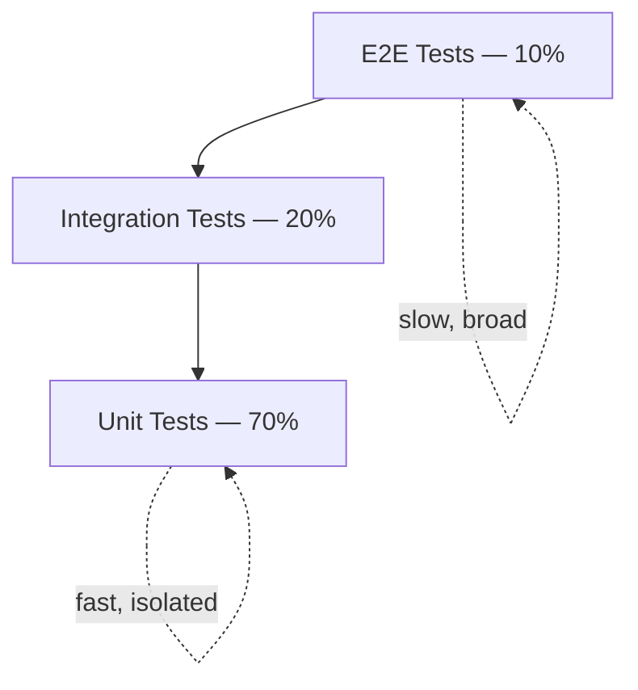
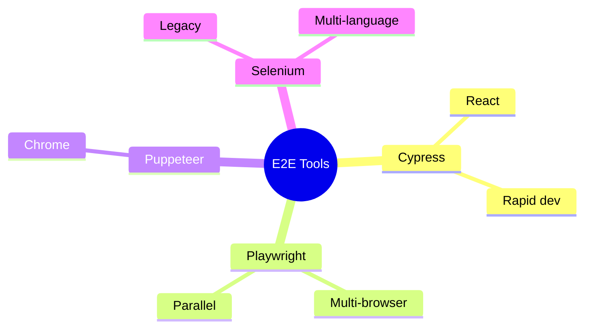
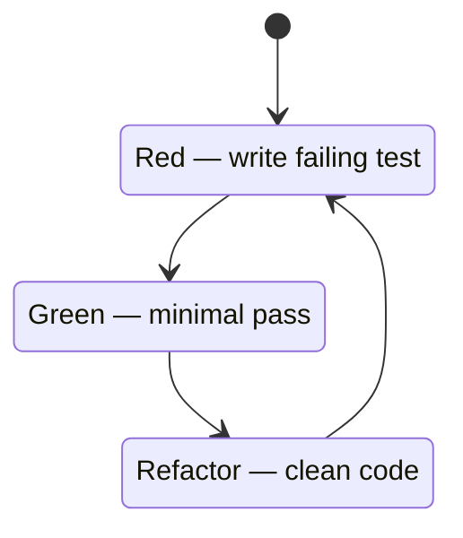

# Frontend Testing


---

## Testing Pyramid

| Level | Share | Speed | Isolation | Purpose |
| --- | --- | --- | --- | --- |
| Unit Tests | 70% | Milliseconds | Full | Component/function logic |
| Integration Tests | 20% | Seconds | Partial | Component interactions |
| E2E Tests | 10% | Minutes | None | User journeys |



## Testing Principles (F.I.R.S.T.)

| Principle | Description |
| --- | --- |
| **Fast** | Mock external dependencies; tests must run quickly |
| **Independent** | No shared state between tests; clean setup/teardown |
| **Repeatable** | Same result every run; no flakiness |
| **Self-Validating** | Pass or fail automatically |
| **Timely** | Write tests alongside code (TDD or same PR) |

**Best practices:**

- Test behavior, not implementation details
- Use descriptive names: `it('returns correct total when items are added')`
- Follow Arrange → Act → Assert
- One assertion per test where possible
- Mock external dependencies (APIs, databases, file system)

---

## Unit Testing

```javascript
function calculateTotal(items) {
    return items.reduce((total, item) => total + (item.price * item.quantity), 0);
}

describe('calculateTotal', () => {
    it('returns 0 for empty array', () => {
        expect(calculateTotal([])).toBe(0);
    });

    it('calculates correct total for single item', () => {
        expect(calculateTotal([{ price: 10, quantity: 2 }])).toBe(20);
    });

    it('handles decimal prices', () => {
        expect(calculateTotal([{ price: 9.99, quantity: 2 }])).toBeCloseTo(19.98);
    });
});
```

### React Component Testing

```jsx
// Button.jsx
export const Button = ({ onClick, children, disabled }) => (
    <button onClick={onClick} disabled={disabled} className="btn btn-primary">
        {children}
    </button>
);

// Button.test.jsx
import { render, screen, fireEvent } from '@testing-library/react';
import { Button } from './Button';

describe('Button', () => {
    it('renders children text', () => {
        render(<Button>Click Me</Button>);
        expect(screen.getByRole('button')).toHaveTextContent('Click Me');
    });

    it('calls onClick when clicked', () => {
        const handleClick = jest.fn();
        render(<Button onClick={handleClick}>Click Me</Button>);
        fireEvent.click(screen.getByRole('button'));
        expect(handleClick).toHaveBeenCalledTimes(1);
    });

    it('does not call onClick when disabled', () => {
        const handleClick = jest.fn();
        render(<Button onClick={handleClick} disabled>Click Me</Button>);
        fireEvent.click(screen.getByRole('button'));
        expect(handleClick).not.toHaveBeenCalled();
    });
});
```

### Testing Async Operations

```javascript
// api.test.js - using Mock Service Worker (MSW)
import { rest } from 'msw';
import { setupServer } from 'msw/node';
import { fetchUser } from './api';

const server = setupServer(
    rest.get('/api/users/:userId', (req, res, ctx) => {
        if (req.params.userId === '123') {
            return res(ctx.json({ id: '123', name: 'John Doe', email: 'john@example.com' }));
        }
        return res(ctx.status(404));
    })
);

beforeAll(() => server.listen());
afterEach(() => server.resetHandlers());
afterAll(() => server.close());

describe('fetchUser', () => {
    it('fetches and returns user data', async () => {
        const user = await fetchUser('123');
        expect(user).toEqual({ id: '123', name: 'John Doe', email: 'john@example.com' });
    });

    it('throws error for non-existent user', async () => {
        await expect(fetchUser('999')).rejects.toThrow('Failed to fetch user');
    });
});
```

---

## Integration Testing

Tests that multiple components work together — interactions and data flow between them.

```jsx
describe('UserProfile', () => {
    beforeEach(() => jest.clearAllMocks());

    it('displays loading state initially', () => {
        fetchUser.mockImplementation(() => new Promise(() => {}));
        render(<UserProfile userId="123" />);
        expect(screen.getByText(/loading/i)).toBeInTheDocument();
    });

    it('displays user data after loading', async () => {
        fetchUser.mockResolvedValue({ id: '123', name: 'John Doe', email: 'john@example.com' });
        render(<UserProfile userId="123" />);
        await waitFor(() => {
            expect(screen.getByText('John Doe')).toBeInTheDocument();
        });
    });

    it('allows editing user name', async () => {
        const user = userEvent.setup();
        fetchUser.mockResolvedValue({ id: '123', name: 'John Doe', email: 'john@example.com' });
        updateUser.mockResolvedValue({ success: true });

        render(<UserProfile userId="123" />);
        await waitFor(() => screen.getByText('John Doe'));

        await user.click(screen.getByRole('button', { name: /edit/i }));
        const nameInput = screen.getByLabelText(/name/i);
        await user.clear(nameInput);
        await user.type(nameInput, 'Jane Doe');
        await user.click(screen.getByRole('button', { name: /save/i }));

        await waitFor(() => {
            expect(updateUser).toHaveBeenCalledWith('123', { name: 'Jane Doe' });
        });
    });
});
```

---

## End-to-End Testing

| Tool | Best For |
| --- | --- |
| **Cypress** | React apps, rapid development |
| **Playwright** | Multi-browser, parallel execution |
| **Puppeteer** | Chrome-specific automation |
| **Selenium** | Legacy enterprise, multi-language |



### Cypress

```javascript
describe('Login Flow', () => {
    beforeEach(() => cy.visit('/login'));

    it('logs in with valid credentials', () => {
        cy.get('[data-cy="email-input"]').type('user@example.com');
        cy.get('[data-cy="password-input"]').type('password123');
        cy.get('[data-cy="submit-button"]').click();
        cy.url().should('include', '/dashboard');
        cy.get('[data-cy="user-menu"]').should('be.visible');
    });

    it('shows error for invalid credentials', () => {
        cy.get('[data-cy="email-input"]').type('invalid@example.com');
        cy.get('[data-cy="password-input"]').type('wrongpassword');
        cy.get('[data-cy="submit-button"]').click();
        cy.get('[data-cy="error-message"]').should('be.visible').and('contain', 'Invalid credentials');
    });
});
```

### Playwright

```javascript
// playwright.config.js
export default defineConfig({
    testDir: './tests',
    fullyParallel: true,
    retries: process.env.CI ? 2 : 0,
    use: { baseURL: 'http://localhost:3000', trace: 'on-first-retry' },
    projects: [
        { name: 'chromium', use: { ...devices['Desktop Chrome'] } },
        { name: 'firefox', use: { ...devices['Desktop Firefox'] } },
        { name: 'webkit', use: { ...devices['Desktop Safari'] } }
    ]
});

// tests/checkout.spec.js
test('completes checkout successfully', async ({ page }) => {
    await page.goto('/products');
    await page.click('[data-product-id="123"]');
    await page.click('[data-cy="cart-icon"]');
    await expect(page).toHaveURL('/cart');
    await page.click('[data-cy="checkout-button"]');

    await page.fill('[data-cy="shipping-name"]', 'John Doe');
    await page.fill('[data-cy="shipping-address"]', '123 Main St');
    await page.click('[data-cy="place-order"]');

    await expect(page).toHaveURL(/\/order-confirmation/);
    await expect(page.locator('[data-cy="order-number"]')).toBeVisible();
});
```

---

## TDD and BDD

### Test-Driven Development (TDD)

Write a failing test → make it pass → refactor → repeat.



```javascript
// 1. Red - write failing test
describe('addItemToCart', () => {
    it('adds item to empty cart', () => {
        const result = addItemToCart([], { id: 1, name: 'Test', price: 10 });
        expect(result).toHaveLength(1);
    });

    it('does not mutate the original cart', () => {
        const original = [];
        const result = addItemToCart(original, { id: 1, name: 'Test', price: 10 });
        expect(original).toHaveLength(0);
        expect(result).not.toBe(original);
    });
});

// 2. Green - minimal implementation
function addItemToCart(cart, item) {
    return [...cart, item];
}

// 3. Refactor if needed, then add next test
```

### Behavior-Driven Development (BDD)

Describes expected behavior from the user's perspective using natural language.

```gherkin
Feature: User Login

Scenario: Successful login with valid credentials
    Given the user is on the login page
    When the user enters valid email "user@example.com"
    And the user enters valid password "password123"
    And clicks the login button
    Then the user is redirected to the dashboard

Scenario: Failed login
    Given the user is on the login page
    When the user enters invalid credentials
    Then the user sees an error message
```

---

## Mocking

```javascript
// Mock functions
const mockFn = jest.fn();
mockFn.mockReturnValue('value');
mockFn.mockResolvedValue('async value');
mockFn.mockImplementation((arg) => arg * 2);

// Mock modules
jest.mock('./api', () => ({
    fetchUser: jest.fn(),
    updateUser: jest.fn()
}));

// Mock timers
jest.useFakeTimers();
test('delays execution', () => {
    const callback = jest.fn();
    setTimeout(callback, 1000);
    expect(callback).not.toHaveBeenCalled();
    jest.advanceTimersByTime(1000);
    expect(callback).toHaveBeenCalledTimes(1);
});
```

### Setup and Teardown

```javascript
describe('Component Tests', () => {
    beforeAll(() => { /* global setup */ });
    beforeEach(() => { jest.clearAllMocks(); });
    afterEach(() => { cleanup(); });
    afterAll(() => { /* global cleanup */ });

    it('does something', () => { /* test */ });
});
```

---

## Coverage

| Type | Target |
| --- | --- |
| Statement | >80% |
| Branch | >80% |
| Function | >90% |
| Line | >80% |

```javascript
// jest.config.js
module.exports = {
    collectCoverage: true,
    coverageDirectory: 'coverage',
    coverageReporters: ['text', 'lcov', 'html'],
    collectCoverageFrom: [
        'src/**/*.{js,jsx,ts,tsx}',
        '!src/**/*.d.ts',
        '!src/**/index.{js,jsx,ts,tsx}'
    ],
    coverageThreshold: {
        global: { branches: 70, functions: 80, lines: 80, statements: 80 }
    }
};
```

---

## References

1. [Jest Documentation](https://jestjs.io/)
2. [React Testing Library](https://testing-library.com/docs/react-testing-library/intro)
3. [Cypress Documentation](https://docs.cypress.io/)
4. [Playwright Documentation](https://playwright.dev/)
