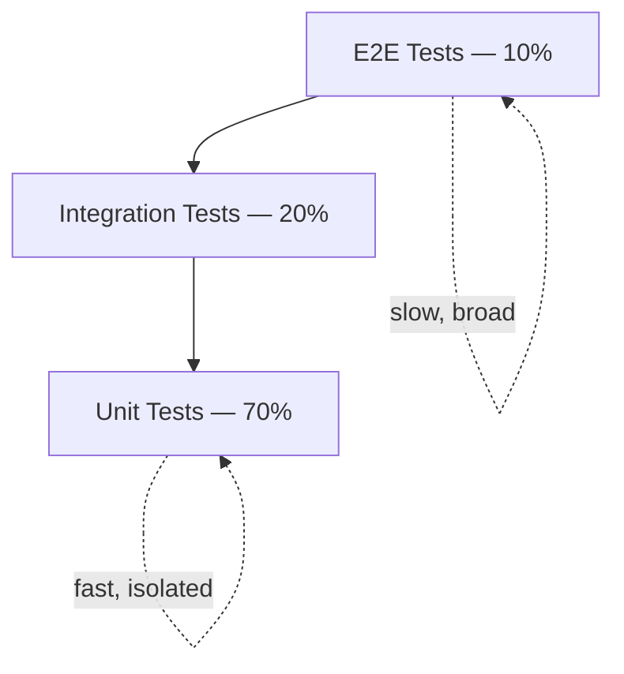

# Frontend Testing


## Testing Pyramid

| Level | Share | Speed | Isolation | Purpose |
| --- | --- | --- | --- | --- |
| Unit Tests | 70% | Milliseconds | Full | Component/function logic |
| Integration Tests | 20% | Seconds | Partial | Component interactions |
| E2E Tests | 10% | Minutes | None | User journeys |



## Testing Principles (F.I.R.S.T.)

| Principle | Description |
| --- | --- |
| **Fast** | Mock external dependencies; tests must run quickly |
| **Independent** | No shared state between tests; clean setup/teardown |
| **Repeatable** | Same result every run; no flakiness |
| **Self-Validating** | Pass or fail automatically |
| **Timely** | Write tests alongside code (TDD or same PR) |

**Best practices:**

- Test behavior, not implementation details
- Use descriptive names: `it('returns correct total when items are added')`
- Follow Arrange → Act → Assert
- One assertion per test where possible
- Mock external dependencies (APIs, databases, file system)


### Behavior-Driven Development (BDD)

Describes expected behavior from the user's perspective using natural language.

```gherkin
Feature: User Login

Scenario: Successful login with valid credentials
    Given the user is on the login page
    When the user enters valid email "user@example.com"
    And the user enters valid password "password123"
    And clicks the login button
    Then the user is redirected to the dashboard

Scenario: Failed login
    Given the user is on the login page
    When the user enters invalid credentials
    Then the user sees an error message
```

## References

1. [Jest Documentation](https://jestjs.io/)
2. [React Testing Library](https://testing-library.com/docs/react-testing-library/intro)
3. [Cypress Documentation](https://docs.cypress.io/)
4. [Playwright Documentation](https://playwright.dev/)
