# AWS Core Concepts

Every concept an AWS design conversation assumes, reduced to a single line each. This is the recall layer: read it to fix the vocabulary, then read the [AWS services overview](01-aws-stack-overview.md) for what each service costs you in practice and the [interview prep guide](02-aws-interview-prep.md) for the questions asked over it. Each section opens with a diagram of how its concepts hang together, and the table under it defines them. Where a definition names another concept with a capital letter, that concept has its own row somewhere in this file.

## Accounts and Regions

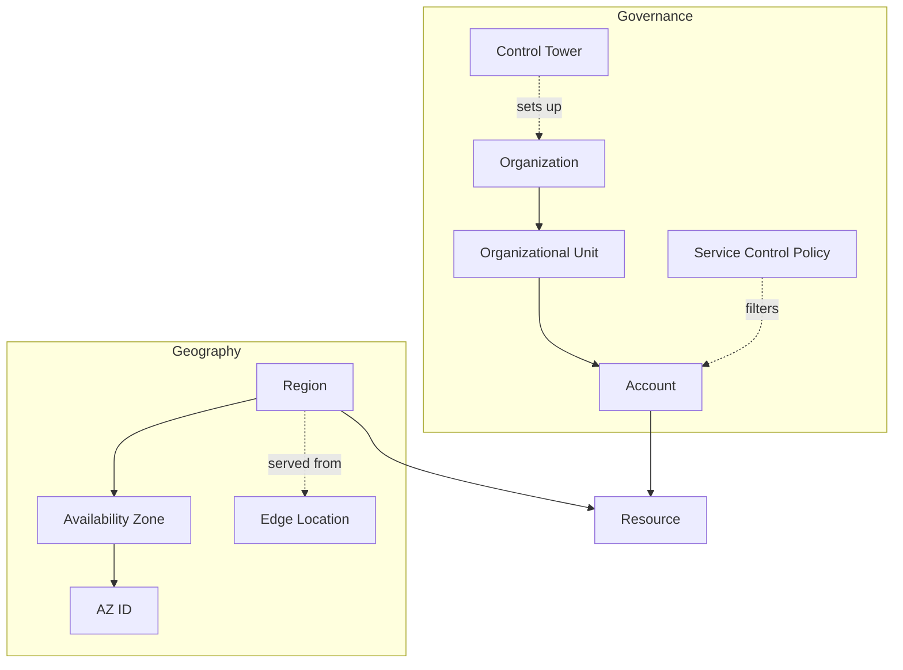

| Concept | Definition |
| --- | --- |
| **Organization** | the tree AWS bills and governs as one, with a payer account at the top and member accounts beneath |
| **Account** | the hard boundary for billing, quotas and failure containment; every Resource lives in exactly one |
| **Organizational Unit** | a folder inside an Organization that groups Accounts so one policy attaches to many at once |
| **Service Control Policy** | a filter on what identities in an Account may do; it removes permissions and never grants any |
| **Region** | a named group of isolated data-centre clusters with its own Service endpoints; nothing leaves one unless you ask |
| **Availability Zone** | one or more data centres inside a Region with independent power, cooling and network |
| **AZ ID** | the Account-independent name of an Availability Zone (`use1-az1`), the only way two Accounts agree on the same physical zone |
| **Edge Location** | a point of presence outside any Region that terminates user connections for the global Services |
| **Control Tower** | a managed setup of an Organization: baseline Accounts, guardrails and an enrollment workflow |

## Services and Resources

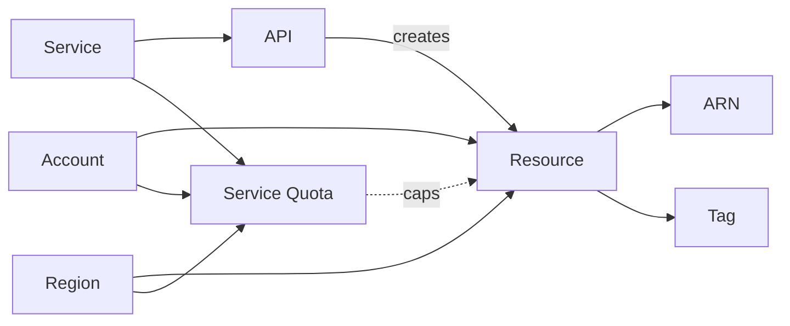

| Concept | Definition |
| --- | --- |
| **Service** | a named product AWS runs and bills as one line item, with its own endpoints, pricing and limits — S3, Lambda and DynamoDB are three of more than two hundred |
| **API** | the signed HTTPS calls a Service accepts; the console, CLI, SDKs and CloudFormation all go through the same ones, so nothing reaches AWS any other way |
| **Resource** | a thing (data or code) a Service creates and keeps for you, and the unit that is named, permissioned and billed — a Bucket, a Lambda function or an IAM Role, never the Service itself |
| **ARN** | the unique identifier of a Resource, encoding partition, Service, Region, Account and name |
| **Tag** | a key/value label on a Resource, and the only mechanism for cost attribution and attribute-based access |
| **Service Quota** | the per-Account, per-Region ceiling on a countable Resource; a default limit, usually raisable on request |

## Identity and Access

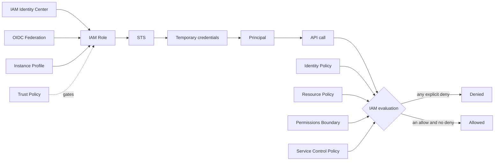

| Concept | Definition |
| --- | --- |
| **IAM** | the policy engine every AWS API call passes through; deny by default, and an explicit deny always wins |
| **Principal** | the identity a request is made as — a user, a role session, or an AWS Service acting on your behalf |
| **IAM Policy** | a JSON document of effect, action, resource and condition statements, evaluated together for each request |
| **Identity Policy** | a policy attached to a Principal, saying what that Principal may do |
| **Resource Policy** | a policy attached to the Resource itself, saying who may touch it; how cross-Account access is granted |
| **IAM Role** | a set of permissions with no credentials of its own, assumed to get short-lived keys |
| **Trust Policy** | the document on an IAM Role naming who is allowed to assume it |
| **STS** | the Service that mints the temporary credentials an assumed IAM Role hands back |
| **Instance Profile** | the wrapper that delivers an IAM Role to a running EC2 instance |
| **IAM Identity Center** | the front door humans log in through: one directory, with permission sets projected into many Accounts |
| **OIDC Federation** | trusting an external token issuer so a pipeline can assume an IAM Role with no stored key |
| **Permissions Boundary** | a ceiling that caps what an Identity Policy can grant, so role creation can be delegated safely |

## Encryption and Secrets

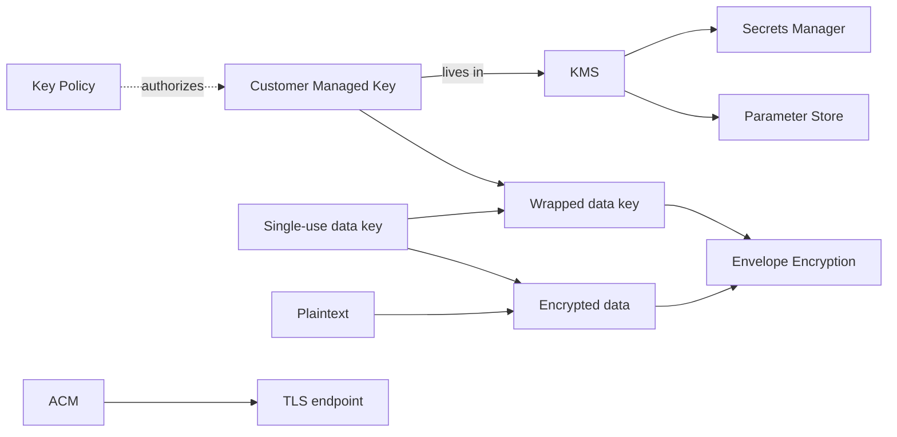

| Concept | Definition |
| --- | --- |
| **KMS** | the managed key Service: keys that never leave it, and every use recorded |
| **Customer Managed Key** | a KMS key you create, write the policy for, and rotate on your own schedule |
| **Envelope Encryption** | encrypting data with a single-use data key, then encrypting that data key with a long-lived one |
| **Key Policy** | the Resource Policy on a key, and the root of its access control rather than an addition to IAM |
| **Secrets Manager** | storage for credentials with built-in rotation and per-secret access control |
| **Parameter Store** | the Systems Manager hierarchy for configuration values, free at standard tier and encrypted on request |
| **ACM** | issues and auto-renews TLS certificates for AWS-managed endpoints, with the private key never exported |

## Compute — Instances

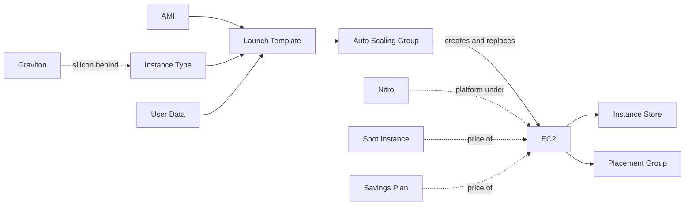

| Concept | Definition |
| --- | --- |
| **EC2** | a rented virtual machine billed per second, on a hypervisor you never see |
| **AMI** | the bootable disk image an instance starts from, scoped to one Region and copyable between them |
| **Instance Type** | the hardware shape (`m7g.large`): family letter for purpose, generation number, silicon suffix, then size |
| **Launch Template** | the versioned recipe — AMI, Instance Type, network, roles — that everything else launches instances from |
| **Auto Scaling Group** | a fleet held at a target size across Availability Zones, replacing what fails and following a scaling rule |
| **Instance Store** | disk physically attached to the host: the fastest available, and erased when the instance stops |
| **Spot Instance** | spare capacity at a deep discount, reclaimed on about two minutes' notice |
| **Placement Group** | a hint about physical layout — packed for latency, spread for isolation, partitioned for rack awareness |
| **Nitro** | the offload card and thin hypervisor behind current instance families; why encryption and fast networking are free |
| **Graviton** | the AWS Arm processors marked by a `g` in the Instance Type, cheaper per unit of work if your image is multi-arch |
| **User Data** | the script an instance runs at first boot, and the seam where a baked image ends and configuration begins |
| **Savings Plan** | a committed hourly spend over one or three years, traded for a lower rate across compute types |

## Compute — Containers

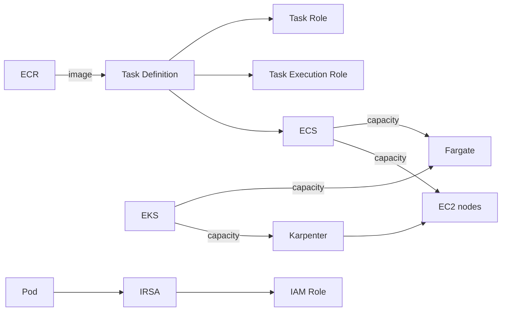

| Concept | Definition |
| --- | --- |
| **ECS** | the AWS container orchestrator, wired directly into IAM, load balancing and CloudWatch |
| **Task Definition** | the container spec ECS runs: image, CPU and memory, environment, log driver and two roles |
| **Task Role** | what the application code inside the container is allowed to call |
| **Task Execution Role** | what the agent pulling the image and shipping the logs uses, which is not the application's identity |
| **Fargate** | a capacity type rather than a cluster: containers on AWS-run micro-VMs, with no host to patch or over-provision |
| **EKS** | managed upstream Kubernetes — AWS runs the control plane, you still choose the data plane |
| **Karpenter** | a provisioner that reads pending pods and launches right-sized nodes for them directly |
| **IRSA** | mapping a Kubernetes service account to an IAM Role through the cluster's OIDC issuer |
| **ECR** | the private image registry, with per-repository policy, scanning and lifecycle expiry |

## Compute — Functions

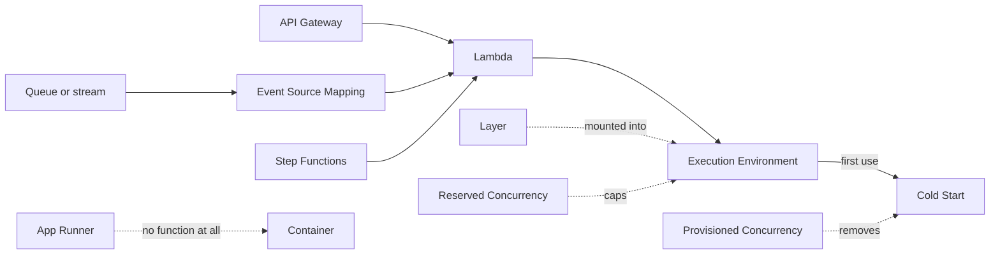

| Concept | Definition |
| --- | --- |
| **Lambda** | a handler AWS runs in a micro-VM only while an event is being processed, billed per millisecond |
| **Execution Environment** | the isolated sandbox that handles exactly one invocation at a time, which is why globals survive between them |
| **Event Source Mapping** | the poller AWS runs against a queue or stream for you, setting batch size and retry behaviour |
| **Cold Start** | the extra latency of creating and initializing a new Execution Environment before its first invocation |
| **Provisioned Concurrency** | environments kept initialized and billed while idle, bought specifically to remove Cold Start |
| **Reserved Concurrency** | a per-function share of the Account limit that both caps the function and guarantees it that capacity |
| **Layer** | a shared archive mounted into a function's filesystem, for dependencies kept out of the deployment package |
| **API Gateway** | a managed HTTP front end doing auth, throttling, validation and mapping before anything of yours runs |
| **Step Functions** | a state machine coordinating services with retries, branching and waits expressed as data instead of code |
| **App Runner** | a container image or repo turned into an autoscaling HTTPS service with no cluster or load balancer to design |

## Networking — Inside the VPC

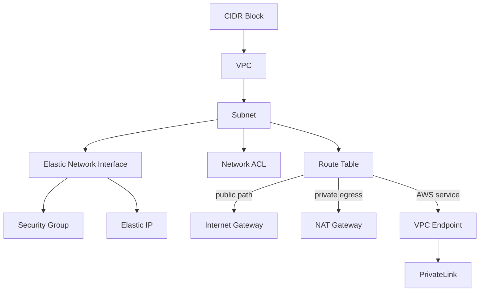

| Concept | Definition |
| --- | --- |
| **VPC** | a private IP network you own inside one Region, isolated from everything else by default |
| **CIDR Block** | the address range given to a network, written `10.0.0.0/16`; the decision that is hardest to change later |
| **Subnet** | a CIDR Block inside a VPC pinned to one Availability Zone, and the unit that placement and routing work on |
| **Route Table** | the longest-prefix rules attached to a Subnet, deciding where traffic leaves it |
| **Internet Gateway** | the attachment that makes a Subnet public and translates addresses in both directions |
| **NAT Gateway** | a one-way door letting private subnets reach the internet without being reachable, billed per hour and per GB |
| **Security Group** | a stateful, allow-only firewall on an interface, where return traffic needs no rule |
| **Network ACL** | a stateless, numbered allow-and-deny list on a Subnet, where both directions must be written out |
| **Elastic Network Interface** | the virtual NIC carrying a private IP, its Security Groups and a MAC address, attached to an instance or task |
| **Elastic IP** | a static public address you hold and re-attach, and the fix for one that changes when an instance stops |
| **VPC Endpoint** | a private entrance to an AWS Service from inside a VPC, so that traffic never reaches the internet |
| **PrivateLink** | the same private entrance pointed at someone else's service, exposed through a Network Load Balancer |

## Networking — Edge and Connections

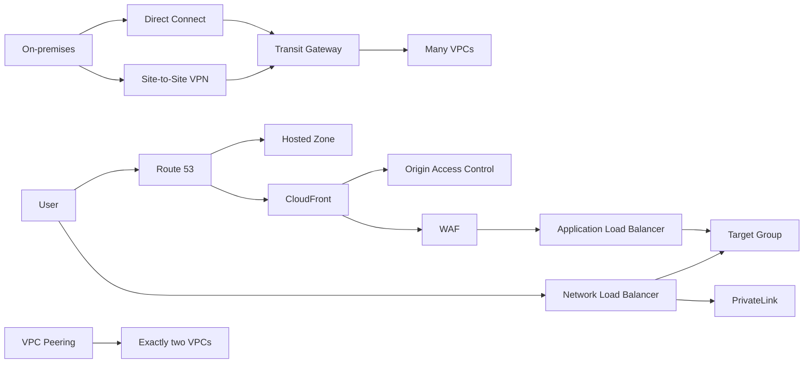

| Concept | Definition |
| --- | --- |
| **Application Load Balancer** | layer 7 balancing that understands HTTP, routing on host, path, header and method |
| **Network Load Balancer** | layer 4 balancing at very high throughput, with a static address per Availability Zone |
| **Target Group** | the registered set of instances, addresses or functions a listener forwards to, plus the health check over them |
| **Route 53** | authoritative DNS with health checks and latency-, geography- and weight-based answers |
| **Hosted Zone** | the container for one domain's records, either public or private to a named set of VPCs |
| **CloudFront** | the CDN that terminates TLS at Edge Locations and caches or accelerates the path back to an origin |
| **Origin Access Control** | the signature that lets only CloudFront read an otherwise private bucket |
| **WAF** | rule-based request filtering in front of an edge distribution, load balancer or API |
| **Transit Gateway** | a regional hub routing between many VPCs and on-premises links, replacing a mesh of point-to-point links |
| **VPC Peering** | a one-to-one, non-transitive route between two VPCs: cheapest, and does not scale past a handful |
| **Direct Connect** | a dedicated private circuit into AWS, bought for consistent latency rather than for privacy |
| **Site-to-Site VPN** | an IPsec tunnel to your own data centre over the public internet, and the quick thing to stand up |

## Storage

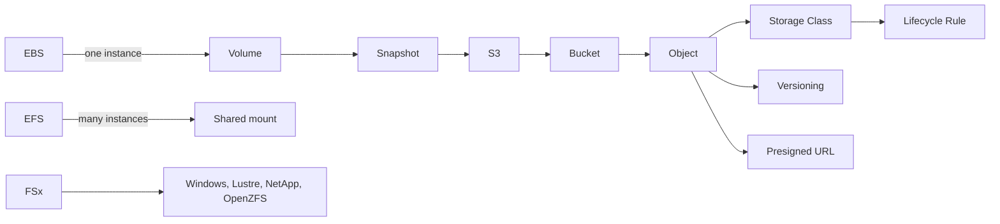

| Concept | Definition |
| --- | --- |
| **S3** | object storage addressed by key, with very high durability and no filesystem underneath |
| **Bucket** | the named, Region-bound namespace objects live in, and the level policy and encryption are set at |
| **Storage Class** | the price and access tier of an object, from instant retrieval down to hours-long archival restore |
| **Lifecycle Rule** | the age-based policy that moves an object between Storage Classes or deletes it outright |
| **Versioning** | keeping every overwrite and delete as a separate copy, where a delete becomes a marker rather than a loss |
| **Presigned URL** | a time-limited link carrying its maker's signature, so a browser can upload or download with no credentials |
| **EBS** | a network block volume attached to one instance at a time and surviving a stop and start |
| **Snapshot** | an incremental copy of a volume held in S3, and the unit of both backup and cloning |
| **EFS** | an elastic NFS filesystem many instances mount at once, priced on what is stored rather than provisioned |
| **FSx** | managed Windows, Lustre, NetApp or OpenZFS filesystems, for workloads that need those protocols specifically |

## Data Stores

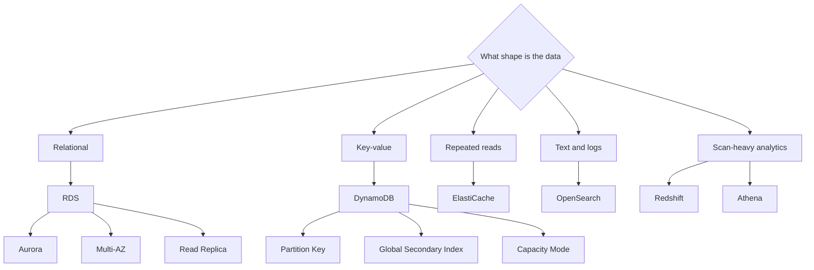

| Concept | Definition |
| --- | --- |
| **RDS** | managed relational engines where patching, backup and failover are handled but the schema is still yours |
| **Multi-AZ** | a standby in another Availability Zone that takes over on failure; availability, and not read capacity |
| **Read Replica** | an asynchronous copy serving reads and promotable to primary, always some lag behind |
| **Aurora** | a cloud-native engine separating compute from a shared, six-way replicated storage layer |
| **DynamoDB** | a key-value store with flat latency at any size, if the access pattern is known before the table is designed |
| **Partition Key** | the attribute deciding which partition an item lands in, and therefore where a hot spot will appear |
| **Global Secondary Index** | a second key layout over the same items, with its own capacity and eventually consistent reads |
| **Capacity Mode** | the billing dial on a table: per request, or a rate you provision and scale yourself |
| **ElastiCache** | managed Redis or Memcached, for the reads a database should never have to serve twice |
| **OpenSearch** | managed search and log analytics; a query engine rather than a system of record |
| **Redshift** | a columnar warehouse for scan-heavy analytics over data too large to query where it lies |
| **Athena** | SQL over files in S3 with no cluster to run, billed per byte scanned |

## Messaging and Events

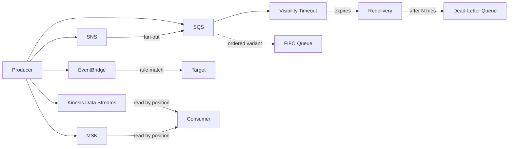

| Concept | Definition |
| --- | --- |
| **SQS** | a durable queue decoupling a producer from a consumer that may be slower, or absent |
| **Visibility Timeout** | the window during which a received message is hidden from other consumers, after which it reappears |
| **Dead-Letter Queue** | where a message lands after failing delivery a set number of times, so one bad message stops blocking the rest |
| **FIFO Queue** | ordering and exactly-once processing within a message group, bought at the cost of throughput |
| **SNS** | publish-and-subscribe fan-out, delivering one message to many independent subscribers |
| **EventBridge** | a router matching events against content-based rules and delivering them to targets, with a schema registry |
| **Kinesis Data Streams** | an ordered, replayable log sharded by key and read by position rather than consumed |
| **MSK** | managed Apache Kafka, for teams that need the Kafka ecosystem and not only the semantics |

## Infrastructure as Code and Delivery

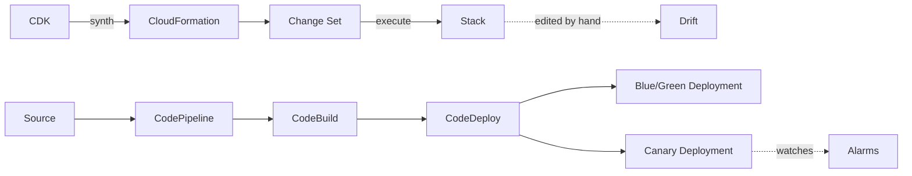

| Concept | Definition |
| --- | --- |
| **CloudFormation** | declarative Stacks that AWS creates, updates and rolls back as a single unit |
| **Stack** | the deployed instance of a template, and the boundary a rollback applies to |
| **Change Set** | the preview of what an update would add, modify or replace, produced before anything is executed |
| **Drift** | the divergence between a Stack and the real Resources after someone edited them by hand |
| **CDK** | infrastructure written in a general-purpose language and synthesized into CloudFormation |
| **CodeBuild** | managed build containers defined by a buildspec, with no build server to keep alive |
| **CodeDeploy** | the component that shifts traffic onto a new version of an EC2 fleet, ECS service or Lambda alias |
| **CodePipeline** | the stage graph tying source, build, approval and deployment into one auditable run |
| **Blue/Green Deployment** | running the new version beside the old and switching traffic at once, so a rollback is another switch |
| **Canary Deployment** | shifting a small share of traffic first and watching the alarms before moving the rest |

## Observability and Governance

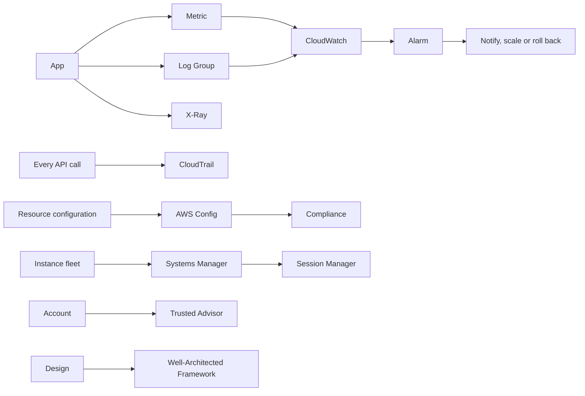

| Concept | Definition |
| --- | --- |
| **CloudWatch** | the metrics, logs and alarms Service that every AWS Service reports into without being asked |
| **Metric** | a named time series of measurements, with dimensions that make it selectable |
| **Alarm** | a rule over a Metric that changes state and acts when a threshold holds for a number of periods |
| **Log Group** | the retention and access boundary around one stream of log events; retention is forever until you set it |
| **CloudTrail** | the audit record of every API call — who made it, from where, and whether it was allowed |
| **AWS Config** | the configuration history of each Resource, plus rules that judge compliance across time |
| **X-Ray** | request tracing that stitches one call's path across services into a single timeline |
| **Systems Manager** | agent-based fleet operations: patching, inventory, remote commands and shell access without SSH |
| **Session Manager** | a shell onto an instance through that agent, needing no bastion host and no inbound port |
| **Trusted Advisor** | automated checks of an Account against cost, security, quota and resilience best practice |
| **Well-Architected Framework** | the six pillars a design is reviewed against: operations, security, reliability, performance, cost and sustainability |

## Resilience and Responsibility

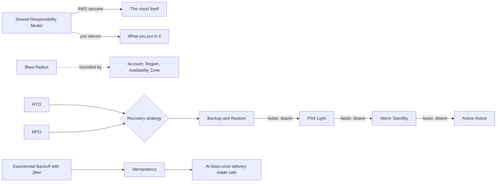

| Concept | Definition |
| --- | --- |
| **Shared Responsibility Model** | AWS secures what it runs, you secure what you put into it, and the line moves with how managed the Service is |
| **Blast Radius** | how much stops working when one thing fails; what the Account, Region and Availability Zone boundaries exist to bound |
| **RTO** | the time a service may stay down before recovery has to be complete |
| **RPO** | the quantity of data a recovery is allowed to lose, measured as a span of time |
| **Backup and Restore** | keeping copies elsewhere and rebuilding on demand: cheapest, and the slowest to come back |
| **Pilot Light** | a minimal always-on copy of the critical parts, scaled up when the primary is lost |
| **Warm Standby** | a smaller but fully working second environment, resized rather than built after a failure |
| **Active-Active** | serving from more than one Region at once, so a failure is a routing change and the data is the hard part |
| **Idempotency** | the property that repeating a request changes nothing further, which is what makes at-least-once delivery safe |
| **Exponential Backoff with Jitter** | retrying after a randomized, growing delay, so that failures do not resynchronize the callers |
