# AWS Handbook

AWS offers more than two hundred services. Most systems use about thirty of them, and this document covers those thirty three ways at once: what each one is and what it costs you in practice, the vocabulary the design conversation assumes, and the questions an infrastructure role is asked over both.

The material is grouped the way a system is built. 
- First the **foundations** every service depends on, 
- the six things almost every system needs — somewhere to run code (**compute**), 
- a network to reach it (**networking**), 
- somewhere to keep data (**storage and data**), 
- a way for the parts to talk (**messaging and events**), 
- a way to decide who may do what (**identity**), 
- and a way to see what is happening (**observability**). 

After those come the cross-cutting concerns that only appear once a system is real: **infrastructure as code and delivery**, **resilience**, and the performance, cost and security practices that keep it running. 

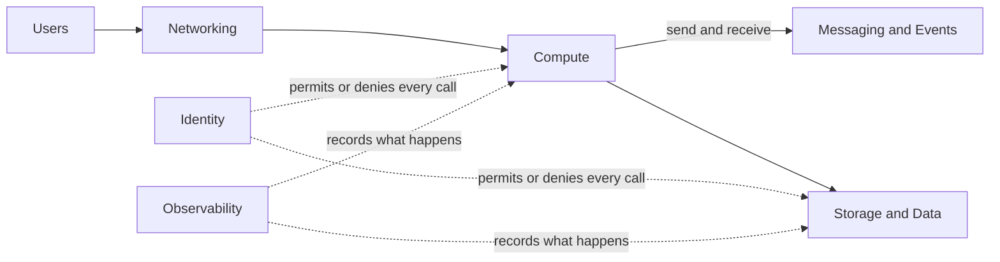

## How to Read This Document

Every domain section is built the same way, and the order is the point: **each concept is defined once, at the top of the domain it belongs to, and everything below that depends on it.** Nothing is explained twice — where a later section needs an idea that has already been introduced, it links back to it rather than restating it.

**First, the concept tables.** A diagram of how the domain's terms hang together, then a table reducing each to a single line. This is the vocabulary layer: read it to fix the terms before a conversation, or to settle a definition in the middle of one. Where a definition names another concept with a capital letter, that concept has its own row somewhere in this file.

**Then, the service entries.** These assume the vocabulary above and add what you cannot get from a definition. Each has the same shape:

- A short description in plain words: what the service is and what you would use it for.
- **Entry point** — the first object you create. Every AWS service is built around one central object, and once you know which one it is, the rest of the service's settings make sense. For a queue service it is the queue; for a virtual machine service it is the machine image plus the hardware size.
- **Use it when** — the situation where this service is the right choice, so that you can compare it with its neighbours.
- **Trap** — the mistake people most often make with the service, and why it happens. Traps are worth reading even when you skip the rest, because they are what an experienced engineer would tell you before you started.

**Last, the sections that depend on everything above:** [Running It Well](#running-it-well), [Diagrams to Draw](#diagrams-to-draw) and [Trade-Offs](#trade-offs) carry no new definitions at all. They are practice, rehearsal and judgement over the vocabulary already established, and they link back to it.

Five words are used before their own domain arrives, so they are worth reading first: **Region** and **Availability Zone** in [Concepts — Accounts and Regions](#concepts--accounts-and-regions), **ARN** in [Concepts — Services and Resources](#concepts--services-and-resources), **VPC** in [Concepts — Inside the VPC](#concepts--inside-the-vpc), and **IAM Role** in [Concepts — Identity and Access](#concepts--identity-and-access).

## Foundations

Everything in AWS rests on three ideas that are explained once here and assumed afterwards: where things live, how you talk to them, and how an organization divides them up.

### Concepts — Accounts and Regions

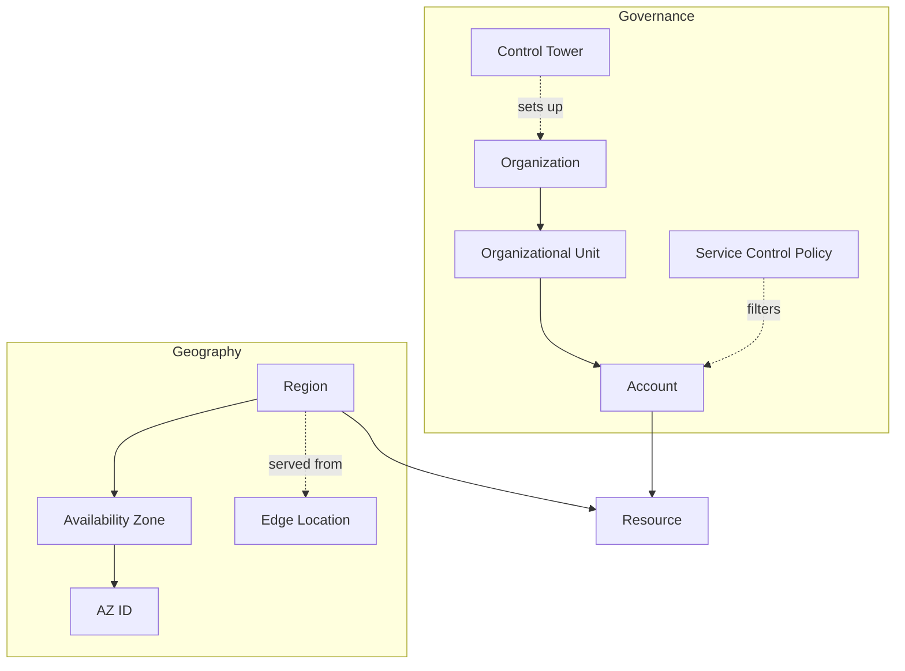

| Concept | Definition |
| --- | --- |
| **Organization** | the tree AWS bills and governs as one, with a payer account at the top and member accounts beneath |
| **Account** | the hard boundary for billing, quotas and failure containment; every Resource lives in exactly one |
| **Organizational Unit** | a folder inside an Organization that groups Accounts so one policy attaches to many at once |
| **Service Control Policy** | a filter on what identities in an Account may do; it removes permissions and never grants any |
| **Region** | a named group of isolated data-centre clusters with its own Service endpoints; nothing leaves one unless you ask |
| **Availability Zone** | one or more data centres inside a Region with independent power, cooling and network |
| **AZ ID** | the Account-independent name of an Availability Zone (`use1-az1`), the only way two Accounts agree on the same physical zone |
| **Edge Location** | a point of presence outside any Region that terminates user connections for the global Services |
| **Control Tower** | a managed setup of an Organization: baseline Accounts, guardrails and an enrollment workflow |

### Concepts — Services and Resources

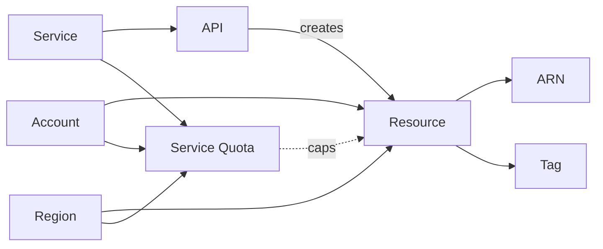

| Concept | Definition |
| --- | --- |
| **Service** | a named product AWS runs and bills as one line item, with its own endpoints, pricing and limits — S3, Lambda and DynamoDB are three of more than two hundred |
| **API** | the signed HTTPS calls a Service accepts; the console, CLI, SDKs and CloudFormation all go through the same ones, so nothing reaches AWS any other way |
| **Resource** | a thing (data or code) a Service creates and keeps for you, and the unit that is named, permissioned and billed — a Bucket, a Lambda function or an IAM Role, never the Service itself |
| **ARN** | the unique identifier of a Resource, encoding partition, Service, Region, Account and name |
| **Tag** | a key/value label on a Resource, and the only mechanism for cost attribution and attribute-based access |
| **Service Quota** | the per-Account, per-Region ceiling on a countable Resource; a default limit, usually raisable on request |

### Accounts, Regions and Availability Zones — Where Everything Lives

An **account** is the container you sign up for. It is the boundary for billing (one bill per account), for limits (quotas are counted per account), and for isolation (nothing in one account can touch another account unless both sides explicitly allow it). Companies run many accounts — one per team, or one per environment — and manage them together with **AWS Organizations**, which nests accounts into **organizational units (OUs)** so that one policy attaches to many at once.

- **Regions** are separate geographic locations, each a group of data centres with its own copy of every regional service. When you create a resource you choose a Region, and it stays there: an S3 bucket in Frankfurt (`eu-central-1`) is not visible from the Ireland (`eu-west-1`) console, and data does not move between Regions unless you copy it. Choose the Region closest to your users, or the one your data-residency rules require.
- **Availability Zones (AZs)** are the fault-isolated data centres inside a Region, usually three, connected by fast private links. A well-built system puts a copy of each part in at least two AZs, so that one data centre failing does not stop it. Much of this document is about which services do that for you (S3, DynamoDB, Lambda) and which need you to do it yourself (EC2, subnets, RDS Multi-AZ). **Local Zones** and **edge locations** extend the same fault model outwards, the first for low-latency compute near a metro area and the second for terminating user connections.
- **Global services:** a few services are not regional. IAM (identity), Route 53 (DNS) and CloudFront (the content network) are the same everywhere in the account.
- **Trap:** AZ names are assigned per account. Your `eu-central-1a` and another account's `eu-central-1a` can be different physical data centres. When two accounts must agree on a physical zone, use the **AZ ID** (`euc1-az1`), which is the same for everyone.


### The Console, the CLI and the API — How You Talk to AWS

Every AWS service is a set of **APIs**: signed HTTPS calls such as `s3:PutObject` or `ec2:RunInstances`. Everything else is a way of making those calls. There is no single "resource manager" layer above them the way Azure has one — each service has its own API, its own error shapes and its own eventual-consistency behaviour.

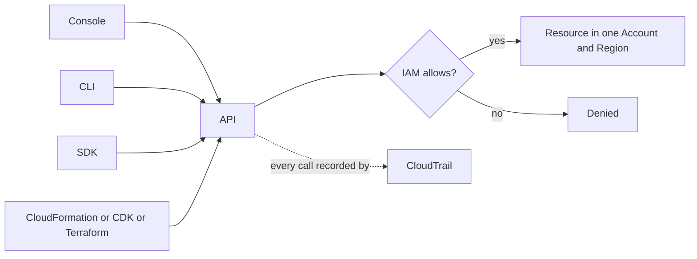

- The **console** (the website) is the same API behind buttons. It is the right place to learn and to look, and the wrong place to build production, because what you click is not recorded anywhere you can repeat.
- The **CLI** (`aws s3 ls`) and the **SDKs** (libraries for Python, TypeScript, Java and other languages) make the same calls from a terminal or from code.
- **Infrastructure as code** — CloudFormation, the CDK, Terraform — describes the resources you want in a file, and the tool makes the API calls to create or change them. This is how production infrastructure is built, because the file can be reviewed, versioned and applied again. [Infrastructure as Code and Delivery](#infrastructure-as-code-and-delivery) compares the tools.
- **Why this matters:** because everything is an API call, every call can be permitted or denied by IAM, and every call is recorded by CloudTrail. Both are covered below, and both work the same way no matter which tool made the call.

### Multi-Account Structure — The Landing Zone

A **landing zone** is the account layout, guardrails and shared networking a company sets up once, before any workload arrives. The account-per-environment split is the AWS-idiomatic answer to environment isolation, not one account with tags, because the account is the only boundary that a mistake genuinely cannot cross.

- **Control Tower** sets up an Organization with baseline accounts, guardrails and an enrollment workflow. **Landing Zone Accelerator** is the heavier, configuration-driven alternative for regulated estates.
- **Account vending:** Control Tower **Account Factory**, or **AFT** (Account Factory for Terraform), makes new accounts repeatable rather than hand-built.
- **Service Control Policies (SCPs)** attach at the OU so that new accounts inherit guardrails at creation. They never grant anything — they only remove permissions — which is why an SCP allowing everything grants nothing by itself. **Resource Control Policies** apply the same idea to resource-based policies.
- **Tags** carry cost attribution and attribute-based access control (ABAC), where a permission is granted by comparing a tag on the principal with a tag on the resource. Cost allocation tags must be activated in the Billing console before they appear in reports, which is the step people forget.
- **Quotas:** limits are per account and per Region. Know which one binds first — in network-dense designs (many ENIs per task or pod, many attached VPCs), ENI, Elastic IP and VPC CIDR quotas are reached long before compute quotas.

The worked drawing of a landing zone, with the network account and Transit Gateway in it, is in [Diagrams to Draw](#diagrams-to-draw).

## Compute

Compute is where your code runs. AWS gives you four ways to run it, and the difference between them is how much of the machine you see and manage. At one end, EC2 gives you a whole virtual server that you install software on and keep patched. At the other, Lambda runs one function of your code when something calls it, and you never see a machine at all. ECS and EKS sit in between: you package your code as a **container** — an application plus everything it needs to run, built with Docker — and the service decides which machines run it.

The general pattern: the less you manage, the less you can customise, and the more you pay per unit of work at steady high load — but the less you pay when the load is low or uneven, and the less operator time you spend. Most teams end up with a mix.

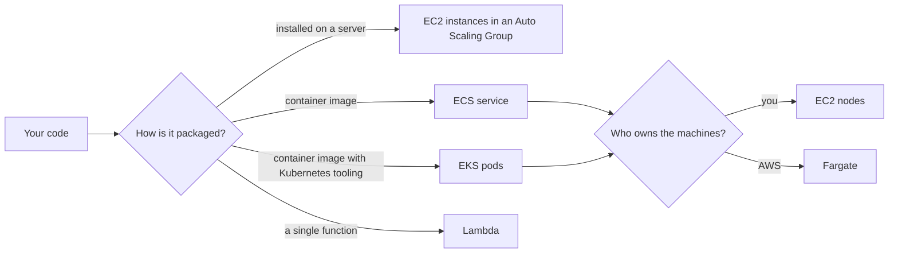

### Concepts — Compute Instances

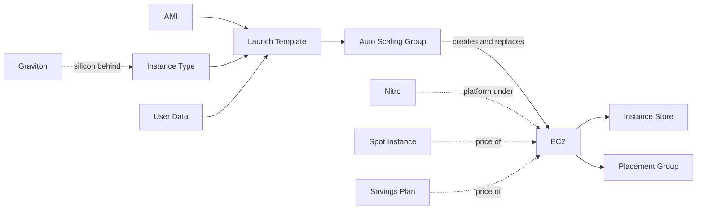

| Concept | Definition |
| --- | --- |
| **EC2** | a rented virtual machine billed per second, on a hypervisor you never see |
| **AMI** | the bootable disk image an instance starts from, scoped to one Region and copyable between them |
| **Instance Type** | the hardware shape (`m7g.large`): family letter for purpose, generation number, silicon suffix, then size |
| **Launch Template** | the versioned recipe — AMI, Instance Type, network, roles — that everything else launches instances from |
| **Auto Scaling Group** | a fleet held at a target size across Availability Zones, replacing what fails and following a scaling rule |
| **Instance Store** | disk physically attached to the host: the fastest available, and erased when the instance stops |
| **Spot Instance** | spare capacity at a deep discount, reclaimed on about two minutes' notice |
| **Placement Group** | a hint about physical layout — packed for latency, spread for isolation, partitioned for rack awareness |
| **Nitro** | the offload card and thin hypervisor behind current instance families; why encryption and fast networking are free |
| **Graviton** | the AWS Arm processors marked by a `g` in the Instance Type, cheaper per unit of work if your image is multi-arch |
| **User Data** | the script an instance runs at first boot, and the seam where a baked image ends and configuration begins |
| **Savings Plan** | a committed hourly spend over one or three years, traded for a lower rate across compute types |

### Concepts — Compute Containers

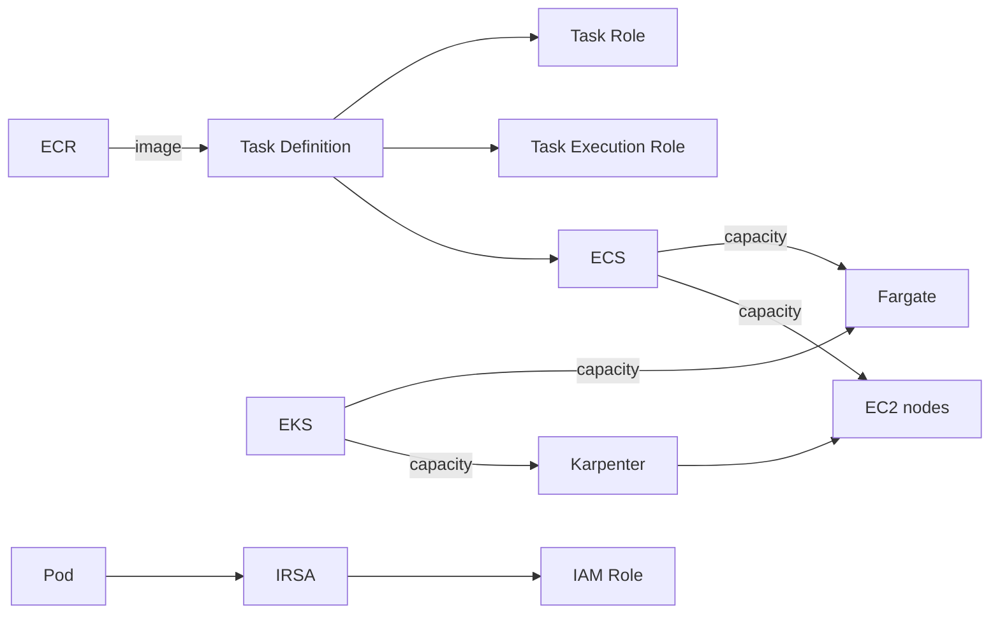

| Concept | Definition |
| --- | --- |
| **ECS** | the AWS container orchestrator, wired directly into IAM, load balancing and CloudWatch |
| **Task Definition** | the container spec ECS runs: image, CPU and memory, environment, log driver and two roles |
| **Task Role** | what the application code inside the container is allowed to call |
| **Task Execution Role** | what the agent pulling the image and shipping the logs uses, which is not the application's identity |
| **Fargate** | a capacity type rather than a cluster: containers on AWS-run micro-VMs, with no host to patch or over-provision |
| **EKS** | managed upstream Kubernetes — AWS runs the control plane, you still choose the data plane |
| **Karpenter** | a provisioner that reads pending pods and launches right-sized nodes for them directly |
| **IRSA** | mapping a Kubernetes service account to an IAM Role through the cluster's OIDC issuer |
| **ECR** | the private image registry, with per-repository policy, scanning and lifecycle expiry |

### Concepts — Compute Functions

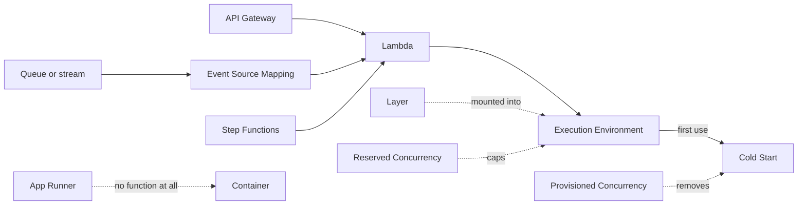

| Concept | Definition |
| --- | --- |
| **Lambda** | a handler AWS runs in a micro-VM only while an event is being processed, billed per millisecond |
| **Execution Environment** | the isolated sandbox that handles exactly one invocation at a time, which is why globals survive between them |
| **Event Source Mapping** | the poller AWS runs against a queue or stream for you, setting batch size and retry behaviour |
| **Cold Start** | the extra latency of creating and initializing a new Execution Environment before its first invocation |
| **Provisioned Concurrency** | environments kept initialized and billed while idle, bought specifically to remove Cold Start |
| **Reserved Concurrency** | a per-function share of the Account limit that both caps the function and guarantees it that capacity |
| **Layer** | a shared archive mounted into a function's filesystem, for dependencies kept out of the deployment package |
| **API Gateway** | a managed HTTP front end doing auth, throttling, validation and mapping before anything of yours runs |
| **Step Functions** | a state machine coordinating services with retries, branching and waits expressed as data instead of code |
| **App Runner** | a container image or repo turned into an autoscaling HTTPS service with no cluster or load balancer to design |

### EC2 — Rented Virtual Machines

EC2 (Elastic Compute Cloud) rents you virtual machines — AWS calls each one an **instance** — running Linux or Windows, billed per second while running. A **hypervisor** (the software that splits one physical server into many virtual ones) sits underneath, but you never see it. You see a server with an operating system, and you are responsible for everything installed on it.

- **Entry point:** an **AMI** (Amazon Machine Image — a saved copy of a disk with an operating system and any software you pre-installed) plus an **instance type** (the hardware shape: how many CPU cores, how much memory), wrapped together in a **launch template**. In production you rarely start one instance by hand. You point an **Auto Scaling Group (ASG)** at the launch template, and it creates instances, replaces the ones that fail, and adds or removes them as the load changes.
- **Use it when:** the software needs a full operating system, a specific kernel, a GPU or long-running state on the machine; or when you are moving an existing server into the cloud with as few changes as possible.
- **Reading an instance type:** the letter at the start says what the shape is good at — `m` general purpose, `c` compute-optimized (more CPU per GB of memory), `r` memory-optimized (more memory per CPU), `t` burstable (cheap, with CPU credits that run out under sustained load), and `g`/`p` GPU. A `g` at the *end* (`m7g`, `c7g`) is the Graviton marker from the table above.
- **Storage choice:** the root disk is usually **EBS**, covered under [Storage and Data](#storage-and-data), and it survives stopping and starting. Use instance store for scratch space and caches only — it is erased when the instance stops.
- **Placement groups:** the `partition` mode is the one people miss. It groups instances by rack for distributed databases such as Cassandra and HDFS that already manage their own replication.
- **Trap:** stopping an instance releases its public IP address unless you attached an **Elastic IP** (a fixed address you own), and it destroys instance-store data. More broadly, long-lived servers that people log into and change by hand drift apart until nobody knows what is on them — which is the whole argument for [immutable infrastructure](#immutable-infrastructure-and-progressive-delivery).

### ECS — AWS's Own Container Orchestrator

A container **orchestrator** is the software that takes container images and decides which machines run them, restarts them when they crash, replaces them when you deploy a new version, and connects them to a load balancer. ECS (Elastic Container Service) is the orchestrator AWS built. It is simpler than Kubernetes and deeply wired into the rest of AWS — IAM for permissions, ALB for traffic, CloudWatch for logs. If you do not need the Kubernetes ecosystem, ECS is the cheaper answer in both money and time.

- **Entry point:** a **task definition** — the specification of what to run: the container image, how much CPU and memory, environment variables, where logs go, and which IAM roles to use. A **task** is one running copy of that definition. A **service** keeps *N* copies of the task running and registers them with a load balancer. Tasks and services live in a **cluster**, which is a name plus the machines (or the Fargate capacity) they run on.
- **Use it when:** your application is already a container, or can easily become one, and you want AWS-native tooling rather than Kubernetes.
- **Launch types — who owns the machines?** With the **EC2** launch type, you run a fleet of EC2 instances (patched and sized by you) and ECS places tasks on them; this is cheaper when the fleet is kept busy. With **Fargate**, there are no machines to manage at all — see the next section. **Capacity providers** let one cluster mix Fargate, Fargate Spot and an ASG, with weights saying how much of each to use.
- **The two roles:** a task definition names two IAM roles, and confusing them is the most common ECS permission bug. The **task role** is what *your application code* can call — for example, read from an S3 bucket. The **task execution role** is what the *ECS agent* uses on your behalf before your code starts — pull the image from ECR (the container image registry) and send logs to CloudWatch.
- **Trap:** `awsvpc` network mode gives every task its own **ENI** (Elastic Network Interface — a virtual network card) with a real IP address in your VPC. That is clean and secure, but each EC2 instance can hold only a limited number of ENIs, and each subnet has a limited number of IP addresses, so busy clusters run out of network interfaces and addresses long before they run out of CPU.

#### Fargate — The Serverless Data Plane

Fargate is not a service you set up on its own. It is a **capacity type** for ECS and EKS: instead of providing machines, you hand AWS a task definition and AWS runs the containers on its own fleet, each task inside its own small, fast-starting virtual machine (a **Firecracker** micro-VM). No machine image, no Auto Scaling Group, no patching, no server to log into — and no server sitting half empty, because you pay only for what each task asks for.

- **Entry point:** choosing `FARGATE` as the launch type (or, better, as a **capacity provider**) on an ECS service. The one sizing decision is the **task-level CPU and memory pair**, chosen from a fixed table of allowed combinations rather than any values you like. This is the first thing that surprises people arriving from EC2.
- **Use it when:** the load is uneven or low, the team is small, or nobody wants to own a fleet of servers. Operator time is usually the real cost, and Fargate removes most of it.
- **Billing and networking:** billed per vCPU-second and per GB-second, from the moment the image starts downloading until the task stops, with a one-minute minimum. `awsvpc` is the *only* network mode, so every task gets its own ENI and VPC IP address. Each task has a default amount of temporary disk with a configurable ceiling; anything that must outlive the task goes to **EFS**. **Arm64/Graviton** and Windows containers are both supported, and **Fargate Spot** gives a lower price in exchange for a two-minute warning (a `SIGTERM` signal) before AWS takes the capacity back.
- **What you give up:** privileged containers, access to the host machine, GPUs, **daemonsets** (Kubernetes objects that run one helper on every node), and any **sidecar** pattern (a helper container next to the main one) that assumes a shared machine. Debugging is done with **ECS Exec**, which opens a shell inside the container through Systems Manager, never with SSH.
- **In EKS:** the same engine appears as a **Fargate profile** that matches pods by namespace and labels. Same trade: one pod per micro-VM and no daemonsets, so your log and metrics agents have to become sidecars inside each pod.
- **Trap:** the cost crossover. Per vCPU-hour, Fargate costs more than EC2, so a fleet that is kept steadily busy and tightly packed is cheaper on EC2. Fargate wins on bursty, spiky or small workloads. The second trap is start-up time: Fargate keeps no local copy of your image between tasks, so every new task begins with a download. **SOCI (Seekable OCI)** lazy loading starts the container before the whole image has arrived; ECS on EC2 avoids the problem by caching images on the node.

### EKS — Managed Kubernetes

**Kubernetes** is the open-source container orchestrator most of the industry has standardised on. It has two halves: the **control plane** (the API server that receives your instructions and the `etcd` database that stores the desired state) and the **data plane** (the worker machines, called **nodes**, that run your containers, grouped into **pods**). EKS (Elastic Kubernetes Service) runs the control plane for you, spread across AZs and kept up to date. Everything else is standard upstream Kubernetes, so tools and knowledge transfer from anywhere else Kubernetes runs. The [containers guide](../03-system-design/05-containers.md) explains the Kubernetes concepts themselves.

- **Entry point:** the **cluster** (the control plane, billed hourly) plus a decision about the data plane: **managed node groups** (Auto Scaling Groups that AWS keeps in step with the cluster version), **Karpenter** (a provisioner that watches for pods with nowhere to run and launches right-sized nodes for them directly — AWS-originated, now a CNCF project, and the modern default over the older Cluster Autoscaler), or **Fargate profiles** (one micro-VM per pod, no nodes).
- **Use it when:** you need the Kubernetes ecosystem — Helm charts, operators, GitOps tooling, a platform team that already knows it — or portability across clouds. If none of that applies, ECS is less work.
- **Two permission systems meet here:** IAM decides who may call the EKS API from outside; Kubernetes **RBAC** (role-based access control) decides what they may do inside the cluster. The mapping between them is now the **access entries** API, which replaced the error-prone practice of editing the `aws-auth` ConfigMap by hand.
- **Pods calling AWS APIs:** a pod that needs to read S3 should not borrow the node's permissions, because then every pod on that node has them. **IRSA** (IAM Roles for Service Accounts) fixes this: the cluster publishes an OIDC identity provider, and an IAM role trusts one specific Kubernetes service account through it. The newer **EKS Pod Identity** does the same job with an agent on the node, no per-cluster OIDC setup, and simpler trust policies.
- **Trap:** the **VPC CNI** (the network plugin) gives every pod a routable VPC IP address, so a busy cluster runs out of subnet addresses. Fixes: **prefix delegation** (hand each node a block of addresses rather than one at a time), secondary CIDR ranges on the VPC, or larger instances with more ENI slots. Plan the address space *before* the cluster exists; changing it later is a migration.

### Lambda — Functions, No Servers

Lambda runs a single function of your code — a **handler** — only when something calls it, and bills you per millisecond of run time. You never see a server. Internally, each invocation runs inside a Firecracker micro-VM that AWS creates, reuses and destroys as demand changes.

- **Entry point:** a **handler** plus an **event source** — the thing that triggers it: an HTTP request through API Gateway or an ALB, a file landing in S3, a message on an SQS queue, an EventBridge event, a record on a Kinesis shard, or a bare **Function URL**. The event source shapes everything: the shape of the event JSON your code receives, what happens on failure (retry or not, and how many times), and whether failures go to a **dead-letter queue**.
- **Use it when:** work arrives as separate events, runs for seconds rather than hours, and is uneven — a thumbnail generator, a webhook receiver, a nightly report, a small connector between two services.
- **Execution model:** one execution environment handles exactly **one invocation at a time**; scaling means AWS starting more environments in parallel. An environment is reused for later invocations while it is still warm, which is why variables declared outside the handler survive between calls — useful for reusing a database connection, dangerous if you treat them as reliable state.
- **Concurrency:** **reserved** concurrency both *caps* a function (it can never run more than N copies) and *guarantees* it that capacity out of the account-wide pool. **Provisioned** concurrency keeps N environments initialised in advance to remove the **cold start** (the delay of creating a fresh environment and loading your code), and bills while they sit idle. **SnapStart** (Java, .NET and Python) takes a snapshot of an initialised environment and restores it instead.
- **Limits that shape design:** a maximum run time per invocation, a memory ceiling that also sets the CPU share (memory is the only performance dial), a bounded `/tmp` scratch directory, and a cap on the size of a synchronous request and response. The exact numbers change; read the current service quotas before designing against any of them.
- **Trap:** databases. Thousands of environments each opening their own database connection will exhaust a relational database's connection limit. **RDS Proxy** exists to pool those connections.

### App Runner, Elastic Beanstalk and Lightsail — The "Just Run My App" Tier

These three trade control for set-up time. You give them an application and they build the surrounding infrastructure for you.

- **App Runner:** point it at a container image or a source repository and get back an HTTPS address with automatic scaling, including down to almost zero when idle. There is no VPC, load balancer or cluster for you to design.
- **Elastic Beanstalk:** the older version of the same idea — it generates a CloudFormation stack of EC2 instances, an Auto Scaling Group and a load balancer behind the scenes, and you can drop down to those resources when you outgrow it.
- **Lightsail:** a fixed-price virtual private server with predictable monthly billing, aimed at small websites and people who want a simpler console.
- **Use them when:** the workload has no VPC integration, no sidecars and no custom scheduling needs. Such a workload rarely justifies EKS, and often not even ECS.

### Choosing Between the Compute Options

| Option | You manage | AWS manages | Fits when |
| --- | --- | --- | --- |
| **EC2** | The operating system, patching, scaling rules, everything installed | The hardware and the hypervisor | You need a full machine, or are moving an existing server |
| **ECS on Fargate** | The container image and its size | Everything underneath, including the machines | You have containers and want the least operations work |
| **ECS on EC2** | The container image plus the node fleet | The scheduling | Steady high load, where a well-packed fleet is cheaper |
| **EKS** | The Kubernetes objects, the add-ons and often the nodes | The control plane | You need the Kubernetes ecosystem or portability |
| **Lambda** | The function code and its memory setting | Everything else | Event-driven, short, uneven work |
| **App Runner** | The image or the repository | Everything else | A plain web service with no special networking |

The longer form of the ECS-versus-EKS decision, with the organizational question that usually settles it, is in [Trade-Offs](#ecs-fargate-vs-eks).

## Networking

A network in AWS is something you build, not something you get. Before an instance or container can receive traffic, someone has decided which private network it sits in, which part of that network, whether that part can be reached from the internet, which firewall rules apply, how requests are spread across copies of the application, and how a domain name finds it. This section follows that path from the outside in.

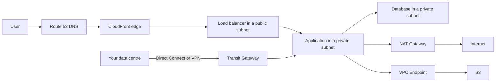

### Concepts — Inside the VPC

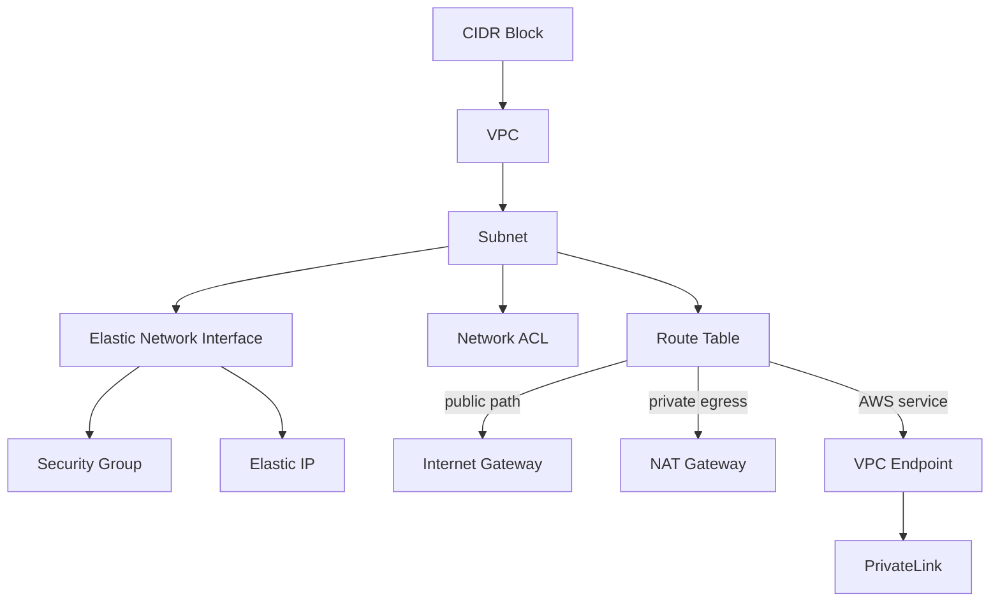

| Concept | Definition |
| --- | --- |
| **VPC** | a private IP network you own inside one Region, isolated from everything else by default |
| **CIDR Block** | the address range given to a network, written `10.0.0.0/16`; the decision that is hardest to change later |
| **Subnet** | a CIDR Block inside a VPC pinned to one Availability Zone, and the unit that placement and routing work on |
| **Route Table** | the longest-prefix rules attached to a Subnet, deciding where traffic leaves it |
| **Internet Gateway** | the attachment that makes a Subnet public and translates addresses in both directions |
| **NAT Gateway** | a one-way door letting private subnets reach the internet without being reachable, billed per hour and per GB |
| **Security Group** | a stateful, allow-only firewall on an interface, where return traffic needs no rule |
| **Network ACL** | a stateless, numbered allow-and-deny list on a Subnet, where both directions must be written out |
| **Elastic Network Interface** | the virtual NIC carrying a private IP, its Security Groups and a MAC address, attached to an instance or task |
| **Elastic IP** | a static public address you hold and re-attach, and the fix for one that changes when an instance stops |
| **VPC Endpoint** | a private entrance to an AWS Service from inside a VPC, so that traffic never reaches the internet |
| **PrivateLink** | the same private entrance pointed at someone else's service, exposed through a Network Load Balancer |

### Concepts — Edge and Connections

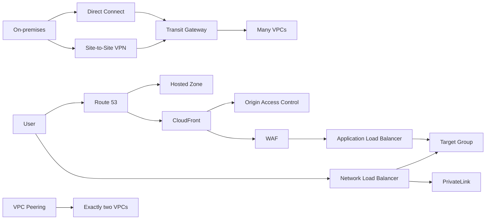

| Concept | Definition |
| --- | --- |
| **Application Load Balancer** | layer 7 balancing that understands HTTP, routing on host, path, header and method |
| **Network Load Balancer** | layer 4 balancing at very high throughput, with a static address per Availability Zone |
| **Target Group** | the registered set of instances, addresses or functions a listener forwards to, plus the health check over them |
| **Route 53** | authoritative DNS with health checks and latency-, geography- and weight-based answers |
| **Hosted Zone** | the container for one domain's records, either public or private to a named set of VPCs |
| **CloudFront** | the CDN that terminates TLS at Edge Locations and caches or accelerates the path back to an origin |
| **Origin Access Control** | the signature that lets only CloudFront read an otherwise private bucket |
| **WAF** | rule-based request filtering in front of an edge distribution, load balancer or API |
| **Transit Gateway** | a regional hub routing between many VPCs and on-premises links, replacing a mesh of point-to-point links |
| **VPC Peering** | a one-to-one, non-transitive route between two VPCs: cheapest, and does not scale past a handful |
| **Direct Connect** | a dedicated private circuit into AWS, bought for consistent latency rather than for privacy |
| **Site-to-Site VPN** | an IPsec tunnel to your own data centre over the public internet, and the quick thing to stand up |

### VPC, Subnets and Routing — The Foundation Everything Else Sits In

A **VPC** (Virtual Private Cloud) is a private network you own inside one Region, defined by a **CIDR block** — a range of IP addresses written like `10.0.0.0/16`, where the number after the slash says how big the range is (a `/16` holds 65,536 addresses, a `/24` holds 256). Nothing outside can reach a VPC unless you connect it to something.

- **Entry point:** the **CIDR block**, then **subnets** (smaller ranges cut out of it, each pinned to one Availability Zone), then **route tables** (the rules that say where traffic leaving a subnet goes). There is no "public subnet" checkbox. A subnet is public *because* its route table sends `0.0.0.0/0` — meaning "everything not matched by a more specific rule" — to an **Internet Gateway**, the VPC's door to the internet. A subnet whose route table has no such rule is private.
- **Use it when:** always — nearly every service in the Compute and Storage sections sits inside a VPC. The design question is not whether to have one but how to divide it. The usual pattern is a public subnet per AZ for load balancers, and a private subnet per AZ for everything else.
- **Private egress:** servers in a private subnet often still need to reach *out* to the internet — to download packages, or to call a third-party API. A **NAT Gateway** (network address translation) sits in a public subnet and forwards their outbound traffic while blocking anything inbound. Put one in each AZ, so that losing one AZ does not cut off the others. For IPv6 the equivalent is the **egress-only Internet Gateway**.
- **Trap:** NAT Gateway is billed per hour *and* per gigabyte processed, and it is a common source of unexpected cost — often because traffic to AWS's own services is going through it. Traffic to S3, ECR and DynamoDB should go through [VPC endpoints](#privatelink-and-vpc-endpoints--reaching-aws-services-privately) instead.

### Security Groups vs. Network ACLs — The Two Firewalls

A VPC has two layers of firewall, and beginners mix them up. A **security group** is attached to the network interface of one instance, task or endpoint. A **network ACL** (access control list) is attached to a whole subnet.

| Aspect | Security Group | Network ACL |
| --- | --- | --- |
| **Attaches to** | An ENI (an instance, a task, an endpoint) | A subnet |
| **State** | **Stateful** — if a request is allowed in, its reply is allowed out automatically | **Stateless** — you must write a rule for the return traffic too |
| **Rules** | Allow only; anything not allowed is denied | Allow **and** deny, checked in number order, first match wins |
| **Default** | Deny all inbound, allow all outbound | Allow all in both directions |

- **Entry point:** the idiomatic AWS pattern is **a security group that references another security group**: `sg-database` allows port 5432 *from anything in `sg-app`*, not from an IP range. Instances come and go and their IP addresses change, but they keep their security group, so the rule keeps working as the application scales.
- **Use NACLs for:** coarse, subnet-wide blocks — for example, denying a known-bad IP range outright. Using NACLs for ordinary application access control is a sign that the design is working against the platform; security groups are the tool for that.
- **Trap:** the stateless part. A network ACL that allows inbound port 443 but forgets to allow the outbound **ephemeral ports** (the high-numbered ports a reply is sent from, 1024–65535) blocks every reply, and connections appear to hang.

### Elastic Load Balancing — ALB, NLB and GWLB

A **load balancer** is the single address that clients connect to. It spreads the incoming connections across many copies of your application and stops sending to copies that fail a health check. AWS has three, distinguished by which layer of the network stack they understand.

- **Entry point:** a **listener** (a port and protocol to accept, such as HTTPS on 443) → **rules** (which requests go where) → a **target group** (a set of instances, IP addresses or Lambda functions, with a health check). The target group, not the load balancer itself, is where health checking and **draining** (letting in-flight requests finish before a target is removed) actually happen.
- **Use it when:** there is more than one copy of anything that receives traffic — which in production is always.

| Load balancer | Layer | Use it for |
| --- | --- | --- |
| **ALB** (Application) | 7 (HTTP) — it reads each request | Routing by path or hostname, splitting traffic by weight between target groups for canary releases, authenticating users at the edge with OIDC, and WebSockets |
| **NLB** (Network) | 4 (TCP/UDP) — it forwards connections without reading them | Very high throughput, a fixed IP address per AZ, protocols other than HTTP, and keeping the client's source IP visible to the application |
| **GWLB** (Gateway) | 3 (IP, over the GENEVE tunnelling protocol) | Inserting third-party firewall or inspection appliances transparently into the traffic path |

- **Trap:** health checks that are too strict or too slow. A health check path that requires the database to be up marks every instance unhealthy during a short database outage and takes the whole service down; a long interval delays removing a broken instance. Check something cheap that proves the process is serving, and tune the interval and thresholds.

### CloudFront — The Global Edge

CloudFront is a **CDN** (content delivery network): it keeps copies of your content at hundreds of **edge locations** around the world, so users get responses from a location near them instead of from your Region. It is also the first thing a user's connection reaches, which makes it the natural place for TLS (the encryption behind `https`), the **WAF** (web application firewall) and protection against **DDoS** attacks (flooding a site with traffic) — all of it handled before anything reaches your servers.

- **Entry point:** a **distribution** with one or more **origins** — the places it fetches from: an S3 bucket (through **OAC**, Origin Access Control, so that the bucket itself stays private), an ALB, or any HTTP server — and **cache behaviours** that map URL path patterns to origins and say how long to keep each response.
- **Use it when:** users are spread out geographically, you serve static files, or you want one place to attach TLS, WAF rules and rate limits.
- **Edge compute:** two ways to run code at the edge. **CloudFront Functions** are tiny JavaScript functions that run in under a millisecond on the viewer's request or response — header rewrites and redirects. **Lambda@Edge** is a full Lambda runtime that can also run on the origin side, heavier and more capable.
- **Trap:** an ACM (AWS Certificate Manager) certificate used by CloudFront **must live in the `us-east-1` Region**, no matter where everything else is, because CloudFront is a global service managed from there.

### Route 53 — DNS and Health Checking

**DNS** turns a name (`api.example.com`) into an address. Route 53 is AWS's DNS service, and it can also decide *which* address to answer with, based on where the user is, what is healthy, or a percentage you set.

- **Entry point:** a **hosted zone** — a container for the DNS records of one domain — either **public** (answers queries from the whole internet) or **private** (answers only inside the VPCs you associate with it, for internal names like `db.internal`).
- **Use it when:** you own a domain and want its records next to the infrastructure they point to, or you need routing decisions that a plain DNS host cannot make.
- **Routing policies:** simple (one answer), **weighted** (split traffic by percentage — canary and blue-green releases), **latency** (send each user to the Region that answers fastest for them), **failover** (a primary and a standby, switched by a health check), geolocation, geoproximity, IP-based and multivalue.
- **Alias records:** a Route 53 record type that points at an AWS resource — a load balancer, a CloudFront distribution, an S3 website. Alias queries are free, and they work at the **zone apex**: the bare domain, `example.com` with nothing in front. Standard DNS forbids a CNAME at the apex, and a load balancer has no fixed IP address to put in an A record, so without alias records a bare domain could not point at an ALB.

### Transit Gateway, VPC Peering and Cloud WAN — Connecting VPCs

Companies end up with many VPCs — one per account, per team, per environment — and eventually two of them need to talk. There are three ways to connect them, from the simplest to the most capable.

- **VPC Peering:** a direct one-to-one link between two VPCs. Cheap, with no bandwidth bottleneck, but **non-transitive**: if A is peered with B and B with C, A still cannot reach C. That is fine for a handful of VPCs, but connecting every VPC to every other needs *n(n−1)/2* peerings — 45 for ten VPCs — which is why it stops scaling.
- **Transit Gateway (TGW):** a regional hub. Every VPC, VPN connection and Direct Connect link becomes an **attachment**, and **TGW route tables** decide which attachments can reach which. This is how you build hub-and-spoke networks with a central inspection point, and it is transitive. Billed per attachment-hour plus per gigabyte.
- **Cloud WAN:** a policy-driven global layer that creates and manages Transit Gateways and the links between Regions for you, for estates that genuinely span many Regions.
- **Use them when:** peering for two or three VPCs that will stay that way; Transit Gateway as soon as there is a hub, a shared-services VPC, or an on-premises connection to share.
- **Trap, for all three:** overlapping address ranges. Nothing can route between two VPCs that both use `10.0.0.0/16`, because a packet to `10.0.1.5` could mean either. Plan address space centrally with **VPC IPAM** (IP address manager) from the start; fixing an overlap later means re-addressing a whole network.

### Direct Connect and Site-to-Site VPN — Reaching On-Prem

Two ways to connect your own data centre or office to a VPC.

- **Site-to-Site VPN:** encrypted IPsec tunnels over the public internet. Live in minutes, but throughput and delay follow whatever the internet is doing that day.
- **Direct Connect (DX):** a dedicated private cable into an AWS facility, arranged through a network provider. Consistent latency and a lower per-gigabyte transfer price, with a **lead time measured in weeks** and a monthly port fee.
- **Use them when:** VPN for small or temporary needs, and as a backup; Direct Connect when a steady, large or latency-sensitive flow justifies the wait and the fee.
- **The standard pattern:** Direct Connect as the primary path, with a VPN as the automatic backup that takes over when the circuit fails.

### PrivateLink and VPC Endpoints — Reaching AWS Services Privately

S3, DynamoDB, ECR and the other AWS services have public internet endpoints. By default, a server in a private subnet reaches them through the NAT Gateway and the public internet, even though both ends are inside AWS. **VPC endpoints** give the service a private entrance inside your VPC instead, so that traffic never leaves the AWS network and never touches the NAT Gateway.

- **Gateway endpoints:** available for **S3 and DynamoDB only**. They are a single line in a route table, and they are **free**. There is no good reason for a VPC not to have both.
- **Interface endpoints:** an **ENI with a private IP address in your subnet** that represents one service — ECR, Systems Manager, Secrets Manager, KMS and many others. Billed per hour per AZ plus per gigabyte, which is still usually cheaper than sending the same traffic through the NAT Gateway.
- **PrivateLink** (endpoint services): the same mechanism in the other direction, so that *you* can publish a service. You put your service behind an NLB and expose it as an endpoint service; other VPCs and other accounts create an interface endpoint to it in their own network. No peering, no shared routes, and overlapping address ranges stop mattering. This is how software vendors deliver a service privately to customers on AWS.
- **Use them when:** whenever private subnets talk to AWS services — gateway endpoints always, interface endpoints wherever the NAT bill or a compliance rule says traffic must stay private — and PrivateLink whenever you offer a service to another account without opening a network path.

## Storage and Data

There is no single "storage" in AWS. Each service is built for one shape of data and one way of reading it, and the price and behaviour differ by orders of magnitude. So the first question is always *what does the data look like, and how will it be read?* — not *which service is best?*

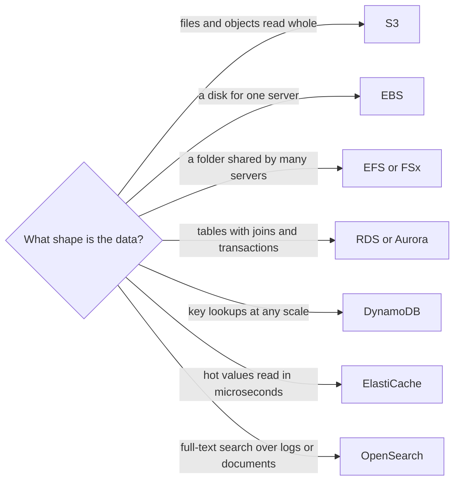

### Concepts — Storage

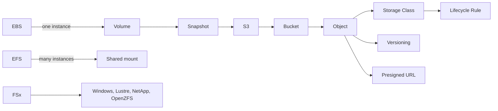

| Concept | Definition |
| --- | --- |
| **S3** | object storage addressed by key, with very high durability and no filesystem underneath |
| **Bucket** | the named, Region-bound namespace objects live in, and the level policy and encryption are set at |
| **Storage Class** | the price and access tier of an object, from instant retrieval down to hours-long archival restore |
| **Lifecycle Rule** | the age-based policy that moves an object between Storage Classes or deletes it outright |
| **Versioning** | keeping every overwrite and delete as a separate copy, where a delete becomes a marker rather than a loss |
| **Presigned URL** | a time-limited link carrying its maker's signature, so a browser can upload or download with no credentials |
| **EBS** | a network block volume attached to one instance at a time and surviving a stop and start |
| **Snapshot** | an incremental copy of a volume held in S3, and the unit of both backup and cloning |
| **EFS** | an elastic NFS filesystem many instances mount at once, priced on what is stored rather than provisioned |
| **FSx** | managed Windows, Lustre, NetApp or OpenZFS filesystems, for workloads that need those protocols specifically |

### Concepts — Data Stores

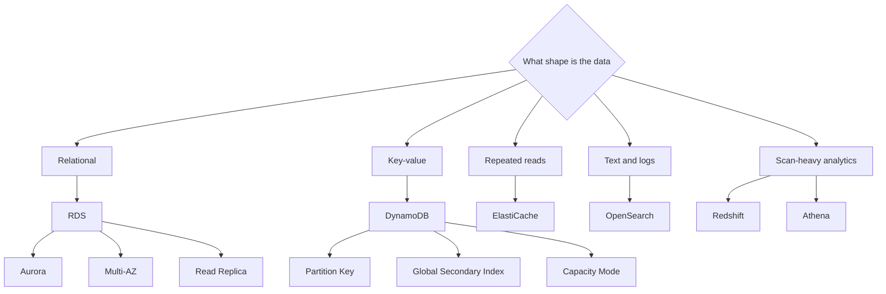

| Concept | Definition |
| --- | --- |
| **RDS** | managed relational engines where patching, backup and failover are handled but the schema is still yours |
| **Multi-AZ** | a standby in another Availability Zone that takes over on failure; availability, and not read capacity |
| **Read Replica** | an asynchronous copy serving reads and promotable to primary, always some lag behind |
| **Aurora** | a cloud-native engine separating compute from a shared, six-way replicated storage layer |
| **DynamoDB** | a key-value store with flat latency at any size, if the access pattern is known before the table is designed |
| **Partition Key** | the attribute deciding which partition an item lands in, and therefore where a hot spot will appear |
| **Global Secondary Index** | a second key layout over the same items, with its own capacity and eventually consistent reads |
| **Capacity Mode** | the billing dial on a table: per request, or a rate you provision and scale yourself |
| **ElastiCache** | managed Redis or Memcached, for the reads a database should never have to serve twice |
| **OpenSearch** | managed search and log analytics; a query engine rather than a system of record |
| **Redshift** | a columnar warehouse for scan-heavy analytics over data too large to query where it lies |
| **Athena** | SQL over files in S3 with no cluster to run, billed per byte scanned |

### S3 — Object Storage

S3 (Simple Storage Service) stores **objects** — files of any kind, from a few bytes to terabytes — and returns them whole when asked. It is not a file system: there are no directories, no editing part of a file in place, and no mounting it like a disk. It is a flat store where each object has a **key** (its full name) and lives in a **bucket** whose name is unique across all of AWS. It is also the cheapest and most durable place to put data in AWS, and nearly every other service reads from it or writes to it.

- **Entry point:** a **bucket** plus a **key** such as `invoices/2026/03/inv-001.pdf`. The slashes make keys *look* like folders in the console, but they are only characters in the name. They matter for one thing: request throughput is partitioned by **prefix** (the beginning of the key), so spreading keys across many prefixes raises the ceiling on requests per second.
- **Use it when:** data is written once and read many times as a whole — uploads, backups, logs, static websites, data-lake files, build artifacts.
- **Storage classes:** how fast and how often you need an object decides how much you pay to store it. **Standard** for frequently read data → **Standard-IA** and **One Zone-IA** ("infrequent access": cheaper per GB stored, a fee per GB retrieved, a minimum storage duration) → **Glacier Instant, Flexible and Deep Archive** (progressively cheaper, with retrieval taking minutes to hours for the deeper tiers). **Intelligent-Tiering** watches how each object is used and moves it between classes automatically for a small monthly monitoring fee; it is the low-risk default when you do not know the access pattern.
- **Durability and control:** **versioning** keeps every previous version of an object, so that an overwrite or a delete can be undone (**MFA delete** additionally requires a second authentication factor to remove versions). **Object Lock** makes objects unchangeable for a set period — WORM, "write once, read many" — for audit logs and legal retention. **Lifecycle policies** move objects between classes and delete them on a schedule, including old *versions*, which people forget until they see the bill for storing every version of everything.
- **Access:** **Block Public Access** is switched on by default at the account level and overrides every setting beneath it, so that a bucket cannot be made public by accident. Grant access with **bucket policies** and IAM. Bucket **ACLs**, an older mechanism, are disabled by default now (`Bucket owner enforced`) and should stay that way.
- **Read consistency:** reads have been **strongly consistent** since December 2020 — after a write completes, every read returns the new object. Older guidance describing "eventual consistency" and stale reads is out of date.

### EBS — Block Storage for One Instance

EBS (Elastic Block Store) provides **volumes**: virtual hard disks that you attach to an EC2 instance and format like any disk. They are in fact network storage, replicated within one AZ, which is why they survive the instance being stopped.

- **Entry point:** a **volume** in one specific AZ, attached to one instance (the high-end `io2` type allows attaching to several). Because it is AZ-bound, moving a volume to another AZ means taking a **snapshot** and creating a new volume from it there.
- **Use it when:** an operating system disk, a database's data directory, or any software that expects a local disk.
- **gp3 vs. gp2:** the general-purpose types. In `gp2`, **IOPS** (input/output operations per second — how many reads and writes the disk can do) were tied to volume size, so people bought bigger disks than they needed to get performance. **`gp3` decouples them**: every volume gets a baseline of 3,000 IOPS and 125 MB/s regardless of size, and you can raise either number independently of capacity. Changing a volume from gp2 to gp3 is a live modification with no downtime and a lower price; there is rarely a reason not to.
- **io2 / io2 Block Express:** for databases that need sustained high IOPS and higher durability than gp3 offers.
- **Snapshots** are point-in-time copies stored in S3. They are incremental (only the blocks changed since the last snapshot are stored) and *regional* rather than AZ-bound, which makes them the standard way to move a disk between AZs or Regions and to back it up.

### EFS and FSx — Shared Filesystems

Sometimes many machines need to read and write the *same* files at the same time — an uploads folder shared by a fleet of web servers, home directories, a build cache. A disk (EBS) attaches to one machine, and an object store (S3) is not a file system, so AWS offers managed network file systems for this case.

- **EFS (Elastic File System):** managed **NFS**, the standard Linux network file protocol. It spans multiple AZs, grows and shrinks automatically as you add and remove files, and can be mounted by many instances or containers at once. Use it when things genuinely need shared **POSIX** read-write — the ordinary Linux file semantics of permissions, locks and directories. Lifecycle policies move files that have not been read for a while to a cheaper infrequent-access class.
- **FSx:** managed versions of *third-party* file systems, for when the software expects a specific one — **FSx for Windows File Server** (SMB, the Windows file protocol, joined to Active Directory), **FSx for Lustre** (a high-performance file system for HPC and machine learning, which can present an S3 bucket as a file system), **FSx for NetApp ONTAP** and **FSx for OpenZFS**.
- **Use them when:** existing software insists on a shared file system, or many processes need to work on the same files.
- **Caveat:** shared file systems are often a compromise made when moving an existing system into the cloud without changing it. Applications built for the cloud usually keep files in S3 and state in a database instead, because both scale further and cost less.

### RDS and Aurora — Managed Relational Databases

A **relational database** stores data in tables with a schema, and is queried with SQL. RDS (Relational Database Service) runs one for you: it installs the database engine, takes backups, applies patches and handles failover, while your code keeps using the same Postgres or MySQL it already speaks. Aurora is AWS's own re-engineered version of Postgres and MySQL with a different storage layer underneath.

- **Entry point:** RDS gives you a **DB instance** — one server running stock Postgres, MySQL, SQL Server, Oracle or MariaDB, in a size you choose. Aurora gives you a **DB cluster**: AWS's own storage engine keeps six copies of the data across three AZs, and one or more compute nodes share that storage.
- **Use it when:** the data has relationships, needs transactions, or is queried in ways you cannot predict in advance. This is the default for most application data.
- **Availability vs. scale — two features that look alike:** **Multi-AZ** is about *availability*. It keeps a synchronised standby copy in another AZ that serves **no traffic** at all; if the primary fails, RDS switches to it automatically, typically within a minute or two. (The *Multi-AZ cluster* variant is the exception, with two standbys that can also serve reads.) **Read replicas** are about *scale*. They copy data asynchronously — so they lag slightly behind — and can serve read queries, but promoting one to primary after a failure is a manual step. The two solve different problems, and neither replaces the other.
- **Aurora specifics:** storage grows automatically without you provisioning it; read replicas share the same storage volume rather than copying it, so failover to one takes seconds rather than minutes; **Serverless v2** scales the compute up and down in **ACUs** (Aurora Capacity Units) without swapping instances; and **Global Database** replicates to other Regions for disaster recovery.
- **RDS Proxy:** a connection pool between your application and the database. It keeps a small number of real connections open and shares them among many clients, and it is the standard fix when Lambda concurrency overwhelms Postgres's connection limit. **Performance Insights** is the companion for finding which queries are actually slow before resizing anything.
- **Trap:** treating a read replica as a backup or as a standby. It is neither: a bad write is replicated to it within seconds, and it does not take over automatically. Backups come from automated snapshots and **point-in-time recovery**; failover comes from Multi-AZ.

### DynamoDB — Managed Key-Value at Any Scale

DynamoDB is a **NoSQL** database: it stores items (JSON-like documents) and finds them by key, and it promises the same single-digit-millisecond response whether the table holds a thousand items or a hundred billion. The price of that promise is that you must know your queries in advance — there is no SQL, no joins, and no ad-hoc queries across the whole table.

- **Entry point:** a **table** and its **partition key** (the attribute that decides which storage partition holds the item, and the only attribute you can look up by directly), optionally plus a **sort key** (which orders items within one partition key and lets you fetch a range of them). The order of work is inverted from SQL: you list every way the application will read the data *first*, then design the keys to serve those reads. There is no "add a JOIN later".
- **Use it when:** the access patterns are known and simple — look up by id, list a user's orders newest first — and the scale or the latency requirement is beyond what a relational database handles comfortably. Session stores, shopping carts, user profiles, event logs.
- **Indexes:** a **GSI** (global secondary index) is a copy of the table with a different partition key, so that you can look items up a second way. It has its own capacity, is eventually consistent (it lags a moment behind the table), and can be added or removed at any time. An **LSI** (local secondary index) keeps the same partition key with a different sort key, must be created *with the table*, and caps the items sharing one partition key at 10 GB.
- **Capacity:** **on-demand** (pay per request, absorbs spikes without planning) vs. **provisioned** (you declare reads and writes per second, optionally with autoscaling; cheaper at steady, predictable load).
- **Extras:** **DAX** (an in-memory cache in front of the table, for microsecond reads); **Streams** (a feed of every change to the table, usually consumed by Lambda — the pattern called change data capture); **TTL** (a timestamp attribute after which items expire and are deleted at no cost); and **global tables** for active-active replication across Regions.
- **Trap:** a **hot partition**. Throughput is divided across partitions by key, so a key that many items share — `status#PENDING`, today's date — sends all its traffic to one partition, which throttles while the rest of the table sits idle. Choose partition keys with many distinct values and even traffic across them.

### ElastiCache and OpenSearch — The Supporting Data Stores

Two services that sit next to the main database rather than replacing it.

- **ElastiCache:** a managed in-memory store — **Redis**, its open-source fork **Valkey**, or Memcached — for data that must be read in microseconds and can be rebuilt if lost. The entry point is a **cluster endpoint**; *cluster mode disabled* means one shard with replica copies, *enabled* means data split across many shards. **Valkey** is the cheaper default since the fork; the fork, and the 2024 relicensing that caused it, are explained in [Redis — Core Concepts and Workflow](../03-system-design/03-caching.md#redis--core-concepts-and-workflow). Used for **cache-aside** (check the cache first, then the database, then fill the cache), session storage, rate limiting and distributed locks.
- **OpenSearch:** managed full-text search and log analytics, the open-source fork of Elasticsearch. The entry point is a **domain** (a cluster you size) or a **serverless collection** (sized for you). Use it when CloudWatch Logs Insights is no longer enough — search across text fields, dashboards over logs, and retention measured in years.
- **Use them when:** ElastiCache when the same values are read far more often than they change and the database is the bottleneck; OpenSearch when users search text, or when operators need to slice logs in ways CloudWatch cannot.

## Messaging and Events

When one part of a system calls another directly, the two are tied together: if the receiver is slow or down, the caller waits or fails. Messaging services put a middle layer between them. The sender hands a message to the service and moves on; the receiver picks it up when it is ready. This is called **decoupling**, and it is how systems absorb bursts, survive partial failures and let teams deploy independently.

AWS has four messaging services because there are four different patterns: SQS **buffers** work in a queue for one consumer, SNS **fans out** one message to many subscribers, EventBridge **routes** events by looking at their content, and Kinesis and MSK keep a **replayable log** that many consumers read at their own pace.

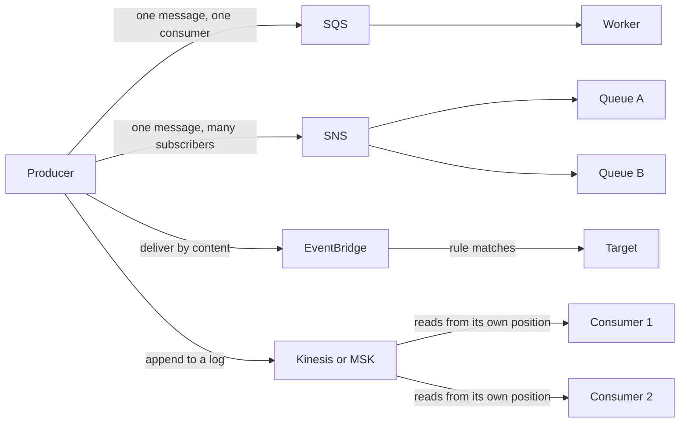

### Concepts — Messaging and Events

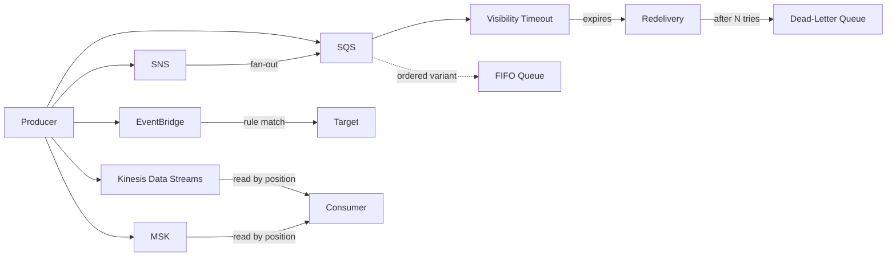

| Concept | Definition |
| --- | --- |
| **SQS** | a durable queue decoupling a producer from a consumer that may be slower, or absent |
| **Visibility Timeout** | the window during which a received message is hidden from other consumers, after which it reappears |
| **Dead-Letter Queue** | where a message lands after failing delivery a set number of times, so one bad message stops blocking the rest |
| **FIFO Queue** | ordering and exactly-once processing within a message group, bought at the cost of throughput |
| **SNS** | publish-and-subscribe fan-out, delivering one message to many independent subscribers |
| **EventBridge** | a router matching events against content-based rules and delivering them to targets, with a schema registry |
| **Kinesis Data Streams** | an ordered, replayable log sharded by key and read by position rather than consumed |
| **MSK** | managed Apache Kafka, for teams that need the Kafka ecosystem and not only the semantics |

### SQS — The Buffer

SQS (Simple Queue Service) is a **queue**: producers put messages in, and consumers take them out, roughly in the order they arrived. Each message is processed by one consumer and then deleted. If the consumers are slow, the queue simply grows; if they are down, messages wait, for up to 14 days.

- **Entry point:** a **queue URL**, a **visibility timeout** and a **dead-letter queue**. The visibility timeout is the period a message is hidden from other consumers after one has received it; it must be longer than your handler takes to run, or the message reappears and is processed twice. The dead-letter queue, with a `maxReceiveCount`, is where a message goes after failing that many times, so that one bad message cannot block the queue forever. Consumers **pull** messages by polling; use **long polling** (wait up to 20 seconds for a message to arrive) to cut cost and empty responses.
- **Use it when:** work can be done a little later, by a pool of workers, at whatever rate they manage — image processing, sending emails, anything triggered by a user action that the user does not need to wait for.
- **Standard vs. FIFO:** a **Standard** queue delivers each message *at least once*, in roughly but not strictly the order sent, with effectively unlimited throughput; your consumer must tolerate the occasional duplicate. A **FIFO** queue delivers in strict order *within a message group ID* and removes duplicates, giving exactly-once processing **within the 5-minute deduplication interval**. FIFO's base throughput limits are far lower than Standard's; **high-throughput mode** raises them substantially.
- **Trap:** the visibility timeout. Set it shorter than the processing time and every slow message is processed twice; set it far longer and a crashed consumer leaves the message invisible for all that time before another consumer can take it. Match it to the real processing time, and make consumers **idempotent** — safe to run twice — because Standard queues will occasionally deliver twice regardless.

### SNS — The Fan-Out

SNS (Simple Notification Service) delivers one message to every **subscriber** of a **topic** at once. Where SQS holds a message until one consumer takes it, SNS pushes a copy to each subscriber immediately and keeps nothing.

- **Entry point:** a **topic**, then **subscriptions** — SQS queues, Lambda functions, HTTPS endpoints, email addresses, SMS numbers or mobile push. **Push**-based, with millisecond delivery.
- **Use it when:** several independent things need to know about the same event — an order was placed, so billing, the warehouse and analytics each need a copy.
- **The standard pattern:** **SNS → one SQS queue per consumer.** Each consumer then has its own buffer, its own retry policy and its own dead-letter queue, and one slow consumer cannot affect the others. Subscribing Lambda functions straight to SNS gives you none of that: there is no buffer between them, and a burst of messages becomes a burst of invocations.

### EventBridge — The Router

EventBridge receives **events** — small JSON documents saying that something happened — and delivers each one to the targets whose **rules** match its content. Where SNS asks "who subscribed to this topic?", EventBridge asks "which rules match this event's fields?", so a rule can say "orders over 1,000 from the EU" without the producer having to create a topic for that case.

- **Entry point:** an **event bus**. Every account has a **default bus** that already carries events generated by AWS services themselves — "an EC2 instance entered `stopping`", "a Config rule went non-compliant", "a pipeline stage failed" — which makes EventBridge *the* way to react to things happening in your infrastructure. **Rules** match on event *content*, not only a topic name, and send matches to **targets**: Lambda functions, Step Functions, SQS queues, other buses, and many more.
- **Also included:** **Scheduler** (cron and rate schedules at any scale — the modern replacement for CloudWatch Events rules) and **Pipes** (a point-to-point connection from one source, through an optional filter and enrichment step, to one target, without writing glue code).
- **Use it when:** routing decisions depend on what is *in* the event, when you want to react to AWS's own events, when events cross account boundaries, or when you need to archive and replay events later.
- **vs. SNS:** richer routing, a schema registry, cross-account buses, archive and replay — at somewhat higher latency and lower throughput. Choose EventBridge for *routing logic*, SNS for *raw fan-out speed*.

### Kinesis Data Streams and MSK — The Log

A **log** in this sense is an ordered, append-only record of events that is kept for a period, not deleted on read. Consumers read from a position of their choosing and remember where they got to, so several of them can read the same data independently, and any of them can go back and read it again. That replay ability is the core difference from SQS, where an acknowledged message is gone.

- **Kinesis Data Streams:** an ordered, **replayable** stream of records split into **shards** (each shard is a unit of throughput and of ordering). Consumers track their own position and can rewind, retention is configurable up to 365 days, and many independent consumers can read the same stream. **Firehose** is the no-code companion that continuously delivers a stream into S3, OpenSearch or Redshift.
- **MSK (Managed Streaming for Apache Kafka):** managed **Apache Kafka**, the open-source standard for this pattern. Use it when you need the Kafka *protocol* and ecosystem — Kafka Connect connectors, Kafka Streams, existing tooling — rather than only a stream. **MSK Serverless** removes the job of sizing brokers.
- **Use them when:** clickstreams, metrics, sensor data and change feeds — anything with many events per second that several systems need to process, or that you may need to process again after fixing a bug.
- **Trap:** ordering is per shard (Kinesis) or per partition (Kafka), and so is throughput. Records with the same partition key land on the same shard, so — exactly as with DynamoDB — a key with uneven traffic creates a hot shard that throttles while the others sit idle.

## Identity, Encryption and Secrets

Every call to AWS — from a person, a pipeline or a running program — is checked by IAM before it does anything. The questions are always the same: *who is asking*, *what are they allowed to do*, and *how did they prove who they are* without a password stored somewhere it can be stolen. The services in this section answer those three questions for people, for CI/CD pipelines and for code running on AWS, and end with the key and secret services that decide who may decrypt what.

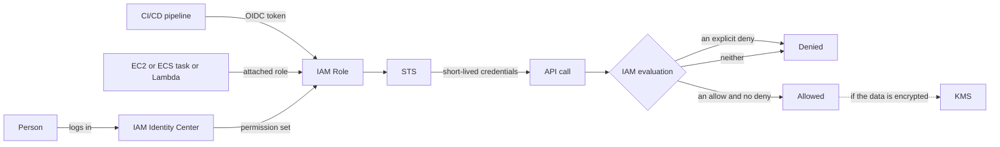

### Concepts — Identity and Access

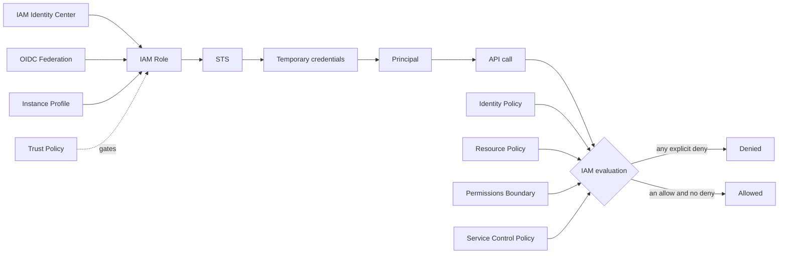

| Concept | Definition |
| --- | --- |
| **IAM** | the policy engine every AWS API call passes through; deny by default, and an explicit deny always wins |
| **Principal** | the identity a request is made as — a user, a role session, or an AWS Service acting on your behalf |
| **IAM Policy** | a JSON document of effect, action, resource and condition statements, evaluated together for each request |
| **Identity Policy** | a policy attached to a Principal, saying what that Principal may do |
| **Resource Policy** | a policy attached to the Resource itself, saying who may touch it; how cross-Account access is granted |
| **IAM Role** | a set of permissions with no credentials of its own, assumed to get short-lived keys |
| **Trust Policy** | the document on an IAM Role naming who is allowed to assume it |
| **STS** | the Service that mints the temporary credentials an assumed IAM Role hands back |
| **Instance Profile** | the wrapper that delivers an IAM Role to a running EC2 instance |
| **IAM Identity Center** | the front door humans log in through: one directory, with permission sets projected into many Accounts |
| **OIDC Federation** | trusting an external token issuer so a pipeline can assume an IAM Role with no stored key |
| **Permissions Boundary** | a ceiling that caps what an Identity Policy can grant, so role creation can be delegated safely |

### Concepts — Encryption and Secrets

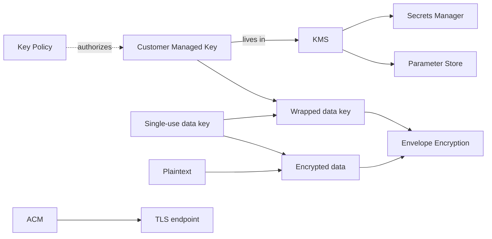

| Concept | Definition |
| --- | --- |
| **KMS** | the managed key Service: keys that never leave it, and every use recorded |
| **Customer Managed Key** | a KMS key you create, write the policy for, and rotate on your own schedule |
| **Envelope Encryption** | encrypting data with a single-use data key, then encrypting that data key with a long-lived one |
| **Key Policy** | the Resource Policy on a key, and the root of its access control rather than an addition to IAM |
| **Secrets Manager** | storage for credentials with built-in rotation and per-secret access control |
| **Parameter Store** | the Systems Manager hierarchy for configuration values, free at standard tier and encrypted on request |
| **ACM** | issues and auto-renews TLS certificates for AWS-managed endpoints, with the private key never exported |

### IAM — The Policy Engine Underneath Everything

IAM (Identity and Access Management) is the rules engine that decides, for every single API call, whether it is allowed. Rules are written as **policies**: JSON documents listing an *effect* (Allow or Deny), the *actions* (`s3:GetObject`), the *resources* (which bucket, by ARN) and optional *conditions* (only from this IP range, only with MFA). Policies attach to identities and to resources, and IAM evaluates all of them together.

- **Entry point:** the **policy evaluation logic**, which is the one thing to memorise: by default everything is denied; an **explicit `Allow`** in some applicable policy permits the call; an **explicit `Deny`** anywhere overrides every Allow. For a call across accounts, *both* the caller's identity policy and the target's resource policy must allow it.
- **Use it when:** always — there is no way around IAM. The skill is writing policies that grant exactly what a program needs (**least privilege**) rather than `*` on everything because it was quicker. **IAM Access Analyzer** finds unused permissions and resources reachable from outside the account, which is where a least-privilege clean-up starts.
- **Policy types:** **identity-based** (attached to a role, user or group: "this identity may do these things"); **resource-based** (attached to the bucket, queue or key: "these identities may touch me" — the way another account is let in); **permission boundaries** (a ceiling on what a role *can* be granted, so that a team allowed to create roles cannot create one more powerful than themselves); and **SCPs** (service control policies, applied by AWS Organizations to whole accounts, which never grant anything).
- **A role has two policies:** the **trust policy** says *who may assume me* — which accounts, services or identity providers — and the **permissions policy** says *what I can do once assumed*. Almost every "access denied and I cannot see why" turns out to be a trust policy that does not name the caller.
- **Trap:** IAM users with long-lived **access keys**. They were the original way to give a program credentials, and keys leaked in code repositories remain the most common cause of compromised accounts. Every section below exists to replace them with short-lived credentials that expire on their own.

### IAM Roles in Practice — The Compute-to-AWS Bridge

How does code running on AWS get permission to call AWS? Not with a stored password. Each compute service can be given an **IAM role**, and AWS hands the running code temporary credentials for that role — rotated automatically, expiring within hours, never written to disk. This is AWS's version of what other clouds call a managed identity.

- **Entry point per compute type:** an **instance profile** for EC2 (the wrapper that attaches a role to an instance), the **task role** for ECS, **IRSA or Pod Identity** for EKS pods, and the **execution role** for Lambda. Your code does not need to know any of this: the AWS SDK's **credential provider chain** looks in the standard places in order — environment variables, a config file, then the compute service's own credentials endpoint — and finds the temporary credentials automatically.
- **Use it when:** any code on AWS needs to call AWS. If you find yourself pasting an access key into an environment variable on an EC2 instance, a role is what you should have used.
- **On EC2:** the credentials are served by the **instance metadata service**, a special address (`169.254.169.254`) that only the instance itself can reach. Enforce **IMDSv2**, which requires a session token obtained with a PUT request first. The original IMDSv1 answered a plain GET, which is exactly what an **SSRF** bug (server-side request forgery — tricking your web server into fetching a URL of the attacker's choosing) can produce; IMDSv1 is how such bugs turned into stolen cloud credentials.
- **Trap:** granting the role more than the code needs, to be safe. Every process on that instance or in that task now has those permissions, and so does anyone who compromises it.

### IAM Identity Center — How Humans Log In

Formerly called AWS SSO. This is how *people* should get into AWS: through one login, tied to the company directory, producing temporary credentials — instead of each person having an IAM user and an access key in every account.

- **Entry point:** connect an **identity source** — the built-in directory, or an existing one such as Microsoft Entra ID or Okta, connected through **SAML** (the enterprise single-sign-on standard) for login and **SCIM** (a provisioning standard) so that users and groups are created and removed automatically. Then define **permission sets** (reusable bundles of policies such as "read-only" or "developer") and **assign** each combination of `group × account × permission set`.
- **Use it when:** more than one person needs access to more than one account — which is every company.
- **Result:** `aws sso login` in the terminal opens a browser login and returns short-lived credentials; one web portal lists every account and role the person may use; and when HR removes the person from the directory, their access to every account disappears with them.

### OIDC Federation for CI/CD — Keyless Pipelines

A deployment pipeline (GitHub Actions, GitLab CI) needs to call AWS to deploy. The old way was to create an IAM user, generate an access key and paste it into the CI system's secrets — a long-lived credential that anyone with access to the CI settings could copy. **OIDC federation** replaces it: the CI provider signs a short-lived token that says which repository and branch is running, and AWS exchanges that token for temporary credentials.

- **Entry point:** register the CI provider once as an **identity provider** in IAM (`token.actions.githubusercontent.com` for GitHub Actions). Then create a role whose **trust policy conditions on the token's `sub` claim** — the field that identifies the repository and the branch or environment — so that only `my-org/my-repo` on `main` can assume it. The pipeline calls `AssumeRoleWithWebIdentity` with its token and receives credentials valid for the length of the job.
- **Use it when:** any pipeline deploys to AWS. There is no scenario where a stored access key in CI is the better choice.
- **Why it matters:** it removes the entire category of leaked long-lived CI keys, and the credentials that remain are scoped to one repository and one branch. A trust policy with `repo:org/*:*` gives that back and is a finding in any review.

### STS — The Token Service

STS (Security Token Service) is the service that actually issues temporary credentials. Every mechanism above — roles on compute, Identity Center logins, OIDC pipelines — ends with a call to STS, which returns an access key, a secret key and a session token that expire together.

- **Entry point:** `AssumeRole` — give it a role ARN and get back credentials for that role. Its siblings are `AssumeRoleWithWebIdentity` (for OIDC tokens, used by CI pipelines and IRSA) and `AssumeRoleWithSAML` (for SAML logins).
- **Use it when:** directly, for cross-account access and for narrowing permissions for one task; indirectly, all the time, because everything else uses it.
- **Cross-account access:** the role lives in the *target* account and its trust policy names the *source* account; the caller in the source account needs `sts:AssumeRole` permission on that role's ARN. Both halves are required, and forgetting either one produces the same "access denied".
- **External ID:** when a third party — a monitoring vendor, a cost tool — needs to assume a role in your account, require an **external ID**: a shared secret the vendor must present with every assume call. It defends against the **confused deputy** problem, where an attacker with an account at the same vendor tricks the vendor's system into using its permission to assume *your* role.

### KMS — Key Management and Envelope Encryption

KMS (Key Management Service) holds encryption keys in hardware that never releases them, and performs encryption operations on request. Nearly every storage service's "encrypt at rest" checkbox is KMS underneath. The point of a managed key service is that a key is never written to a disk you control, and every use of it is logged and permission-checked.

- **Entry point:** a **customer-managed key (CMK)** and its **key policy**. Unlike most services, the *key policy is the root of trust*: an IAM policy granting `kms:Decrypt` does nothing unless the key policy also permits it, or explicitly delegates to IAM. This surprises people whose IAM permissions look complete but who still cannot decrypt.
- **Use it when:** data must be encrypted with a key *you* control, audit and can revoke — rather than an AWS-owned key you cannot see — and whenever a compliance rule says so.
- **Envelope encryption:** KMS keys never leave KMS, and one KMS call can encrypt only a few kilobytes, so nothing encrypts a terabyte disk directly with a KMS key. Instead, a service asks KMS for a **data key** (`GenerateDataKey`) and receives two copies: one in plain text and one encrypted under the KMS key. It encrypts the data locally with the plain-text key, stores the *encrypted* copy of the data key next to the data, and discards the plain-text copy. To read, it sends the encrypted data key back to KMS to be decrypted. That is how S3, EBS and RDS encrypt terabytes with a key that never leaves KMS.
- **Also:** **grants** (temporary programmatic permission to use a key, used by AWS services on your behalf); **automatic key rotation** (configurable from 90 to 2,560 days since 2024, where the period used to be fixed at the 365-day default); **multi-Region keys** for encrypting data that is replicated across Regions; and a mandatory **7–30 day waiting period** before a key is deleted — there is no immediate delete, by design, because deleting a key makes everything encrypted under it unreadable forever.
- **Trap:** deleting or disabling a key that something still uses. Snapshots, database backups and S3 objects encrypted with it become unreadable, and the waiting period is your only warning.

### Secrets Manager, Parameter Store and ACM

Both stores are defined in the table above. What decides between them: rotation and cross-account sharing are what you pay Secrets Manager for, per secret. Everything else fits in Parameter Store's free standard tier.

- **Injecting them:** the ECS task definition `secrets` block, Lambda extensions, and the External Secrets Operator on EKS. Never bake a secret into an AMI or a container image, and never leave one in an environment variable that is committed to Git.
- **ACM:** remember the `us-east-1` requirement for CloudFront — a certificate for a distribution must live in that Region whatever the origin does.

## Observability and Governance

Once a system is running you need to answer three questions about it: *is it healthy right now* (metrics, logs and traces), *who changed what* (an audit log of API calls), and *what did a resource look like on a given day* (a history of configuration). A fourth group of services manages the servers themselves and tells you where money is being wasted.

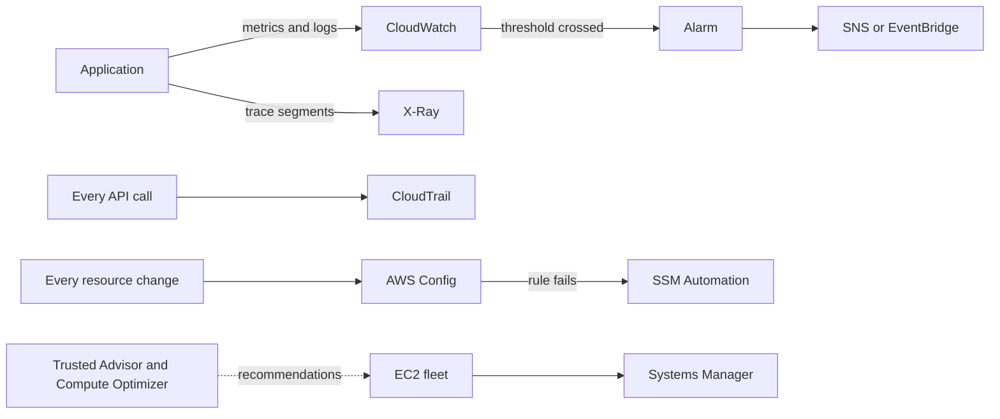

### Concepts — Observability and Governance

```mermaid
flowchart LR
  App --> Metric
  App --> LG[Log Group]
  App --> XRay[X-Ray]
  Metric --> CW[CloudWatch]
  LG --> CW
  CW --> Alarm
  Alarm --> Act[Notify, scale or roll back]
  Calls[Every API call] --> CT[CloudTrail]
  State[Resource configuration] --> Cfg[AWS Config]
  Cfg --> Compliance
  Fleet[Instance fleet] --> SSM[Systems Manager]
  SSM --> SessM[Session Manager]
  Account --> TA[Trusted Advisor]
  Design --> WA[Well-Architected Framework]
```

| Concept | Definition |
| --- | --- |
| **CloudWatch** | the metrics, logs and alarms Service that every AWS Service reports into without being asked |
| **Metric** | a named time series of measurements, with dimensions that make it selectable |
| **Alarm** | a rule over a Metric that changes state and acts when a threshold holds for a number of periods |
| **Log Group** | the retention and access boundary around one stream of log events; retention is forever until you set it |
| **CloudTrail** | the audit record of every API call — who made it, from where, and whether it was allowed |
| **AWS Config** | the configuration history of each Resource, plus rules that judge compliance across time |
| **X-Ray** | request tracing that stitches one call's path across services into a single timeline |
| **Systems Manager** | agent-based fleet operations: patching, inventory, remote commands and shell access without SSH |
| **Session Manager** | a shell onto an instance through that agent, needing no bastion host and no inbound port |
| **Trusted Advisor** | automated checks of an Account against cost, security, quota and resilience best practice |
| **Well-Architected Framework** | the six pillars a design is reviewed against: operations, security, reliability, performance, cost and sustainability |

### CloudWatch — Metrics, Logs and Alarms

CloudWatch is where numbers and log lines go. Every AWS service publishes **metrics** (numbers over time — CPU use, request count, queue depth) to it automatically, applications send their **logs** to it, and **alarms** watch a metric and act when it crosses a threshold.

- **Entry point:** a **metric**, identified by a namespace (`AWS/EC2`, or your own), a name (`CPUUtilization`) and **dimensions** (key-value pairs such as `InstanceId=i-123` that say *which* thing the number is about). Dimensions are part of the metric's identity, so a typo in a dimension creates a *new*, separate metric rather than an error — a common reason an alarm never fires.
- **Use it when:** always, for alarms on the platform metrics; and for application logs, unless you already run another log system.
- **Alarms:** watch one metric, or a **metric math** expression combining several, and trigger when `M out of N` recent data points breach the threshold, so that a single spike does not trigger the alarm. **Composite alarms** combine several alarms with AND and OR to cut noise. How an alarm treats *missing* data is an explicit setting, and the default is usually wrong for your case — decide whether "no data" means "healthy" or "the thing that reports data is dead".
- **Logs:** a **log group** (one per application or service) holds **log streams** (one per instance or task). **Retention defaults to "never expire"** — set it on the first day, because forgotten log groups are a reliably large line on the bill. Query with **Logs Insights**, a purpose-built query language over log lines.
- **EMF (Embedded Metric Format):** write a specially structured JSON log line and CloudWatch extracts custom metrics from it automatically — no separate `PutMetricData` call, and no extra latency in the request path. It is the cheapest way to get business metrics out of an application.
- **Trap:** custom metrics cost per metric per month, and each unique combination of dimension values is a separate metric. A dimension such as `UserId` with a million values creates a million metrics and a surprising bill.

### X-Ray and ADOT — Distributed Tracing

When one request passes through a load balancer, two services, a queue and a database, no single log tells you where the time went. **Distributed tracing** gives the request an id at the front and records a timed **segment** at every hop, so that the whole journey can be put back together into one picture.

- **Entry point:** a **trace** made of **segments** and subsegments, one per service or call, stitched into a **service map** that shows latency and error rates per hop. **Sampling rules** control how many requests are traced, which controls cost.
- **Use it when:** more than two services handle one request and "it is slow" cannot be answered from logs alone.
- **ADOT** (AWS Distro for OpenTelemetry) is AWS's supported build of **OpenTelemetry**, the vendor-neutral standard for instrumenting code. Instrument with OpenTelemetry and export to X-Ray, or to any third-party backend, rather than writing X-Ray-specific code that ties you to one vendor.

### CloudTrail — The Audit Log

CloudTrail records every API call made in the account — who made it, from which IP address, when, with which parameters, and what the answer was. Because everything in AWS is an API call, this is the complete answer to "who did this?"

- **Entry point:** **management events** — control-plane API calls such as creating an instance, changing a security group or assuming a role. They are recorded by default and viewable free in the console for 90 days. **Data events** — the high-volume calls inside a service, such as every S3 object read or every Lambda invocation — are **off by default** and billed by volume, so turning them on for specific buckets or functions is a real cost decision.
- **Use it when:** always, and for longer than 90 days: create a **trail** that writes events to an S3 bucket, so that they are kept as long as you need and can be searched with Athena.
- **The organization pattern:** an **organization trail** that covers every account and writes to a locked-down **log archive account**, with S3 Object Lock on the bucket, so that nobody — including an administrator of the account where something happened — can erase the record of what they did.
- **Boundary with Config:** CloudTrail records *API calls* — the actions. For "what did this security group look like last Tuesday" — the state — the answer is AWS Config, next.

### AWS Config — Configuration History and Compliance

AWS Config keeps a history of what every resource looked like and when it changed, and checks that history against rules you define.

- **Entry point:** enable the **configuration recorder** in each account and Region. It takes a snapshot of every supported resource whenever it changes, giving you a timeline you can compare — this security group had port 22 open from Tuesday 14:02 until Wednesday 09:15, changed by this principal.
- **Use it when:** compliance rules must be proven rather than promised, or when you need to know what a resource looked like at a point in the past.
- **Rules:** checks written as managed rules, or as custom ones in Lambda or the **Guard** policy language — "is every EBS volume encrypted?", "does every bucket block public access?" — grouped into **conformance packs**. A failing rule can trigger a **remediation action**, an SSM Automation runbook that fixes the violation without a person involved.
- **Aggregators** collect the results from every account and Region into one compliance view for the organization.

### Systems Manager — Fleet Management

Systems Manager (SSM) is an umbrella over a dozen tools for managing servers at scale — connecting to them, patching them, running commands on them and keeping them configured.

- **Entry point:** the **SSM Agent** (pre-installed on current Amazon Linux, Ubuntu and Windows AMIs) plus an instance profile granting the `AmazonSSMManagedInstanceCore` policy. That is the whole onboarding; the agent then registers the instance as **managed**. **Hybrid activations** bring on-premises machines under the same control.
- **Use it when:** you have EC2 instances at all. Session Manager alone justifies it.
- **Session Manager:** a shell on an instance from the browser or the CLI, **without SSH, without port 22 open, without a bastion host and without a key pair**. Access is controlled by IAM, every session start is in CloudTrail, and the full session can be recorded to S3. This is why modern security groups have no inbound SSH rule at all.
- **Also:** **Patch Manager** (patch baselines applied in maintenance windows), **Run Command** (run a script on a thousand instances at once), **State Manager** (**associations** that *continuously* re-apply a configuration, not a one-time run), **Automation** runbooks (multi-step operational procedures, such as the remediation actions Config uses), **Parameter Store** and **Inventory** (what software is installed where).

### Trusted Advisor, Health Dashboard and Compute Optimizer — The Advisory Layer

Three services that look at your account and tell you things, rather than doing things.

- **Trusted Advisor:** automated checks across cost, security, fault tolerance, performance and **service limits** — "this security group allows SSH from anywhere", "this instance has been idle for two weeks", "you are at 80% of your VPC quota". The full set of checks requires a Business or Enterprise support plan.
- **AWS Health Dashboard:** events affecting *your* account specifically — a scheduled hardware retirement for one of your instances, a degraded service in your Region, an end-of-life notice for a version you run. Connect it to EventBridge so that the events reach a ticket queue or a chat channel instead of waiting to be read.
- **Compute Optimizer:** right-sizing recommendations for EC2 instances, Auto Scaling Groups, EBS volumes, Lambda memory and Fargate tasks, based on your actual CloudWatch history rather than on guesses. This is where a cost review should start.
- **Use them when:** monthly, as a routine — none of them interrupts you, and all three find money and risk that nobody was looking for.

## Infrastructure as Code and Delivery

Production infrastructure is described in files, reviewed like application code, and applied by a pipeline that no person has console access to bypass. This section covers the tools that describe it, the pipeline that applies it, what remains of configuration management once the tools do their job, and the deployment patterns that make a release reversible.

### Concepts — Infrastructure as Code and Delivery

```mermaid
flowchart LR
  CDK -->|synth| CFN[CloudFormation]
  CFN --> CS[Change Set]
  CS -->|execute| Stack
  Stack -. edited by hand .-> Drift
  Source --> CP[CodePipeline]
  CP --> CB[CodeBuild]
  CB --> CD[CodeDeploy]
  CD --> BG[Blue/Green Deployment]
  CD --> Can[Canary Deployment]
  Can -. watches .-> Alarms
```

| Concept | Definition |
| --- | --- |
| **CloudFormation** | declarative Stacks that AWS creates, updates and rolls back as a single unit |
| **Stack** | the deployed instance of a template, and the boundary a rollback applies to |
| **Change Set** | the preview of what an update would add, modify or replace, produced before anything is executed |
| **Drift** | the divergence between a Stack and the real Resources after someone edited them by hand |
| **CDK** | infrastructure written in a general-purpose language and synthesized into CloudFormation |
| **CodeBuild** | managed build containers defined by a buildspec, with no build server to keep alive |
| **CodeDeploy** | the component that shifts traffic onto a new version of an EC2 fleet, ECS service or Lambda alias |
| **CodePipeline** | the stage graph tying source, build, approval and deployment into one auditable run |
| **Blue/Green Deployment** | running the new version beside the old and switching traffic at once, so a rollback is another switch |
| **Canary Deployment** | shifting a small share of traffic first and watching the alarms before moving the rest |

### Choosing an IaC Tool

| Tool | Native/OSS | Notes |
| --- | --- | --- |
| **CloudFormation** | Native | YAML/JSON, stacks + change sets, StackSets for multi-account/region; drift detection built in |
| **AWS CDK** | Native | TypeScript/Python/etc. that *synthesizes* CloudFormation; constructs and aspects for reuse |
| **Terraform (aws provider)** | OSS (HashiCorp) | Multi-cloud, explicit state, common in mixed estates |
| **Pulumi** | OSS | IaC in general-purpose languages, own state backend |
| **SAM / Serverless Framework** | Native / OSS | Opinionated shorthand for Lambda-centric stacks |
| **Ansible (`amazon.aws`)** | OSS | Config management + light provisioning |

- **State management:** Terraform remote state in S3 with locking — a DynamoDB lock table is still supported, and S3-native locking arrived as the opt-in `use_lockfile` in Terraform 1.10 (November 2024). State is a production asset: remote storage, locking, backup and an access model of its own, because state files hold secrets in plain text.
- **Modules:** CDK constructs vs. Terraform modules — reuse, versioning, private registries, and the point at which a shared module becomes a bottleneck rather than a convenience.
- **Drift detection:** `terraform plan`, CloudFormation drift detection, and AWS Config rules. A nightly plan that alerts on a non-empty diff is what proves the code is the source of truth rather than a hopeful description.
- **Idempotency:** declarative tools converge safely on repeated runs, and the places AWS makes that hard are eventual consistency and non-updatable properties that force a replacement. See the [System Design Glossary](../03-system-design/01-common-concepts.md).
- **Testing:** **Terratest**, **cfn-lint**, **CDK assertions and snapshot tests**, and `checkov` / `tfsec` / `cfn-nag` for policy-as-code scanning. **Open Policy Agent / Conftest** or CloudFormation **Guard** carry org-specific rules into the pipeline.

The full comparison, with the failure mode that usually decides it, is in [Trade-Offs](#cloudformationcdk-vs-terraform).

### Pipelines for Infrastructure

- **Where it runs:** **GitHub Actions** or **GitLab CI** against native **CodePipeline + CodeBuild** (and CodeCatalyst). Where the application code already lives usually decides it. See [CI/CD](../04-development-process/03-ci-cd.md).
- **Pipeline shape:** plan → manual approval → apply for Terraform; `cdk diff` or change set → review → execute for CloudFormation and the CDK. Apply the *saved plan artifact* from the pull request rather than a fresh plan at apply time, or you are approving something you did not review.
- **Credentials:** OIDC federation to an IAM role. Never store access keys in CI.
- **Multi-account deploys:** a pipeline in a tooling account assuming a deployment role in each target account, with separate state per environment so that a corrupted dev state cannot reach production.
- **GitOps on EKS:** Flux or Argo CD, with the repository as the source of truth and the cluster reconciling towards it.

The worked drawing of this pipeline is in [Diagrams to Draw](#diagrams-to-draw).

### Configuration Management

- The [Systems Manager](#systems-manager--fleet-management) components do most of this natively: State Manager for continuous enforcement, Run Command for one-off fleet work, Automation runbooks for multi-step procedures.
- **Ansible** for post-provision configuration on EC2, especially mixed-OS estates or ordered multi-host sequences. The comparison with State Manager is in [Trade-Offs](#ssm-state-manager-vs-ansible).
- **user-data / cloud-init** for bootstrap, and **AWS Config remediation actions** for auto-correcting non-compliant resources.
- **EventBridge → Lambda** as the general-purpose "react to an infrastructure event" pattern.

### Immutable Infrastructure and Progressive Delivery

**Immutable infrastructure** means replacing servers rather than changing them, so that what is running always matches an artifact someone can inspect. It is the structural answer to configuration drift, and it is why "why doesn't the AMI already have this?" is the right first question about any bootstrap script.

- **Golden AMIs:** EC2 Image Builder or Packer — bake configuration into the image rather than mutating running servers. Share images across accounts with AWS RAM.
- **Rolling replacement:** ASG **instance refresh** rather than in-place patching, with **lifecycle hooks** for graceful drain.
- **Immutable containers:** pin images by digest rather than tag, set ECR immutable tags, and keep `latest` out of production. See [containers](../03-system-design/05-containers.md).
- **Blue/green and canary:** **CodeDeploy** for ECS, Lambda and EC2 blue/green; ALB weighted target groups; Lambda alias traffic shifting; and Argo Rollouts or Flagger on EKS. Draw the rollback alarm explicitly — a canary that nothing watches is just a slow deploy.
- **Patch management:** SSM Patch Manager for the fleets that stay mutable, image-based patching for the ones that do not.

### Cloud-Native Practice on AWS

- **Containerization:** multi-stage builds, distroless base images, and scanning (ECR enhanced scanning via Inspector, or Trivy).
- **On [EKS](#eks--managed-kubernetes)**, beyond the cluster mechanics already covered: Deployments, StatefulSets, DaemonSets and Ingress through the AWS Load Balancer Controller, Helm for packaging, network policies, and VPC CNI prefix delegation for IP density.
- **Service mesh basics:** Istio and Linkerd concepts — traffic management and mTLS — for when routing and encryption belong below the application.
- **KEDA** for event-driven autoscaling, such as scaling on SQS queue depth.
- **12-factor app principles** as the philosophy underneath all of it, and **serverless-first thinking** — Lambda, EventBridge and Step Functions as an architecture rather than as glue.

## Resilience and Recovery

Availability is bought, not assumed. What you buy is decided by two numbers and one boundary: how long the service may be down, how much data a recovery may lose, and how much stops working when one thing fails.

### Concepts — Resilience and Responsibility

```mermaid
flowchart LR
  SRM[Shared Responsibility Model] -->|AWS secures| Cloud[The cloud itself]
  SRM -->|you secure| Yours[What you put in it]
  Blast[Blast Radius] -. bounded by .-> Bounds[Account, Region, Availability Zone]
  RTO --> Pick{Recovery strategy}
  RPO --> Pick
  Pick --> BR[Backup and Restore]
  BR -->|faster, dearer| PL[Pilot Light]
  PL -->|faster, dearer| WS[Warm Standby]
  WS -->|faster, dearer| AA[Active-Active]
  Retry[Exponential Backoff with Jitter] --> Idem[Idempotency]
  Idem --> Once[At-least-once delivery made safe]
```

| Concept | Definition |
| --- | --- |
| **Shared Responsibility Model** | AWS secures what it runs, you secure what you put into it, and the line moves with how managed the Service is |
| **Blast Radius** | how much stops working when one thing fails; what the Account, Region and Availability Zone boundaries exist to bound |
| **RTO** | the time a service may stay down before recovery has to be complete |
| **RPO** | the quantity of data a recovery is allowed to lose, measured as a span of time |
| **Backup and Restore** | keeping copies elsewhere and rebuilding on demand: cheapest, and the slowest to come back |
| **Pilot Light** | a minimal always-on copy of the critical parts, scaled up when the primary is lost |
| **Warm Standby** | a smaller but fully working second environment, resized rather than built after a failure |
| **Active-Active** | serving from more than one Region at once, so a failure is a routing change and the data is the hard part |
| **Idempotency** | the property that repeating a request changes nothing further, which is what makes at-least-once delivery safe |
| **Exponential Backoff with Jitter** | retrying after a randomized, growing delay, so that failures do not resynchronize the callers |

### Choosing a Recovery Strategy

The four strategies in the table are ordered cheapest and slowest first, and each step down the list buys a shorter RTO at a higher standing cost. The choice is which of the two numbers the business is actually paying for, and it is a business answer rather than a technical one.

Two things the definitions cannot carry:

- **AWS Backup** applies organization-wide backup policies across services, so that retention is a policy rather than a per-team habit.
- The Shared Responsibility line moves with how managed the service is: on EC2 you patch the operating system, on Fargate you do not, and on S3 you own only the policy and the data.

## Running It Well

Every service this section names has already been introduced above. What is here is the practice: which of them you reach for, in what order, when the question is not "what is it" but "does this system perform, does it cost what it should, and is it safe".

### Performance Optimization

The order matters more than any individual technique — the first three steps are free, and the fourth is the only one that costs money.

1. **Measure.** Load testing and [tracing](#x-ray-and-adot--distributed-tracing) find the actual bottleneck. Resizing before measuring buys a bigger instance for a problem that was in the database.
2. **Cache what is read repeatedly.** [CloudFront](#cloudfront--the-global-edge) at the edge, [ElastiCache](#elasticache-and-opensearch--the-supporting-data-stores) in front of a database, and **DAX** in front of [DynamoDB](#dynamodb--managed-key-value-at-any-scale). See [caching](../03-system-design/03-caching.md) for when a cache is the wrong answer.
3. **Fix the data layer before the compute layer.** [Aurora](#rds-and-aurora--managed-relational-databases) read replicas for read scaling, **RDS Proxy** for connection storms — a thousand concurrent [Lambda](#lambda--functions-no-servers) invocations otherwise mean a thousand database connections — and **Performance Insights** to find the slow query rather than guessing at it.
4. **Then right-size.** Choose the instance family before the size, take [Compute Optimizer's](#trusted-advisor-health-dashboard-and-compute-optimizer--the-advisory-layer) recommendations over an opinion, and prefer **Graviton** where the runtime supports it. On [storage](#ebs--block-storage-for-one-instance), gp3 lets you buy IOPS and throughput independently of capacity; on [S3](#s3--object-storage), throughput scales with key prefixes, so a naming scheme that spreads objects parallelizes better than one that concentrates them.

### Cost Management

Two of these are tools introduced here for the first time; the rest is knowing where the money leaks.

- **Visibility:** **Cost Explorer** for trends, **AWS Budgets** for alerts before the month ends, **Cost Anomaly Detection** for the spike nobody set a budget for, and the **Cost and Usage Report** into Athena or QuickSight when the question is too specific for the console.
- **Commitment:** **Savings Plans** (Compute Savings Plans are the flexible default; EC2 Instance Savings Plans are cheaper but narrower) and **Reserved Instances** for the steady-state baseline; **Spot** for interruptible, checkpointed work at a large discount. Most fleets want both, not one.
- **Scale to zero** where the platform allows it: Lambda by nature, Fargate by scaling in, and non-production environments on an EventBridge shutdown schedule.
- **The line items people miss**, each explained where it was introduced: idle [NAT Gateways](#privatelink-and-vpc-endpoints--reaching-aws-services-privately) and their per-GB charge, unattached EBS volumes and forgotten snapshots, unassociated Elastic IPs, cross-AZ data transfer, and [log groups](#cloudwatch--metrics-logs-and-alarms) left at "never expire".
- **Low-risk structural wins:** migrating to Graviton, and turning on S3 Intelligent-Tiering.
- **Attribution:** the [cost allocation tags and consolidated billing](#multi-account-structure--the-landing-zone) that make chargeback or showback possible at all.

### Security Best Practices

The first four are the mechanisms from the sections above, applied as a policy. Only the detection services are new here.

- **Least privilege:** no IAM users, [roles](#iam-roles-in-practice--the-compute-to-aws-bridge) only, [Identity Center](#iam-identity-center--how-humans-log-in) for humans, and [IAM Access Analyzer](#iam--the-policy-engine-underneath-everything) run as a routine rather than once.
- **Guardrails:** [SCPs](#multi-account-structure--the-landing-zone) that deny leaving the organization, deny disabling CloudTrail, and restrict which Regions can be used.
- **Segmentation:** private subnets by default, [VPC endpoints](#privatelink-and-vpc-endpoints--reaching-aws-services-privately) so that traffic to S3 and ECR never reaches the internet, and [security groups](#security-groups-vs-network-acls--the-two-firewalls) that reference other security groups rather than CIDR blocks.
- **Encryption and secrets:** [customer managed keys](#kms--key-management-and-envelope-encryption) with key policies, S3 default encryption, TLS enforced by a bucket policy condition on `aws:SecureTransport`, and [Secrets Manager](#secrets-manager-parameter-store-and-acm) with rotation — never an environment variable committed to Git, and never baked into an AMI or an image.
- **Detection (new here):** **GuardDuty** (continuous threat detection from CloudTrail, DNS and VPC flow logs), **Security Hub** (aggregating findings and scoring against standards such as CIS and the AWS Foundational Security Best Practices), **Inspector** (vulnerability scanning of instances, images and functions) and **Macie** (finding sensitive data in S3).
- **Supply chain (new here):** image scanning, an SBOM, signed artifacts and dependency scanning in the pipeline.
- **Audit:** an [organization trail](#cloudtrail--the-audit-log) into a locked-down log archive account, a [Config aggregator](#aws-config--configuration-history-and-compliance), and Security Hub standards enabled everywhere.

## Diagrams to Draw

Two diagrams answer most infrastructure questions on a whiteboard: how the accounts and the network fit together, and how a change reaches production. Both are worth being able to draw from memory, in a fixed order, while talking.

### Multi-Account Landing Zone with a Transit Gateway Hub

Draw order: organization and OUs top-down, then the network account and the Transit Gateway, then the workload VPCs, and the routes last.

```text
        ┌──────────────────── AWS Organization (Management acct) ────────────────────┐
        │   SCPs applied at OU level ─ billing ─ Control Tower                        │
        └───┬───────────────────┬────────────────────┬──────────────────┬────────────┘
            │                   │                    │                  │
     ┌──────▼──────┐     ┌──────▼──────┐      ┌──────▼──────┐    ┌──────▼──────┐
     │ Security OU │     │Infrastructure│     │ Workloads OU│    │  Sandbox OU │
     ├─────────────┤     │      OU      │     ├─────────────┤    ├─────────────┤
     │ Log Archive │     ├──────────────┤     │  Prod acct  │    │  per-dev    │
     │ Audit/SecHub│     │Network  Shared│    │ NonProd acct│    │  accounts   │
     └─────────────┘     │ acct   Svcs   │    └──────┬──────┘    └─────────────┘
                         └───┬───────────┘           │
                             │                       │
                    ┌────────▼───────────────────────▼────────┐
                    │        TRANSIT GATEWAY (Network acct)   │
                    │   shared to org via AWS RAM             │
                    │   separate route tables per segment     │
                    └──┬──────────────┬───────────────┬───────┘
                       │              │               │
          ┌────────────▼───┐  ┌───────▼────────┐  ┌───▼──────────────┐
          │ INSPECTION VPC │  │  EGRESS VPC    │  │  ON-PREM         │
          │ Network Fw /   │  │  NAT GW (AZ-a) │  │  DX + VPN backup │
          │ GWLB appliance │  │  NAT GW (AZ-b) │  └──────────────────┘
          └────────────────┘  └───────┬────────┘
                                      │ 0.0.0.0/0
        ┌─────────────────────────────┴──────────────────────────────┐
        │                                                            │
  ┌─────▼───────────────────┐                        ┌───────────────▼─────────┐
  │ PROD VPC (Prod acct)    │                        │ NONPROD VPC             │
  │ ┌────────┐  ┌────────┐  │                        │  (same modules,         │
  │ │public  │  │public  │  │ ALB across 2+ AZs      │   smaller sizes)        │
  │ └───┬────┘  └───┬────┘  │                        └─────────────────────────┘
  │ ┌───▼────┐  ┌───▼────┐  │
  │ │private │  │private │  │ EKS nodes / ECS tasks
  │ └───┬────┘  └───┬────┘  │
  │ ┌───▼────┐  ┌───▼────┐  │
  │ │  data  │  │  data  │  │ RDS Multi-AZ, no route to IGW
  │ └────────┘  └────────┘  │
  │   VPC endpoints ────────┼──► S3 / ECR / SSM / Secrets Mgr
  │   (no NAT for AWS APIs) │     (traffic never leaves the VPC)
  └─────────────────────────┘
```

Points to make **while** drawing:

- **The account is the blast radius** — production and non-production are separate accounts, not separate tags in one account. That is the answer to "how do you stop a development mistake taking production down?"
- **Spokes attach to the hub and never peer to each other** — east-west traffic goes through the [TGW](#transit-gateway-vpc-peering-and-cloud-wan--connecting-vpcs) route tables, and through the inspection VPC where the compliance regime requires it.
- **Centralized egress** — one [NAT Gateway](#vpc-subnets-and-routing--the-foundation-everything-else-sits-in) pair for the whole estate, not a pair per VPC, and [VPC endpoints](#privatelink-and-vpc-endpoints--reaching-aws-services-privately) bypassing it entirely for S3, ECR and SSM. Both a cost point and a security point.
- **Guardrails are inherited, not applied** — SCPs attach at the [OU](#multi-account-structure--the-landing-zone), so a new account has them before anyone logs into it. Name Account Factory / AFT as what makes that repeatable.

### CI/CD for Infrastructure as Code, Across Accounts

Draw order: left to right, the pull request path on top, the main path below, the authentication arrows last.

```text
   ┌──────────┐
   │ Feature  │
   │  branch  │
   └────┬─────┘
        │ open PR
        ▼
   ┏━━━━━━━━━━━━━━━━━━━━━━━ PR VALIDATION ━━━━━━━━━━━━━━━━━━━━━━━┓
   ┃  fmt/lint ──► validate ──► checkov/tfsec ──► plan / cdk diff ┃
   ┃  (tflint,     (terraform   (policy-as-       (posted as a    ┃
   ┃   cfn-lint)    validate)    code scan)        PR comment)    ┃
   ┗━━━━━━━━━━━━━━━━━━━━━━━━━━━━━━━━┳━━━━━━━━━━━━━━━━━━━━━━━━━━━━━┛
                                    │ human review + merge
                                    ▼
   ┏━━━━━━━━━━━━━━━━━━━━━━━━ MAIN PIPELINE ━━━━━━━━━━━━━━━━━━━━━━━┓
   ┃                                                              ┃
   ┃   DEV acct ────► STAGING acct ──► [ APPROVAL ] ──► PROD acct  ┃
   ┃    auto            auto           (environment)     manual    ┃
   ┃      │               │             protection)         │      ┃
   ┃      └───────────────┴──── same modules, different ─────┘     ┃
   ┃                            *.tfvars / CDK context            ┃
   ┗━━━━━━━━━━━━━━━━━━━━━━━━━━━━━━━━┳━━━━━━━━━━━━━━━━━━━━━━━━━━━━━┛
                                    ▼
                    ┌───────────────────────────────┐
                    │  POST-DEPLOY                  │
                    │  • smoke tests                │
                    │  • AWS Config compliance      │
                    │  • drift detection (nightly   │
                    │    plan → alert if non-empty) │
                    └───────────────────────────────┘

   AUTH:  GitHub Actions ──OIDC──► IAM role (tooling acct)
                                      │ sts:AssumeRole
                                      ▼
                          per-env deployment role in each target account
          (NO access keys anywhere)

   STATE: Terraform state in S3, one bucket/key per env
          + S3 conditional-write locking (use_lockfile) + versioning + KMS
```

Points to make while drawing:

- **Plan artifact promotion** — apply the saved plan from the pull request, not a fresh one at apply time. See [Pipelines for Infrastructure](#pipelines-for-infrastructure).
- **Blast radius** — separate state *and* a separate account per environment.
- **Trust policy conditions** — the pinned `sub` claim is the whole security of the arrangement. See [OIDC Federation](#oidc-federation-for-cicd--keyless-pipelines).
- **Drift detection** — the nightly plan is what proves the code is the source of truth. See [Choosing an IaC Tool](#choosing-an-iac-tool).

### Also Worth Being Able to Draw

- **EKS request path:** Route 53 → CloudFront → ALB (through the Load Balancer Controller) → Ingress → Service → Pods, with IRSA arrows out to Secrets Manager and RDS.
- **Immutable pipeline:** source → Packer or EC2 Image Builder → AMI (versioned, shared across accounts with AWS RAM) → launch template version bump → ASG instance refresh.
- **Blue/green on ECS:** CodeDeploy shifting an ALB listener between two target groups, with the rollback alarm drawn explicitly.
- **Event-driven serverless:** API Gateway → Lambda → EventBridge → Step Functions, with an SQS dead-letter queue on every asynchronous hop.

## Trade-Offs

Every question of the form "X or Y?" has the same shape of answer: name the variable the decision turns on, give your default, and say what would make you switch. [Interview Technique](../10-humans/21-interview.md) covers the pattern and the phrasing. The pairs below are the AWS ones worth having rehearsed.

### CloudFormation/CDK vs. Terraform

**It depends on:** whether you are AWS-only, what the organization already runs, and whether the team wants a general-purpose language or a configuration language.

| Aspect | CloudFormation / CDK | Terraform |
| --- | --- | --- |
| **Scope** | AWS only | Multi-cloud, plus GitHub, Datadog, Okta and Cloudflare |
| **State** | Managed by the service — no state file to lose | Explicit state file (power **and** liability) |
| **New AWS features** | Usually fast, but *not* always day 0 | Provider lag; sometimes ahead of CloudFormation, and `awscc` covers the gap |
| **Preview/dry-run** | Change sets, `cdk diff` | `plan` (precise, from state) |
| **Failure mode** | Automatic rollback — good, until a stack is `UPDATE_ROLLBACK_FAILED` | Partial apply; you re-run and converge |
| **Multi-account** | StackSets, natively org-aware | Per-account state plus assume-role providers |
| **Abstraction** | CDK gives you real code (loops, types, unit tests) | HCL: deliberately limited, more predictable to read |
| **Cost/support** | Free, AWS-supported | OSS core; the BUSL license change matters to some organizations → OpenTofu |

**Sample answer:** *"If the estate is AWS-only and the team is application engineers who would rather write TypeScript than HCL, CDK — the constructs give real reuse, you can unit-test your infrastructure, and there is no state file to corrupt or back up. I flip to Terraform the moment there is a second provider in play, and there usually is: GitHub repos, Okta apps, DNS at an external registrar, Datadog monitors. That is not multi-cloud, it is multi-provider, and CDK cannot reach it. The real cost of Terraform is that state becomes a production asset — remote storage, locking, backup, and an access model of its own, because state files contain secrets in plaintext. The real cost of CloudFormation is the day a production stack lands in UPDATE_ROLLBACK_FAILED at 2am and you have to repair a stack whose internals you do not control. I would pick based on which of those two failures the team is better equipped to handle."*

### ECS Fargate vs. EKS

**It depends on:** whether you need the Kubernetes API surface, your team's operational maturity, and whether portability is a real requirement or an aspiration.

| Aspect | ECS on Fargate | EKS |
| --- | --- | --- |
| **You manage** | Task definitions only | Cluster add-ons, node lifecycle, and version upgrades |
| **Control plane cost** | None | A per-cluster hourly charge, plus nodes |
| **Upgrade cadence** | AWS handles it | Roughly quarterly Kubernetes versions; as of 2025, 14 months of standard support per version and then 12 months of extended support at a higher price. AWS has already revised those windows once, so read the EKS Kubernetes version lifecycle page before you plan an upgrade calendar around them |
| **Ecosystem** | AWS-native only | Full CNCF: operators, CRDs, Helm, and service mesh |
| **IAM integration** | Task roles — simple and clean | IRSA / Pod Identity — more moving parts |
| **Portability** | Locked to AWS | Manifests move; the surrounding glue mostly does not |
| **Ops burden** | Low | Real — needs a named owner |

**Sample answer:** *"Default to ECS on Fargate. Task roles, ALB integration and CloudWatch are already wired together, there are no nodes to patch, and a small team can run it without a platform engineer. I move to EKS when I hit something ECS structurally cannot do — operators and CRDs, DaemonSets for node-level agents, a service mesh, or a team that already has years of Kubernetes experience and a library of Helm charts. The honest deciding question is usually organizational, not technical: does someone own cluster upgrades? Last time I checked the EKS version lifecycle page — and those numbers have moved before, so I would check it again — each Kubernetes version got 14 months of standard support and then 12 months of extended support at a higher price, so a cluster with no named owner drifts into paying for support it never planned for. If nobody owns upgrades, ECS is the right call even where EKS would technically fit. And I would push back on 'we need Kubernetes for portability' — the manifests port; the IAM, the load balancer controller and the storage classes do not."*

### SSM State Manager vs. Ansible

**It depends on:** the OS mix, whether your instances are mutable at all, and push against pull.

| Aspect | SSM State Manager | Ansible |
| --- | --- | --- |
| **Model** | Pull, agent-based, **continuously** re-asserts on a schedule | Push, agentless (SSH/WinRM), point-in-time |
| **Drift** | Auto-corrects; compliance reported to SSM and Config | Only fixes when you run it |
| **Reach** | Anything with the SSM agent, including on-prem via hybrid activations | Needs a network path from a control node |
| **Access model** | IAM — no inbound ports, no SSH keys | Requires SSH/WinRM credentials and reachability |
| **Best at** | Enforcing a steady state, fleet-wide, with no bastion | Orchestrating ordered, multi-host sequences |

**Sample answer:** *"State Manager when the goal is 'this baseline must never drift' — it is pull-based, it re-asserts on a schedule, it needs no inbound network path, and compliance lands next to everything else in Config, so auditors get one dashboard. Ansible when the work is orchestration rather than enforcement: ordered steps across multiple hosts, anything with a dependency between machines. They are not really competing — I have run both, State Manager holding the security baseline and Ansible doing application deployment on top. But the answer I would actually push for is neither: if you are configuring instances at boot, ask why the AMI does not already have it. Bake it with Image Builder, replace instances instead of patching them, and the drift problem stops existing. Configuration management is what you keep for the cases you genuinely cannot bake."*

### Other Pairs Worth a Rehearsed Answer

Each row names the variable that decides it; the section linked from the pair holds the detail.

| Pair | The Deciding Variable |
| --- | --- |
| [Security Group vs. NACL](#security-groups-vs-network-acls--the-two-firewalls) | Stateful per-resource (SG, the default tool) against stateless per-subnet (NACL, a coarse deny for CIDR blocks) |
| [VPC Peering vs. Transit Gateway](#transit-gateway-vpc-peering-and-cloud-wan--connecting-vpcs) | Number of VPCs — peering is non-transitive and O(n²); TGW past roughly 5–10 VPCs, at a per-attachment and per-GB cost |
| [NAT Gateway vs. VPC endpoints](#privatelink-and-vpc-endpoints--reaching-aws-services-privately) | Is the destination an AWS service? → endpoint (cheaper, private); NAT only for genuine internet egress |
| [Multi-AZ vs. read replica (RDS)](#rds-and-aurora--managed-relational-databases) | Availability (a synchronous standby with automatic failover, not readable) against read scaling (asynchronous, with lag) |
| [Secrets Manager vs. Parameter Store](#secrets-manager-parameter-store-and-acm) | Do you need automatic rotation and cross-account sharing? → Secrets Manager, which is priced per secret |
| [Savings Plan vs. Spot](#cost-management) | Steady-state baseline (Savings Plan) against interruptible and checkpointed (Spot); most fleets want both |
| [Lambda vs. Fargate](#choosing-between-the-compute-options) | Request duration, the shape of the concurrency, and whether 15 minutes is a ceiling you will hit |
| [IAM user vs. role](#iam--the-policy-engine-underneath-everything) | There is no case for a new IAM user; use roles, Identity Center and OIDC |
| [ALB vs. NLB](#elastic-load-balancing--alb-nlb-and-gwlb) | L7 routing, WAF and OIDC authentication (ALB) against static IPs, extreme throughput and non-HTTP protocols (NLB) |
| [DynamoDB vs. RDS](#dynamodb--managed-key-value-at-any-scale) | Do you know your access patterns up front and need single-digit-millisecond reads at any scale? → DynamoDB |
| [Control Tower vs. a hand-built org](#multi-account-structure--the-landing-zone) | Speed and guardrails out of the box against full control; Control Tower is opinionated and hard to un-adopt |

## Where to Go Next

- [Containers — Core Concepts and Orchestration](../03-system-design/05-containers.md) explains the ideas behind ECS and EKS — images, containers, pods, orchestration — for readers who want the concepts before the products.
- [Azure Handbook](02-azure.md) maps the same ground onto the other major cloud, which is the fastest route in for anyone arriving from Azure.
- [GCP Handbook](03-gcp.md) does the same for Google Cloud, and ends with an [AWS to Google Cloud service map](03-gcp.md#aws-to-google-cloud-service-map) that names where each analogy stops being true.
- [CI/CD](../04-development-process/03-ci-cd.md) covers the pipeline concepts that the delivery section here assumes.
- [Interview Technique](../10-humans/21-interview.md) covers how to deliver the trade-off answers above.
