# Azure Handbook

Azure has hundreds of services. Most systems use about thirty of them, and this document covers those thirty three ways at once: what each one is and what it costs you in practice, the vocabulary the design conversation assumes, and the questions an infrastructure role is asked over both.

Nothing here assumes you have used Azure before. Every term is explained the first time it appears, and where Azure does something differently from AWS — which it does more often than the marketing pages suggest — the difference is called out rather than glossed over.

The material is grouped the way a system is built. First the **foundations** every service depends on, then the six things almost every system needs — somewhere to run code (**compute**), a network to reach it (**networking**), somewhere to keep data (**storage and data**), a way for the parts to talk (**messaging and events**), a way to decide who may do what (**identity**), and a way to see what is happening (**observability**). After those come the concerns that only appear once a system is real: **infrastructure as code**, **immutable delivery**, **resilience**, and the performance, cost and security practices that keep it running. The last part is rehearsal — the diagrams worth being able to draw, the trade-offs worth having an answer ready for, and the stories worth having prepared.

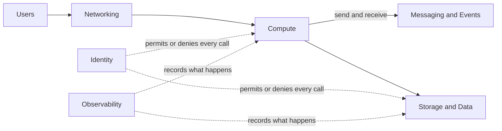

## How to Read This Document

Every domain section is built the same way, and the order is the point: **each concept is defined once, at the top of the domain it belongs to, and everything below that depends on it.** Nothing is explained twice — where a later section needs an idea that has already been introduced, it links back to it rather than restating it.

**First, the concept tables.** A diagram of how the domain's terms hang together, then a table reducing each to a single line. This is the vocabulary layer: read it to fix the terms before a conversation, or to settle a definition in the middle of one. Where a definition names another concept with a capital letter, that concept has its own row somewhere in this file.

**Then, the service entries.** These assume the vocabulary above and add what you cannot get from a definition. Each has the same shape:

- A short description in plain words: what the service is and what you would use it for.
- **Entry point** — the first object you create. Every Azure service is built around one central object, and once you know which one it is, the rest of the service's settings make sense. For a queue service it is the queue; for a virtual machine service it is the disk image plus the hardware size.
- **Use it when** — the situation where this service is the right choice, so that you can compare it against its neighbours.
- **Trap** — the mistake people most often make with the service, and why it happens. Traps are worth reading even when you skip the rest, because they are what an experienced engineer would tell you before you started.

**Last, the sections that depend on everything above:** [Running It Well](#running-it-well--performance-cost-and-security), [Diagrams to Draw](#diagrams-to-draw) and [Trade-Offs](#trade-offs--the-it-depends-on-x-answers) carry no new definitions at all. They are practice, rehearsal and judgement over the vocabulary already established, and they link back to it.

Six words are used before their own domain arrives, so they are worth reading first: **Subscription** and **Resource Group** in [Concepts — Tenants and Subscriptions](#concepts--tenants-and-subscriptions), **Region** and **ARM** in [Concepts — Regions and Resources](#concepts--regions-and-resources), **VNet** in [Concepts — Inside the VNet](#concepts--inside-the-vnet), and **System-Assigned Identity** in [Concepts — Identity and Access](#concepts--identity-and-access).

## Foundations

Before any service makes sense, you need to know where things live and who is allowed to touch them. Azure answers both with the same structure.

### Concepts — Tenants and Subscriptions

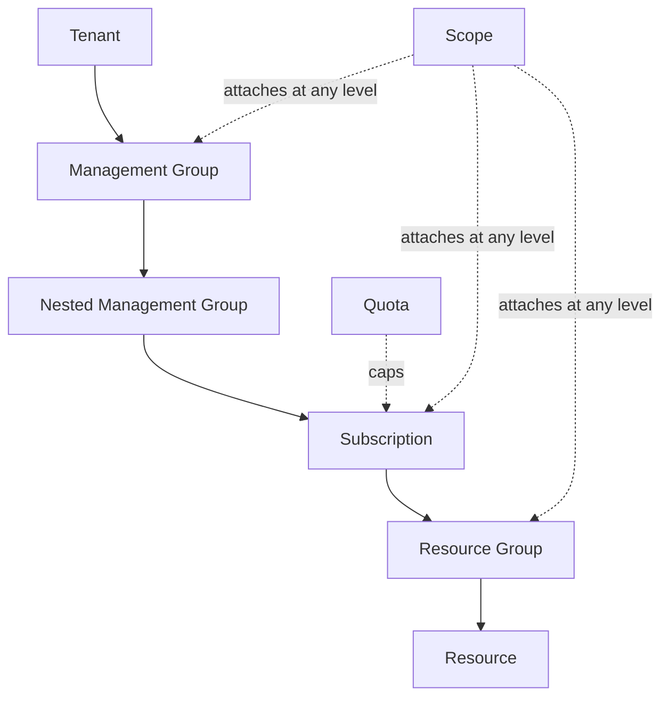

| Concept | Definition |
| --- | --- |
| **Entra ID** | the directory holding users, groups and applications, and the thing that performs every sign-in |
| **Tenant** | one organization's Entra ID directory; a Subscription trusts exactly one of them for sign-in |
| **Management Group** | a container for Subscriptions, so that one policy or role assignment attaches to many at once |
| **Subscription** | the billing and isolation boundary, and the nearest Azure equivalent of an AWS account |
| **Resource Group** | a folder whose contents share a lifecycle; deleting it deletes everything inside |
| **Scope** | the Management Group, Subscription, Resource Group or Resource that a role or policy attaches to; it then applies to everything below and never upward |
| **Quota** | the ceiling on how much of a given service one Subscription may create; a default limit, usually raisable on request |

### Concepts — Regions and Resources

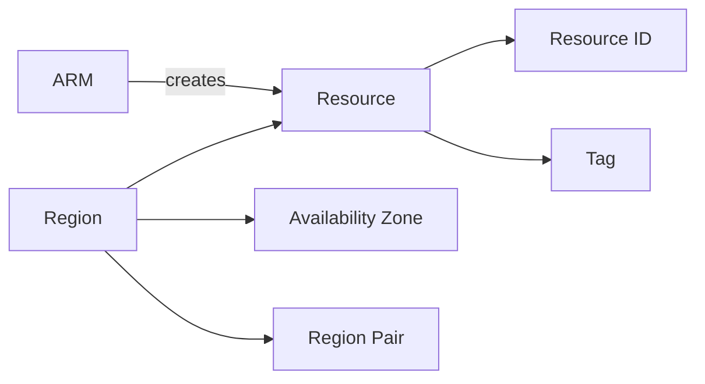

| Concept | Definition |
| --- | --- |
| **ARM** | Azure Resource Manager, the one API behind every Azure tool; the portal, the command line and every deployment language are clients of it, so no Resource reaches Azure any other way |
| **Resource** | a thing Azure creates and keeps for you, and the unit that is named, permissioned and billed |
| **Resource ID** | the unique path naming a Resource, and what every permission and script is written against; moving a Resource changes it and breaks anything holding the old one |
| **Tag** | a key/value label on a Resource, and the mechanism cost attribution and policy targeting both rely on |
| **Region** | a named geographic group of data centres with its own copy of every regional service; nothing leaves one unless you ask |
| **Availability Zone** | an independently powered group of data centres inside a Region; zone numbers are shuffled per Subscription, so two of them do not agree on zone 1 |
| **Region Pair** | the second Region some redundancy options replicate to automatically, and that Azure never patches at the same time as its partner |

### The Resource Hierarchy — Where Everything Lives

A Scope decides three things at once: who can touch the resource, which rules apply to it, and who pays for it.

- **Entry point:** the chain Management Group → Subscription → Resource Group → Resource, drawn above.
- **Use it when:** always. There is no way to create a resource outside this tree. The design question is only how many Subscriptions you want and where the boundaries between teams fall.
- **The rule that explains most permission behaviour:** permissions and policies **inherit downward, and only downward**. Grant someone the Reader role at a management group and they can read every subscription beneath it. There is no way to grant something at a resource and have it apply upward to its neighbours.
- **A resource group has its own location:** you pick a Region for the group itself. That Region only stores the group's bookkeeping data, so a group in West Europe can happily contain resources in three other Regions. People often assume the group's Region constrains its contents. It does not.
- **Moving things:** resources can usually be moved between resource groups and between subscriptions, but not every service supports it, and the move **changes the resource's ID** — the unique path string that permissions and scripts are written against. Anything referring to the old ID breaks.
- **Trap — zones are per subscription.** Availability Zone "1" in your subscription and zone "1" in a colleague's subscription may be different physical data centres. Azure deliberately shuffles the mapping so that everyone does not pile into zone 1. This matters the moment two subscriptions have to coordinate placement. Separately, **not every Region has zones at all**, which is the first thing to check when a design calls for zone redundancy.

### ARM — The One Control Plane

Every tool you can use to create Azure resources ends up calling the same API.

- **Entry point:** the `az` command line, PowerShell, Bicep, Terraform and Pulumi are all clients of the same API. None can do anything the others cannot.
- **Why it is worth knowing:** it collapses a whole category of confusion. When someone says "it worked in the portal but failed in Terraform", the cause is almost never the tool. It is either a permissions difference (the portal ran as you, the pipeline ran as a service identity with fewer rights) or an API version difference (the tool is pinned to an older version of the resource type). Knowing there is one control plane tells you which two things to check.
- **Region Pairs are geographic:** the partner Region sits in the same geography — West Europe with North Europe, for example — which is what keeps a replicated copy inside the same data-residency rules.

## Compute

Compute is where your code runs. Azure gives you several ways to run it, and the difference between them is how much of the machine you see and manage.

At one end, a **Virtual Machine** gives you a whole virtual server that you install software on and keep patched. At the other, **Azure Functions** runs one piece of your code when something calls it, and you never see a machine at all. **AKS** and **Container Apps** sit in between: you package your code as a Container, built with a tool such as Docker, and the service decides which machines run it.

The general pattern: the less you manage, the less you can customise, and the more you pay per unit of work at steady high load — but the less you pay when the load is low or uneven, and the far less operator time you spend. Most teams end up with a mix.

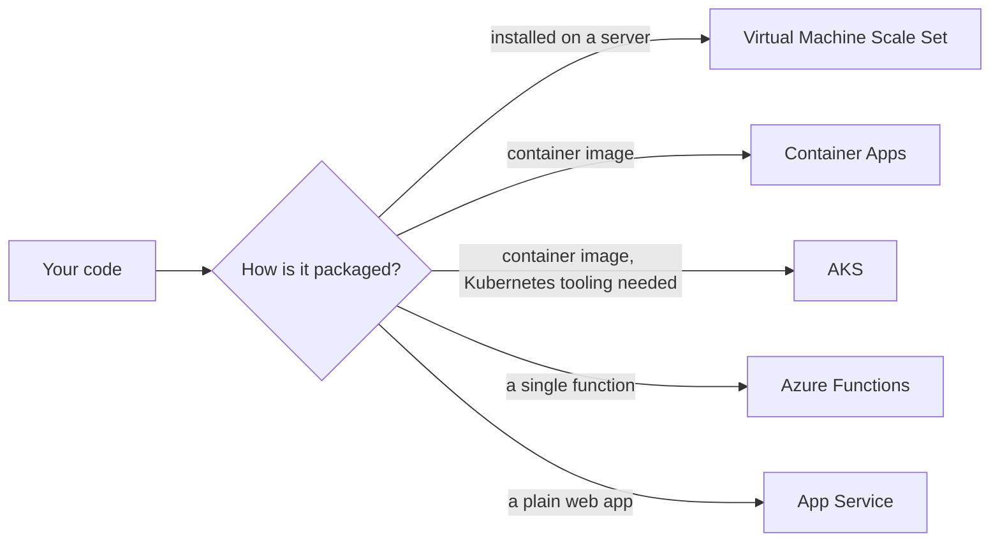

### Concepts — Compute Instances

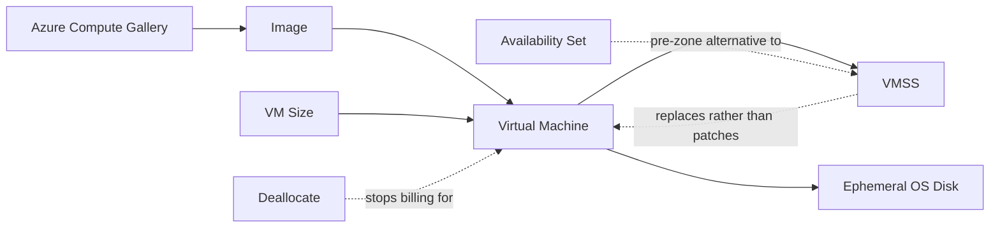

| Concept | Definition |
| --- | --- |
| **Virtual Machine** | a rented Linux or Windows server you install software on and keep patched, billed by the second while it runs |
| **VM Size** | the hardware shape of a Virtual Machine — cores, memory and capabilities — encoded in a letter-and-number name |
| **Image** | a saved disk holding an operating system and pre-installed software, and the thing a Virtual Machine is created from |
| **Azure Compute Gallery** | where you version an Image and replicate it to the Regions that need it |
| **VMSS** | Virtual Machine Scale Set: a managed group of identical Virtual Machines that creates, replaces and scales them for you |
| **Availability Set** | the pre-zone way to spread machines across separate racks and power inside one data centre, superseded by Availability Zones wherever a Region offers them |
| **Deallocate** | releasing a machine's hardware so that billing stops; shutting the guest operating system down leaves the Virtual Machine billable |
| **Ephemeral OS Disk** | an operating system disk kept on the host's own storage: free and much faster to rebuild, erased by any reimage or Deallocate |

### Concepts — Compute Containers

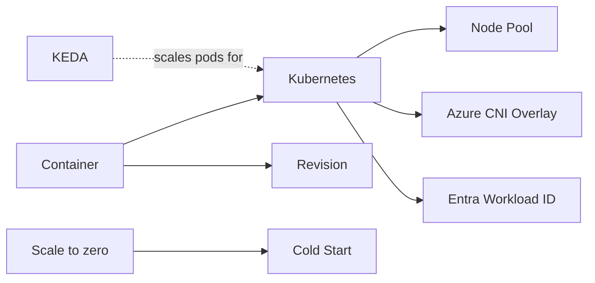

| Concept | Definition |
| --- | --- |
| **Container** | an application packaged with everything it needs to run, so that it behaves the same on any machine |
| **Kubernetes** | the open-source system that places a Container on a machine, restarts it when it dies, and replaces it during a deploy |
| **Node Pool** | a group of identical machines inside an AKS cluster; a `System` pool runs Kubernetes' own services and a `User` pool runs yours |
| **Azure CNI Overlay** | the AKS network plugin to choose for new clusters: pod addresses come from a private range that never consumes VNet address space |
| **Entra Workload ID** | the federation that lets a Kubernetes service account exchange its token for an Azure one, so a pod stores no secret anywhere |
| **KEDA** | scaling the number of pods from an external signal such as queue depth rather than from CPU |
| **Revision** | an immutable snapshot of a Container Apps app at one configuration; several can serve traffic at weighted percentages |
| **Cold Start** | the delay a request pays when it arrives at a service that had scaled to zero and must start a Container first |

### Concepts — Compute Functions

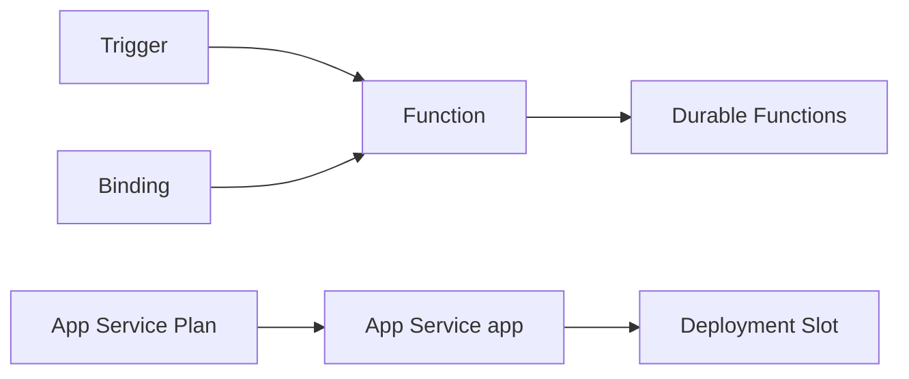

| Concept | Definition |
| --- | --- |
| **Trigger** | the one event that causes a function to run — an HTTP request, a queue message, a timer |
| **Binding** | a declared input or output connection for a function, which replaces the client library code you would otherwise write |
| **Durable Functions** | workflow orchestration on top of functions; an orchestrator replays its own history to recover state, so its code must be deterministic |
| **App Service Plan** | the fleet of machines App Service apps are tenants on, and the thing actually billed |
| **Deployment Slot** | a staging copy of an App Service app that is warmed up and then swapped into production |

### Virtual Machines and Scale Sets — Rented Virtual Machines

A Virtual Machine is a rented Linux or Windows server, billed by the second while it runs. Underneath sits a **hypervisor** — the software that splits one physical server into many virtual ones — but you never see it. You see a server with an operating system, and you are responsible for everything installed on it.

- **Entry point:** an **image** (a saved copy of a disk with an operating system and any pre-installed software, taken from the Azure Marketplace or built by you and stored in an **Azure Compute Gallery**) plus a **VM size** (the hardware shape: how many CPU cores and how much memory). In production you wrap both in a **Virtual Machine Scale Set (VMSS)**, which creates instances, replaces failed ones, and adds or removes them as load changes. Deploying a single standalone VM is a development-time thing.
- **Use it when:** the software needs a full operating system, a specific kernel, a GPU, or long-running state on the machine; or when you are moving an existing server into the cloud with as few changes as possible.
- **Reading a VM size:** the letter says what the machine is good at — `D` general purpose, `F` compute-optimized (more CPU per GB of memory), `E` memory-optimized, `B` burstable (cheap, with CPU credits that run out under sustained load), `L` storage-optimized, `N` GPU. Suffix letters stack and each means something: `a` = AMD processor, `p` = **Ampere Arm** processor (cheaper per unit of work, Azure's answer to AWS Graviton), `s` = can use premium SSD storage, `d` = has a local temporary disk.
- **Scale set orchestration modes:** **Flexible** is the modern default — instances are ordinary VMs you can address and manage individually, spread across zones. **Uniform** is the older model, where instances are identical and anonymous; it still suits very large stateless fleets. An **availability set** is the pre-zone construct, spreading VMs across separate racks and power within a single data centre. Where a Region offers zones, zones are the better answer.
- **Disk choice:** the operating system disk is normally a **managed disk**, which is network-attached and survives the machine being shut down. Some sizes also offer an **ephemeral OS disk**, stored on the host machine's own local storage: free, much faster to reimage, and **wiped whenever the machine is deallocated or reimaged**. That erasure is a feature if you never modify running servers, which makes ephemeral disks the natural fit for [immutable infrastructure](#immutable-infrastructure-and-cloud-native-delivery).
- **Trap — "stopped" does not mean "not billed".** Shutting a VM down from inside the guest operating system leaves Azure still holding the hardware for you, and still charging for it. You have to **deallocate** the machine to stop paying. Deallocating also releases any dynamically assigned public IP address and destroys the contents of an ephemeral OS disk. Separately, the old Basic-tier public IPs and Basic Load Balancer were retired in September 2025; Standard tier is the only choice for new work.

### AKS — Managed Kubernetes

Running Kubernetes yourself means operating its **control plane** — the set of components that decide which machine runs what. Azure Kubernetes Service runs that control plane for you. Everything above it is ordinary, unmodified Kubernetes.

- **Entry point:** the **cluster**, plus two decisions that are painful to reverse later. The first is the **node pool layout**: a `System` pool for Kubernetes' own internal services, and one or more `User` pools for your workloads, where each pool is a group of identical machines of one VM size. The second is the network plugin, below.
- **Use it when:** you need the Kubernetes ecosystem specifically — custom operators, cluster-wide agents, network policies for tenant isolation, or a service mesh you chose yourself. If you do not need those, [Container Apps](#container-apps--serverless-containers) does the same job with far less to operate.
- **The networking choice, which dates a cluster:** **Azure CNI Overlay** is the recommendation for new clusters. Pods get addresses from a private range that exists only inside the cluster and never consumes VNet address space, so your network address plan stays small. **Azure CNI (node subnet)** gives every pod a real, routable VNet address, which is what you want when something outside the cluster must reach a pod directly — and what exhausts your address space when you did not plan for it. **kubenet** is the legacy option, with a retirement already announced. Which plugin you get when you do not specify one depends on how the cluster was created, so specify it.
- **How pods get permission to call Azure:** **Entra Workload ID**. The cluster publishes an OIDC issuer, a Kubernetes service account is federated to a [managed identity](#managed-identities--the-password-free-bridge), and the pod receives a short-lived token with no secret stored anywhere. It replaced AAD Pod Identity, retired in September 2024. The alternative people fall into — granting broad rights to the node's own identity — gives *every* pod on that node the same access, which is rarely what anyone intended.
- **Scaling, at two levels:** the **cluster autoscaler** adds and removes nodes from existing pools within a min/max range, and is still the default. **Node Auto Provisioning** (built on the upstream Karpenter project) goes further and provisions right-sized nodes directly from the shape of the pending pods; it is the current recommendation. Separately, **KEDA** scales the number of *pods* based on external signals such as queue depth rather than CPU, which is what event-driven workloads actually need.
- **Trap — the two identities.** A cluster has a **cluster identity**, which manages Azure resources on the cluster's behalf (load balancers, disks, route tables), and a **kubelet identity**, which the nodes use to pull container images from a registry. Granting the image-pull permission to the wrong one produces an `ImagePullBackOff` error that no amount of Kubernetes RBAC will fix, because the failure is happening in Azure, not in Kubernetes.

### Container Apps — Serverless Containers

Container Apps is Kubernetes, KEDA, Dapr and the Envoy proxy assembled for you and then hidden. You get containers, versions and scaling rules. You never see a node, and there is no `kubectl`.

- **Entry point:** a **Container Apps environment** — the boundary that holds the shared network integration, the logging workspace, and the internal networking between your apps. Apps in the same environment can reach each other by name; apps in different environments cannot.
- **Use it when:** you have a container and you want it running with as little operational surface as possible — which covers most web services, APIs and background workers. It is the right default, and moving to AKS later is a real but bounded piece of work.
- **Revisions give you safe deploys for free:** a **revision** is an immutable snapshot of your app at one configuration. You can run several revisions at once and split traffic between them by percentage, which means blue/green and canary deployments with no load balancer to configure and nothing extra to buy.
- **Scale rules and scale to zero:** scaling is driven by KEDA **scalers** — HTTP concurrency, queue length, a cron schedule, or a custom signal. Setting the minimum replica count to `0` means the app genuinely stops costing anything when idle. **Workload profiles** let one environment mix Consumption capacity (per-second billing, scales to zero) with Dedicated capacity (reserved machines, GPUs, larger sizes).
- **Also included:** **jobs** for run-to-completion tasks, triggered manually, on a schedule, or by an event; and **Dapr**, an optional sidecar that provides publish/subscribe messaging, state storage and service-to-service calls behind a uniform API.
- **Trap:** scale-to-zero and HTTP traffic interact badly for latency-sensitive apps — the first request after an idle period pays a **cold start** while a container is created. And the moment you need DaemonSets, custom resource definitions, admission controllers, or a service mesh of your choosing, you have outgrown Container Apps and are describing AKS.

### Azure Functions — Functions, No Servers

You write a single function; the runtime invokes it when something happens. No machine, no container, no scaling configuration.

- **Entry point:** a **trigger** plus **bindings**. The trigger is the event that runs your function — an HTTP request, a queue message, a timer. **Bindings** are the genuinely distinctive part: a function can declare "triggered by a Service Bus queue, with an output binding to Cosmos DB" and then read and write both without writing a single line of client library code. One trigger per function; input and output bindings are declared, not coded.
- **Use it when:** the work is short, event-driven and bursty — reacting to a file upload, processing a queue, running a scheduled job, or serving a lightweight API.
- **Hosting plans, in the order they get chosen wrongly:** **Consumption** scales to zero but has no virtual network access on the classic plan and a **5-minute default timeout with a 10-minute hard ceiling**. **Flex Consumption** is the modern default — it scales to zero *and* supports network integration, lets you control per-instance concurrency, and lifts the 10-minute ceiling. **Premium** keeps instances warm so there is no cold start, and has no runtime limit. **Dedicated** runs your functions on an existing App Service Plan you already pay for.
- **Durable Functions** adds workflows: an *orchestrator* function coordinates *activity* functions to do fan-out/fan-in, wait for a human approval, or run a long multi-step process. The critical constraint is that **the orchestrator replays its own history from an event log to recover state, so its code must be deterministic** — no reading the current time, no generating random values, no direct input/output. Every run must take the same path given the same history.
- **Trap:** connections. Hundreds of concurrent function instances each opening a database connection or an outbound socket will exhaust both the database's connection limit and the platform's own pool of outbound ports. The fix is to create clients once and reuse them across invocations, rather than per call.

### App Service, Static Web Apps and Container Instances — The "Just Run My App" Tier

Not every workload needs an orchestrator. Reaching for the simplest thing that meets the requirement is a design decision worth stating out loud.

- **App Service** is managed web hosting for code or a container. Its entry point is the **App Service Plan** — the fleet of machines you actually pay for. Apps are tenants on that plan, so sizing it is a *shared* decision and noisy neighbours between apps are real. **Deployment slots** give you a staging copy of the app that you warm up and then **swap** into production; settings marked as *deployment slot settings* stay pinned to their slot rather than moving with the swap, and forgetting that is exactly how staging configuration reaches production. Turn **Always On** on, or the app unloads itself when idle and the next visitor waits for it to start.
- **Static Web Apps** hosts a static frontend on a global content delivery network with an optional managed Functions API attached, and builds a preview environment per pull request automatically.
- **Azure Container Instances** runs a single **container group** with per-second billing and no orchestrator at all. Good for one-shot jobs and burst capacity, though Container Apps jobs have largely superseded it for new work.

## Networking

Networking is how traffic reaches your code and how your code reaches everything else. Azure's model is close enough to AWS's to be familiar and different enough in three specific places to catch people out: subnets span zones rather than sitting in one, outbound internet access must be arranged explicitly, and reaching a managed service privately depends entirely on DNS.

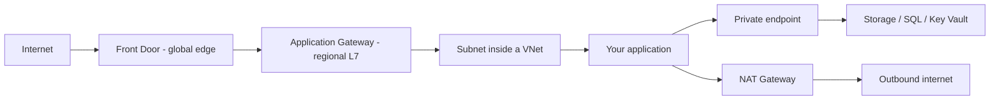

### Concepts — Inside the VNet

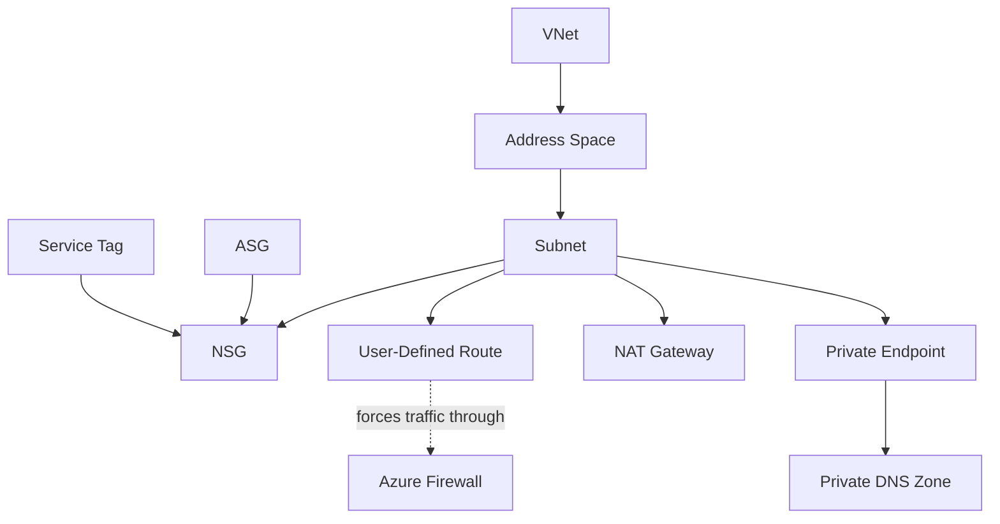

| Concept | Definition |
| --- | --- |
| **VNet** | a private network defined inside one Region, and the Address Space everything else is carved out of |
| **Address Space** | the block of private IP addresses a network owns, written in CIDR notation |
| **Subnet** | a division of a VNet's Address Space; it spans every Availability Zone in the Region rather than sitting in one |
| **User-Defined Route** | a route written to override Azure's own routing, most often to force traffic through Azure Firewall |
| **NAT Gateway** | the way to give a Subnet outbound internet access from a stable address that does not run out of ports under load |
| **NSG** | Network Security Group: the numbered allow and deny rules evaluated on a Subnet or a network interface |
| **ASG** | Application Security Group: a label on network interfaces, so an NSG rule names a role instead of an address range |
| **Service Tag** | a Microsoft-maintained named set of IP addresses, used in an NSG rule in place of a hard-coded range |
| **Azure Firewall** | a managed firewall in its own Subnet that filters on domain names and can inspect TLS |
| **Private Endpoint** | a private IP inside your Subnet mapped to one specific resource, which is what lets that resource's public access be switched off |
| **Private DNS Zone** | a DNS zone resolvable only from the VNets linked to it, and what a Private Endpoint needs in order to resolve at all |

### Concepts — Edge and Connections

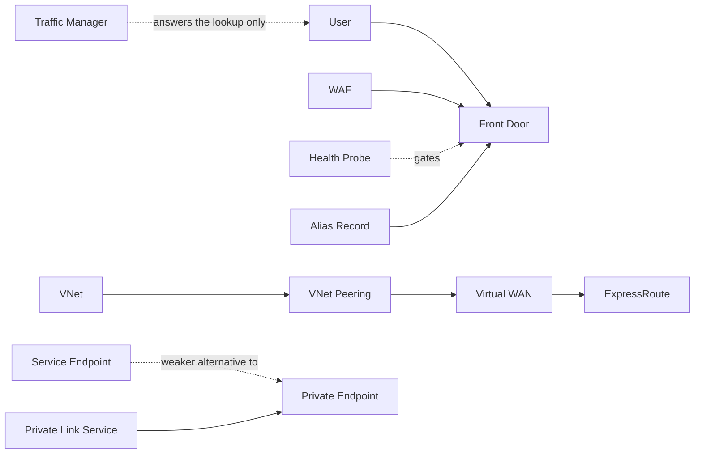

| Concept | Definition |
| --- | --- |
| **Front Door** | the global edge that terminates user connections outside any Region, caches, and fails traffic over between Regions |
| **Health Probe** | the check that decides whether one backend is fit to receive traffic |
| **WAF** | Web Application Firewall: rules that block common web attacks, attachable at Front Door or at a regional gateway |
| **Traffic Manager** | global steering done in DNS: it answers the lookup and then leaves the traffic path entirely |
| **Alias Record** | a DNS record pointing at an Azure resource that works at a bare domain name, where a CNAME cannot |
| **VNet Peering** | a direct link between two VNets that is not transitive, so a peer of your peer stays unreachable |
| **Virtual WAN** | managed transit hubs that route between VNets, VPN and ExpressRoute without a mesh of peerings to maintain |
| **ExpressRoute** | a dedicated private circuit into Azure, ordered from a carrier with weeks of lead time |
| **Service Endpoint** | a free route optimisation that keeps traffic to a whole service off the internet while still using its public address |
| **Private Link Service** | the way to publish your own service behind a Private Endpoint for other networks and organisations to consume |

### VNets, Subnets and Routing — The Foundation Everything Sits In

- **Entry point:** the Address Space, written in CIDR notation such as `10.0.0.0/16`, then the Subnets that divide it, then User-Defined Routes if you need to override where traffic goes.
- **Use it when:** always, for anything that runs on a machine. Virtual machines, AKS nodes and VNet-integrated services all live in a subnet.
- **Two differences from AWS worth saying out loud.** First, **a subnet is regional, not zonal** — it spans every Availability Zone in the Region, and the individual *resource* chooses which zone it sits in. Second, **every subnet in a VNet can already reach every other one**, because Azure creates system routes from the start. There is no internet gateway to attach and no route table to write before things work.
- **Outbound internet must now be arranged deliberately.** It used to happen by default. **Default outbound access was retired for new deployments in September 2025**, so a new subnet needs an explicit method. The right answer is a **NAT Gateway**: a managed component that gives everything in the subnet a stable outbound address and does not run out of ports under load. The alternatives are a load balancer outbound rule, or giving the machine its own public IP.
- **Forcing traffic through inspection:** a user-defined route that sends `0.0.0.0/0` (meaning "everything") to a `VirtualAppliance` next hop is how you push traffic through [Azure Firewall](#nsgs-asgs-and-azure-firewall--the-filtering-layers) or a third-party appliance instead of straight out to the internet. This is the mechanism behind hub-and-spoke designs.
- **Trap — address planning bites twice.** Azure reserves **five** addresses in every subnet for its own use, so a `/29` gives you three usable addresses, not eight. And several services demand their own **dedicated, empty, exactly-named** subnet: `AzureFirewallSubnet`, `GatewaySubnet`, `AzureBastionSubnet`, and a subnet of its own for Application Gateway. Discovering the naming requirement after the address plan is agreed means rebuilding the network.

### NSGs, ASGs and Azure Firewall — The Filtering Layers

Two different things filter traffic, at two different levels of sophistication.

| Aspect | Network Security Group | Azure Firewall |
|---|---|---|
| **Attaches to** | A subnet, a network interface, or both | Its own subnet, as a routing destination |
| **Understands** | IP addresses, ports and protocols | The same, plus domain names and inspected TLS traffic |
| **Return traffic** | Automatic — it tracks connections | Automatic |
| **Rules** | Allow **and** deny, evaluated by priority number, lowest first | Grouped rule collections for address translation, network and application rules |
| **Cost** | Free | A fixed hourly charge **plus** a charge per gigabyte processed |

- **Entry point:** a **Network Security Group (NSG)** holding numbered allow and deny rules. But the idiomatic Azure pattern is to pair it with an **Application Security Group (ASG)** — a named label you attach to network interfaces. You then write the rule as "allow port 5432 into `asg-db` *from* `asg-app`" rather than from a hard-coded address range. Machines join the ASG as the fleet grows and the rule keeps working untouched.
- **Service tags** are Microsoft-maintained, automatically updated sets of IP addresses with names such as `Storage`, `AzureKeyVault`, `Internet` and `VirtualNetwork`. Use them instead of hard-coding ranges that change every month.
- **Know this about evaluation order:** when an NSG is attached to both the subnet and the network interface, **inbound traffic is checked at the subnet first and then the interface, and outbound is checked at the interface first and then the subnet**. Both must allow the traffic. Default rules already permit traffic within the VNet and the load balancer's health checks, and already deny inbound traffic from the internet.

### Load Balancing — Four Services, Four Jobs

- **Entry point:** for **Azure Load Balancer**, a **frontend IP address** → **rules** → a **backend pool** of machines → a **health probe** that decides which of them are fit to receive traffic. For **Application Gateway**, a **listener** → a **routing rule** → a **backend pool** plus its HTTP settings. In both, health checking lives with the backend, not the frontend.

| Service | Works at | Scope | Use it for |
|---|---|---|---|
| **Load Balancer** | Layer 4 (TCP/UDP) | One Region | Very high throughput, non-HTTP protocols, zone-redundant frontends, outbound address translation |
| **Application Gateway** | Layer 7 (HTTP) | One Region | Routing by URL path or hostname, **WAF** (a web application firewall that blocks common attacks), TLS termination, session affinity |
| **Front Door** | Layer 7 (HTTP) | **Global** | An edge presence close to users, caching, WAF at the edge, failover between Regions |
| **Traffic Manager** | DNS | Global | Steering users to a Region by priority, weight, latency or geography — including to endpoints outside Azure |

- **Use Front Door for new edge and CDN work.** **Azure CDN from Edgio** was announced for retirement on 15 January 2025, with service reportedly extended for some customers beyond that date, so check the current Microsoft retirement notice rather than assuming a given profile is already gone. **Azure CDN Standard from Microsoft** has its own, later retirement date. **Front Door Premium** can reach a backend over [Private Link](#private-link-and-service-endpoints--reaching-managed-services-privately), so the origin needs no public address at all.
- **Traffic Manager is not in the traffic path.** It answers a DNS lookup and then steps aside. That means failover happens at the speed of DNS caching, not instantly — clients keep using the old answer until their cached record expires.
- **Trap:** Application Gateway needs its **own dedicated subnet** with room to grow. And a WAF in *Prevention* mode will block legitimate traffic until you have tuned its exceptions, so run it in *Detection* mode first and read what it would have blocked.

### Azure DNS and Private DNS Zones

- **Entry point:** a **zone**, which holds the DNS records for a domain. A **public** zone answers the whole internet. A **private** zone answers only the VNets you explicitly attach to it with a **virtual network link**, optionally registering VM records automatically.
- **Alias records** point at an Azure resource rather than at a fixed address, update themselves when the target changes, and — critically — work at the **zone apex**, the bare domain such as `example.com`. Standard DNS forbids a CNAME record at the apex, so alias records are Azure's answer to pointing a bare domain at a load balancer.
- **Azure DNS Private Resolver** replaces the hand-built DNS forwarder machines teams used to run. It gives you inbound and outbound endpoints with forwarding rules, and it is the current answer to "how does our on-premises network resolve the names of our private endpoints".

### VNet Peering and Virtual WAN — Connecting Networks

- **VNet peering** links two VNets directly. It is cheap, runs at full network speed, and is **non-transitive**: if A is peered to B and B to C, **A still cannot reach C**. That single property is why hub-and-spoke designs need either user-defined routes pointing the spokes at a firewall in the hub, or a gateway. Two flags decide whether a peering actually carries the traffic you want — **allow forwarded traffic** (accept packets that did not originate in the peer itself) and **gateway transit** (let the peer use this network's VPN or ExpressRoute connection).
- **Virtual WAN** is the managed alternative. A **virtual hub** absorbs VNet connections, VPN tunnels, ExpressRoute circuits and a firewall into one Microsoft-operated object that routes between all of them automatically. It is what you move to when a hand-built hub has stopped scaling.
- **Trap for both:** overlapping address spaces. Two VNets that both use `10.0.0.0/16` cannot be peered, ever. Address space has to be planned centrally before it becomes a migration project.

### ExpressRoute and VPN Gateway — Reaching On-Premises

- **VPN Gateway** builds encrypted tunnels over the ordinary public internet. It can be running within the hour, but its bandwidth and consistency are whatever the internet gives you that day. Deploy it **active-active** across zones; the SKU you pick sets the throughput ceiling and can only be resized within its own family.
- **ExpressRoute** is a dedicated private circuit arranged through a connectivity partner. Consistent latency, much higher throughput, and a **lead time measured in weeks** — say that part out loud, because it is the operational reality that shapes migration plans. **Private peering** reaches your VNets; **Microsoft peering** reaches public Microsoft services such as Microsoft 365.
- **The standard design** is ExpressRoute as the primary path with a VPN configured as automatic backup. **ExpressRoute Global Reach** additionally lets two of your own on-premises sites talk to each other across Microsoft's network.

### Private Link and Service Endpoints — Reaching Managed Services Privately

Managed services such as Storage and SQL have public addresses by default. There are two ways to stop using them, and they are not equivalent.

- **Service endpoints** are a routing optimisation. Traffic leaves your subnet over Microsoft's own network and arrives at the service **carrying your subnet's identity**, so the service's firewall can allow it specifically. But it still arrives at the service's **public** endpoint, it applies to the whole service rather than one account, and it does nothing for traffic coming from on-premises. They are **free**.
- **Private endpoints** are a real network interface with a **private IP address inside your subnet**, mapped to **one specific resource** — this storage account, this SQL server, this vault. Once one exists, the resource's public endpoint can be switched off entirely, and on-premises systems can reach it over ExpressRoute or VPN. Billed hourly plus per gigabyte.
- **Private Link Service** is the reverse direction: it publishes *your own* service, sitting behind a Standard Load Balancer, so that other VNets, subscriptions and even other organisations consume it through a private endpoint of their own. No peering, no shared routes, and overlapping address spaces stop mattering. This is how software vendors offer private connectivity on Azure.
- **Trap — it is always DNS.** A private endpoint only works if the service's normal hostname resolves to the new private address. That requires a private DNS zone named for the service (`privatelink.blob.core.windows.net` for blob storage) linked to the VNet doing the lookup and populated by the endpoint. Get every part of the networking right and the DNS wrong, and every client will silently carry on using the public address as though nothing had changed.

## Storage and Data

Somewhere to keep things. Azure separates storage by shape: objects in a storage account, disks attached to one machine, file shares mounted by many, and then the database services.

### Concepts — Storage

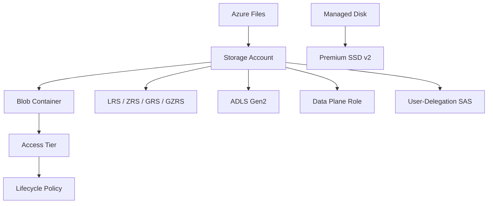

| Concept | Definition |
| --- | --- |
| **Storage Account** | the resource owning redundancy, firewall rules, encryption and throughput limits for blobs, files, queues and tables alike |
| **Blob Container** | a grouping of blobs inside a Storage Account; a naming boundary, not a limits one |
| **LRS / ZRS / GRS / GZRS** | the four redundancy choices: within one data centre, across Availability Zones, to the Region Pair, or both at once |
| **Access Tier** | Hot, Cool, Cold or Archive: cheaper to keep, and slower and dearer to read, as you go down the list |
| **Lifecycle Policy** | rules that move blobs down the Access Tier list or delete them outright, on age alone |
| **Data Plane Role** | the kind of role granting access to contents rather than to the resource; owning a Storage Account grants no data access at all |
| **User-Delegation SAS** | a time-limited signed URL tied to an Entra ID identity, and therefore revocable by disabling that identity |
| **ADLS Gen2** | a Storage Account with hierarchical namespace turned on, which adds real directories and POSIX permissions |
| **Managed Disk** | a network-attached disk bound to one Availability Zone and normally attached to one machine |
| **Premium SSD v2** | the disk tier where capacity, IOPS and throughput are bought independently of one another |
| **Azure Files** | managed SMB and NFS shares that many machines mount at once, served from a Storage Account |

### Concepts — Data Stores

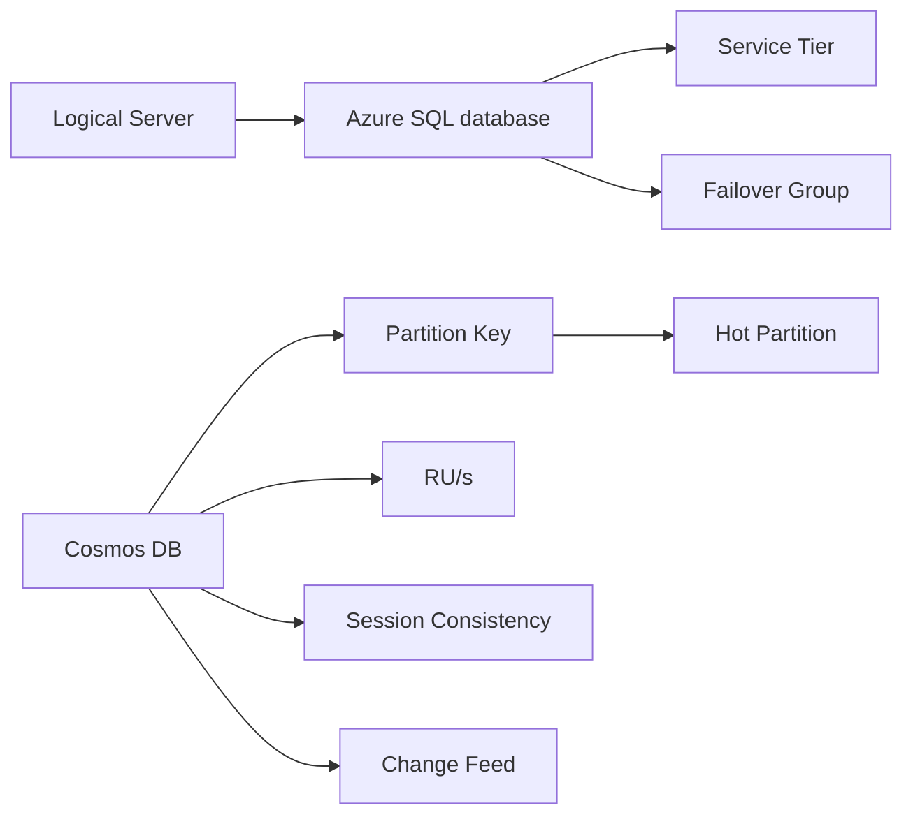

| Concept | Definition |
| --- | --- |
| **Logical Server** | the namespace and firewall boundary Azure SQL databases attach to; not a machine, and not something you size |
| **Service Tier** | the Azure SQL choice that fixes the availability model as well as the performance, which is why it is not a pure sizing decision |
| **Failover Group** | a stable endpoint name in front of geo-replication, so a connection string survives a failover unchanged |
| **Partition Key** | the field Cosmos DB distributes items by; it cannot be changed once a container exists |
| **RU/s** | Request Units per second: the single currency every Cosmos DB read, write and query is charged in |
| **Session Consistency** | Cosmos DB's default, in which each client reads its own writes; the right answer for most applications |
| **Hot Partition** | a Partition Key that concentrates traffic on one physical partition, so it throttles while the rest sits idle |
| **Change Feed** | a subscribable stream of every change made to a Cosmos DB container |

### Storage Accounts — Blobs, Files, Queues and Tables

One resource containing four different services. Blob storage is **not a filesystem**: it is a flat store of objects addressed by key, under a globally unique account name.

- **Entry point:** the **storage account**, and it is a much bigger unit than an S3 bucket. Redundancy, firewall rules, encryption, the default access tier and — importantly — **the throughput limits** are all set on the **account**. **Containers** and the blobs inside them sit beneath it and inherit most of it. Internalising that the account, not the container, is the boundary is the main adjustment coming from AWS.
- **Use it when:** you need to store files, images, backups, logs, or any large objects; or you need a simple queue or a cheap key-value table alongside them.
- **Redundancy, cheapest first:** **LRS** keeps three copies in one data centre. **ZRS** spreads copies across Availability Zones in the Region. **GRS** is LRS plus an asynchronous copy to the paired Region. **GZRS** combines both. Prefixing any of the geo options with **RA-** adds read access to the far copy. Because geo-replication is **asynchronous**, a Region failure can lose recent writes, and a failover you initiate yourself converts the account to LRS afterwards.
- **Tiers and lifecycle:** Hot → Cool → Cold → **Archive**, each cheaper to store and more expensive to read. Archive is genuinely offline — retrieving data takes **hours**, and there is no way to go faster than the rehydration priority you selected. Each tier also has a minimum retention period, so deleting early is billed as though the data had stayed. **Lifecycle management policies** move and delete blobs automatically on age, including old versions.
- **Trap, and the highest-signal one in Azure:** **the control plane and the data plane are separate**. Being **Owner of a storage account grants you exactly zero access to the data inside it**. Reading a blob requires a *data* role such as **Storage Blob Data Contributor**. This surprises nearly everyone once. Prefer Entra identity over account keys entirely; when you must hand out a URL, use a **user-delegation SAS** — a time-limited signed link tied to an Entra identity, and therefore revocable — rather than one signed with the account key.
- **Two more things worth knowing:** enabling **hierarchical namespace** turns the account into **ADLS Gen2**, which adds real directories, atomic rename and POSIX-style permissions; it is normally a creation-time choice and there is no way back once enabled. And throughput limits being per *account* and shared across Blob, Queue and Table is how one busy table workload ends up throttling unrelated blob traffic. Microsoft's published target is on the order of 20,000 requests per second per account; check the current figure before designing against it.

### Managed Disks — Block Storage for One Machine

Network-attached virtual disks that behave like disks physically inside the machine.

- **Entry point:** a **disk** created in a specific Region and zone, attached to one VM. (Shared disks exist for clustering software, but the normal case is one disk, one machine.) A disk is bound to its zone: moving it elsewhere means taking a snapshot, unless you use a **ZRS disk**, which can attach from any zone in the Region.
- **The performance ladder:** Standard HDD → Standard SSD → Premium SSD → Premium SSD v2 → **Ultra Disk** for databases needing sustained sub-millisecond latency.
- **Premium SSD v2 is the cost win worth naming.** On the original Premium SSD tiers, performance is tied to the size you buy, so teams over-provisioned capacity purely to get more IOPS. **v2 separates them**: you choose capacity, IOPS and throughput independently, with a useful baseline included. The catch is that v2 requires a zonal deployment and supports no host caching.
- **Snapshots** are incremental and stay within a Region. For images that need to exist in several Regions, the **Azure Compute Gallery** is where you version and replicate them.

### Azure Files and NetApp Files — Shared Filesystems

- **Azure Files** provides managed SMB and NFS shares that many machines and containers can mount at once. **Premium** is provisioned SSD; Standard is pay-as-you-go on hard disks. It can authenticate users against Active Directory, and **Azure File Sync** turns an on-premises Windows Server into a local cache in front of the cloud share — the standard route for modernising a traditional file server.
- **Azure NetApp Files** is bare-metal NetApp hardware for high-performance computing, SAP, and latency-sensitive NFS workloads, with snapshots and cross-Region replication.
- **A judgement call worth voicing:** a shared filesystem is often a sign that an application was lifted from a server without being changed. Cloud-native usually means blob storage plus a database instead.

### Azure SQL and the Flexible Servers — Managed Relational Databases

- **Entry point:** **Azure SQL Database** gives you a single database attached to a logical **server**, which despite the name is a namespace and firewall boundary rather than a machine. **SQL Managed Instance** gives you near-complete SQL Server — including the SQL Agent and cross-database queries — placed inside your VNet, which is what makes lift-and-shift migrations possible. **PostgreSQL** and **MySQL Flexible Server** are the open-source equivalents, also placeable in a VNet, with maintenance windows you choose.
- **The service tier *is* the availability model, not just a speed grade.** This is the thing to know cold. **General Purpose** separates compute from remote storage, so a failure means restarting on another node — tens of seconds. **Business Critical** keeps data on local SSDs with a replica set already running, so failover takes seconds, **and it includes a readable replica at no extra charge**. **Hyperscale** splits storage into page servers, which gives near-instant restores, fast replica creation, and a maximum database size far beyond the others (Microsoft currently publishes 128 TB).
- **Sizing and elasticity:** use the **vCore** model, which maps to real hardware and supports licence reuse, rather than the legacy **DTU** blend. **Serverless** pauses the database when idle and bills per second. **Elastic pools** let many small databases share one pot of capacity, which works when their busy periods do not coincide.
- **Cross-Region:** a **failover group** wraps geo-replication in a stable endpoint name, so the application's connection string survives a failover unchanged. Without one, disaster recovery involves editing connection strings under pressure.

### Cosmos DB — Managed NoSQL at Any Scale

Single-digit millisecond reads at any size, provided you model the data correctly. If you model it incorrectly, no amount of money fixes it.

- **Entry point:** an **account** — and **the API is fixed when you create it** and cannot be changed (NoSQL, MongoDB, Cassandra, Gremlin or Table; NoSQL is the first-class one). Then a database, then a **container** with its **partition key**, the field Cosmos uses to decide which physical machine holds each item.
- **The partition key is immutable**, which inverts the usual order of work: you list the queries the application will make *first*, and only then choose a key that serves them. Coming from relational databases, this is the hardest habit to change.
- **Capacity is measured in Request Units (RU/s).** Every read, write and query costs a number of RUs. You either provision throughput (optionally with autoscale between 10% and a ceiling) or run **serverless**, paying per request with a lower ceiling — good for development and small spiky workloads.
- **Five consistency levels**, from Strong through Bounded Staleness, **Session**, Consistent Prefix, to Eventual. Session is the default and the right answer for most applications: each client reliably reads its own writes. Each weaker level costs fewer RUs and tolerates more failure.
- **Useful extras:** the **change feed**, a stream of every change that Functions can subscribe to; automatic expiry with TTL; **multi-region writes** with a conflict resolution policy; and an integrated cache for repeated reads.
- **Trap — the hot partition.** Choosing a low-cardinality field such as `status` as the partition key concentrates all traffic onto one physical partition, which throttles and returns `429` errors while the rest of the container sits idle. Worse, **a single logical partition also has a hard size cap** (currently documented at 20 GB), so a bad key is not a slowdown you can grow out of — it is a wall.

### Azure Cache for Redis and AI Search — The Supporting Stores

- **Azure Cache for Redis** is managed Redis, used for caching, sessions, rate limiting and distributed locks. The entry point is the instance and its tier: Basic is a single node with no availability guarantee, Standard is replicated, and **Premium** is where network integration, persistence, clustering and geo-replication appear. Enterprise tiers add the Redis modules.
- **Azure AI Search** is managed search over your own content. The entry point is a **service** containing **indexes**, with **indexers** that pull content from Blob, SQL or Cosmos, and **skillsets** that enrich it on the way in. It handles full-text, vector and hybrid search in one index, which is why it has become the default retrieval layer for AI applications on Azure.
- For searching **logs** rather than content, the answer is Log Analytics and KQL — see [Observability and Governance](#observability-and-governance).

## Messaging and Events

Four services that people confuse constantly. Choosing correctly between them is one of the clearest signals that someone has actually built systems on Azure rather than read about it.

The one-line version: **Storage Queues** for a simple work handoff, **Service Bus** for messages you must not lose or reorder, **Event Grid** for reacting to things that happened, and **Event Hubs** for high-volume streams you may need to replay.

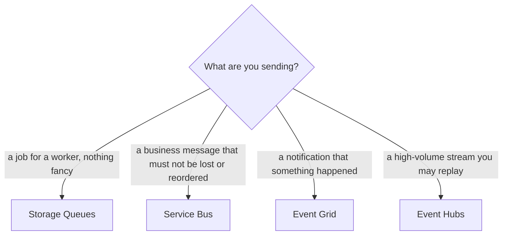

### Concepts — Messaging and Events

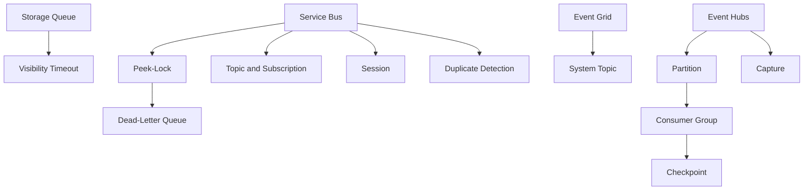

| Concept | Definition |
| --- | --- |
| **Visibility Timeout** | the period a taken message is hidden from other workers; when it expires the message comes back |
| **Peek-Lock** | receiving a message under a renewable lock, so that a crash returns it to the queue rather than losing it |
| **Dead-Letter Queue** | where a message goes after repeated processing failures, with the reason attached |
| **Topic and Subscription** | one published message and the filtered copies of it delivered to many independent consumers |
| **Session** | a Service Bus grouping that guarantees strict ordering within one session identifier |
| **Duplicate Detection** | discarding repeat messages carrying the same identifier inside a configured time window |
| **System Topic** | an Event Grid topic carrying the events Azure resources emit about themselves |
| **Partition** | a parallel lane through an event hub; the count caps consumer parallelism and is usually fixed at creation |
| **Consumer Group** | an independent reader of an event hub, holding its own position in the stream |
| **Checkpoint** | the recorded position a Consumer Group has read to, which is what lets it resume or rewind |
| **Capture** | automatic archival of an event hub stream to blob storage, with no code to write |

### Storage Queues — The Simple Buffer

- **Entry point:** a **queue** inside a storage account. Messages are up to 64 KB; the queue can grow to the account's capacity. A worker takes a message with a **visibility timeout**, during which the message is hidden from other workers, and deletes it on success.
- **Use it when:** you need a cheap, durable buffer and genuinely nothing else — no topics, no ordering guarantee, no transactions. The moment the requirements grow past that list, you wanted Service Bus, and retrofitting is worse than starting there.

### Service Bus — The Enterprise Broker

- **Entry point:** a **namespace**, and its tier matters more than usual: Basic has queues only, **Standard adds topics**, and **Premium** gives you dedicated capacity, private networking and 100 MB messages. Inside the namespace you create a **queue** (one sender, one set of competing receivers) or a **topic** with **subscriptions**, where each subscription gets a filtered copy of the messages.
- **Use it when:** the message represents a business action — an order placed, a payment taken — that must not be lost, duplicated silently, or processed out of order.
- **The two receive modes:** **peek-lock** takes a message, locks it while you work, and completes it when you are done, so a crash returns the message to the queue rather than losing it. Receive-and-delete removes it immediately and is only safe when losing one does not matter. The lock lasts **up to five minutes and must be renewed** for longer work.
- **Also included:** **dead-lettering** with a recorded reason for failure, **sessions** for strict first-in-first-out ordering within a session ID, **duplicate detection** by message ID within a time window, scheduled messages, transactions, and auto-forwarding between entities.
- **Trap:** the lock duration is the visibility timeout problem wearing a different hat. If processing outlives the lock and nobody renewed it, the message is handed to another worker while the first is still working on it, and the work happens twice.

### Event Grid — The Router

- **Entry point:** a **topic**. A **system topic** carries events Azure itself emits — a blob was created, a machine was deallocated, a resource became unhealthy. A **custom topic** carries your own. A **domain** handles fan-out to many tenants. You then create **event subscriptions** with filters, and Event Grid pushes matching events to them, retrying with backoff and dead-lettering to blob storage on repeated failure.
- **Use it when:** you want something to happen in reaction to a change, without anything polling for it. "A file lands in storage and a function runs" is Event Grid's job, and doing it without a timer is the point.
- **Against Service Bus:** Event Grid carries lightweight **notifications that something happened**, at very high fan-out and low latency. Service Bus carries **commands and business messages** you must not lose. Event Grid **namespaces** additionally support MQTT and pull-style delivery for consumers that cannot accept a push.

### Event Hubs — The Log

- **Entry point:** a **namespace** → an **event hub** → **partitions**. Consumers join a **consumer group** and record their own position, or **checkpoint**, in blob storage. Because the data stays in the hub for its retention period regardless of who has read it, a consumer can **rewind and replay** — the fundamental difference from Service Bus, where a completed message is gone.
- **Use it when:** you are ingesting telemetry, clickstreams, device data or application logs at volume, and more than one system needs to read the same stream independently.
- **Worth knowing:** retention is one day on Basic, up to seven on Standard, and up to ninety on Premium and Dedicated. **Capture** writes the stream to blob storage automatically with no code. And the **Kafka protocol endpoint** (Standard and above) means existing Kafka producers and consumers can connect by changing a connection string — usually the right answer instead of running Kafka on virtual machines yourself.
- **Trap:** the partition count sets your maximum consumer parallelism, and on most tiers **it cannot be changed after creation**. Under-partition and the only remedy is a new hub and a migration of every producer and consumer.

## Identity, Secrets and Access

Identity in Azure is two systems that share a name and are frequently confused. Getting the distinction right is the foundation of everything else in this section.

### Concepts — Identity and Access

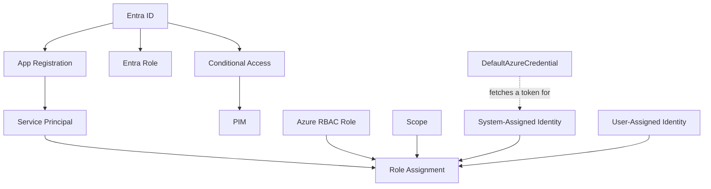

| Concept | Definition |
| --- | --- |
| **App Registration** | the tenant-wide definition of an application: its identifiers, redirect URLs, requested permissions and credentials |
| **Service Principal** | the local instance of an App Registration inside one Tenant, and where consent and role assignments actually attach |
| **Entra Role** | a role governing the directory itself, such as Global Administrator; it grants nothing over resources |
| **Azure RBAC Role** | a role governing resources, such as Owner, Contributor or Reader; it grants nothing over the directory |
| **Role Assignment** | one principal, one Azure RBAC Role and one Scope taken together; assignments are additive, inherited downward, and cannot express a deny |
| **Conditional Access** | where multi-factor authentication, device compliance and location rules are actually enforced at sign-in |
| **PIM** | Privileged Identity Management: time-limited, approval-gated activation of a privileged role rather than a standing one |
| **System-Assigned Identity** | an identity created and deleted with one resource, and usable by nothing else |
| **User-Assigned Identity** | a standalone identity attachable to many resources, and grantable before those resources exist |
| **DefaultAzureCredential** | the SDK helper that finds a token from the local identity endpoint, so that no secret is written into code or configuration |

### Concepts — Secrets and Keys

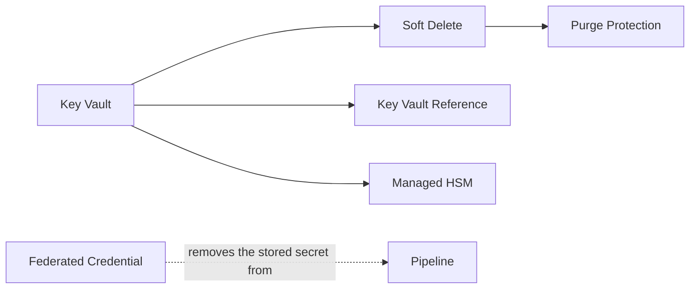

| Concept | Definition |
| --- | --- |
| **Key Vault** | the managed store for secrets, keys and certificates, with an access model and audit trail of its own |
| **Soft Delete** | the mandatory retention of a deleted vault or secret, which blocks reuse of the name until it is purged |
| **Purge Protection** | the stronger setting that forbids purging at all for the whole Soft Delete retention period |
| **Key Vault Reference** | a configuration value resolving to a Key Vault secret at runtime through a managed identity, so that the secret never sits in configuration |
| **Managed HSM** | single-tenant, FIPS 140-validated hardware for keys that may never exist in software |
| **Federated Credential** | a trust rule letting an external OIDC token be exchanged for an Azure one, which is what removes the stored secret from a pipeline |

### Microsoft Entra ID — The Directory Underneath Everything

Entra ID (formerly Azure Active Directory) holds your users, groups and applications, and handles signing them in.

- **Entry point:** the **tenant**, which is the directory itself. A subscription trusts exactly one tenant for authentication, and moving a subscription to a different tenant invalidates every role assignment inside it.
- **The pair everyone garbles:** an **App Registration** is the *global definition* of an application — its identifier, its redirect URLs, the permissions it requests, its credentials. An **Enterprise Application** is the **service principal**: the local instance of that application inside one particular tenant, which is where consent and role assignments actually live. One registration; one service principal in each tenant that uses it.
- **Two separate role systems, and this is the important one:** **Entra roles** such as Global Administrator govern the *directory* — users, groups, app registrations. **Azure RBAC roles** such as Owner and Contributor govern *resources* — virtual machines, storage, databases. They are different systems with different assignment mechanisms. **A Global Administrator has no access to any resource by default.** They can elevate themselves to gain it, which is precisely why that specific action is audited and alerted on everywhere.
- **Conditional Access** is where multi-factor authentication, device compliance and location restrictions are actually enforced. Paired with **PIM** (Privileged Identity Management), which makes privileged roles time-limited, approval-gated and activated only when needed, it is the real answer to "how do you secure administrative access".

### Azure RBAC — The Authorization Model

- **Entry point:** a **role assignment**, which is always three things multiplied together: **a principal** (who), **a role definition** (what they may do), and **a scope** (where). A role definition lists `Actions` and `NotActions` for the control plane, and `DataActions` and `NotDataActions` for the data plane. That control/data split is the [storage access trap](#storage-accounts--blobs-files-queues-and-tables) generalised to every service.
- **How evaluation works:** assignments are **additive and inherit downward**. There is **no user-authored deny**. If you want to forbid something outright, RBAC cannot express it — which is exactly why [Azure Policy](#azure-policy--the-guardrail-rbac-cannot-provide) carries the guardrail role in Azure. (Deny assignments do exist, but only Azure itself creates them.)
- **Good practice, briefly:** assign roles to **groups** rather than individual users, at the **highest scope that is still correct**, and use PIM for anything privileged. Writing a custom role is usually an exercise in starting from a built-in role and subtracting with `NotActions`.

### Managed Identities — The Password-Free Bridge

The Azure answer to "there should be no credential stored anywhere, ever".

- **Entry point:** turning on identity for the resource. **System-assigned** identities are created with the resource and deleted with it: one identity, one resource, nothing to manage. **User-assigned** identities are standalone resources you create first and attach to many things — and crucially, you can grant them roles **before** the workload exists, which removes the deployment race where an application starts before its permissions have finished propagating.
- **How it actually works:** the Azure SDK's `DefaultAzureCredential` requests a token from a local endpoint that only code on that machine can reach — the instance metadata service at `169.254.169.254` on virtual machines, or an injected environment variable on App Service, Functions and Container Apps. No secret is ever stored, and the token expires quickly.
- **Where it plugs in:** Key Vault, Storage, container registries, Azure SQL, Service Bus and Cosmos DB all accept it. If a design still has a connection string sitting in application settings, replacing it with a managed identity is the single most useful improvement to propose.

### Workload Identity Federation — Keyless Pipelines

The same idea, extended to systems running outside Azure.

- **Entry point:** a **federated credential** added to an app registration or a user-assigned managed identity, conditioned on the **issuer** and **subject** of an incoming token — for example `repo:my-org/my-repo:ref:refs/heads/main` for a GitHub Actions workflow running on the main branch. The pipeline presents its own OIDC token and receives an Azure token in exchange. **No client secret exists at all**, so there is nothing to leak, rotate or accidentally commit.
- **Why it matters:** it eliminates the entire category of long-lived CI credentials, and it is the highest-signal single thing to mention in any discussion of pipeline security. The same mechanism is what [Entra Workload ID](#aks--managed-kubernetes) uses for AKS pods.

### Key Vault — Secrets, Keys and Certificates

- **Entry point:** a **vault**, and immediately its **permission model**. The legacy option is **access policies**: per-vault, coarse, with no inheritance. The recommended option is **Azure RBAC**, which gives real roles, inheritance from management groups, and PIM eligibility. Migrating an existing vault from access policies to RBAC is a common real-world task.
- **The behaviour that breaks pipelines:** **soft delete is mandatory and cannot be switched off**. A deleted vault or secret lingers for a retention period, and re-creating one with the same name fails until you explicitly purge it. **Purge protection** goes further and blocks purging altogether, which some services require before they will use the vault. This is the cause of the classic "my Terraform destroy-and-apply loop stopped working" story.
- **Also worth knowing:** **certificates** can auto-renew through integrated certificate authorities; **Key Vault references** written as `@Microsoft.KeyVault(...)` let App Service, Functions and Container Apps resolve a secret at runtime using their managed identity, so the secret never enters configuration at all; **Managed HSM** provides single-tenant, FIPS 140-validated hardware for keys; and each vault has its own request rate limits, which is why you cache secrets in memory rather than fetching one per request.
- **Trap:** the vault firewall. Enabling network restrictions without first adding your private endpoint, the trusted-Microsoft-services exception, or the build agent's address, locks out the very pipeline that manages the vault.
- **App Configuration** is the non-secret sibling: centralised application settings, feature flags and dynamic refresh, with secrets referenced from Key Vault rather than duplicated into it.

## Observability and Governance

Two jobs that share a toolset: seeing what is happening, and constraining what is allowed to happen.

### Concepts — Observability

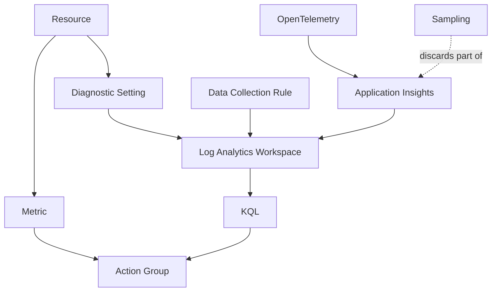

| Concept | Definition |
| --- | --- |
| **Log Analytics Workspace** | the store logs land in, and the place a KQL query runs against them |
| **Diagnostic Setting** | the per-resource switch that starts logs flowing anywhere at all; without one there are no logs to query |
| **Metric** | a pre-aggregated number over time: cheap, granular, and what an alert threshold is set on |
| **KQL** | Kusto Query Language, the language logs are queried in |
| **Data Collection Rule** | a declaration of what to collect from a machine and where to send it, held apart from the machine itself |
| **Action Group** | the set of notification targets an alert fires into |
| **Application Insights** | application performance monitoring and distributed tracing, stored in a Log Analytics Workspace like everything else |
| **OpenTelemetry** | the vendor-neutral instrumentation standard Azure now recommends over its own SDKs |
| **Sampling** | discarding a fixed proportion of telemetry to hold ingestion cost down, at the cost of exact counts |

### Concepts — Governance

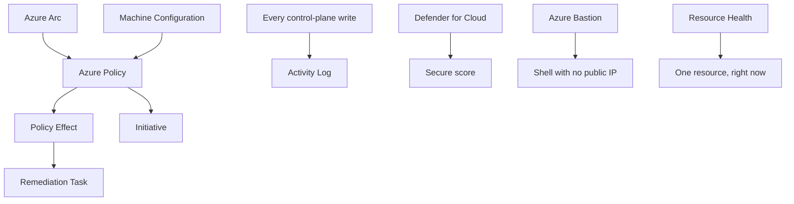

| Concept | Definition |
| --- | --- |
| **Activity Log** | the ninety-day record of control-plane writes: who changed what, when, and from where |
| **Policy Effect** | what a policy does when it matches — Audit, Modify, DeployIfNotExists or Deny — and the only preventative deny Azure offers |
| **Initiative** | a named group of policy definitions assigned together, so that compliance is reported once rather than per rule |
| **Remediation Task** | the job bringing resources that already exist into line with a DeployIfNotExists Policy Effect |
| **Defender for Cloud** | the security posture service behind the secure score and the regulatory compliance dashboards |
| **Azure Bastion** | managed RDP and SSH access with no public IP, no open inbound port and no jump box to maintain |
| **Machine Configuration** | continuous desired-state auditing and enforcement inside a machine, reporting compliance alongside policy |
| **Azure Arc** | projecting Azure governance onto machines and clusters that run outside Azure |
| **Resource Health** | whether one specific Resource is healthy right now, as distinct from Azure-wide service health |

### Azure Monitor — Metrics, Logs and Alerts

One service holding two very different kinds of data. Knowing which one you are looking at explains most of the confusion people have with it.

- **Entry point:** a **Log Analytics workspace**, plus a **diagnostic setting** on every resource you care about. **This is the gotcha that matters most in Azure**: platform metrics are collected automatically, but a resource emits **no logs anywhere at all** until you create a diagnostic setting routing them to a workspace, a storage account or an event hub. "Why is there no data?" is almost always a missing diagnostic setting.
- **Metrics versus logs:** **metrics** are pre-aggregated numbers over time — cheap, one-minute granularity, queried by name and **dimensions**. **Logs** are tables queried with **KQL** (Kusto Query Language), billed **per gigabyte ingested plus retention**, and far more expressive. The rule of thumb: send high-cardinality detail to logs, and set alert thresholds against metrics.
- **Three kinds of alert:** **metric alerts** are fast and cheap and can use dynamic thresholds that learn the normal baseline. **Log search alerts** run any KQL query, are slower, and are billed per evaluation. **Activity log alerts** fire when someone changes or deletes something. All of them route into **action groups** (email, webhook, ITSM ticket), and **alert processing rules** suppress them during maintenance windows.
- **Collecting from machines:** the **Azure Monitor Agent** plus **Data Collection Rules**. A rule declares what to collect and where to send it, separately from the machine itself, so you change collection without touching servers. It replaced the older Log Analytics agent, retired 31 August 2024.

### Application Insights — Application Performance and Tracing

- **Entry point:** a **workspace-based** Application Insights resource (classic ones were retired in February 2024) and a connection string in the application.
- **Instrument with OpenTelemetry.** The **Azure Monitor OpenTelemetry distribution** is the current answer: you instrument once against an open standard and export to Application Insights or to a third-party backend, rather than tying your instrumentation to one vendor. Traces correlate across service boundaries through the W3C `traceparent` header, which is what makes the end-to-end transaction view and the application map work at all.
- **Controlling cost means controlling sampling.** Adaptive sampling is on by default and ingestion sampling acts as a backstop. **Live Metrics** streams unsampled data for the few minutes you are watching a deployment.

### Activity Log and Auditing — The "Who Did This" Layer

- **Entry point:** the **Activity Log**, which records every control-plane write against ARM, retained **90 days free** and exported beyond that with — again — a diagnostic setting. It answers who created, changed or deleted a resource, from where, and when.
- **Know its boundary:** the Activity Log records **API calls, not contents**. Nothing about who read which blob appears in it. Data-plane auditing is enabled **per service** — storage diagnostics, Key Vault logs, SQL audit — each one separately, which is genuinely more work than flipping a single switch.
- **A third, separate stream:** Entra **sign-in** and **audit** logs live in the directory rather than in any subscription, and need their own diagnostic setting to reach a workspace. A real security investigation normally needs the resource stream and the directory stream joined together.

### Azure Policy — The Guardrail RBAC Cannot Provide

- **Entry point:** a **policy definition** with an **effect**, assigned at a scope. The effects in ascending order of intervention: `Audit` (record it), `AuditIfNotExists` (record a missing companion resource), `Append` and `Modify` (change the request as it arrives), `DeployIfNotExists` (create the missing thing), and **`Deny`** (refuse the request). Group definitions into **initiatives** and grant time-limited **exemptions** rather than removing a policy when one team needs an exception.
- **Why it is structural, not optional:** because [Azure RBAC has no user-authored deny](#azure-rbac--the-authorization-model), `Deny` policies are the only way to enforce rules such as "no public IP addresses", "only these Regions", or "every resource must carry an owner tag". And `DeployIfNotExists` paired with a remediation task is how you *fix* the resources that already violate the rule — the closest thing Azure has to a self-healing estate.
- **Compliance reporting comes free:** built-in initiatives map to CIS, ISO 27001, NIST and PCI, and roll up into **Microsoft Defender for Cloud**'s secure score and regulatory compliance dashboard.

### Fleet Management — Bastion, Update Manager, Automation and Arc

Azure has no single equivalent of AWS Systems Manager. The same job is split across several services, and saying that cleanly is worth more than reciting the list.

- **Azure Bastion** gives browser or native-client RDP and SSH access to machines **with no public IP address, no exposed management ports, and no jump box of your own to patch**. This is the concrete answer to "how would you improve the security of this environment".
- **Azure Update Manager** assesses and schedules operating system patching across Azure machines and, through Arc, on-premises ones too.
- **Run Command** and the **Custom Script Extension** execute commands on machines through the Azure control plane rather than over the network, which means they work even when the network path does not.
- **Azure Automation** runs PowerShell and Python **runbooks** on a schedule or from a webhook — the general-purpose operations glue — and **Machine Configuration** (formerly Guest Configuration) continuously audits and enforces desired state on machines rather than applying it once.
- **Azure Arc** projects the entire Azure control plane — Policy, Monitor, Update Manager, Defender, RBAC — onto servers, Kubernetes clusters and databases running on-premises or in another cloud. It is the answer to any hybrid governance question.

### Advisor and Service Health — The Advisory Layer

- **Azure Advisor** generates recommendations across reliability, security, performance, cost and operational excellence from your own usage data, including right-sizing and idle resource detection. It is where a cost conversation should start; see [Cost](#cost--the-levers-in-order-of-size).
- **Service Health versus Resource Health:** Service Health covers Azure-side incidents, planned maintenance and upcoming retirements affecting *your* subscriptions. **Resource Health** tells you whether *this particular resource* is healthy right now and why it last was not. Wire both to alerts rather than expecting anyone to check a dashboard.

## Infrastructure as Code and Delivery

Everything above describes what you can create. This section is about creating it from a file in version control rather than by hand in the portal, which is what makes an environment reproducible, reviewable and recoverable.

### Concepts — Infrastructure as Code and Delivery

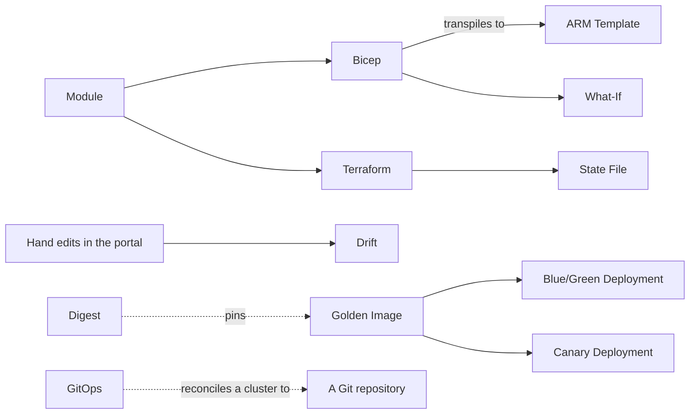

| Concept | Definition |
| --- | --- |
| **ARM Template** | the JSON every Azure deployment ends up as, whatever language it was written in |
| **Bicep** | a readable language transpiling to an ARM Template, with modules and a preview run built in |
| **Terraform** | a cross-cloud tool that keeps its own record of what it created rather than asking Azure |
| **State File** | Terraform's record of what it created, which is how it tells "create this" from "update that"; it needs storage, locking and backup of its own |
| **What-If** | the preview of what a deployment would add, modify or replace, produced before anything is applied |
| **Drift** | the divergence between what the code says and what actually exists, created by someone changing something by hand |
| **Module** | a reusable, versioned piece of infrastructure published to a registry, so one team's pattern becomes everyone's without copy-paste |
| **Golden Image** | an Image with the operating system, agents and application already baked in, so that a deploy replaces a machine instead of patching it |
| **Digest** | the content hash of a container image, and the only reference that cannot be moved to point at different content |
| **Blue/Green Deployment** | running the new version beside the old and switching traffic at once, so that a rollback is another switch |
| **Canary Deployment** | shifting a small share of traffic first and watching the metrics before moving the rest |
| **GitOps** | reconciling a cluster to a Git repository continuously, so that its state is a consequence of the repository rather than of who ran the last command |

### The Tool Choice

| Tool | Who makes it | What it is for |
|---|---|---|
| **ARM templates** | Microsoft | JSON, verbose, and still what everything else compiles down to |
| **Bicep** | Microsoft | A readable language that transpiles to ARM JSON; supports modules and preview runs |
| **Terraform** | HashiCorp | Works across clouds and other providers; keeps its own state file |
| **Pulumi** | Pulumi | Infrastructure defined in general-purpose programming languages |
| **Ansible** | Red Hat | Primarily configuration management, with light provisioning |

The Bicep-versus-Terraform decision comes up in almost every conversation and has a rehearsed answer in [Trade-Offs](#bicep-versus-terraform).

### The Ideas Underneath the Tools

- **State.** Terraform records what it created in a **state file**, which is how it knows the difference between "create this" and "update that". On Azure that file lives in a storage account, with **blob lease locking** so two pipelines cannot write it simultaneously. Bicep has no state file at all, because ARM already knows what exists. State is Terraform's greatest strength and its main operational liability: it needs storage, locking, backup and an access model of its own.
- **Idempotency.** Declarative tools describe the desired end state rather than the steps to get there, so running the same file twice converges on the same result instead of creating things twice. This is what makes it safe to re-run a pipeline after a failure.
- **Modules.** Both Bicep and Terraform support reusable, versioned modules published to a private registry. This is how one team's networking pattern becomes every team's networking pattern without copy-paste.
- **Drift detection.** Drift is the gap between what the code says and what actually exists, created by someone changing something in the portal. `terraform plan`, Bicep's `what-if`, and Azure Policy compliance scans all surface it. A nightly plan that alerts when the diff is non-empty is what proves the code is genuinely the source of truth, and it is the piece most teams skip.
- **Multiple environments.** One set of modules, different parameter files per environment (`*.tfvars` or `.bicepparam`), and a naming convention applied consistently. Copying the whole codebase per environment is the anti-pattern; the environments drift apart within a quarter.

### CI/CD for Infrastructure

- **Azure DevOps Pipelines** and **GitHub Actions** both do this job. Choose by where the code already lives; the differences are covered in [Trade-Offs](#other-pairs-worth-a-rehearsed-answer).
- **The pipeline shape** is the same either way: for Terraform, plan → manual approval → apply; for Bicep, validate → what-if → deploy.
- **Authentication should use workload identity federation**, not a stored service principal secret. See [Workload Identity Federation](#workload-identity-federation--keyless-pipelines) — this is the highest-value change available in most existing pipelines.
- **GitOps** is the application-layer counterpart: Flux or Argo CD watches a Git repository and reconciles the AKS cluster to match it, so the cluster's state is a consequence of the repository rather than of whoever last ran a command. See [CI/CD](../04-development-process/03-ci-cd.md) for the general pipeline concepts.
- **Testing infrastructure code** uses **Terratest** or **Pester** for behaviour, linting (`tflint`, `bicep lint`) for style, and **checkov** or **tfsec** to scan for insecure configurations before they are deployed.

### Configuration Management

Once a machine exists, something has to put software and settings on it — unless you [bake them into the image instead](#immutable-infrastructure-and-cloud-native-delivery), which is usually the better answer.

- **Azure Machine Configuration** continuously audits and enforces a desired state, reporting compliance into Azure Policy. It is the successor to PowerShell DSC and Azure Automation DSC, and the name to use for new work.
- **Azure Automation runbooks** handle scheduled and event-driven operational tasks in PowerShell or Python.
- **Ansible** handles post-provisioning configuration — packages, files, services — and is strongest at sequenced work across multiple hosts.
- **Custom Script Extension** and **cloud-init** handle first-boot bootstrap.
- **Azure Policy with `DeployIfNotExists` or `Modify`** is configuration enforcement at the resource level rather than inside the operating system, and it is often overlooked in this list.

## Immutable Infrastructure and Cloud-Native Delivery

**Immutable infrastructure** means never changing a running server. To deploy a change, you build a new machine or container from a new image and replace the old one. The payoff is that what is running always matches something you can rebuild, which removes the whole category of servers that drifted apart until nobody knew what was on them.

- **Golden images.** Bake the operating system, the agents and the application into a versioned image with **Azure Image Builder** or **Packer**, store it in an **Azure Compute Gallery**, and replicate it to the Regions that need it. Configuration management then only has to cover what genuinely cannot be baked.
- **Rolling replacement.** A [VMSS](#virtual-machines-and-scale-sets--rented-virtual-machines) rolling upgrade replaces instances in batches with the new image rather than patching them in place. [Ephemeral OS disks](#virtual-machines-and-scale-sets--rented-virtual-machines) make each replacement faster and free.
- **Immutable containers.** Pin image references by **digest** — the content hash — rather than by a tag such as `latest`, which can be moved to point at different content. Never modify a running container.
- **Progressive delivery.** Blue/green runs two complete versions and switches between them: [App Service deployment slots](#app-service-static-web-apps-and-container-instances--the-just-run-my-app-tier) with a swap, or two backends behind Front Door or Application Gateway. Canary shifts a small percentage of traffic first and watches the metrics: [Container Apps revision weights](#container-apps--serverless-containers) do this natively, and on AKS the tools are Argo Rollouts or Flagger.

### Cloud-Native Practices on Azure

- **Containers.** Multi-stage builds to keep images small, and image scanning with Trivy or Defender for Containers in the pipeline. The underlying concepts are in [Containers](../03-system-design/05-containers.md).
- **Kubernetes objects worth knowing by name:** Deployments (stateless replicas), StatefulSets (replicas with stable identity and storage), DaemonSets (one copy per node, for agents), Services (a stable address in front of pods), and Ingress (HTTP routing into the cluster, via the Application Gateway Ingress Controller on Azure).
- **Helm** packages a set of Kubernetes objects as one versioned, parameterised unit.
- **Scaling** comes in three forms: the Horizontal Pod Autoscaler (more pods), the Vertical Pod Autoscaler (bigger pods), and the cluster autoscaler or Node Auto Provisioning (more nodes). [KEDA](#aks--managed-kubernetes) adds event-driven scaling from queue depth.
- **Network policies** restrict which pods may talk to which, implemented by Azure Network Policy Manager, Calico or Cilium. This is one of the capabilities that genuinely requires AKS rather than Container Apps.
- **Service mesh** adds traffic management and mutual TLS between services. On AKS the supported route is the Istio-based add-on; the older Open Service Mesh add-on is retired and the project archived.
- **Dapr** provides publish/subscribe, state management and service invocation behind a uniform API, and is built into [Container Apps](#container-apps--serverless-containers).
- **The twelve-factor app** principles — configuration from the environment, stateless processes, logs as streams — are the philosophy all of the above assumes.

### The Delivery Pipeline End to End

1. Infrastructure code (Bicep or Terraform) lives in Git.
2. A pull request triggers formatting, linting, a security scan, and a plan or what-if posted as a comment.
3. A human reviews the diff and approves.
4. The pipeline applies it, authenticating with a federated identity and no stored secret.
5. Post-deployment, automated smoke tests run and a policy compliance scan checks the result.
6. Application-layer changes on AKS reconcile through GitOps rather than through the pipeline.

## Resilience and Operating at Scale

### Concepts — Resilience and Recovery

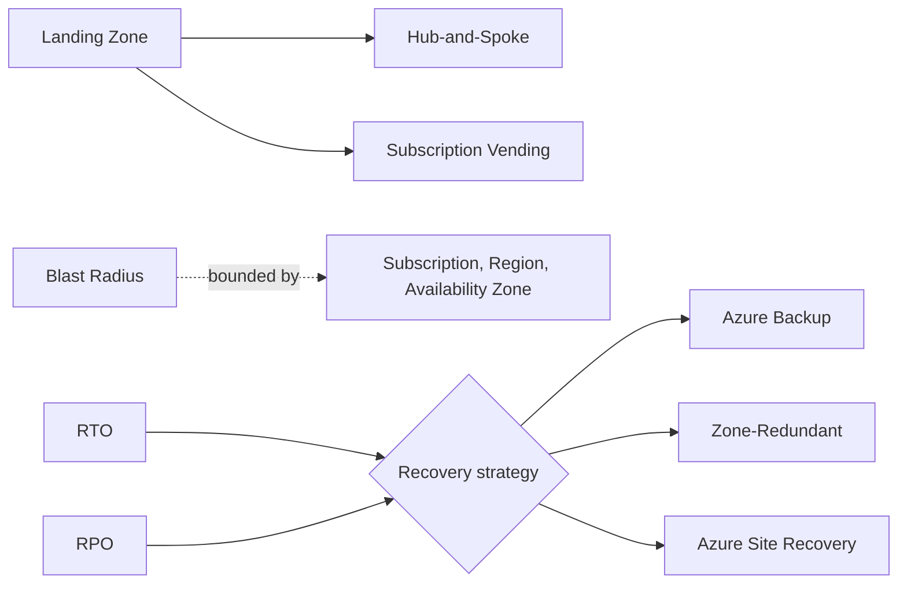

| Concept | Definition |
| --- | --- |
| **Blast Radius** | how much stops working when one thing fails; what the Subscription, Region and Availability Zone boundaries exist to bound |
| **Landing Zone** | a pre-built, governed starting point for an environment: the Subscription layout, network topology, policies and identity model already assembled |
| **Hub-and-Spoke** | the topology inside a Landing Zone: shared services in one VNet, one VNet per workload, and VNet Peering only to the hub |
| **Subscription Vending** | the automation issuing a new Subscription already placed, peered and governed, which is what makes a Landing Zone scale past a handful of teams |
| **RTO** | the time a service may stay down before recovery has to be complete |
| **RPO** | the quantity of data a recovery is allowed to lose, measured as a span of time |
| **Zone-Redundant** | spread across the Availability Zones of one Region by the service itself, which buys real resilience for almost no added design complexity |
| **Azure Backup** | scheduled copies of machines, files, databases and blobs into a vault, with retention set centrally |
| **Azure Site Recovery** | replication of whole machines to a second Region plus an orchestrated failover, including a test failover that does not disturb production |

### Landing Zones — The Structure You Start From

Microsoft publishes a Landing Zone as part of the Cloud Adoption Framework, and starting from it is almost always better than assembling the same pieces yourself.

Inside it, the Hub-and-Spoke topology puts shared services (firewall, gateways, DNS, Bastion) in the hub VNet and each workload in its own spoke. Because [peering is not transitive](#vnet-peering-and-virtual-wan--connecting-networks), spokes cannot reach each other directly, which means all east-west traffic can be forced through the firewall by routing. The diagram is in [Diagrams to Draw](#landing-zone-and-hub-spoke).

**Subscription vending** is the automation that makes this scale: a request for a new team produces a new subscription, already placed under the right management group, already peered, already governed — without anyone assembling it by hand.

For packaging deployments, **template specs** and **deployment stacks** are the current mechanisms. Azure Blueprints is deprecated and should not be used for new work.

### Backup and Recovery

- **Azure Backup** protects virtual machines, files, databases and blobs into a recovery services vault, with retention policies you set centrally.
- **Azure Site Recovery** replicates whole machines to another Region and orchestrates a failover, including a test failover you can run without disrupting production.
- **The two numbers that drive every design here** are **RPO** (recovery point objective — how much recent data you can afford to lose) and **RTO** (recovery time objective — how long you can afford to be down). They are business decisions, and they determine the architecture rather than the other way around. Geo-redundant storage has a real RPO because [replication is asynchronous](#storage-accounts--blobs-files-queues-and-tables); [Business Critical SQL](#azure-sql-and-the-flexible-servers--managed-relational-databases) has an RTO of seconds where General Purpose has tens of seconds.
- **Patching** is [Azure Update Manager](#fleet-management--bastion-update-manager-automation-and-arc) for machines you keep, and image replacement for machines you do not.

## Running It Well — Performance, Cost and Security

### Performance

- **Right-sizing** is the first lever, and it is usually downward: VM sizes, AKS node pool sizes, and autoscale thresholds chosen from measured usage rather than from the estimate someone made before launch. [Azure Advisor](#advisor-and-service-health--the-advisory-layer) does this analysis from your own metrics.
- **Caching** at two levels: [Front Door](#load-balancing--four-services-four-jobs) at the edge for content, and [Azure Cache for Redis](#azure-cache-for-redis-and-ai-search--the-supporting-stores) for application data.
- **Database tuning:** use the vCore model rather than DTU, read the query performance insights the service already collects, and move read-only traffic to a replica.
- **Measure before and after.** [Application Insights](#application-insights--application-performance-and-tracing) profiling shows where time actually goes, and **Azure Load Testing** generates the load to see it under pressure.
- **Zone-redundant SKUs** buy meaningful resilience for very little added complexity, and are usually a better first move than a multi-Region design.

### Cost — The Levers in Order of Size

The order matters, because engineers habitually start with the smallest lever.

- **Attribution before optimisation.** You cannot cut spend you cannot attribute. A **tagging strategy** with an owner and an environment on every resource, enforced with an Azure Policy `Deny` or `Modify` effect, is what makes the rest of this possible. **Cost Management** then reports by tag, and budgets alert the owning team rather than a central inbox.
- **Azure Hybrid Benefit** reuses Windows Server and SQL Server licences you already own, and in a Microsoft-heavy estate it is regularly the single largest line-item saving available. It is a procurement conversation rather than an engineering change, which is exactly why it gets overlooked.
- **Commitment discounts:** **Reservations** commit to a specific SKU family and Region for one or three years. **Savings Plans** commit to an hourly spend and stay flexible about what you spend it on. Buy either *after* right-sizing has settled — a reservation against a size you are about to change becomes a stranded commitment rather than a saving.
- **Spot** capacity is heavily discounted and can be reclaimed at 30 seconds' notice, which suits interruptible, checkpointed work and pairs naturally with stateless immutable design.
- **Scale to zero** wherever the platform allows it: [Container Apps](#container-apps--serverless-containers), [Functions](#azure-functions--functions-no-servers) on a consumption plan, and serverless Azure SQL.
- **Orphaned resources** accumulate silently: unattached managed disks, reserved public IP addresses attached to nothing, and old snapshots. A recurring query for them pays for itself.

### Security

- **Zero Trust, in practice**, means two things here: least privilege through [RBAC](#azure-rbac--the-authorization-model) assigned at the narrowest correct scope, and **no standing secrets** through [managed identities](#managed-identities--the-password-free-bridge) and [workload identity federation](#workload-identity-federation--keyless-pipelines).
- **Network segmentation:** [NSGs and ASGs](#nsgs-asgs-and-azure-firewall--the-filtering-layers) between tiers, [Azure Firewall](#nsgs-asgs-and-azure-firewall--the-filtering-layers) for outbound inspection, and [private endpoints](#private-link-and-service-endpoints--reaching-managed-services-privately) so managed services are not reachable from the internet at all.
- **Secrets** live in [Key Vault](#key-vault--secrets-keys-and-certificates), with rotation enabled where the service supports it and [Key Vault references](#key-vault--secrets-keys-and-certificates) so they never enter application configuration.
- **Encryption** is on by default at rest; the decision is platform-managed keys versus customer-managed keys, which is a compliance question about who can revoke access. In transit, TLS everywhere.
- **Guardrails** through [Azure Policy](#azure-policy--the-guardrail-rbac-cannot-provide): deny public IP addresses, require HTTPS, restrict Regions, mandate tags. Because RBAC cannot express a deny, this is the only preventative control available.
- **Supply chain:** scan images for vulnerabilities, produce an SBOM (a manifest of everything inside a build), sign commits and artifacts, and scan dependencies — all inside the pipeline, before anything is deployed.
- **Audit and compliance:** the [Activity Log](#activity-log-and-auditing--the-who-did-this-layer) plus per-service diagnostic settings feeding Log Analytics and Microsoft Sentinel, with [Defender for Cloud](#azure-policy--the-guardrail-rbac-cannot-provide) providing the secure score and the regulatory compliance dashboard.

## Diagrams to Draw

Being able to sketch these while talking is worth more than being able to recognise them. How to practise narrating a diagram while drawing it is covered in [Interview Technique](../10-humans/21-interview.md); what follows is the Azure-specific content.

### Landing Zone and Hub-Spoke

Draw order: management groups top-down, then the hub, then the spokes, then the connections last.

```text
              ┌──────────────── Tenant Root MG ────────────────┐
              │                                                │
        ┌─────┴─────┐    ┌───────────┐    ┌───────────┐  ┌─────┴─────┐
        │ Platform  │    │ Landing   │    │  Sandbox  │  │Decommiss- │
        │    MG     │    │ Zones MG  │    │    MG     │  │  ioned MG │
        └─────┬─────┘    └─────┬─────┘    └───────────┘  └───────────┘
              │                │
     ┌────────┼────────┐   ┌───┴────┬─────────┐
  Identity Management Connectivity │         │
    sub      sub        sub      Corp     Online
                         │        sub       sub
                         │         │         │
                    ┌────▼─────────▼─────────▼────┐
                    │      HUB VNet (Connectivity) │
                    │  ┌────────┐  ┌────────────┐  │
                    │  │ Azure  │  │ VPN / ER   │  │──── on-prem
                    │  │Firewall│  │  Gateway   │  │
                    │  └────────┘  └────────────┘  │
                    │  ┌────────┐  ┌────────────┐  │
                    │  │ Bastion│  │Private DNS │  │
                    │  └────────┘  └────────────┘  │
                    └───┬──────────────────┬───────┘
                 peering│                  │peering
                 ┌──────▼──────┐    ┌──────▼──────┐
                 │ SPOKE: Prod │    │ SPOKE: NonPd│
                 │ ┌─────────┐ │    │ ┌─────────┐ │
                 │ │ AKS /   │ │    │ │ AKS /   │ │
                 │ │ App Svc │ │    │ │ App Svc │ │
                 │ └────┬────┘ │    │ └─────────┘ │
                 │ ┌────▼────┐ │    └─────────────┘
                 │ │ Private │ │
                 │ │Endpoints│──────► SQL / Storage / Key Vault
                 │ └─────────┘ │      (no public access)
                 └─────────────┘
```

Points to make **while** drawing:

- Spokes peer to the hub and **never to each other** — east-west traffic is forced through the firewall by a user-defined route sending `0.0.0.0/0` to the firewall's private address.
- Private DNS zones live in the hub and are linked to every spoke, because otherwise private endpoint name resolution silently fails and clients quietly keep using public addresses.
- Policy is assigned at the **management group** level so that new subscriptions inherit the guardrails at the moment they are created. This is the answer to "how does this scale to fifty teams?"
- Mention **subscription vending** as the automation that makes a new spoke repeatable rather than a ticket.

### CI/CD for Infrastructure as Code

Draw order: left to right, the pull request path on top, the main path below.

```text
   ┌──────────┐
   │ Feature  │
   │  branch  │
   └────┬─────┘
        │ open PR
        ▼
   ┏━━━━━━━━━━━━━━━━━━━━━━━ PR VALIDATION ━━━━━━━━━━━━━━━━━━━━━━━┓
   ┃  fmt/lint ──► validate ──► tfsec/checkov ──► plan / what-if  ┃
   ┃  (tflint)     (bicep       (policy-as-      (posted as a     ┃
   ┃               build)        code scan)       PR comment)     ┃
   ┗━━━━━━━━━━━━━━━━━━━━━━━━━━━━━━━━┳━━━━━━━━━━━━━━━━━━━━━━━━━━━━━┛
                                    │ human review + merge
                                    ▼
   ┏━━━━━━━━━━━━━━━━━━━━━━━━ MAIN PIPELINE ━━━━━━━━━━━━━━━━━━━━━━━┓
   ┃                                                              ┃
   ┃   DEV ──────► TEST ──────► [ APPROVAL GATE ] ──────► PROD     ┃
   ┃  auto        auto           (env protection)       manual    ┃
   ┃    │           │                                      │      ┃
   ┃    └───────────┴──── same modules, different ─────────┘      ┃
   ┃                        *.tfvars / .bicepparam                ┃
   ┗━━━━━━━━━━━━━━━━━━━━━━━━━━━━━━━━┳━━━━━━━━━━━━━━━━━━━━━━━━━━━━━┛
                                    ▼
                    ┌───────────────────────────────┐
                    │  POST-DEPLOY                  │
                    │  • smoke tests                │
                    │  • Azure Policy compliance    │
                    │  • drift detection (nightly   │
                    │    plan → alert if non-empty) │
                    └───────────────────────────────┘

   AUTH:  Pipeline ──OIDC federated credential──► Entra ID workload identity
          (NO secrets stored in the pipeline — this is the bit to say out loud)

   STATE: Terraform remote state in a Storage Account
          + blob lease locking + a separate state file per environment
```

Points to make while drawing:

- **Promote the plan artifact.** Apply the *saved plan file* produced during the pull request, not a freshly generated one at apply time — otherwise you are approving one thing and deploying another.
- **Blast radius:** a separate state file per environment, so a corrupted development state cannot reach production.
- **Drift detection** is the bullet most people forget. A nightly plan that alerts on a non-empty diff is the thing that proves the code is actually the source of truth.

### Also Worth Being Able to Draw

- **The AKS request path:** Front Door → Application Gateway (via the Ingress Controller) → Ingress → Service → Pods, with Entra Workload ID pointing off to Key Vault and SQL.
- **An immutable pipeline:** source → Packer or Image Builder → Azure Compute Gallery (versioned, replicated) → VMSS rolling upgrade.
- **Blue/green:** two slots or two backends behind one traffic switch, with the swap arrow *and* the rollback arrow both drawn explicitly.

## Trade-Offs — The "It Depends on X" Answers

A good trade-off answer names the deciding variable first, then argues both sides, then commits. The general technique is in [Interview Technique](../10-humans/21-interview.md); these are the Azure pairs worth having ready.

### Bicep versus Terraform

**It depends on:** whether you are Azure-only, what the organisation already runs, and how quickly you need support for brand-new services.

| Aspect | Bicep | Terraform |
|---|---|---|
| **Scope** | Azure only | Multiple clouds, plus Entra ID, GitHub, Datadog and others |
| **State** | None — ARM is the state | An explicit state file: real power, real liability |
| **New Azure features** | Available on day one, through ARM | Provider lag; the `azapi` provider covers the gap |
| **Preview run** | `what-if`, which is approximate | `plan`, which is precise because it has state |
| **Deletes** | Leaves out-of-band resources alone unless in Complete mode | Tracks and destroys what it created |
| **Ecosystem** | Azure Verified Modules, growing | A large, mature module registry |
| **Cost and support** | Free, supported by Microsoft | Open-source core; the licence change matters to some organisations → OpenTofu |

**Sample answer:** *"If the estate is Azure-only and the team lives in the portal and PowerShell, Bicep — no state file to corrupt, day-zero support for new resource types, and it's supported by the same vendor as the platform. I flip to Terraform the moment there's a second provider in play, and there usually is: Entra ID app registrations, GitHub repositories, DNS at an external registrar. That's not multi-cloud, but it is multi-provider, and Bicep can't reach it. The real cost of Terraform is that state becomes a production asset — it needs remote storage, locking, backup and an access model of its own. If a team isn't ready to own that, Bicep is the safer choice."*

### AKS versus Container Apps

**It depends on:** whether you need the Kubernetes API surface, your team's operational maturity, and your scale-to-zero requirements.

| Aspect | Container Apps | AKS |
|---|---|---|
| **You manage** | Containers only | The cluster, node pools, upgrades and patching |
| **Scale to zero** | Yes, built in | User node pools can; the System pool cannot, so a cluster always costs something at idle |
| **Built in** | KEDA, Dapr and Envoy | You install them |
| **Extensibility** | No custom resources, no DaemonSets, no custom controllers | The full ecosystem |
| **Networking** | Simplified | Network policies, CNI modes, full control |
| **Operational burden** | Low | Real, and it needs a named owner |

**Sample answer:** *"Default to Container Apps. It's KEDA, Dapr and Envoy already wired together, and it scales to zero, which matters for spiky or non-production workloads. I move to AKS when I hit something Container Apps structurally can't do — custom resources and operators, DaemonSets for a node-level agent, network policies for tenant isolation, or a service mesh. The honest deciding question is usually organisational rather than technical: does someone own cluster upgrades? Last time I checked the AKS version support policy — and Microsoft has moved these windows before, so I'd re-read it — a Kubernetes minor version got roughly twelve months of community support, then a further year of platform support where Azure keeps supporting the cluster but upstream fixes are no longer backported, with Long-Term Support on the Premium tier stretching it to two years. That middle window is the one people forget: the cluster is still supported and quietly no longer getting Kubernetes patches. Either way an unowned cluster falls off a supported version on a clock you don't control. If nobody owns upgrades, Container Apps is the right call even where AKS would technically fit."*

### Machine Configuration versus Ansible

**It depends on:** your operating system mix, whether the machines are mutable at all, and whether you want push or pull.

| Aspect | Machine Configuration | Ansible |
|---|---|---|
| **Model** | Pull, agent-based, **continuously** re-asserts | Push, agentless over SSH/WinRM, point-in-time |
| **Drift** | Corrects it and reports compliance to Azure Policy | Only fixed when you next run it |
| **Operating systems** | Windows-first, Linux supported | Strong on both |
| **Reach** | Anywhere the agent runs, including Arc-connected on-premises | Needs a network path from a control node |
| **Best at** | Holding a steady state | Orchestrating ordered, multi-host sequences |

**Sample answer:** *"Machine Configuration when the goal is 'this baseline must never drift' — it's pull-based, it re-asserts on a schedule, and compliance lands in Azure Policy next to everything else, so auditors get one dashboard. Ansible when the work is orchestration rather than enforcement: sequenced steps across multiple hosts, mixed operating systems, anything with ordering between machines. They aren't really competing — I've run both, Machine Configuration holding the security baseline and Ansible doing app deployment on top. But the answer I'd push for is neither: if you're configuring VMs at boot, ask why the image doesn't already have it. Bake it with Image Builder and the drift problem stops existing. Config management is what you keep for the cases you can't bake."*

### Other Pairs Worth a Rehearsed Answer

| Pair | The deciding variable |
|---|---|
| **Azure DevOps vs. GitHub Actions** | Where the code already lives. Azure DevOps ships more built-in gate types out of the box (query work items, call a REST endpoint, wait on a monitor alert); GitHub Actions has the larger ecosystem. Both are actively developed, so re-check the gap rather than quoting it. |
| **Service endpoint vs. private endpoint** | Do you need a private address in your VNet and reachability from on-premises? Then a private endpoint — it costs more and depends on DNS. |
| **VMSS vs. AKS** | Are you running containers, or an application that needs identical whole machines? |
| **Managed identity vs. service principal** | Is the workload running *inside* Azure? Then a managed identity. External CI? A service principal with OIDC federation, never a stored secret. |
| **Azure Firewall vs. NSG** | An NSG gives free layer-4 rules per subnet or interface. Firewall adds domain-name filtering, threat intelligence and central logging, and bills a fixed hourly charge plus a per-gigabyte charge. |
| **Reservation vs. Spot** | Is the workload steady-state, or interruptible and checkpointed? |
| **Hub-spoke vs. Virtual WAN** | The number of Regions and branch sites. Virtual WAN is managed transit bought at the cost of control. |
| **Blue/green vs. canary** | Can you afford two full environments, or do you need a gradual, metric-driven rollout? |
| **General Purpose vs. Business Critical SQL** | Is an RTO of tens of seconds acceptable, or do you need seconds and a free readable replica? |

## Interview Rehearsal

Azure infrastructure roles are consistently assessed against five competency areas. Everything needed to answer them is above; this section is the checklist and the story structure.

### The Five Areas, and What to Be Ready to Say

| Area | Be ready to | Where it is covered |
|---|---|---|
| **1. Core concepts** | Walk the hierarchy out loud and name which level each policy, role and budget belongs at; distinguish Azure RBAC from Entra roles; say which of Regions, zones and Region pairs answers a resilience question and which answers a disaster-recovery one | [Foundations](#foundations), [Identity](#identity-secrets-and-access) |
| **2. Building and maintaining infrastructure** | Describe a landing zone and hub-spoke topology, subscription vending, and your backup and DR position in RPO and RTO terms | [Resilience and Operating at Scale](#resilience-and-operating-at-scale) |
| **3. Automation and configuration management** | Defend an IaC tool choice, describe the pipeline shape, explain state and drift, and say how the pipeline authenticates | [Infrastructure as Code and Delivery](#infrastructure-as-code-and-delivery) |
| **4. Immutable infrastructure and cloud-native** | Explain golden images and rolling replacement, and name the Kubernetes and CNCF pieces you have actually used | [Immutable Infrastructure](#immutable-infrastructure-and-cloud-native-delivery) |
| **5. Performance, cost and security** | Give the cost levers in order of size, and describe zero-trust in terms of least privilege and no standing secrets | [Running It Well](#running-it-well--performance-cost-and-security) |

### Behavioural Stories

The story structure, the two rules for telling one, and the two stories asked in every loop whatever the cloud are in [Interview Technique](../10-humans/21-interview.md). What follows is Azure-specific.

#### Worked Example — Automation

Every figure below is a placeholder. Substitute your own resource counts, timings and outcomes, and keep the shape of the answer.

> **Situation:** "Three environments, about 200 resources, all built in the portal over two years and described by nothing but a wiki page. Deployments ran from an Azure DevOps variable group holding one service principal secret that was Owner on every subscription and had not been rotated since the pipeline was written."
>
> **Task:** "I owned getting the estate into code and getting that standing secret out of the pipeline, without freezing delivery while I did it."
>
> **Action:** "I didn't start by writing Bicep. I exported the existing resource groups to ARM templates and ran `what-if` against them until the diff came back empty, which told me what the portal had actually created rather than what the wiki claimed — six resources nobody could name an owner for, and two NSG rules that existed only in production. Then I rewrote that as Bicep modules, one per resource group, and adopted environments into the code one at a time instead of in a single pass. I chose Bicep over Terraform deliberately: the estate was Azure-only, the team already read ARM JSON in the portal, and I didn't want to hand people with no prior state-file experience a Terraform backend to operate on top of a new language. Separately I replaced the variable-group secret with workload identity federation on the service connection, scoped per environment, and cut the identity from Owner down to Contributor plus an explicit User Access Administrator assignment only where role assignments were genuinely needed. Those two changes went in as separate pull requests so a rollback of one couldn't block the other."
>
> **Result:** "Within two quarters every environment deployed from `main`, the drift that had made production special was either codified or deleted, and there was no secret left in the pipeline to rotate or leak. What I'd do differently is turn on the Azure Policy `DeployIfNotExists` for diagnostic settings in month one rather than month four — half the resources I adopted had never emitted a log anywhere, and I only found that out at the point I needed the logs."

Note what that does. It names a **decision with an alternative rejected and a reason** (Bicep over Terraform, because the estate was Azure-only and nobody was ready to own state). It shows **risk management** (reconcile with `what-if` before writing a line; keep the two changes in separate pull requests). And it closes with **honest hindsight**, which reads as senior rather than as weakness.

#### Worked Example — Cost

The figures here are placeholders too. Replace the spend, the split and the saving with your own before using this.

> **Situation:** "One subscription, and about 40% of the monthly bill sat on resources with no owner tag at all. Finance had asked twice which team owned which half of the spend and nobody could answer, so the bill had never really been questioned."
>
> **Task:** "I was asked to cut the run-rate without a migration and without resizing production on guesswork."
>
> **Action:** "I went after attribution before savings: a Cost Management export into a Log Analytics workspace, plus an Azure Resource Graph query listing every resource missing the owner and environment tags. Two weeks of asking the teams who recognised the resource names got the untagged share under 5%, and only then did I look at what to cut — in a deliberate order. Azure Hybrid Benefit turned out to be switched off across the whole Windows fleet, which was the single largest line and a licence-entitlement conversation with procurement rather than an engineering change; I mention it first because engineers rarely look there first. Then three App Service Plans were each running one app at P2v3, so consolidating them onto one plan was two hours of work. Then an Azure Firewall sat in the non-production hub billing its fixed hourly charge around the clock for workloads that ran office hours. I held reservations back until the resizing had settled, because a reservation bought against a size you're about to change stops being a saving and becomes a stranded commitment."
>
> **Result:** "About 28% off the monthly run-rate over two billing cycles, with no production change at all. The durable part is the tagging: budgets are scoped per team now and the alert goes to that team rather than to me. In hindsight I'd have checked Hybrid Benefit in week one — I spent a month in infrastructure detail while the biggest lever was a licensing setting."

#### Story Bank by Area

| Area | Likely prompt | The story to prepare |
|---|---|---|
| **1. Core concepts** | "Walk me through how you'd structure subscriptions for a new business unit" | A governance, RBAC or landing-zone decision |
| **2. Infrastructure** | "Tell me about the most complex environment you've built" | Hub-spoke, networking, or a migration |
| **3. Automation** | "Describe a manual process you automated" | IaC adoption, a pipeline build, or configuration management |
| **4. Immutable / cloud-native** | "Tell me about a deployment that went wrong" | A rollback, a blue/green cutover, or a containerisation effort |
| **5. Performance, cost, security** | "How have you handled a security or cost problem?" | Cost reduction, incident response, or eliminating stored secrets |

## AWS to Azure Service Map

Mappings are approximate. Where the two services differ in shape, the third column names the difference — which is usually the more useful half.

| AWS | Azure | Where the analogy breaks down |
|---|---|---|
| **Account** | Subscription | The billing, quota and isolation boundary on both sides. Management groups sit above it and answer to Organizations OUs; resource groups sit below and have no AWS equivalent |
| **EC2** | Virtual Machines | Subnets are regional in Azure, so the machine picks its zone |
| **Auto Scaling group** | Virtual Machine Scale Sets | Flexible orchestration keeps instances individually addressable; Uniform is the older anonymous model |
| **ECS / Fargate** | Container Apps | Container Apps bundles KEDA, Dapr and revision-based traffic splitting |
| **EKS** | AKS | The control plane is free on the AKS Free tier, which carries no availability guarantee |
| **ECR** | Azure Container Registry | The AKS *kubelet* identity needs the pull permission, not the cluster identity |
| **Lambda** | Azure Functions | Bindings are declarative input and output; Durable Functions has no Lambda equivalent |
| **Step Functions** | Durable Functions / Logic Apps | Durable orchestrators are ordinary code and must be deterministic; Logic Apps is the low-code path |
| **VPC / Internet Gateway** | VNet / *(none)* | There is no internet gateway; outbound access needs a NAT Gateway or another explicit method |
| **Security Group** | NSG + ASG | NSGs support deny rules and explicit priority ordering |
| **ALB / NLB** | Application Gateway / Load Balancer | Application Gateway is the regional layer-7 tier with WAF; Load Balancer is layer 4 |
| **CloudFront + Global Accelerator** | Front Door | One service covers the anycast edge, caching, edge WAF and global failover |
| **Route 53** | Azure DNS + Private DNS Zones | Private DNS is the first place to look when a private endpoint misbehaves |
| **Route 53 routing policies** | Traffic Manager | Both are DNS-level global routing with the same set of policies |
| **PrivateLink** | Private Link / Private Endpoint | Service endpoints are a coarser, free middle option with no AWS equivalent |
| **Transit Gateway** | Virtual WAN | Hand-built hub-and-spoke with route tables is still common on Azure |
| **Direct Connect** | ExpressRoute | Private peering reaches VNets; Microsoft peering reaches public Microsoft endpoints |
| **Site-to-Site VPN** | VPN Gateway | Deploy active-active across zones; the SKU sets the ceiling and resizes only within a family |
| **S3** | Blob Storage | The *storage account*, not the container, is the limits and firewall boundary |
| **EBS** | Managed Disks | Premium SSD v2 is the gp3 equivalent |
| **EFS / FSx** | Azure Files / NetApp Files | Azure Files speaks SMB natively and integrates with Active Directory |
| **RDS / Aurora** | Azure SQL Database / Flexible Server | The service tier *is* the availability model; Hyperscale is the Aurora-shaped tier |
| **DynamoDB** | Cosmos DB | Five consistency levels, and RU/s instead of separate read and write capacity units |
| **ElastiCache** | Azure Cache for Redis | The Premium tier is where network integration, persistence, clustering and geo-replication appear |
| **OpenSearch** | Azure AI Search | Content search only; log search belongs to Log Analytics and KQL |
| **SQS** | Service Bus / Storage Queues | Azure has no direct SNS equivalent; Event Grid covers the notification case |
| **Kinesis / MSK** | Event Hubs | One service, with a Kafka protocol endpoint built in |
| **EventBridge** | Event Grid | System topics cover the "react to infrastructure" case |
| **IAM** | Azure RBAC | Assignments are additive and inherit downward, and there is no user-authored deny |
| **IAM roles (instance profiles, IRSA)** | Managed identities | System- versus user-assigned; user-assigned avoids the deploy-time race |
| **IAM Identity Center** | Microsoft Entra ID + PIM | Entra is the directory itself, not a layer on top of one |
| **SCPs** | Azure Policy (`Deny`) | RBAC has no user-authored deny, so Policy carries the guardrail |
| **KMS** | Key Vault keys / Managed HSM | Managed HSM is the FIPS 140-validated single-tenant option |
| **Secrets Manager** | Key Vault | One vault holds secrets, keys and certificates; Key Vault references resolve them at runtime |
| **CloudFormation / CDK** | ARM templates / Bicep | Bicep compiles to ARM JSON, and every tool ends at Azure Resource Manager |
| **CloudWatch** | Azure Monitor | Nothing logs anywhere until you create a diagnostic setting |
| **CloudTrail** | Activity Log | Control plane only; data-plane auditing is enabled per service |
| **AWS Config** | Azure Policy + Resource Graph | Policy is preventative *and* detective, where Config is detective only |
| **Systems Manager** | Update Manager + Automation + Run Command + Bastion | There is no single umbrella service |
| **Trusted Advisor / Compute Optimizer** | Azure Advisor | One service covers all five pillars |
| **Cost Explorer** | Microsoft Cost Management | Budgets, cost analysis by tag, and Advisor's cost recommendations in one place |

## Where to Go Next

- [AWS Handbook](01-aws.md) maps the same ground onto the other major cloud, and is the fastest route in for anyone arriving from AWS — read it alongside the [service map](#aws-to-azure-service-map) above.
- [GCP Handbook](03-gcp.md) covers the third platform, where a global VPC and an inherited resource hierarchy change several of the answers given here.
- [Containers — Core Concepts and Orchestration](../03-system-design/05-containers.md) explains the ideas behind AKS and Container Apps for readers who want the concepts before the products.
- [CI/CD](../04-development-process/03-ci-cd.md) covers the pipeline concepts the delivery section here assumes.
- [Interview Technique](../10-humans/21-interview.md) covers how to actually deliver the trade-off answers and stories above.
