# GCP Handbook

Google Cloud offers around two hundred services. Most systems use about thirty of them, and this document covers those thirty three ways at once: what each one is and what it costs you in practice, the vocabulary the design conversation assumes, and the questions an infrastructure role is asked over both.

The material is grouped the way a system is built.
- First the **foundations** every service depends on,
- the six things almost every system needs — somewhere to run code (**compute**),
- a network to reach it (**networking**),
- somewhere to keep data (**storage and data**),
- a way for the parts to talk (**messaging and events**),
- a way to decide who may do what (**identity**),
- and a way to see what is happening (**observability**).

After those come the cross-cutting concerns that only appear once a system is real: **infrastructure as code and delivery**, **resilience**, and the performance, cost and security practices that keep it running.

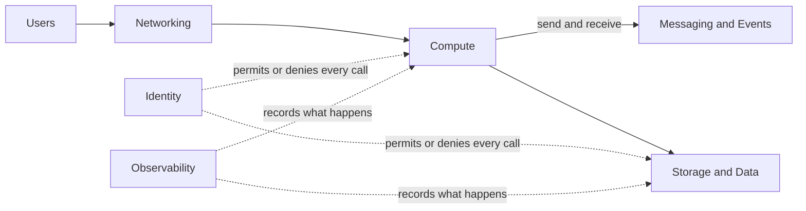

## How to Read This Document

Every domain section is built the same way, and the order is the point: **each concept is defined once, at the top of the domain it belongs to, and everything below that depends on it.** Nothing is explained twice — where a later section needs an idea that has already been introduced, it links back to it rather than restating it.

**First, the concept tables.** A diagram of how the domain's terms hang together, then a table reducing each to a single line. This is the vocabulary layer: read it to fix the terms before a conversation, or to settle a definition in the middle of one. Where a definition names another concept with a capital letter, that concept has its own row somewhere in this file.

**Then, the service entries.** These assume the vocabulary above and add what you cannot get from a definition. Each has the same shape:

- A short description in plain words: what the service is and what you would use it for.
- **Entry point** — the first object you create. Every Google Cloud service is built around one central object, and once you know which one it is, the rest of the service's settings make sense. For a queue service it is the topic and its subscription; for a virtual machine service it is the image plus the machine type.
- **Use it when** — the situation where this service is the right choice, so that you can compare it with its neighbours.
- **Trap** — the mistake people most often make with the service, and why it happens. Traps are worth reading even when you skip the rest, because they are what an experienced engineer would tell you before you started.

**Last, the sections that depend on everything above:** [Running It Well](#running-it-well), [Diagrams to Draw](#diagrams-to-draw) and [Trade-Offs](#trade-offs) carry no new definitions at all. They are practice, rehearsal and judgement over the vocabulary already established, and they link back to it.

Five words are used before their own domain arrives, so they are worth reading first: **Project** and **Zone** in [Concepts — Projects and Regions](#concepts--projects-and-regions), **Resource** in [Concepts — Services and Resources](#concepts--services-and-resources), **VPC** in [Concepts — Inside the VPC](#concepts--inside-the-vpc), and **Service Account** in [Concepts — Identity and Access](#concepts--identity-and-access).

Readers arriving from another cloud should start at the [AWS to Google Cloud Service Map](#aws-to-google-cloud-service-map) at the end, which names the counterpart of each AWS service and, more usefully, where the analogy breaks down.

## Foundations

Everything in Google Cloud rests on three ideas that are explained once here and assumed afterwards: where things live, how you talk to them, and how an organization divides them up. The shape of that division is the first real difference from AWS: instead of a flat set of accounts joined by an organization, Google Cloud has **one tree**, and permissions and policies flow down it.

### Concepts — Projects and Regions

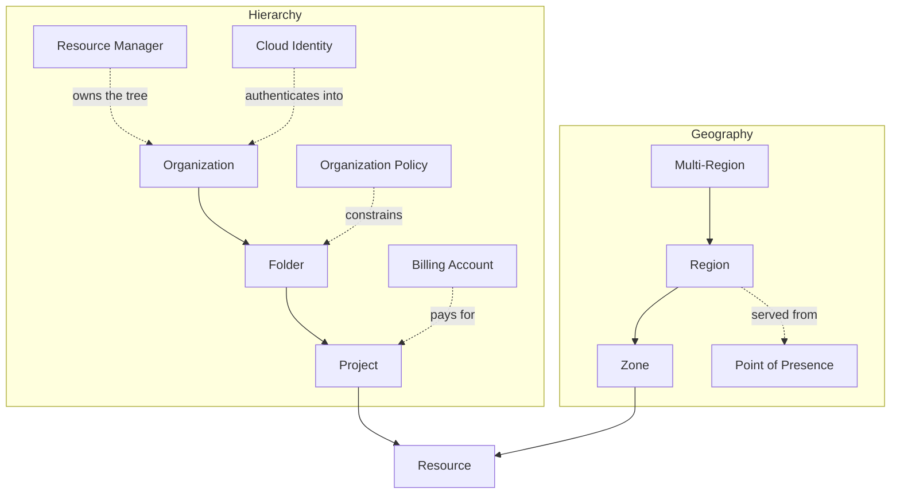

| Concept | Definition |
| --- | --- |
| **Organization** | the root node of the tree, tied to one verified domain name, that every Folder and Project hangs beneath |
| **Folder** | a grouping node in the tree that policy attaches to once and everything under it inherits |
| **Project** | the container every Resource belongs to, and the boundary for billing, quotas and which APIs are switched on |
| **Billing Account** | the payment instrument a Project is linked to, held outside the tree so that finance and engineering can be different people |
| **Organization Policy** | a constraint set on a node of the tree that restricts how anything beneath it may be configured; it never grants |
| **Region** | a named geographic area holding three or more Zones, and the scope most Services are quota'd and priced in |
| **Zone** | a failure-isolated deployment area with its own power, cooling and network, and the placement unit for a machine or a disk |
| **Multi-Region** | a set of Regions a Service replicates across by itself, bought for durability and reach rather than assembled by you |
| **Point of Presence** | an edge site outside any Region where Google's private network takes over from the public internet |
| **Cloud Identity** | the directory of human accounts and groups an Organization authenticates against, free of charge at its base tier |
| **Resource Manager** | the Service that holds the tree itself, and the one API that creates, moves and lists its nodes |

### Concepts — Services and Resources

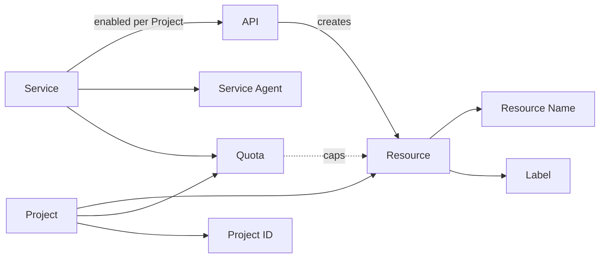

| Concept | Definition |
| --- | --- |
| **Service** | a named Google Cloud product with its own endpoint, pricing and limits, switched on inside a Project before anything can call it |
| **API** | the REST and gRPC surface a Service accepts calls on; the console, the `gcloud` CLI, the client libraries and Terraform all reduce to the same calls |
| **Resource** | a thing an API creates and keeps — a virtual machine, a bucket, a key ring — and the unit that is named, permissioned and billed |
| **Resource Name** | the full path of a Resource, `projects/p/zones/us-central1-a/instances/web-1`, which encodes the tree it hangs in |
| **Project ID** | the globally unique, permanent string that names a Project everywhere, distinct from both its display name and its generated number |
| **Label** | a key/value pair on a Resource, and the mechanism cost attribution and per-team reporting are built on |
| **Quota** | the per-Project, per-Region ceiling on something countable; most are raisable on request, a few are hard limits |
| **Service Agent** | a Google-managed identity a Service uses to act on your Resources, created the first time you switch that Service on |

### Organizations, Projects, Regions and Zones — Where Everything Lives

A **project** is the container you create things in. It is the boundary for billing (each project is linked to a billing account), for quotas (limits are counted per project), for API enablement (a service does not exist in a project until someone turns it on), and for the default blast radius (deleting a project deletes everything in it). Projects sit inside **folders**, folders sit inside one **organization**, and that whole tree is what Google Cloud calls the **resource hierarchy**.

- **The tree is the governance model.** An IAM grant or an organization policy set on a folder applies to every project beneath it, without being copied. This is the biggest structural difference from AWS, where each account is its own island and inheritance has to be built with Organizations and SCPs. It is also the biggest hazard: a broad role granted at the organization node reaches everything, forever, and nothing below it can take that away.
- **Regions** are separate geographic areas, each holding three or more zones. Most resources are regional or zonal, and they stay where you put them. Choose the region closest to your users, or the one your data-residency rules require.
- **Zones** are the fault-isolated data centres inside a region. A zone name is its region plus a letter, `us-central1-a`. A well-built system puts a copy of each part in at least two zones. Much of this document is about which services do that for you (Cloud Storage, Spanner, Pub/Sub) and which need you to do it yourself (Compute Engine instances, GKE node pools, persistent disks).
- **Global, regional and zonal resources.** Google Cloud is explicit about this in a way AWS is not: each resource type has a documented scope. A VPC network is **global**, a subnet is **regional**, a virtual machine and a persistent disk are **zonal**. That single sentence explains most of the networking section below.
- **Multi-region** locations (`US`, `EU`, `ASIA`) exist for Cloud Storage, BigQuery and Spanner, where Google replicates across regions for you rather than you assembling it.
- **Trap:** zone letters are consistent across projects — unlike AWS availability zone names, `us-central1-a` is the same place for everyone — but zones do not all offer the same machine types or GPUs. Check availability before designing a fleet around a specific shape, because "capacity is not available in this zone" is a deployment-time error, not a design-time one.

### The Console, the gcloud CLI and the API — How You Talk to Google Cloud

Every Google Cloud service is a set of **APIs**, and they are unusually uniform: most follow the same resource-oriented design, return the same error shapes, and represent long-running work as an **operation** object you poll. There is one hierarchy underneath all of them, so a single call can list resources across projects — something that takes a fan-out across accounts on AWS.

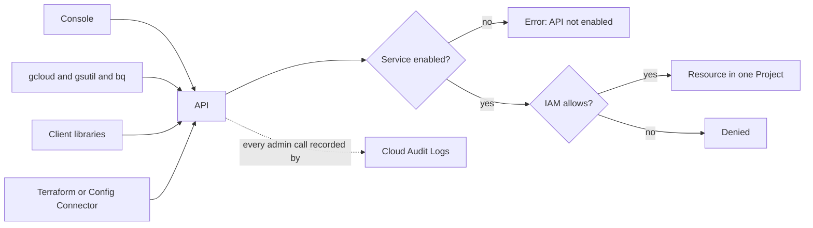

- The **console** (the website) is the same API behind buttons. It is the right place to learn and to look, and the wrong place to build production, because what you click is not recorded anywhere you can repeat. Its one genuinely useful production feature is the **Equivalent command line** link on most creation forms, which prints the `gcloud` call it is about to make.
- The **`gcloud` CLI** is uniform in a way that pays off: almost every command reads `gcloud <service> <resource-type> <verb>`, so `gcloud compute instances list` and `gcloud pubsub topics list` are the same sentence. `bq` and `gcloud storage` are the specialised tools for BigQuery and Cloud Storage.
- **Client libraries** for Python, Go, Java, Node and others make the same calls from code, and pick up credentials through **Application Default Credentials** — the standard search order described under [Service Accounts](#service-accounts--the-compute-to-google-cloud-bridge).
- **Infrastructure as code** — Terraform above all, on this cloud — describes the resources you want in a file, and the tool makes the API calls. [Infrastructure as Code and Delivery](#infrastructure-as-code-and-delivery) compares the tools.
- **Trap, and the one that costs every newcomer an hour:** a service's API must be **enabled in the project** before any call to it works, including calls Terraform makes. The error is `SERVICE_NAME has not been used in project N before or it is disabled`, and it appears at apply time rather than at plan time. Enable the APIs a project needs as part of the project's own Terraform, before anything that depends on them.

### Resource Hierarchy — The Landing Zone

A **landing zone** is the hierarchy, guardrails and shared networking a company sets up once, before any workload arrives. On Google Cloud, the project-per-environment split is the idiomatic answer to isolation, for the same reason the account-per-environment split is on AWS: the project is the boundary a mistake genuinely cannot cross.

- **The shape.** Organization → folders for `common`, `production`, `non-production` and `development` → one project per workload per environment, plus separate projects for networking, logging and security. Google publishes this as the **Cloud Foundation Fabric** and **enterprise foundation** Terraform blueprints, which are worth reading whether or not you adopt them, because they encode the layout most large estates converge on anyway.
- **Project vending:** new projects come from a Terraform module or **Project Factory**, never from the console, so that the billing link, the enabled APIs, the shared VPC attachment, the log sink and the baseline IAM arrive together.
- **Organization policies** attach at the organization or a folder and are inherited. The high-value constraints are `compute.vmExternalIpAccess` (no public IPs on virtual machines), `iam.disableServiceAccountKeyCreation` (the single most effective security control on this cloud), `gcp.resourceLocations` (data residency), and `sql.restrictPublicIp`. They restrict configuration, which is a different mechanism from IAM: an organization policy can forbid a resource from existing in a shape, where IAM only decides who may ask.
- **IAM inheritance is the trade.** Grants flow down and are additive, so the discipline is to grant at the lowest node that works — usually the project — and to keep organization-level grants to a small, reviewed list. **Deny policies** exist for the cases where inheritance has to be interrupted, and they are evaluated before allow policies.
- **Labels** carry cost attribution; the billing export to BigQuery is where per-team reporting actually happens, because the console's cost views cannot answer specific questions.
- **Quotas** are per project and per region. In network-dense designs the binding limit is usually internal IP addresses in a subnet or instances per VPC network, long before it is CPU.

The worked drawing of a landing zone, with the shared VPC host project in it, is in [Diagrams to Draw](#diagrams-to-draw).

## Compute

Compute is where your code runs. Google Cloud gives you four ways to run it, and the difference between them is how much of the machine you see and manage. At one end, Compute Engine gives you a whole virtual server that you install software on and keep patched. At the other, Cloud Run takes a container image and gives back an HTTPS address, with no machine anywhere in the picture. GKE sits in between, and its two modes — Standard and Autopilot — reproduce that whole spectrum inside Kubernetes.

The general pattern: the less you manage, the less you can customise, and the more you pay per unit of work at steady high load — but the less you pay when the load is low or uneven, and the less operator time you spend. Most teams end up with a mix. Google Cloud's particular bias is that its serverless tier accepts an **ordinary container image**, so moving between Cloud Run and Kubernetes is a deployment change rather than a rewrite.

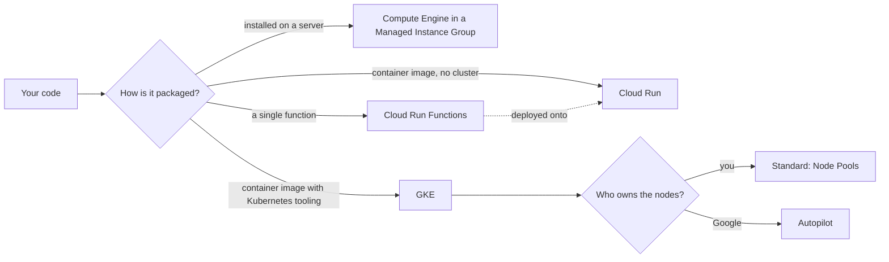

### Concepts — Compute Instances

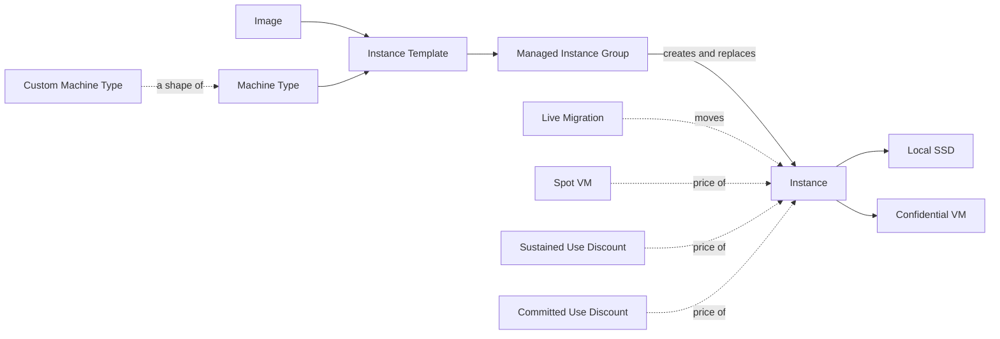

| Concept | Definition |
| --- | --- |
| **Compute Engine** | the Service that rents virtual machines by the second, on hosts you never see |
| **Machine Type** | the hardware shape, `n2-standard-4`: family letter for purpose, generation number, then vCPU count |
| **Custom Machine Type** | a vCPU and memory pair you name yourself, for a workload that fits none of the standard shapes and would otherwise round up |
| **Image** | the bootable disk contents a machine starts from, either one Google maintains or one you bake and keep in a family |
| **Instance Template** | the immutable recipe — Image, Machine Type, network, disks, Service Account — that everything else launches from |
| **Managed Instance Group** | a fleet held at a target size across Zones, replacing what fails, healing what stops answering, and following an autoscaling policy |
| **Local SSD** | disk physically attached to the host: the fastest available, and erased when the machine stops |
| **Spot VM** | spare capacity at a deep discount, reclaimed after a thirty-second notice, with no maximum lifetime |
| **Live Migration** | Google moving a running machine to another host for maintenance without rebooting it, which is why planned host maintenance is not an event you handle |
| **Sustained Use Discount** | an automatic price reduction that grows as an eligible machine runs for more of the month, with nothing to buy and nothing to commit |
| **Committed Use Discount** | a one- or three-year commitment, to a quantity of vCPU and memory or to a level of spend, traded for a lower rate |
| **Confidential VM** | a machine whose memory is encrypted by the processor, so that the hypervisor underneath cannot read it |

### Concepts — Compute Containers

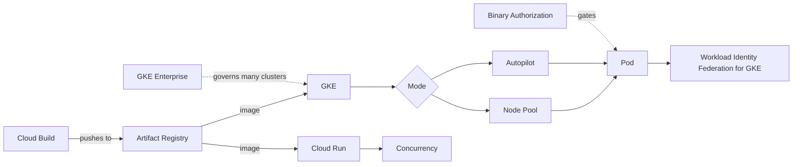

| Concept | Definition |
| --- | --- |
| **GKE** | managed Kubernetes: Google runs the control plane, and the mode you choose decides who owns the machines under it |
| **Autopilot** | the GKE mode with no machines to size, patch or scale, billed for what each Pod requests instead of for a fleet |
| **Node Pool** | a group of identically configured machines in a GKE cluster, upgraded, repaired and autoscaled as one unit |
| **Pod** | the smallest schedulable unit in Kubernetes: one or more containers sharing a network namespace and a lifecycle |
| **Cloud Run** | a container image turned into an autoscaling HTTPS endpoint with no cluster to design, scaling to zero when idle |
| **Concurrency** | how many requests one Cloud Run instance serves at the same time; the dial that separates this model from one-at-a-time functions |
| **Artifact Registry** | the private registry for container images and language packages, with per-repository access control, scanning and cleanup policies |
| **Workload Identity Federation for GKE** | binding a Kubernetes service account to a Service Account, so that a Pod calls Google APIs as an identity of its own |
| **Cloud Build** | managed build steps, each of them a container, defined in a YAML file with no build server to keep alive |
| **Binary Authorization** | a deploy-time gate that refuses an image lacking the signed attestations the policy requires |
| **GKE Enterprise** | the fleet layer over many clusters — config sync, policy and service mesh — including clusters that are not on Google Cloud |

### Concepts — Compute Functions

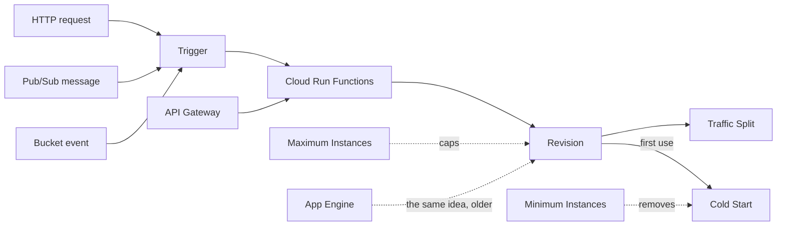

| Concept | Definition |
| --- | --- |
| **Cloud Run Functions** | a single handler deployed onto the Cloud Run platform and scaled by it, billed while a request is being handled |
| **Trigger** | the binding that says what causes a handler to run — an HTTP request, a message, an object appearing in a bucket |
| **Revision** | an immutable snapshot of an image plus its configuration; deploys create one rather than changing the last |
| **Traffic Split** | the percentages that send requests across Revisions, and how a canary or a blue/green release is expressed here |
| **Cold Start** | the extra latency of starting and initializing a new instance before it can serve its first request |
| **Minimum Instances** | instances kept warm and billed while idle, bought specifically to remove Cold Start |
| **Maximum Instances** | the ceiling on how far a service scales out, which is what protects the database behind it from a traffic spike |
| **API Gateway** | a managed HTTP front end doing authentication, API keys and rate limits before anything of yours runs |
| **App Engine** | the original platform as a service: deploy source rather than an image, with versions and traffic splitting built in |

### Compute Engine — Rented Virtual Machines

Compute Engine rents you virtual machines — **instances** — running Linux or Windows, billed per second while running. A **hypervisor** sits underneath, but you never see it. You see a server with an operating system, and you are responsible for everything installed on it.

- **Entry point:** an **image** (a saved disk with an operating system and any software you pre-installed) plus a **machine type** (how many vCPUs, how much memory), wrapped together in an **instance template**. In production you rarely start one instance by hand. You point a **managed instance group (MIG)** at the template, and it creates instances, replaces the ones that fail, and adds or removes them as load changes.
- **Use it when:** the software needs a full operating system, a specific kernel, a GPU or long-running state on the machine; or when you are moving an existing server into the cloud with as few changes as possible.
- **Reading a machine type:** the letter says what the shape is good at — `e2` cost-optimized (the cheap default, with no sustained use discount), `n` general purpose, `c` compute-optimized, `m` memory-optimized, `a` and `g` accelerator families with GPUs. **Custom machine types** are the feature with no AWS equivalent: pick 6 vCPUs and 20 GB if that is what the workload needs, instead of paying for the next standard shape up.
- **Two features that change the operating model.** **Live migration** moves a running instance to another host during Google's maintenance, so host maintenance is not an event you plan a drain around — a genuine difference from AWS, where a retirement notice is your problem. And **sustained use discounts** apply automatically as an eligible instance runs for more of the month; there is nothing to buy, which means the "did you reserve capacity" question lands differently here.
- **Storage choice:** the boot disk is usually a **persistent disk**, covered under [Storage and Data](#storage-and-data), and it survives stopping and starting. Use local SSD for scratch space and caches only — it is erased when the instance stops.
- **Trap:** an instance with an **external IP address** is on the public internet, and the default network's firewall rules are permissive enough that this matters. The correct default is no external IP at all, [Cloud NAT](#vpc-subnets-and-routes--the-foundation-everything-else-sits-in) for outbound access and [IAP tunnelling](#os-config-and-fleet-management) for administrative access. Enforce it with the `compute.vmExternalIpAccess` organization policy rather than by remembering.

### GKE — Managed Kubernetes

**Kubernetes** is the open-source container orchestrator most of the industry has standardised on, and Google originated it. It has two halves: the **control plane** (the API server that receives your instructions and the `etcd` database that stores the desired state) and the **data plane** (the worker machines, called **nodes**, that run your containers, grouped into **pods**). GKE runs the control plane for you. The [containers guide](../docs/03-system-design/05-containers.md) explains the Kubernetes concepts themselves.

- **Entry point:** the **cluster**, and then the choice that shapes everything else — **Autopilot** or **Standard** mode. Standard gives you **node pools** you size, upgrade and autoscale; Autopilot gives you none of that and is covered in the next section. A second decision, harder to change, is **regional or zonal**: a regional cluster replicates the control plane across three zones and spreads nodes across them, a zonal cluster does not. Production clusters are regional.
- **Use it when:** you need the Kubernetes ecosystem — Helm charts, operators, custom resources, GitOps tooling, a platform team that already knows it — or portability across clouds. If none of that applies, [Cloud Run](#cloud-run--containers-without-a-cluster) is far less work.
- **Two permission systems meet here:** IAM decides who may call the GKE API and reach the cluster endpoint; Kubernetes **RBAC** decides what they may do inside it. A principal needs both, and "I am project Owner but `kubectl` says forbidden" is the normal first encounter with that.
- **Pods calling Google APIs:** a pod that needs to read a bucket should not borrow the node's service account, because then every pod on that node can read it. **Workload Identity Federation for GKE** fixes this: a Kubernetes service account is bound to a Google [service account](#service-accounts--the-compute-to-google-cloud-bridge), and the pod receives short-lived credentials for it. This is on by default for Autopilot clusters and should be enabled on every Standard one.
- **Release channels:** clusters subscribe to `rapid`, `regular` or `stable`, and Google upgrades the control plane on that channel's cadence whether or not you act. Node upgrades follow, with **maintenance windows** and **maintenance exclusions** as the controls. This is genuinely different from EKS, where an unattended cluster simply falls out of support: here it moves.
- **Trap:** IP address planning. The default **VPC-native** networking gives every pod a routable address from a secondary range on the subnet, and every service another. The ranges are fixed when the cluster is created, and the pods-per-node setting silently reserves far more addresses per node than a node actually runs. Size the secondary ranges before the cluster exists; changing them later is a cluster rebuild.

#### Autopilot — The Serverless Data Plane

Autopilot is not a separate service. It is a **mode** of a GKE cluster in which Google owns the nodes: you submit pods, Google provisions and patches the machines under them, and you are billed for the CPU, memory and storage your pods **request** rather than for a fleet.

- **Entry point:** creating the cluster in Autopilot mode — the choice is permanent, so a Standard cluster cannot become an Autopilot one. After that the entry point is an ordinary pod specification, with **resource requests** as the one sizing decision that matters, because they are now the bill.
- **Use it when:** the load is uneven, the team is small, or nobody wants to own node upgrades and bin-packing. Operator time is usually the real cost.
- **What you give up:** privileged containers, most host access, arbitrary DaemonSets and node-level agents, unsupported kernel modules, and node taints or labels you did not get through the supported surface. Logging and monitoring agents are provided rather than installed, which is why an existing cluster's third-party agent is often what blocks the move.
- **Trap:** the same cost crossover as any serverless data plane. Autopilot charges for requested resources, so pods with requests set far above what they use cost more than the equivalent well-packed Standard fleet. Autopilot rewards accurate requests and punishes copy-pasted ones — which is a good discipline, but a surprise on the first bill.

### Cloud Run — Containers Without a Cluster

Cloud Run takes a container image that listens on a port and gives back an autoscaling HTTPS endpoint. There is no cluster, no load balancer to design and no machine to patch. It scales to zero when nothing is calling it, and it is the service that most defines Google Cloud's compute story: the serverless tier accepts an **ordinary container**, so nothing about the application has to be written for it.

- **Entry point:** a **service** built from a container image, which creates a **revision** — an immutable snapshot of the image plus its configuration. Deploys create new revisions, and a **traffic split** across revisions is how canary and blue/green releases work, expressed as percentages rather than as infrastructure. **Jobs** are the second form, for work that runs to completion rather than serving requests.
- **Use it when:** the workload is a web service, an API, an event handler or a batch job in a container, and it does not need the Kubernetes ecosystem. On this cloud that covers most services most teams write.
- **Concurrency is the difference from Lambda.** One Cloud Run instance handles **many requests at once** — the default is up to 80, and the ceiling is higher — where a Lambda execution environment handles exactly one. That single fact changes the cost model (an instance serving 80 concurrent requests is billed once, not eighty times), the code (your handler must be safe under concurrent execution in one process), and the connection story (an instance holds one connection pool, so the database connection storm that plagues Lambda mostly does not happen here).
- **The dials:** **minimum instances** to remove cold starts at a cost, **maximum instances** to protect whatever the service calls, **CPU allocation** (billed only during requests, or always on when a background task must keep running), and **direct VPC egress** or a **Serverless VPC Access connector** when the service must reach private addresses.
- **Trap:** deploying with `--allow-unauthenticated` because it is what the tutorial does. That makes the service public, and public Cloud Run services are found quickly. The alternative is IAM invoker permission plus an internal ingress setting, with a load balancer and [Cloud Armor](#cloud-cdn-cloud-armor-and-media-cdn--the-global-edge) in front of anything genuinely public.

### Cloud Run Functions — One Handler at a Time

Cloud Run functions (the service formerly called Cloud Functions) deploy a single **handler** — a function in your source code — and build the container around it for you. Since the second generation it runs on the Cloud Run platform, so it inherits revisions, traffic splitting, concurrency and the same scaling behaviour.

- **Entry point:** a **handler** plus a **trigger**: an HTTP request, a Pub/Sub message, an object arriving in a Cloud Storage bucket, a Firestore document change, or any [Eventarc](#eventarc--the-router) event. The trigger shapes the event your code receives, what happens on failure, and whether retries are on — event-driven functions have retry **off by default**, which surprises people who assume at-least-once.
- **Use it when:** the unit of work is genuinely one function and you want the source-to-URL path rather than a Dockerfile — a webhook receiver, a small connector, a scheduled report.
- **Against plain Cloud Run:** the difference is now mostly the build step and the programming model, not the runtime. If the code is already a container, deploy it as a Cloud Run service; if you want to hand over a directory of source and a function name, use this.
- **Trap:** background functions and retries. A function triggered by Pub/Sub that fails without retry enabled loses the message silently; the same function with retries enabled and no dead-letter topic can retry the same poison message for days. Set both deliberately — the [dead-letter topic](#pubsub--the-buffer-and-the-fan-out) belongs on the subscription.

### App Engine, Batch and VMware Engine — The Older and the Lifted

Three services you should recognise without reaching for them first.

- **App Engine:** the original platform as a service, and still a reasonable place for a plain web application: deploy source, get versions, traffic splitting and scale to zero. The **standard** environment runs sandboxed language runtimes and scales to zero; the **flexible** environment runs containers on managed instances and does not. New work generally goes to Cloud Run instead, which is the same idea without the sandbox rules.
- **Batch:** managed scheduling of batch jobs onto Compute Engine, including Spot VMs, for scientific and rendering workloads that want a queue and not a cluster.
- **VMware Engine:** actual VMware vSphere running on Google Cloud hardware, for lifting an existing VMware estate without converting it. It is an answer to a migration question, not an architecture choice.

### Choosing Between the Compute Options

| Option | You manage | Google manages | Fits when |
| --- | --- | --- | --- |
| **Compute Engine** | The operating system, patching, scaling rules, everything installed | The hardware and the hypervisor | You need a full machine, or are moving an existing server |
| **Cloud Run** | The container image, concurrency and the scaling bounds | Everything underneath | A service, API or job in a container with no cluster-level needs |
| **Cloud Run functions** | The handler and its trigger | Everything else, including the build | The unit of work is one function and you want source-to-URL |
| **GKE Autopilot** | Kubernetes objects and accurate resource requests | The control plane and every node | You need Kubernetes but not node-level control |
| **GKE Standard** | Kubernetes objects, add-ons and the node pools | The control plane | You need DaemonSets, GPUs, custom kernels or tight bin-packing |
| **App Engine standard** | The source and the runtime choice | Everything else | An existing App Engine application, or a plain web app |

The longer form of the Cloud Run versus GKE decision, with the organizational question that usually settles it, is in [Trade-Offs](#cloud-run-vs-gke-autopilot).

## Networking

A network on Google Cloud is something you build, not something you get — but it starts from a different shape than on AWS. **A VPC network is global.** It spans every region at once, it has no address range of its own, and the subnets carved into it are regional, each one reaching all the zones in its region. Two instances in Tokyo and Frankfurt on the same VPC talk over private addresses with no peering, no gateway and no route you wrote. Almost every difference in this section follows from that one fact.

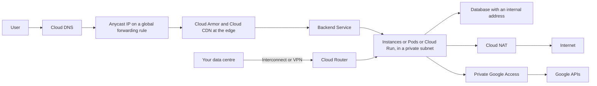

### Concepts — Inside the VPC

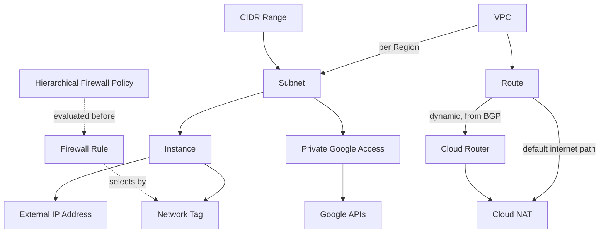

| Concept | Definition |
| --- | --- |
| **VPC** | a private network you own that spans every Region at once and holds no address range of its own |
| **Subnet** | a CIDR Range assigned to one Region, and where an instance takes its internal address from |
| **CIDR Range** | the address block given to a network, written `10.0.0.0/16`; the decision that is hardest to change later |
| **Route** | an entry sending traffic for a destination to a next hop, with a priority that breaks ties between overlapping entries |
| **Firewall Rule** | a stateful allow or deny evaluated in priority order, selecting the machines it applies to by tag or by identity |
| **Network Tag** | a plain string attached to an instance that decides which rules and routes apply to it, carrying no permission of its own |
| **Hierarchical Firewall Policy** | rules set on the Organization or a Folder and evaluated before anything a Project is able to write |
| **Cloud NAT** | managed, regional address translation letting machines with no public address reach the internet, with no gateway machine to run or scale |
| **Cloud Router** | the managed BGP speaker that learns and advertises routes dynamically, and what every hybrid link and Cloud NAT attaches to |
| **Private Google Access** | a per-Subnet setting letting machines with only internal addresses reach Google APIs without going through the internet |
| **External IP Address** | a public address on a machine or a load balancer, either ephemeral or reserved so that it survives a rebuild |

### Concepts — Load Balancing and the Edge

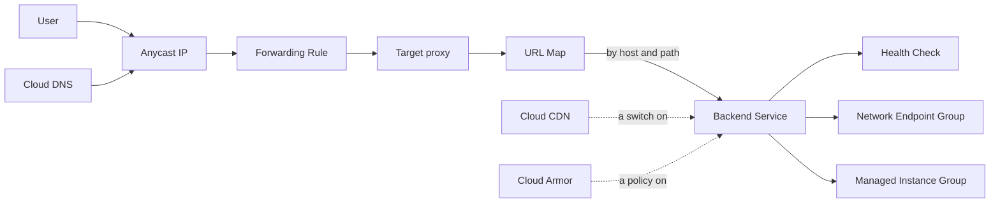

| Concept | Definition |
| --- | --- |
| **Forwarding Rule** | the front door of a load balancer — an address, a protocol and a port — pointing at the proxy behind it |
| **URL Map** | the layer-7 routing table that matches an incoming host and path to one Backend Service |
| **Backend Service** | the set of backends traffic is spread over, together with the Health Check, the balancing mode and the timeout applied to them |
| **Health Check** | the probe that decides whether a backend may receive traffic, sent from documented Google address ranges rather than from your network |
| **Network Endpoint Group** | backends addressed directly — pod addresses, serverless services, or endpoints outside Google Cloud — rather than whole machines |
| **Anycast IP** | one address announced from every Point of Presence at once, so that a user enters Google's network close to them |
| **Cloud CDN** | caching at Google's edge, switched on as a property of a Backend Service rather than deployed as a separate thing |
| **Cloud Armor** | request filtering, rate limiting and bot management applied at the edge, in front of a Backend Service |
| **Cloud DNS** | authoritative DNS with public and private zones, and answers that can vary by geography, weight or health |

### Concepts — Connecting Networks

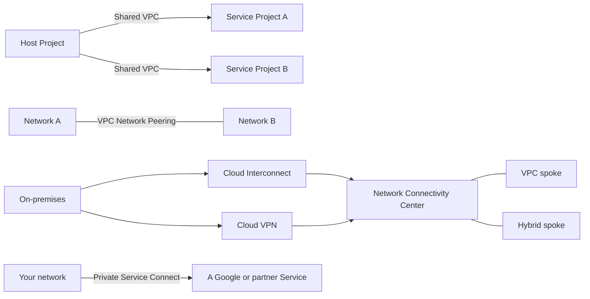

| Concept | Definition |
| --- | --- |
| **Shared VPC** | one Project's network used directly by many other Projects, so networking stays with a central team while workloads stay with theirs |
| **VPC Network Peering** | a route exchange between two networks that is not transitive and needs their address ranges not to overlap |
| **Network Connectivity Center** | a hub that networks and hybrid links attach to as spokes, replacing a mesh of point-to-point connections |
| **Private Service Connect** | a private entrance to a Google or partner Service, reached at an internal address you choose inside your own network |
| **Cloud Interconnect** | a private circuit into Google's network, bought for consistent latency and a lower egress price rather than for privacy |
| **Cloud VPN** | an IPsec tunnel to your own data centre over the public internet, with a paired high-availability form that carries a stronger guarantee |

### VPC, Subnets and Routes — The Foundation Everything Else Sits In

A **VPC network** is a private network you own. Unlike an AWS VPC it is **global** and has no CIDR block: the address space lives on the **subnets**, and each subnet belongs to one region and covers every zone in it.

- **Entry point:** the network, created in **custom mode** (you define every subnet) rather than **auto mode** (Google creates a subnet in every region with predictable ranges). Auto mode is convenient and wrong for production, because the ranges are the same in every project and will eventually collide with something you need to peer to.
- **Use it when:** always — everything in the compute and storage sections either sits in a VPC or is reached from one. The design question is not whether to have one but how to divide it.
- **There is no "public subnet".** A subnet has no public or private flag. An instance is reachable from the internet if it has an **external IP address** and a firewall rule allows the traffic; otherwise it is not. Reachability is a property of the instance and the firewall, not of the subnet it sits in.
- **Private egress:** instances with no external address reach the internet through **Cloud NAT**, which is a regional software function rather than a machine. There is nothing to size, nothing to put one of per zone, and no instance to fail — a real simplification against NAT gateways. It still bills for the addresses it holds and the data it processes, and its ports-per-instance setting is the thing that runs out first on a busy fleet.
- **Expanding a subnet is allowed.** A subnet's primary range can be widened in place, which AWS does not permit. Secondary ranges are how GKE gets its pod and service addresses.
- **Trap:** the **default network** every new project gets, with a subnet in every region and firewall rules allowing SSH, RDP and ICMP from anywhere. It exists to make the first tutorial work. Delete it with an organization policy (`compute.skipDefaultNetworkCreation`) at the folder level, so that projects are created without it rather than cleaned up afterwards.

### Firewall Rules and Policies — The One Firewall

Google Cloud has one firewall model rather than AWS's two. **Firewall rules** are stateful, live on the VPC network, apply to instances rather than to subnets, and can both **allow and deny**. Each rule has a **priority** between 0 and 65535, and the lowest number that matches wins.

| Aspect | Google Cloud firewall rule | AWS equivalent |
| --- | --- | --- |
| **Attaches to** | The network, targeting instances by tag or service account | A security group attached to an interface |
| **State** | **Stateful** — a reply to an allowed connection needs no rule | Same for a security group |
| **Rules** | Allow **and** deny, in explicit priority order | Security groups allow only; NACLs add deny at the subnet |
| **Default** | Deny all ingress, allow all egress, with two implied rules at the lowest priority | Deny all inbound, allow all outbound |
| **Selector** | A network tag, or the instance's service account | A security group referencing another security group |

- **Entry point:** the choice of **selector**. A **network tag** is a plain string and anyone who can edit an instance can add one, so a rule targeting `tag:prod-db-client` is only as strong as who may set tags. Targeting a **service account** instead ties the rule to an identity that IAM already controls, and is the stronger pattern for anything that matters.
- **Hierarchical firewall policies** are set on the organization or a folder and evaluated **before** any rule a project can write. This is where "no RDP from the internet, anywhere, ever" belongs — a project owner cannot override it. There is no AWS equivalent; the closest thing is an SCP denying the API call, which is a different mechanism.
- **Use deny rules sparingly and with reserved priorities.** Because both allow and deny live in one ordered list, a low-priority deny written by someone debugging can silently take precedence over a carefully designed allow. Agree a priority band convention (hierarchy rules at the top, platform rules in the middle, application rules at the bottom) before the second team arrives.
- **Trap:** load balancer **health checks** come from Google's own ranges — `35.191.0.0/16` and `130.211.0.0/22` for the global and proxy-based balancers, and the proxy-only subnet's range for the regional Envoy-based ones — not from your subnet. A backend service whose instances are healthy but which the balancer reports as unhealthy is, almost every time, a missing ingress rule for those ranges.

### Cloud Load Balancing — The Forwarding Rule Chain

Google's load balancers are not one resource but a **chain of resources**, and knowing the chain is what makes their configuration readable: a **forwarding rule** (address, protocol, port) points at a **target proxy**, which consults a **URL map**, which selects a **backend service**, which spreads traffic over **backends** according to a **health check**. Every layer-7 balancer is that same sequence.

- **Entry point:** the forwarding rule, and the decision behind it — **global or regional**, and **proxy or passthrough**.
- **Use it when:** there is more than one copy of anything that receives traffic, which in production is always.

| Balancer | What it is | Use it for |
| --- | --- | --- |
| **Global external Application LB** | Layer 7, one **anycast address** announced worldwide, terminating at the nearest edge | Public web and API traffic, with Cloud CDN and Cloud Armor attached |
| **Regional external Application LB** | Layer 7 in one region, Envoy-based, needing a proxy-only subnet | Regional residency requirements, or when global is more than you need |
| **Internal Application LB** | Layer 7 on internal addresses, regional or cross-region | Service-to-service traffic inside the VPC |
| **External passthrough Network LB** | Layer 4, forwards packets without terminating the connection | Non-HTTP protocols, and keeping the client source address visible |
| **Internal passthrough Network LB** | Layer 4 on an internal address, implemented in the network itself rather than by proxies | Internal TCP and UDP services, and as the next hop for custom routes |

- **The single global address is the headline difference from AWS.** One anycast IP serves users from every continent, entering Google's private network at the nearest point of presence and travelling to the closest healthy backend over Google's own links. There is no per-region DNS steering to build; that is what Route 53 latency routing plus a per-region ALB is doing on AWS, and here it is one resource.
- **Backends can be almost anything:** managed instance groups, GKE pods (through **network endpoint groups**, which address pods directly rather than routing through a node port), Cloud Run services (serverless NEGs), a bucket (a backend bucket, for static content), or endpoints outside Google Cloud entirely.
- **Trap:** health checks again, plus their cousin — a **backend service timeout** left at the default while the application streams a long response, which cuts the connection at exactly the point that is hardest to reproduce. Check something cheap that proves the process is serving, and set the timeout to what the slowest legitimate response actually needs.

### Cloud CDN, Cloud Armor and Media CDN — The Global Edge

Because the global load balancer already terminates connections at the edge, caching and filtering there are **switches on an existing backend service** rather than separate products to place in front of it.

- **Cloud CDN:** enable it on a backend service and responses are cached at Google's points of presence, keyed by the cache mode you choose (cache static content by extension, honour origin headers, or force caching). Signed URLs and signed cookies protect private content. There is no distribution to create and no separate origin to configure, because the backend service already is one.
- **Cloud Armor:** a security policy attached to a backend service. It carries WAF rules (including preconfigured OWASP rule sets), IP and geography allow and deny lists, **rate limiting** per client, bot management with reCAPTCHA, and adaptive protection against layer-7 floods. Volumetric DDoS defence at the network layer is on by default and free for anything behind the global balancer.
- **Media CDN:** the separate, higher-capacity product for video and large-file delivery, using the same infrastructure that serves YouTube. Reach for it when the workload is streaming, not when it is a website.
- **Trap:** caching a response that varies by user. A `Cache-Control: public` header on an authenticated response puts one user's data in a shared cache at the edge, and the bug surfaces as a report that someone saw someone else's page. Decide caching by route, and default to `private` for anything the request identity affects.

### Cloud DNS — Names, Public and Private

**DNS** turns a name into an address. Cloud DNS is Google's authoritative service for it, and unusually it carries a 100% availability service level agreement, because it is served from the same anycast infrastructure as everything else at the edge.

- **Entry point:** a **managed zone** — a container for the records of one domain — either **public** (answering the whole internet) or **private** (answering only inside the VPC networks you attach it to, for names like `db.internal`).
- **Use it when:** you own a domain and want its records next to the infrastructure they point at, or you need internal names that do not exist on the public internet.
- **Routing policies:** weighted round robin (canary and blue/green splits), geolocation, and failover driven by health checks. Note that the global load balancer removes the need for most of the geographic steering that would need these on another cloud.
- **Also here:** **DNS peering** (one network resolves names in another network's zones — the standard shared-services pattern), **forwarding zones** (queries for a domain go to your on-premises resolvers), and **DNSSEC**, which is a checkbox on a public zone.
- **Trap:** private zones and **Private Service Connect** endpoints interact. When a private endpoint stops resolving, the answer is nearly always in which zone is attached to which network, and whether an automatically created zone is being shadowed by one someone wrote.

### Shared VPC, Peering and Network Connectivity Center — Connecting Networks

Because a VPC is global, the "connect two regions" problem that dominates AWS networking does not exist here. What remains is connecting two *networks*, usually because they belong to different teams or different projects.

- **Shared VPC** is the idiomatic answer and has no close AWS equivalent. One project is nominated the **host project** and owns the network; other projects are attached as **service projects** and create instances, load balancers and GKE clusters directly in the host project's subnets. Networking permissions stay with the platform team, workload permissions stay with each application team, and there is no peering, no route exchange and no duplicated address plan. This is what most Google Cloud landing zones are built on.
- **VPC Network Peering** exchanges routes between two networks. It is **not transitive** — if A peers with B and B with C, A still cannot reach C — and it requires non-overlapping ranges. Use it between two organizations' networks, or where a managed service (Cloud SQL's private path, historically) requires it.
- **Network Connectivity Center** is the hub for estates that genuinely have many networks and hybrid links: VPC networks and on-premises connections attach as **spokes**, and the hub routes between them. This is the Transit Gateway analogue, and it is needed far less often here because of Shared VPC and global networks.
- **Trap, for peering and hybrid links alike:** overlapping address ranges. Nothing can route between two networks that both use `10.0.0.0/16`. Plan address space centrally before the second network exists; fixing an overlap later means re-addressing a live estate.

### Cloud Interconnect and Cloud VPN — Reaching On-Prem

Two ways to connect your own data centre or office to a VPC, and one component both depend on.

- **Cloud VPN:** encrypted IPsec tunnels over the public internet. **HA VPN** is the form to use — two interfaces, two tunnels, and a stronger availability guarantee than the classic single-tunnel form. Live in minutes; throughput and delay follow whatever the internet is doing that day.
- **Cloud Interconnect:** a private circuit into a Google facility. **Dedicated Interconnect** is a direct 10 or 100 Gbps port; **Partner Interconnect** reaches Google through a service provider at smaller capacities and shorter lead times. Consistent latency and a materially lower egress price, with lead times measured in weeks and a monthly port charge. **Cross-Cloud Interconnect** is the same circuit terminating at another cloud provider.
- **Cloud Router is not optional.** Both options attach to a Cloud Router, which speaks BGP to your side and installs the learned routes into the VPC. Static routing to on-premises exists but is a dead end: dynamic routing is what makes failover between a circuit and its backup work at all.
- **The standard pattern:** Interconnect as the primary path with HA VPN as the automatic backup, both on the same Cloud Router, with the VPN advertised at a worse BGP priority so it only carries traffic when the circuit is down.

### Private Google Access and Private Service Connect — Reaching Services Privately

Cloud Storage, BigQuery, Pub/Sub and the rest are reached at public endpoints such as `storage.googleapis.com`. By default a machine with no external address cannot resolve or reach them at all, which is the first thing that breaks when someone follows the "no public IPs" rule. There are three answers, in increasing order of control.

- **Private Google Access:** a **per-subnet switch**. Turn it on and instances with only internal addresses can reach Google APIs, with traffic staying on Google's network. It is free, it is a single boolean, and it should be on for every private subnet in the estate.
- **Private Service Connect:** an **internal address inside your own network** that represents a Google service, a third-party service, or a service you publish yourself. You choose the address, so the service appears at `10.x.x.x` in your address plan, and DNS in your private zone points at it. Use it where a compliance rule requires that traffic never touch a public endpoint even by name, or to consume a partner's service without peering networks. Publishing works the other way round: put your service behind an internal passthrough load balancer and expose it as a **service attachment** that consumers connect to from their own networks, with overlapping address ranges no longer mattering.
- **VPC Service Controls** is the third and least AWS-like: a **service perimeter** around a set of projects that blocks Google API access across the boundary regardless of IAM. It is the control that stops a person with legitimate credentials from copying a bucket out to a personal project, which is exactly the exfiltration path IAM alone cannot close. It is also the control most likely to break a working pipeline the day it is enabled, so build it with dry-run mode first.
- **Use them when:** Private Google Access always; Private Service Connect where a named private address or a published service is required; VPC Service Controls where the data is regulated and exfiltration is the threat being designed against.

## Storage and Data

There is no single "storage" on Google Cloud. Each service is built for one shape of data and one way of reading it, and the price and behaviour differ by orders of magnitude. So the first question is always *what does the data look like, and how will it be read?* — not *which service is best?*

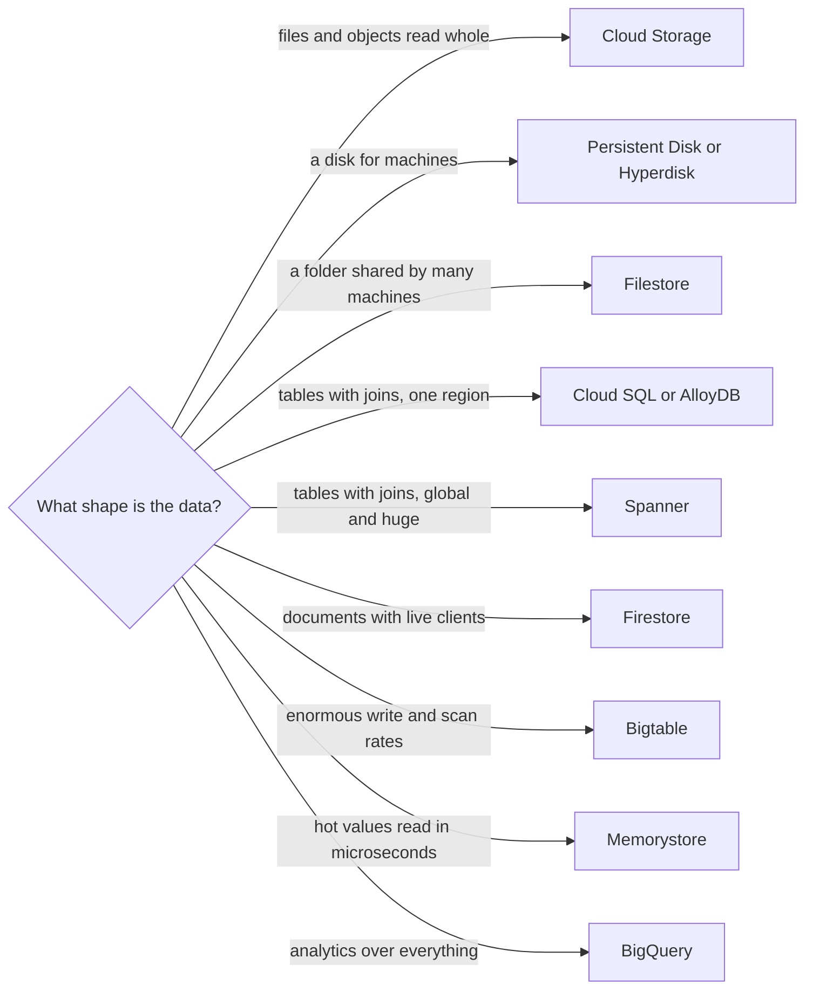

### Concepts — Storage

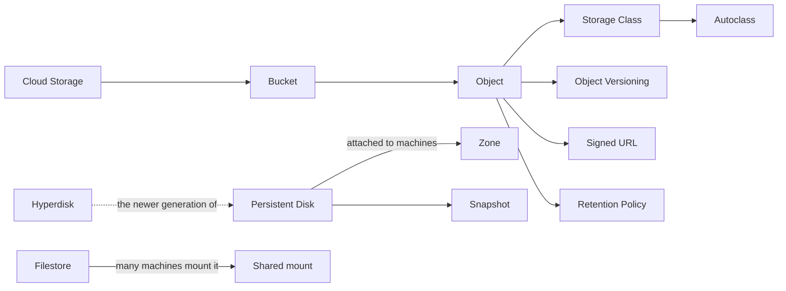

| Concept | Definition |
| --- | --- |
| **Cloud Storage** | object storage addressed by name, with no filesystem underneath and durability quoted in eleven nines |
| **Bucket** | the globally unique namespace an Object lives in, and the level location, Storage Class and access control are set at |
| **Object** | an immutable blob and its metadata, replaced rather than edited in place, addressed by a name that only looks like a path |
| **Storage Class** | the price and access tier applied to data, from immediate retrieval down to archive, each with a minimum billed duration |
| **Autoclass** | a per-Bucket setting that moves data between Storage Classes by how it is actually read, with no retrieval charge to plan for |
| **Object Versioning** | keeping every overwrite and delete as a separate generation, so a delete hides the data rather than losing it |
| **Signed URL** | a time-limited link carrying its signer's authority, so that a browser can upload or download with no credentials of its own |
| **Retention Policy** | a minimum age before data may be deleted, lockable so that not even a Project owner can shorten it |
| **Persistent Disk** | a network block volume attached to machines in one Zone, surviving the machine being stopped or deleted |
| **Hyperdisk** | the newer block storage generation where capacity, IOPS and throughput are bought as three independent numbers |
| **Snapshot** | an incremental copy of a disk held outside any one Zone, and the unit of both backup and cloning |
| **Filestore** | managed NFS that many machines mount at once, for software that needs ordinary shared file semantics |

### Concepts — Data Stores

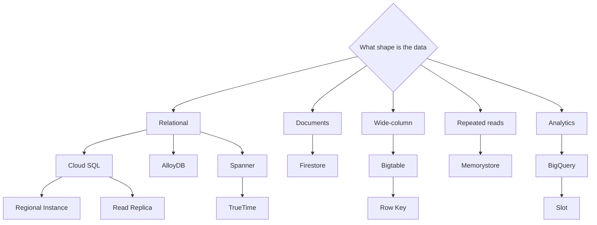

| Concept | Definition |
| --- | --- |
| **Cloud SQL** | managed MySQL, PostgreSQL and SQL Server, where patching, backup and failover are handled but the schema is still yours |
| **Regional Instance** | a Cloud SQL configuration with a synchronous standby in a second Zone, promoted automatically on failure; availability, and not read capacity |
| **Read Replica** | an asynchronous copy serving reads and promotable by hand, always some lag behind what it copies |
| **AlloyDB** | Google's PostgreSQL-compatible engine, separating compute from a replicated storage layer and adding a columnar cache for analytical queries |
| **Spanner** | a relational database that shards and replicates itself across Zones or Regions while still offering strongly consistent transactions |
| **TrueTime** | the bounded-uncertainty clock, backed by atomic clocks and satellite time, that lets Spanner order transactions globally |
| **Firestore** | a document database with live listeners and offline clients, which indexes every field until you tell it not to |
| **Bigtable** | a wide-column store for very high write and scan rates, with one sorted index and no secondary ones |
| **Row Key** | the single key a Bigtable row is found by, and the design decision that determines whether writes spread out or pile onto one server |
| **Memorystore** | managed Redis, Valkey or Memcached, for the reads a database should never have to serve twice |
| **BigQuery** | a warehouse with no cluster to run, separating stored data from query compute and billing them apart |
| **Slot** | the unit of query compute in BigQuery, drawn per query from a shared pool or reserved in advance at a flat rate |

### Cloud Storage — Object Storage

Cloud Storage keeps **objects** — files of any kind — and returns them whole when asked. It is not a file system: there are no directories, no editing part of a file in place, and no mounting it as a disk. Each object has a name and lives in a **bucket** whose name is unique across all of Google Cloud. It is the cheapest and most durable place to put data here, and nearly every other service reads from it or writes to it.

- **Entry point:** a **bucket** plus a **location type** — the decision that cannot be changed afterwards. A **regional** bucket stores data in one region; a **dual-region** bucket in two named regions with fast replication between them; a **multi-region** bucket across a continent. Then an object name such as `invoices/2026/03/inv-001.pdf`, where the slashes are characters, not folders.
- **Use it when:** data is written once and read whole — uploads, backups, logs, static sites, data-lake files, build artifacts, machine-learning training sets.
- **Storage classes:** **Standard** → **Nearline** (about a month between reads) → **Coldline** (about a quarter) → **Archive** (about a year), each cheaper to store and dearer to retrieve, with a minimum billed duration that rises down the list. **Autoclass** moves objects between all four by observed access and — the part that matters — charges no retrieval fees while doing so, which makes it the low-risk default when the access pattern is unknown.
- **Access:** **uniform bucket-level access** turns off per-object ACLs and makes IAM the only mechanism. Turn it on for every bucket; per-object ACLs are the mechanism behind most accidental public data. **Public access prevention** can be enforced from an organization policy so that no bucket in the estate can be made public at all.
- **Durability and control:** **object versioning** keeps previous generations, **retention policies** (lockable, for WORM compliance) set a minimum age before deletion, **soft delete** retains deleted objects for a window by default, and **lifecycle rules** change class or delete on age — including old generations, which people forget until they see the bill for keeping every version of everything.
- **Consistency:** reads are **strongly consistent** globally for object data and metadata. Guidance describing eventual consistency for object listings is out of date.
- **Trap:** **egress pricing**, which is the line item that surprises people arriving from anywhere. Reading data out to the internet, or from one region to another, costs meaningfully more than storing it. Co-locate compute with the bucket, and check the location type against where the readers actually are before the data is loaded rather than after.

### Persistent Disk and Hyperdisk — Block Storage

Block storage is what a machine sees as a disk. **Persistent disks** are network volumes, replicated within a zone (or across two zones for the regional type), which is why they survive the instance being stopped or deleted.

- **Entry point:** a **disk** in one zone, attached to an instance. `pd-balanced` is the sensible default, `pd-ssd` for latency-sensitive databases, `pd-standard` (spinning disks) only for cold bulk, and `pd-extreme` where IOPS have to be provisioned explicitly.
- **Hyperdisk** is the newer generation and the one to reach for on current machine families: capacity, IOPS and throughput are **three separate numbers you buy independently**, so a small disk can be fast — the same decoupling that gp3 brought on AWS, taken further. Hyperdisk Balanced covers most cases; Hyperdisk ML and Throughput exist for the shapes their names suggest.
- **Regional persistent disks** replicate synchronously to a second zone, which is how a single-instance database gets a zonal-failure story without changing the application.
- **Local SSD** is physically attached, is the fastest storage available, and is **erased when the instance stops**. Scratch space and caches only.
- **Snapshots** are incremental and are not tied to a zone, which makes them the standard way to move a disk between zones or regions and the basis of backup. Attach a **snapshot schedule** to the disk rather than remembering to take them.
- **Trap:** disk performance scales with size *and* with the machine's own limits. A small disk on a large machine, or a large disk on a small machine, is throttled by whichever ceiling is lower, and the symptom is a database that is slow for no reason visible in its own metrics.

### Filestore and NetApp Volumes — Shared Filesystems

Sometimes many machines need to read and write the *same* files at the same time — an uploads folder shared by web servers, home directories, a build cache. A disk attaches to one machine and an object store is not a file system, so there are managed network file systems for this case.

- **Filestore:** managed **NFS**, the standard Linux network file protocol, in tiers from Basic through Zonal to Enterprise (which is regional and the one to use where the file system must survive a zone). Mountable by instances and by GKE pods.
- **NetApp Volumes:** managed NetApp ONTAP, for software that expects SMB, multi-protocol access, or ONTAP's own snapshot and replication features.
- **Use them when:** existing software insists on a shared file system, or many processes must work on the same files.
- **Caveat:** a shared file system is usually a compromise made while moving an existing system into the cloud without changing it. Applications built for the cloud keep files in Cloud Storage and state in a database, because both scale further and cost less. **Cloud Storage FUSE** exists to mount a bucket as a file system and is genuinely useful for read-heavy machine-learning workloads, but it does not make a bucket into a POSIX file system, and treating it as one ends badly.

### Cloud SQL and AlloyDB — Managed Relational Databases

A **relational database** stores data in tables with a schema and is queried with SQL. Cloud SQL runs one for you — installing the engine, taking backups, applying patches, handling failover — while your code keeps talking to the same PostgreSQL or MySQL it already speaks. AlloyDB is Google's re-engineered PostgreSQL with a different storage layer underneath.

- **Entry point:** a **Cloud SQL instance**: an engine, a version, a machine shape, and the choice between **zonal** and **regional (HA)**. AlloyDB's entry point is a **cluster** with a primary instance and optional read pools.
- **Use it when:** the data has relationships, needs transactions, or is queried in ways you cannot predict. This is the default for most application data, and it stays the default until scale or global reach forces the [Spanner](#spanner--relational-at-global-scale) conversation.
- **Availability against scale — two features that look alike:** a **regional (HA) instance** keeps a synchronous standby in a second zone that serves **no traffic**, and fails over automatically. **Read replicas** copy asynchronously, lag behind, can serve reads, and are promoted by hand. The two solve different problems and neither replaces the other.
- **Connecting to it:** the **Cloud SQL Auth Proxy** (or the language connectors that embed it) is the intended path — it authenticates with IAM, encrypts the connection, and needs no allow-listed addresses. **Private IP** puts the instance on your VPC. **IAM database authentication** removes the stored database password entirely for the services that support it.
- **AlloyDB specifics:** storage grows without provisioning, read pools scale independently of the primary, and the **columnar engine** keeps a column-oriented copy of hot data in memory so that analytical queries run without a separate warehouse. It is the answer to "PostgreSQL, but the read and analytics load has outgrown it".
- **Trap:** treating a read replica as a backup or a standby. It is neither — a bad `DELETE` reaches it in seconds, and it does not take over by itself. Backups come from automated backups plus **point-in-time recovery**; failover comes from the HA configuration.

### Spanner — Relational at Global Scale

Spanner is the service with no equivalent on other clouds: a relational database with SQL, schemas and transactions that also **shards and replicates itself across zones or regions**, offering strongly consistent reads and externally consistent transactions everywhere at once. It is what Google runs its own business on.

- **Entry point:** an **instance** with a configuration (regional, dual-region or multi-region) and an amount of compute measured in **processing units** or nodes, then a database and a schema. Since granular instance sizing arrived, small workloads no longer start at a full node, which changed Spanner from an expensive last resort into something a normal service can begin on.
- **Use it when:** the workload needs relational semantics *and* horizontal write scaling, or strong consistency across regions, or an availability target a single-primary database cannot reach. Financial ledgers, inventory, global user accounts.
- **How it does it:** the data is cut into **splits** by primary key range and each split is replicated with Paxos. **TrueTime** — a clock that reports an interval rather than an instant, kept tight by atomic clocks and satellite time in every data centre — lets a transaction wait out the uncertainty and so be ordered globally without a coordinator. That is the mechanism worth being able to describe, because it is what makes the guarantee possible.
- **Also:** **change streams** for change data capture, a **PostgreSQL interface** as well as GoogleSQL, and a **Graph** and full-text query surface over the same data.
- **Trap:** **hotspotting on a monotonically increasing primary key**. An auto-incrementing id or a timestamp puts every new write at the end of one split, so a database designed for horizontal scale serves all its writes from one server. Use a UUID, a hashed prefix, or Spanner's own bit-reversed sequence — and interleave child tables under their parent to keep related rows in the same split.

### Firestore and Bigtable — The NoSQL Pair

Two non-relational stores that answer completely different questions, and which people conflate because both are "NoSQL".

- **Firestore:** a **document** database. It stores JSON-like documents in collections, and its distinguishing feature is the client side — mobile and web SDKs with **real-time listeners** (the client is pushed changes as they happen) and **offline persistence**, with access controlled by **security rules** evaluated at the database rather than by a backend you write. Use it for application state that clients read and write directly: chat, collaborative editing, user profiles, mobile app data. Native mode is the current one; Datastore mode exists for compatibility with the older App Engine API.
- **Bigtable:** a **wide-column** store built for enormous, sustained write and scan rates at single-digit-millisecond latency — time series, telemetry, financial ticks, ad-tech, the storage under many of Google's own products. There is **one index, the row key**, no secondary indexes and no joins, and rows are stored sorted by that key. It speaks the HBase API, and it is the store BigQuery and Dataflow read alongside.
- **Use them when:** Firestore when clients talk to the database directly and the data is documents; Bigtable when the write rate is beyond what a relational database absorbs and every query is a key or a range of keys.
- **Trap (Bigtable):** the row key again. Sequential keys — a timestamp prefix, a monotonically increasing id — send every write to the last tablet, and the cluster's other nodes sit idle. Put a high-cardinality field first (`deviceId#timestamp`, not `timestamp#deviceId`) so that writes spread. This is the same failure as a DynamoDB hot partition and a Spanner hotspot, and it is the single most reliably asked NoSQL design question.

### BigQuery — The Warehouse and the Lake

BigQuery is a data warehouse with **no cluster to run**. You create a dataset, load or point at data, and run SQL; Google allocates compute for the query and takes it back afterwards. It is the service most Google Cloud estates are actually built around, and it behaves unlike any of the storage services above.

- **Entry point:** a **dataset** (which has a location, and it cannot be changed) holding **tables**. Beyond native tables there are **external tables** over files in Cloud Storage, **BigLake** tables that add fine-grained access control over those files, and federated queries into Cloud SQL and Spanner.
- **Use it when:** analytics, reporting, log analysis at scale, and anything where the query pattern is unknown in advance. Also as the destination for [billing export](#cost-management) and [log sinks](#cloud-logging--the-log-router), which is how cost and audit questions actually get answered here.
- **Two pricing models, and the choice matters more than any tuning:** **on-demand** bills by the bytes a query scans; **capacity** bills for **slots** reserved by the hour with autoscaling. On-demand suits spiky, exploratory use; a reservation suits steady pipelines and puts a ceiling on the bill.
- **Design for the byte counter:** **partition** tables by date or an integer range so that a query reads one day rather than five years, and **cluster** by the columns most filtered on. Both are declared on the table and applied by the engine automatically.
- **Beyond queries:** **materialized views** that refresh incrementally, **BI Engine** for in-memory acceleration of dashboards, **BigQuery ML** for models trained in SQL, and **Data Transfer Service** for scheduled loads from other systems.
- **Trap:** `SELECT *`. Because billing is by bytes scanned and storage is columnar, selecting every column of a large table costs a multiple of selecting the three you need — and a `LIMIT` does not reduce it, because the scan happens before the limit. Set **maximum bytes billed** on queries and per-project **custom quotas** on daily query bytes; they are the only real guardrail against one exploratory query costing a month of budget.

### Memorystore — The Cache

Memorystore is managed in-memory storage — **Redis**, its open-source fork **Valkey**, or Memcached — for data that must be read in microseconds and can be rebuilt if lost.

- **Entry point:** an **instance** (or, in the newer cluster form, a cluster with shards and replicas) reached at a private address in your VPC. The tier decides whether there is a replica and therefore whether a failure is a blip or an outage.
- **Use it when:** the same values are read far more often than they change and the database is the bottleneck — **cache-aside**, session storage, rate limiting, distributed locks. See [caching](../docs/03-system-design/03-caching.md) for when a cache is the wrong answer, and [Redis — Core Concepts and Workflow](../docs/03-system-design/03-caching.md#redis--core-concepts-and-workflow) for the 2024 relicensing and the Valkey fork that followed it.
- **Trap:** treating it as a system of record. It is memory: a failover, a version upgrade or an eviction under memory pressure loses whatever was not written somewhere durable, and the `maxmemory-policy` setting decides whether that happens silently.

## Messaging and Events

When one part of a system calls another directly, the two are tied together: if the receiver is slow or down, the caller waits or fails. Messaging services put a middle layer between them. The sender hands a message to the service and moves on; the receiver picks it up when it is ready. This is called **decoupling**, and it is how systems absorb bursts, survive partial failures and let teams deploy independently.

Google Cloud's answer differs from AWS's in shape. Where AWS has four services for four patterns, **Pub/Sub is one service that covers three of them**: the queue, the fan-out and the replayable log are all the same topic read through different subscriptions. Around it sit a router (Eventarc), two schedulers (Cloud Tasks and Cloud Scheduler) and an orchestrator (Workflows).

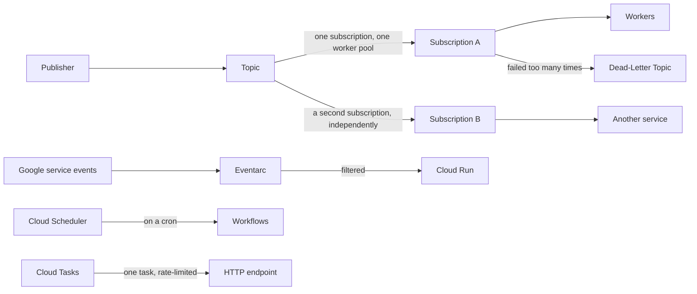

### Concepts — Messaging and Events

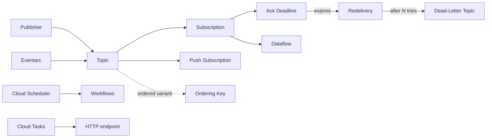

| Concept | Definition |
| --- | --- |
| **Pub/Sub** | a global Service decoupling a publisher from a consumer that may be slower, absent, or one of several |
| **Topic** | the named channel messages are published to, holding no reader state of its own |
| **Subscription** | one consumer's independent backlog and cursor over a Topic, and where retention, delivery and retry behaviour are set |
| **Ack Deadline** | the window a consumer has to acknowledge a message before it is delivered again to someone else |
| **Dead-Letter Topic** | where a message lands after failing delivery a set number of times, so that one bad message stops blocking the rest |
| **Ordering Key** | a string forcing messages that share it to arrive in publish order, at the cost of throughput on that key |
| **Push Subscription** | delivery as an authenticated HTTP request to an endpoint you own, instead of a consumer polling for work |
| **Eventarc** | the router carrying events from Google services, Cloud Audit Logs and Pub/Sub to a target, matched by filters on the event |
| **Cloud Tasks** | a queue where each task is individually scheduled, rate-limited and retried, then dispatched to an HTTP handler |
| **Cloud Scheduler** | managed cron, firing an HTTP call, a message or a Workflow on a timetable |
| **Workflows** | a state machine coordinating services with retries, branching and waits, expressed as YAML instead of code |
| **Dataflow** | managed Apache Beam pipelines running the same code over a stream or a batch, and the standard consumer for high-volume feeds |

### Pub/Sub — The Buffer and the Fan-Out

Pub/Sub is a **global** messaging service: publishers send messages to a **topic**, and each **subscription** on that topic gets its own independent copy of the backlog. One subscription with many workers behaves like an SQS queue; several subscriptions on one topic behave like SNS fan-out; a subscription with a retention window and seek behaves like a replayable log. Nothing about the topic changes between those three uses.

- **Entry point:** a **topic** and a **subscription**. The subscription is where the interesting settings live: **pull** or **push**, the **ack deadline**, the **message retention duration**, the **dead-letter topic** with a maximum delivery attempt count, the retry policy, and whether **exactly-once delivery** and **message ordering** are on.
- **Use it when:** work can be done a little later, by a pool of workers, at whatever rate they manage; or when several independent consumers need the same events. On this cloud that is also how services react to infrastructure: bucket notifications, Cloud Build results and Eventarc all arrive as Pub/Sub messages.
- **The delivery guarantee:** at-least-once by default, so consumers must be **idempotent** — safe to run twice. **Exactly-once delivery** is available on pull subscriptions and removes duplicates within the ack deadline, at some cost in throughput. **Ordering keys** give per-key order, and like every ordering guarantee in this document they trade throughput for it.
- **Replay:** because the subscription holds the backlog and retention is configurable up to a week (and longer on the topic itself), you can **seek** a subscription back to a timestamp or a snapshot and reprocess. That is the capability Kinesis provides on AWS, and here it is a property of the same service.
- **Trap:** the **ack deadline**, which is the visibility timeout by another name. Set it shorter than the handler takes and every slow message is processed twice; set it far too long and a crashed consumer leaves messages invisible for that whole period. The client libraries extend the deadline automatically while a handler runs, which hides the problem right up until you write a consumer without them.

### Eventarc — The Router

Eventarc delivers events to a target when they match a **trigger**: an event from a Google service, an entry in Cloud Audit Logs, or a message on a topic. It is how "when an object lands in this bucket, run this Cloud Run service" is expressed without writing glue.

- **Entry point:** a **trigger** — an event type, optional filters on the event's attributes, and a target (a Cloud Run service, a Cloud Run function, a Workflow, or a GKE service). Events are delivered in the **CloudEvents** format, which is a specification rather than a Google shape, so handlers stay portable.
- **The Audit Log source is the powerful one:** because almost every administrative API call is written to Cloud Audit Logs, a trigger on `methodName` can react to *any* change in the estate — a firewall rule edited, a service account key created, a database instance deleted. That is the equivalent of an EventBridge rule on the default bus, and it is the standard way to build automatic guardrails.
- **Use it when:** the routing decision depends on what happened rather than on which topic something was published to, or when the producer is Google rather than your own code.
- **Against Pub/Sub directly:** Eventarc is a layer over Pub/Sub, not a replacement. Publish to a topic yourself when your own code is the producer; use a trigger when Google's services are.

### Cloud Tasks and Cloud Scheduler — Per-Task Control and Cron

Two services that look like Pub/Sub from a distance and are not.

- **Cloud Tasks:** a queue whose unit is a **task with its own settings** — schedule it for a specific time, deduplicate it by name, retry it on its own policy, and dispatch it as an authenticated HTTP request to a handler you name. Pub/Sub broadcasts to subscribers and cannot tell you about one message; Cloud Tasks lets you create, inspect, delay and delete an individual task. Use it for per-user work with rate limits, deferred actions a user can cancel, and calling out to an endpoint that must not be overwhelmed — the **maximum dispatch rate** on the queue is a real backpressure control.
- **Cloud Scheduler:** managed cron. A schedule in standard cron syntax fires an HTTP request, a Pub/Sub message, or a Workflow, with retries and a time zone. It is the right home for nightly jobs, and combined with a Workflow it replaces most "we run a small VM just for cron" arrangements.
- **Trap:** using Pub/Sub for work that needs per-item control, and then building a database of message states beside it to get that control back. If the question "can I cancel that one job?" has to be answerable, it was a Cloud Tasks queue.

### Workflows — The State Machine

Workflows executes a sequence of steps described in YAML: call this API, branch on the answer, retry with backoff, wait, call the next. The state lives in the service rather than in a process you keep alive, so a workflow can wait hours between steps without anything running.

- **Entry point:** a **workflow definition** and an **execution**. Steps make authenticated calls to Google APIs and to your own services, with connectors that hide the polling for long-running operations.
- **Use it when:** several services must be coordinated with retries and branching, and the coordination logic deserves to be visible rather than buried in a handler — a provisioning sequence, an ETL chain, a human-approval flow.
- **Against writing it in code:** the argument is the same as for Step Functions on AWS. Expressing orchestration as data makes each step's retry policy explicit, makes the execution history a first-class thing to look at, and stops a Cloud Run instance from being kept alive purely to wait.

### Dataflow and Managed Kafka — The Stream Processors

- **Dataflow:** managed **Apache Beam**. One pipeline definition runs over a bounded batch or an unbounded stream, with windowing, watermarks and late-data handling as first-class concepts, and Google supplies templates for the common Pub/Sub-to-BigQuery and Pub/Sub-to-Cloud-Storage paths. It is the standard high-volume consumer of Pub/Sub, and the reason a subscription with millions of messages per minute is a normal thing here.
- **Managed Service for Apache Kafka:** Google-run Kafka clusters, for teams that need the Kafka **protocol** and ecosystem — Connect, Streams, existing tooling — and not only the semantics, which Pub/Sub already provides.
- **Trap:** ordering and throughput are per key, exactly as they are on every other platform in this document. An ordering key with uneven traffic, or a Kafka partition key with the same problem, throttles one path while the rest sit idle.

## Identity, Encryption and Secrets

Every call to Google Cloud — from a person, a pipeline or a running program — is checked before it does anything. The questions are always the same: *who is asking*, *what are they allowed to do*, and *how did they prove who they are* without a credential stored somewhere it can be stolen. Two things make the answers different from AWS: permissions **inherit down the resource hierarchy**, and grants are **additive with no user-authored deny** in the ordinary case, so the whole design discipline is about granting at the right node rather than about writing denies.

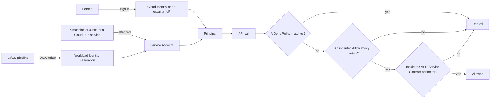

### Concepts — Identity and Access

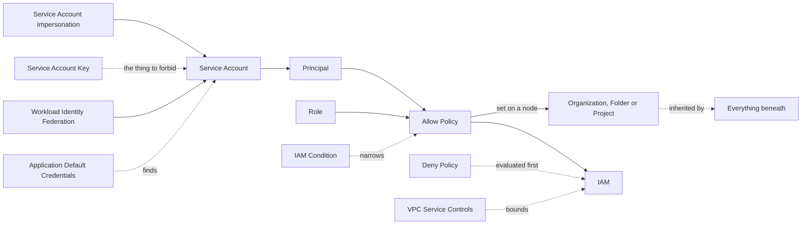

| Concept | Definition |
| --- | --- |
| **IAM** | the policy engine every Google Cloud call passes through: denied by default, grants that only add, and inheritance down the tree |
| **Principal** | the identity a request is made as — a person, a group, a workload, or a federated identity from outside |
| **Role** | a named bundle of permissions, either one of the three coarse basic ones, one predefined by Google, or one custom to your Organization |
| **Allow Policy** | the binding of Principals to Roles at one node of the tree, taking effect on everything beneath that node too |
| **Deny Policy** | a rule blocking a permission for named Principals whatever else grants it, evaluated first, and the only way to interrupt inheritance |
| **IAM Condition** | an expression attached to a binding that narrows it by resource name, by time, or by an attribute of the request |
| **Service Account** | an identity belonging to a workload rather than a person, which is both a Principal and a Resource others can be granted access to |
| **Service Account Impersonation** | obtaining short-lived credentials for another identity instead of holding a long-lived file for it |
| **Service Account Key** | a long-lived private key file: the credential that leaks, and the one an Organization Policy should forbid creating at all |
| **Workload Identity Federation** | trusting an external token issuer, so that a pipeline or another cloud's workload receives credentials with nothing stored anywhere |
| **Application Default Credentials** | the standard order a client library searches for credentials in, which is why correct code contains no credential handling |
| **VPC Service Controls** | a perimeter around a set of Projects that blocks Google API access across its boundary whatever the grants say |

### Concepts — Encryption and Secrets

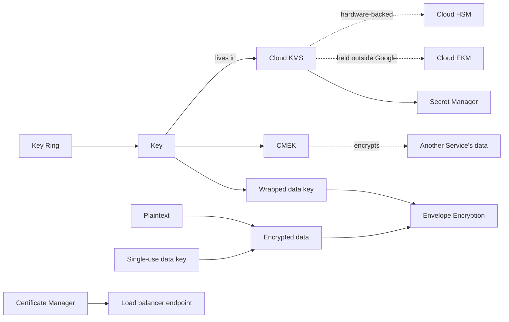

| Concept | Definition |
| --- | --- |
| **Cloud KMS** | the managed key Service: material that never leaves it, and every use permission-checked and recorded |
| **Key Ring** | the Region-scoped container keys are grouped into, which cannot be renamed, moved or deleted once it exists |
| **CMEK** | a key you create and control, used to encrypt another Service's data in place of the one Google would use by default |
| **Envelope Encryption** | encrypting data with a single-use data key, then encrypting that data key with a long-lived one |
| **Cloud HSM** | key material held in FIPS-validated hardware, for the compliance rules that require exactly that |
| **Cloud EKM** | key material held by a manager outside Google entirely, which Google must call out to in order to use it |
| **Secret Manager** | versioned storage for credentials, with per-secret access control, a replication choice and rotation notifications |
| **Certificate Manager** | issues and renews TLS certificates for managed endpoints, with the private key never leaving Google |
| **Confidential Space** | a hardware-attested environment where several parties compute over each other's data without any of them seeing it |

### IAM — The Policy Engine Underneath Everything

IAM decides, for every API call, whether it is allowed. The model has three parts and is simpler than AWS's: a **principal** (who), a **role** (a bundle of permissions), and a **resource** (the node the binding is set on). An **allow policy** on a node binds principals to roles, and it applies to that node and everything beneath it.

- **Entry point:** the **role**, and the discipline is entirely in which one you pick. **Basic roles** — Owner, Editor, Viewer — predate the rest of the model and are far too broad; Editor alone can modify almost everything in a project. **Predefined roles** are per-service and per-job (`roles/storage.objectViewer`, `roles/pubsub.publisher`) and are what production uses. **Custom roles** exist for the gaps, and carry a maintenance cost, because Google adds permissions to services and your custom role does not move.
- **Evaluation:** **deny policies** are checked first and win outright. Otherwise the union of every allow policy from the organization down to the resource is computed, and the call proceeds if any of them grants the permission. There is no "explicit deny in an ordinary policy" as there is on AWS — which removes a whole class of confusing evaluation, and removes the escape hatch with it.
- **Conditions** narrow a binding: only for resources whose name matches a prefix, only during working hours, only from a device meeting an access level. This is how "read-only on production, but only for buckets named `public-*`" is expressed without a custom role.
- **Groups, not people.** Grant roles to Google Groups and manage membership in the directory. A binding list full of individual email addresses is the reliable sign of an estate nobody can audit, and removing a leaver then means finding every binding they appear in.
- **Trap:** granting at the organization or folder node because it is convenient. Inheritance means the grant reaches every project that will ever exist beneath it, and — with no ordinary deny — nothing below can take it back. Grant at the project, and use the [Policy Analyzer and IAM Recommender](#recommender-and-security-command-center--the-advisory-layer) to find the over-broad grants already in place.

### Service Accounts — The Compute-to-Google-Cloud Bridge

How does code running on Google Cloud get permission to call Google Cloud? Not with a stored password. Each workload runs **as a service account** — an identity that belongs to the workload rather than to a person — and the platform hands it short-lived tokens automatically.

- **Entry point per compute type:** the service account **attached** to a Compute Engine instance, a Cloud Run service, a Cloud Run function or a Cloud Build trigger; and for GKE, a Kubernetes service account bound to a Google one through [Workload Identity Federation for GKE](#gke--managed-kubernetes). Your code does not need to know any of this: **Application Default Credentials** searches the standard places in order — an explicit environment variable, the local `gcloud` credentials, then the metadata server — and finds the token.
- **A service account is two things at once**, which is the part that confuses people arriving from AWS. It is a **principal** (you grant it roles, so it can do things) and a **resource** (you grant other principals roles *on it*, so they can use it). `roles/iam.serviceAccountUser` on a service account means "may attach this identity to a workload"; `roles/iam.serviceAccountTokenCreator` means "may become it". Both are privilege escalation paths and belong in every review.
- **Impersonation is the everyday tool.** `gcloud --impersonate-service-account=` and the equivalent in Terraform let a person or a pipeline act as a service account for one command, using short-lived credentials, with the impersonation recorded in the audit log. It replaces the key file for nearly every case a key file was used for.
- **On Compute Engine:** credentials come from the **metadata server** at `169.254.169.254`, reachable only from the instance itself. Note the default: unless told otherwise, a new instance is given the **default Compute Engine service account with the Editor role** and broad scopes. Create a purpose-built service account with the roles the workload actually needs, and disable the default with the `iam.automaticIamGrantsForDefaultServiceAccounts` organization policy.
- **Trap:** **service account keys** — downloadable JSON private keys that never expire. They are this cloud's equivalent of a long-lived AWS access key, and keys committed to repositories are the most common cause of compromised projects. There is now almost no legitimate reason to create one: impersonation covers local development, and workload identity federation covers pipelines and other clouds. Forbid them with `iam.disableServiceAccountKeyCreation` at the organization node, and treat the exceptions as exceptions.

### Cloud Identity and Workforce Federation — How Humans Log In

People sign in with Google identities that belong to your organization's domain, held in **Cloud Identity** (the directory, free at its base tier, and the same directory Google Workspace uses).

- **Entry point:** the verified domain and the directory behind it, then **groups** — because every role should be granted to a group, not to a person. Existing identity providers connect two ways: **federating into Cloud Identity** with SAML or OIDC and provisioning accounts there, or **Workforce Identity Federation**, which lets people from an external provider get short-lived Google Cloud credentials with no directory account created at all.
- **Also here:** two-step verification and security keys enforced by policy, **context-aware access** (grant only from managed devices or known networks, expressed as an access level and used in an IAM condition), and **Privileged Access Manager** for time-bound, approved elevation instead of standing administrative roles.
- **The super-admin problem:** organization-level super administrators sit above IAM and can grant themselves anything. Keep the count small, put them on hardware security keys, alert on their use, and never let day-to-day work happen under one.

### Workload Identity Federation — Keyless Pipelines

A deployment pipeline needs to call Google Cloud to deploy. The old way was to create a service account, download a key, and paste it into the CI system's secrets — a credential anyone with access to those settings could copy, and which never expires. **Workload identity federation** replaces it: the CI provider signs a short-lived token saying which repository and branch is running, and Google exchanges that token for credentials.

- **Entry point:** a **workload identity pool** and a **provider** inside it, registered once (for example GitHub's OIDC issuer). The provider maps claims from the incoming token onto Google attributes, and an **attribute condition** restricts which tokens are accepted at all. Then grant the pipeline's mapped identity permission to impersonate a deployment service account.
- **Use it when:** any pipeline deploys to Google Cloud, and equally for workloads running on AWS, Azure or on-premises that need to call Google APIs. There is no case where a downloaded key is the better answer.
- **Get the condition right, because it is the whole security of the arrangement.** A provider that accepts any token from GitHub's issuer accepts tokens from *every repository on GitHub*. The attribute condition must pin the repository, and usually the branch or environment as well. This is the exact analogue of an AWS trust policy with `repo:org/*:*` in it, and it is the same finding in a review.

### Organization Policy and VPC Service Controls — The Guardrails

IAM answers "may this principal do this?". Two other mechanisms answer questions IAM structurally cannot.

- **Organization policies** constrain **how resources may be configured**, regardless of who is asking. They are set on the organization, a folder or a project, and inherited. The ones worth setting on day one: `iam.disableServiceAccountKeyCreation`, `compute.vmExternalIpAccess`, `compute.requireOsLogin`, `compute.skipDefaultNetworkCreation`, `storage.publicAccessPrevention`, `sql.restrictPublicIp`, and `gcp.resourceLocations` where residency rules apply. **Custom constraints** cover organization-specific rules the built-in list does not.
- **VPC Service Controls** draw a **perimeter** around projects and block Google API traffic across it. Inside the perimeter, services can talk; from outside, even a valid credential with a valid role is refused. This closes the exfiltration path IAM cannot: a legitimate administrator copying a bucket to a personal project. **Ingress and egress rules** carve out the paths that must cross, and **access levels** let named devices or networks in.
- **Build the perimeter in dry-run mode first.** It logs what it would have blocked without blocking it. Enforcing a perimeter on a live estate without that step breaks pipelines, monitoring exports and support tooling on the same afternoon, and the failures are opaque by design.

### Cloud KMS — Key Management and Envelope Encryption

Everything on Google Cloud is encrypted at rest by default, with keys Google manages and you never see. Cloud KMS is for when that is not enough: keys **you** create, control, audit and can destroy.

- **Entry point:** a **key ring** in a location, then a **key** with a purpose (symmetric encryption, asymmetric signing, MAC) and a rotation period. Key rings and keys cannot be deleted, which is deliberate and worth knowing before you name them: the resource names are permanent.
- **CMEK — customer-managed encryption keys** — is the pattern that matters day to day: point Cloud Storage, BigQuery, Persistent Disk, Cloud SQL or Pub/Sub at your key, and that service now needs your permission to read its own data. Revoking or disabling the key makes the data unreadable, which is the point and also the hazard.
- **Envelope encryption:** a key in KMS never leaves it and can only encrypt a few kilobytes, so nothing encrypts a terabyte directly with one. A service asks KMS for a **data key**, gets a plaintext copy and a wrapped copy, encrypts locally with the plaintext copy, stores the wrapped copy next to the data, and discards the plaintext. To read, it sends the wrapped key back to be unwrapped. That is how services encrypt terabytes with a key that never leaves KMS.
- **The escalating tiers:** software keys in KMS, **Cloud HSM** for FIPS-validated hardware, **Cloud EKM** for keys held by an external manager outside Google — which is as close as this gets to "the provider cannot read my data", and which makes availability of your key manager part of your availability story.
- **Trap:** the **service agent** of each service needs the encrypter/decrypter role on your key, and that grant is easy to miss when a project is rebuilt from Terraform. The symptom is a service that creates its resource successfully and then fails to write to it.

### Secret Manager and Certificate Manager

- **Secret Manager:** secrets stored as immutable **versions**, with per-secret IAM and a **replication policy** chosen at creation — automatic (Google picks regions) or user-managed (you name them, for residency). Applications read a version at startup, or mount it: Cloud Run and GKE can expose a secret as an environment variable or a file without your code calling the API. Rotation here means a **notification** on a schedule plus your own rotation function; it is not automatic the way Secrets Manager's built-in rotations are on AWS.
- **Certificate Manager:** provisions and renews TLS certificates for load balancers, including Google-managed certificates validated by DNS, wildcard certificates and certificate maps for many domains on one balancer. The private key never leaves Google.
- **Never** bake a secret into an image, leave one in an environment variable committed to Git, or pass one as a build argument that lands in an image layer. The one rule with no exceptions in this document.

## Observability and Governance

Observability is how you find out what a running system is doing. Governance is how you find out what the estate itself is doing — who changed what, what exists, and whether it matches the rules. Google Cloud packages both under **Cloud Operations**, and the pieces are unusually well joined: logs, metrics, traces and errors share one query surface, and a log line can be turned into a metric without leaving the console.

The important structural difference from AWS: **there is no per-service log group to create.** Everything writes to one Cloud Logging pipeline, and a **sink** decides what is stored, where, and for how long. That makes routing a design decision you make once for the whole organization rather than a setting on each service.

```mermaid
flowchart LR
  Apps[Applications and Google services] --> Logging[Cloud Logging]
  Apps --> Monitoring[Cloud Monitoring]
  Apps --> Trace[Cloud Trace]
  Logging --> Sink{Log Sink filter}
  Sink -->|keep| Bucket[Log bucket]
  Sink -->|analyse| BQ[BigQuery]
  Sink -->|archive| GCS[Cloud Storage]
  Sink -->|forward| PS[Pub/Sub to an external SIEM]
  Logging --> LBM[Log-based metric] --> Monitoring
  Monitoring --> Alert[Alerting policy] --> Oncall[On-call]
  Monitoring --> SLO[SLO and error budget]
  Audit[Cloud Audit Logs] --> Logging
  Assets[Cloud Asset Inventory] --> SCC[Security Command Center]
```

### Concepts — Observability and Governance

```mermaid
flowchart LR
  Metric --> AP[Alerting Policy]
  UC[Uptime Check] --> Metric
  Metric --> SLO
  SLO --> EB[Error Budget]
  Metric --> CM[Cloud Monitoring]
  CL[Cloud Logging] --> LS[Log Sink]
  CL --> LBM[Log-Based Metric] --> Metric
  CAL[Cloud Audit Logs] --> CL
  CT[Cloud Trace] -. per request .-> Latency
  CAI[Cloud Asset Inventory] -. inventories .-> Everything
```

| Concept | Definition |
| --- | --- |
| **Metric** | a named series of numbers over time with labels, produced either by Google for a Resource or written by your own code |
| **Cloud Monitoring** | the Service that collects those series from Google, from agents and from applications, and hosts the dashboards, alerts and SLOs built on them |
| **Alerting Policy** | a condition over a Metric together with the channels notified while it holds, and the place where paging noise is tuned |
| **Uptime Check** | a probe run from Google's locations against an endpoint, giving the outside view that no internal Metric can |
| **SLO** | a target for one indicator of service quality over a window — the number deciding whether users are being served well enough |
| **Error Budget** | the amount of failure an SLO still permits in its window; when it is spent, the work changes from features to reliability |
| **Cloud Logging** | the single pipeline every log entry is written to, routed before it is stored and queried in one place afterwards |
| **Log Sink** | a filter plus a destination, deciding which entries are kept, where they are sent, and which are dropped before anyone pays to store them |
| **Log-Based Metric** | a counter or distribution derived from matching log entries, turning something written as text into something you can alert on |
| **Cloud Audit Logs** | the record of who called which API, against what, and when, written by Google rather than by your code |
| **Cloud Trace** | timing for one request as it crosses services, showing where the latency actually was rather than where it was assumed to be |
| **Cloud Asset Inventory** | a searchable, time-travelling index of every Resource and policy in the Organization, and the answer to "what do we actually have?" |

### Cloud Monitoring — Metrics, Alerts and SLOs

Cloud Monitoring collects metrics with no setup for Google's own services, and with the **Ops Agent** installed for anything inside a virtual machine — CPU steal, memory, disk and process metrics that the hypervisor cannot see from outside.

- **Entry point:** the **metric explorer** and the query language behind it (**PromQL** or **MQL**), then dashboards and **alerting policies**. An alerting policy is a condition, a duration, and one or more **notification channels**; the duration is what separates a page from a spike.
- **Managed Service for Prometheus** is the piece worth knowing about. It ingests Prometheus metrics at scale, stores them for two years, and is queried with PromQL — so a team already running Prometheus and Grafana keeps its dashboards and its alert rules and stops running the storage. On GKE it can be enabled per cluster and collects from standard `PodMonitoring` resources.
- **SLOs are first-class here.** Define a service, define an SLI from a metric or from request counts, set a target and a window, and Monitoring computes the **error budget** and its burn rate for you. Alert on **burn rate**, not on raw error rate: a fast-burn condition pages when the month's budget would be gone in hours, and a slow-burn condition opens a ticket. That single change removes most alert fatigue, because it ties paging to user harm rather than to a threshold someone guessed.
- **Trap:** alerting on a symptom nobody feels. High CPU on a node that is serving fine is not an incident. Page on the SLO burn rate and on saturation that predicts imminent failure; leave everything else as a dashboard.

### Cloud Logging — The Log Router

Every log entry — from Google's services, from the logging agent, from your application's stdout — enters one pipeline, and the **log router** decides what happens to it.

- **Entry point:** the **sink**, which is a filter and a destination. Four destinations matter: a **log bucket** (the default store, with a configurable retention period and optional **Log Analytics**, which puts a SQL surface over it), **BigQuery** for analysis, **Cloud Storage** for cheap long archive, and **Pub/Sub** for forwarding to an external SIEM. **Exclusion filters** drop high-volume noise before it is billed, which is the main cost lever in this whole section.
- **The aggregated sink is the pattern to remember.** A sink created at the **organization or folder** node with `includeChildren` captures logs from every project beneath it, into one central place, and does so for projects that do not exist yet. That is how an estate gets a single audit trail without asking every team to configure anything.
- **Structured logging matters more than it looks.** Write JSON to stdout and Cloud Logging parses it into `jsonPayload` fields you can filter and build log-based metrics on; write plain text and you are searching strings forever. On Cloud Run and GKE this is free — the platform picks up stdout.
- **Trap:** cost. Logging bills on ingestion, and the volume that surprises people is almost always **data access audit logs** (off by default for exactly this reason) and debug-level application logs left on after an incident. Set exclusion filters and per-bucket retention deliberately, and re-check ingestion after any incident where log levels were raised.

### Cloud Trace, Profiler and Error Reporting — Application Insight

- **Cloud Trace:** distributed tracing. A request gets a trace ID, each service adds spans, and the waterfall shows where the time went. Instrument with **OpenTelemetry** rather than a Google-specific library — the same code then exports to Trace, to Jaeger, or to a vendor, and the choice stays reversible. App Engine, Cloud Run and the load balancers propagate context automatically.
- **Cloud Profiler:** continuous, low-overhead CPU and heap profiling from production. It answers "which function is actually burning the money", which is a different question from "which request is slow" and is rarely answerable from a laptop.
- **Error Reporting:** groups stack traces from logs into distinct errors with counts, first-seen and last-seen. It is the difference between "there are 40,000 error lines" and "there are three bugs".
- **Trap:** sampling. Trace samples by default, so the one slow request you want is often not captured. Raise the sample rate for the routes that matter, and force a trace when a request is already known to be slow.

### Cloud Audit Logs — Who Did What

Four streams, and the distinction between them is worth having ready.

- **Admin Activity:** every call that creates, modifies or deletes configuration. Always on, cannot be turned off, free, retained 400 days. This is the log that answers "who deleted the database".
- **Data Access:** reads and writes of *data* — reading an object, querying a table. Off by default except for BigQuery, because the volume is enormous. Turn it on per service, with exemptions, where a compliance rule or a real threat model requires it.
- **System Event:** actions Google takes on your resources, such as a live migration or an automatic instance restart.
- **Policy Denied:** a request refused by a security policy, which is where VPC Service Controls and organization policy violations appear.

Route all four to an aggregated sink at the organization node, into a project whose access list is short and separate from the ones being audited. An audit trail that the people being audited can delete is not an audit trail.

### Cloud Asset Inventory — What Do We Have

Asset Inventory keeps a searchable index of every resource, every IAM policy and every organization policy in the estate, with **five weeks of history**. You can query it (`gcloud asset search-all-resources`), export it to BigQuery on a schedule, ask what a resource looked like last Tuesday, and subscribe to a **feed** that publishes to Pub/Sub whenever something changes.

- **Use it when:** answering "which projects have a public bucket", "where are the VMs with an external IP", "when did that firewall rule change", or building the cost and compliance reports that need a full inventory joined to something else.
- **With Policy Analyzer:** the pair answers the access questions IAM alone makes hard — "who can read this bucket, by any path, including through group membership and inheritance". That is the query that finds the grant nobody remembers making.

### OS Config and Fleet Management

The virtual machines still need patching, inventory and remote access, and doing that with a bastion host and SSH keys does not scale.

- **OS Config:** an agent on each instance that reports **inventory** (installed packages and versions), applies **patch jobs** on a schedule with a maintenance window and a reboot policy, and enforces **guest policies** so a package or configuration file is present. This is the Systems Manager Patch Manager equivalent.
- **OS Login:** ties Linux SSH access to IAM instead of to metadata SSH keys. `roles/compute.osLogin` gives a person an account on the machine; `roles/compute.osAdminLogin` gives them `sudo`; revoking the role revokes access everywhere at once, and every session is auditable. Enforce it with the `compute.requireOsLogin` organization policy and stop managing key files entirely.
- **Identity-Aware Proxy TCP forwarding:** reach an instance with no external IP, over an IAP tunnel authorised by IAM, with `gcloud compute ssh --tunnel-through-iap`. That removes the bastion host and the inbound SSH rule together, which is two standing risks gone for one configuration change.
- **Trap:** the agent. OS Config, the Ops Agent and IAP all depend on something being installed and reachable — build them into the image or the instance template, not into a manual step, or the fleet quietly splits into managed and unmanaged halves.

### Recommender and Security Command Center — The Advisory Layer

- **Recommender:** a family of automatic suggestions computed from usage — idle instances and disks, over-provisioned machine types, unused IP addresses, commitment purchases that would pay off, and the important one, **IAM role recommendations**, which propose a narrower role based on the permissions an identity has actually used in the last 90 days. That last one turns least privilege from an argument into a diff.
- **Security Command Center:** the aggregated security view. **Security Health Analytics** finds misconfigurations (public buckets, open firewall rules, keys past their rotation date), **Event Threat Detection** watches audit logs for suspicious behaviour, and findings can be exported to Pub/Sub or a ticketing system. The Standard tier is included; the paid tiers add threat detection and attack path analysis.
- **Also here:** **Policy Intelligence** for the analyzers described above, and **Cloud Quotas** for seeing and raising limits before they stop a deployment rather than during one.
- **Trap:** enabling all of this and routing none of it. Findings that appear only in a console nobody opens are the same as no findings. Export to the place the team already looks, and give each finding class an owner.

## Infrastructure as Code and Delivery

Infrastructure as code means the estate is described in files kept in version control, and changes reach the cloud by changing those files. The benefit is not automation for its own sake — it is that the description is reviewable, repeatable across projects, and recoverable. A project rebuilt from a repository is a project you understand.

Google Cloud's own history here is unusual: **Deployment Manager, its first-party tool, is deprecated**, and Google's answer is Terraform. That is not a hedge — Google publishes the provider, publishes reference architectures as Terraform modules, runs a hosted Terraform service, and generates Terraform from existing resources in the console. Anyone arguing for a Google-specific declarative language on this cloud is arguing against Google.

```mermaid
flowchart LR
  Repo[Git repository] --> PR[Pull request]
  PR --> Plan[terraform plan in CI]
  Plan --> Review[Human review of the plan]
  Review --> Apply[terraform apply]
  Apply -->|impersonated, keyless| SA[Deployment service account]
  SA --> Env[Google Cloud project]
  Env -.->|changed by hand| Drift
  Drift -.->|detected by a scheduled plan| Repo
  Repo --> Build[Cloud Build] --> AR[Artifact Registry] --> CD[Cloud Deploy] --> Prod[Production]
```

### Concepts — Infrastructure as Code and Delivery

```mermaid
flowchart LR
  Terraform --> Provider
  Terraform --> State
  Terraform --> Module
  Module --> Blueprint
  Terraform --> IM[Infrastructure Manager]
  CC[Config Connector] -. the alternative loop .-> Terraform
  State -.->|compared against reality| Drift
  CD[Cloud Deploy] --> DP[Delivery Pipeline]
  DP --> PD[Progressive Delivery]
  II[Immutable Infrastructure] --> PD
```

| Concept | Definition |
| --- | --- |
| **Terraform** | the tool most Google Cloud infrastructure is declared in, applying the difference between what is declared and what is recorded as existing |
| **Provider** | the plugin translating declarations into one platform's API calls, pinned to a version so that upgrading is a deliberate act |
| **State** | the file recording which real Resource each declared one corresponds to, and the thing that must be shared and locked before two people run a plan |
| **Module** | a reusable group of Resources with inputs and outputs, so that a pattern is written once, versioned, and reused across Projects |
| **Infrastructure Manager** | Google's hosted runner for Terraform, holding State and applying under a Service Account rather than on somebody's laptop |
| **Config Connector** | a GKE add-on that represents Google Cloud Resources as Kubernetes objects, so a controller reconciles them continuously instead of on demand |
| **Blueprint** | a packaged, opinionated set of Modules for a whole landing zone, published by Google as a starting point rather than as a product |
| **Drift** | the gap that opens when something is changed outside the declarations, and the reason console edits are banned in production |
| **Cloud Deploy** | the managed release Service promoting one built artifact through ordered environments, with approvals and a one-command rollback |
| **Delivery Pipeline** | the declared sequence of target environments a release moves through, kept in version control beside the code it deploys |
| **Immutable Infrastructure** | replacing a server instead of modifying it, so that what is running always matches what was built and tested |
| **Progressive Delivery** | shifting traffic to a new Revision in steps while watching metrics, so that a bad release is caught before everyone has it |

### Choosing an IaC Tool

- **Terraform** is the default, and on this cloud it is close to unanimous. The Google provider covers essentially the whole platform, the **Cloud Foundation Toolkit** publishes maintained modules for projects, networks, GKE clusters and organization policies, and `gcloud beta resource-config bulk-export` generates Terraform from an estate that already exists — which is how a manually built environment gets brought under code without rewriting it by hand.
- **Infrastructure Manager** runs that same Terraform as a Google service: it stores state, runs the apply under a service account, and keeps a deployment history. It removes the "where does state live and who can run apply" problem, at the cost of less control than a pipeline you own.
- **Config Connector** is the genuinely different option. Google Cloud resources become Kubernetes custom resources in a GKE cluster, and a controller **continuously reconciles** them — drift is corrected rather than reported. Choose it when the team already lives in Kubernetes and wants one control plane for applications and infrastructure; the trade is that your infrastructure now depends on a cluster being healthy. (The trade-off is worked through in [Terraform vs. Config Connector](#terraform-vs-config-connector).)
- **Deployment Manager** is deprecated. If you meet it in an existing estate, the migration path is export to Terraform.
- **The client libraries and `gcloud`** are for the things code cannot express — a one-off investigation, a data migration, a script inside a pipeline. They are not an infrastructure tool, and a shell script that creates resources is an infrastructure tool nobody can review.

### Pipelines for Infrastructure

Terraform in a pipeline follows the same shape everywhere, and three details are specific to Google Cloud.

1. **State in a Cloud Storage bucket**, with **object versioning on** so a corrupted state can be rolled back. GCS locking is built into the backend — there is no separate lock table to create as there is with DynamoDB on AWS.
2. **Authentication by workload identity federation**, never a service account key. The pipeline exchanges its OIDC token for credentials and impersonates a deployment service account per environment.
3. **A project per environment**, and separate state per project. `terraform plan` on a pull request, posted as a comment; `terraform apply` only after review, only from the main branch.

Beyond that: run `tflint` and a policy check in the same job. **Policy as code** here means either **Open Policy Agent / Gatekeeper** against the plan, or Google's **Policy Controller** in GKE, and it is what stops the fourteenth review comment that says "this bucket is public". Add a **scheduled plan** that runs against production and alerts on a non-empty diff — that is your drift detector, and it is five lines of pipeline.

The delivery side of the same story: **Cloud Build** builds and tests, **Artifact Registry** stores the image with its vulnerability scan, **Cloud Deploy** promotes one immutable artifact through dev, staging and production with approvals, and **Binary Authorization** refuses to run anything that was not signed along the way. The rule underneath is worth stating plainly: **build once, promote the same artifact**. An image rebuilt per environment is a different image, and it is the one that behaves differently in production.

For the general practice, see [CI/CD](../docs/04-development-process/03-ci-cd.md).

### Configuration Management

Configuration management — Ansible, Chef, Puppet — changes a server that already exists to bring it to a desired state. It answers a different question from Terraform, which creates and destroys the servers.

On Google Cloud the boundary is usually drawn like this: **Packer builds an image, Terraform creates instance templates and managed instance groups from it, and nothing logs in afterwards.** The configuration work moves left, into image build. What remains for a configuration tool is the estate that cannot be rebuilt — long-lived stateful machines, legacy appliances, on-premises servers in a hybrid estate — and there, **OS Config guest policies** cover the common cases (a package present, a file in place, a patch applied) without another tool at all.

Use a configuration management tool when you have servers you cannot replace. Prefer to have fewer of those.

### Immutable Infrastructure and Progressive Delivery

**Immutable infrastructure** means never modifying a running server. To change it, build a new image and replace the instance. It eliminates configuration drift by construction — every instance came from the same artifact — and makes rollback into "start the previous version" instead of "undo the change".

On this cloud the mechanics are: a **golden image** built by Packer and stored as a Compute Engine image (or a container image in Artifact Registry), an **instance template** referencing it, and a **managed instance group** doing a rolling update with `maxSurge` and `maxUnavailable` set so capacity never dips. For containers, the same thing without images to bake: a new Cloud Run revision, or a new deployment in GKE.

**Progressive delivery** is releasing to a fraction of traffic and watching before continuing.

- **Cloud Run** makes it a one-liner: tag a revision, then `--to-revisions=REV=10` sends it a tenth of traffic, and the rest stays where it was. Rollback is the same command with the old revision at 100.
- **GKE** does it with a service mesh (Cloud Service Mesh, based on Istio) or a gateway that supports weighted routing, and **Cloud Deploy** can automate the canary phases with verification jobs between them.
- **Compute Engine** does it by weighting two backend services behind one URL map.
- **Feature flags** do it in the application, and are the only version of this that works when the change is a database migration rather than a deployment.

The part that gets skipped is the watching. A canary with no automatic check is just a slower deployment; define what "healthy" means as a metric or an SLO burn rate, and let the pipeline roll back on it.

### Cloud-Native Practice on Google Cloud

Cloud-native is not "runs on a cloud"; it is a set of habits that assume elastic, failure-prone infrastructure.

- **Design for failure.** Instances are preempted, live-migrated and replaced. Health checks, retries with backoff and jitter, and idempotent handlers are the baseline, not the hardening pass.
- **Stateless services.** Keep session and application state in Memorystore, Firestore or a database so any instance can serve any request and scaling is a number.
- **Managed over self-run.** Every service you operate yourself is on-call time. Prefer Cloud SQL to a database on a VM, Pub/Sub to a broker you patch, GKE Autopilot to nodes you manage — unless there is a concrete reason, and "we might need the control" is not one until you need it.
- **Everything as code.** Infrastructure, pipelines, policies, dashboards and alerts. If it exists only because someone clicked, it is gone after the person leaves.
- **Observability from the start.** Structured logs, traces through OpenTelemetry, SLOs with error budgets. Instrumentation added during an incident arrives too late to help with it.

See [Containers and Orchestration](../docs/03-system-design/05-containers.md) for the patterns underneath, and [The Twelve-Factor App](../docs/05-coding/index.md) for the application-side rules these assume.

## Resilience and Recovery

Resilience is staying up through the failures you expected. Recovery is getting back after the ones you did not. Google Cloud's zonal and regional structure decides what each costs, and the two numbers that drive every decision are **RTO** — how long you may be down — and **RPO** — how much recent data you may lose. Everything else follows from where those two land.

Two Google-specific facts change the shape of the answer compared with other clouds. **Live migration** moves running instances off failing hardware without a reboot, so single-machine failures rarely become your problem. And the **global VPC and global load balancer** mean a multi-region front end is a routing change rather than a second network to build.

```mermaid
flowchart LR
  Zonal[Zone fails] -->|regional MIG, regional PD, regional Cloud SQL| SurviveZ[Survived automatically]
  Regional[Region fails] --> Q{What did you build?}
  Q -->|Backup only| Restore[Restore into another Region: hours to days]
  Q -->|Pilot light| Scale[Start the standby and scale: tens of minutes]
  Q -->|Warm standby| Shift[Shift traffic: minutes]
  Q -->|Hot, multi-region| None[No action: seconds]
  Restore --> Cost1[Cheapest]
  None --> Cost2[Most expensive]
```

### Concepts — Resilience and Recovery

```mermaid
flowchart LR
  RTO --> Choice[Recovery strategy]
  RPO --> Choice
  Choice --> PL[Pilot Light]
  Choice --> WS[Warm Standby]
  Choice --> HS[Hot Standby]
  Snapshot --> Restore
  BDR[Backup and DR Service] --> Snapshot
  BV[Backup Vault] -. protects .-> Snapshot
  Failover --> Failback
  BR[Blast Radius] -. bounded by .-> Boundaries[Project and Region boundaries]
  GD[Game Day] -. proves .-> Choice
```

| Concept | Definition |
| --- | --- |
| **RTO** | the length of time the business accepts being unable to serve, which decides how much standing capacity is worth paying for |
| **RPO** | the amount of recent data the business accepts losing, which decides how often something must be copied elsewhere |
| **Backup and DR Service** | the managed scheduler and catalogue for backups of instances, disks and databases across an Organization |
| **Backup Vault** | a store whose contents the Project's own administrators cannot delete early, which is what makes a copy ransomware-resistant |
| **Failover** | moving serving to the standby, whether automatic or triggered by a person |
| **Failback** | returning to the original once it is healthy, and the half of the plan that is almost never rehearsed |
| **Blast Radius** | how much stops working when one thing does, and the property that Project and Region boundaries exist to bound |
| **Pilot Light** | data kept continuously up to date elsewhere with the compute switched off, traded against a recovery measured in tens of minutes |
| **Warm Standby** | a smaller copy of the system running elsewhere, ready to take traffic and be scaled up within minutes |
| **Hot Standby** | full capacity serving in more than one place at once, which is the only arrangement with nothing to do when one fails |
| **Game Day** | a rehearsed failure run against a real environment, because a plan that has never been executed is an assumption |

### Choosing a Recovery Strategy

Start by separating the two kinds of failure, because they have different answers.

**A zone fails.** This should not be a decision at all — it should already be handled by how things were built. A **regional managed instance group** spreads instances across zones and recreates the lost ones. A **regional Persistent Disk** replicates synchronously between two zones. **Cloud SQL with high availability** keeps a standby in a second zone and fails over automatically. A **regional GKE cluster** puts the control plane in three zones. Each of these costs roughly double the zonal version for the resource concerned, and each removes an entire class of incident. For anything serving users, take them.

**A region fails.** Now it is a business decision, and there are four positions.

| Strategy | RTO | RPO | What runs continuously | Cost |
| --- | --- | --- | --- | --- |
| **Backup and restore** | hours to days | hours | nothing | lowest |
| **Pilot light** | tens of minutes | minutes | data replication only | low |
| **Warm standby** | minutes | seconds to minutes | a scaled-down copy | medium |
| **Hot, multi-region** | near zero | near zero | full capacity in each region | highest |

The mechanics for each on this cloud:

- **Backup and restore:** dual-region or multi-region buckets, cross-region snapshot schedules, Cloud SQL backups with a cross-region replica, and the Backup and DR Service to schedule and catalogue it all. Put the critical copies in a **backup vault** so that compromised credentials cannot delete them.
- **Pilot light:** a second project and subnets in the other region, a Cloud SQL cross-region read replica or a Spanner configuration kept current, images and Terraform ready, and no compute running. Recovery is promote the replica, `terraform apply`, shift DNS.
- **Warm standby:** the same, with a small managed instance group or Cloud Run service already serving. Because the load balancer is global, "shifting traffic" is adding a backend to an existing URL map, not repointing DNS and waiting for caches.
- **Hot:** a global external Application Load Balancer with backends in several regions, and a database that is genuinely multi-region — **Spanner** in a multi-region configuration, or **Firestore** in a multi-region location. Everything else in this list is a workaround for a database that is not.

Three things decide whether any of it works.

- **The database is the hard part.** Compute is easy to run in two regions; consistent data is not. Whether Spanner's cost is justified is almost always the same question as whether your RPO is really "near zero".
- **The dependencies must exist there too.** Container images in a multi-region Artifact Registry, secrets replicated, KMS keys available in that region — a key ring is regional, and a workload cannot decrypt with a key from a region that is down.
- **Untested means broken.** Run a game day: fail over on purpose, in production, on a scheduled afternoon, and time it. The gap between the documented RTO and the measured one is the finding.

Related: [Reliability and Recovery](../docs/03-system-design/01-common-concepts.md).

## Running It Well

Everything above is what the services are. This section is what to do with them once real traffic and a real bill are involved. Nothing new is defined here — every term links back to where it was introduced.

### Performance Optimization

- **Measure before changing anything.** Cloud Monitoring for the resource view, Cloud Trace for where a request's time went, Cloud Profiler for which code burns the CPU. Most "the cloud is slow" findings turn out to be one query, one missing index or one synchronous call in a loop.
- **Right-size from data, not from a guess.** Recommender computes machine type suggestions from eight days of observed usage, and **custom machine types** let you act on them exactly — 6 vCPUs and 20 GB, rather than the next size up. This is the single largest source of easy savings on Compute Engine.
- **Put the work near the user.** The global external Application Load Balancer terminates TLS at the nearest point of presence and carries the request over Google's own backbone from there, which is often a larger win than anything done inside the application. Add Cloud CDN for anything cacheable.
- **Cache deliberately.** Memorystore in front of a database, Cloud CDN in front of static and cacheable dynamic responses, and application-level caching for computed results. Decide the invalidation rule before adding the cache; see [Caching](../docs/03-system-design/03-caching.md).
- **Match the disk to the workload.** Balanced Persistent Disk for most things, SSD or Hyperdisk when IOPS matter, Local SSD only for scratch that can vanish. Remember that Persistent Disk performance scales with size and with the instance's vCPU count — a small disk on a small machine is slow for two reasons at once.
- **Scale on the right signal.** CPU is a poor proxy for a service whose work is waiting on something else. Autoscale Cloud Run on concurrency, GKE on a custom metric or queue depth, managed instance groups on the load balancer's utilization rather than CPU where the two disagree.
- **Reach for the tier above only when the tier below is exhausted.** Premium tier networking, a larger Cloud SQL instance and more Dataflow workers all work; they also all hide the query that should have been fixed.

### Cost Management

- **Understand the discounts before buying anything.** **Sustained use discounts** apply automatically to Compute Engine when an instance runs a large fraction of the month — no commitment, no action. **Committed use discounts** are a one- or three-year commitment for a much larger reduction, and now come in a spend-based flavour that covers Cloud Run, GKE Autopilot and databases as well as VMs. Cover the steady baseline with commitments and let the variable part ride on the automatic discount.
- **Use Spot VMs where interruption is acceptable** — batch, CI runners, stateless workers behind a queue, GKE node pools with a tolerance. The discount is 60–91%, and the price of it is a 30-second notice.
- **Delete what nobody is using.** Unattached disks, old snapshots, reserved but unassigned external IP addresses, idle Cloud SQL instances and forgotten dev projects. Recommender lists all of these; the difficulty is never finding them, it is having an owner willing to act.
- **Set budgets with programmatic alerts.** A budget publishes to Pub/Sub as well as sending an email, so the response can be a function that stops a runaway job rather than a message somebody reads on Monday.
- **Export billing to BigQuery on day one.** It is the only way to answer "why did this go up" with labels, projects and SKUs — and it is retrospective, so the export you did not enable last month cannot be backfilled.
- **Label everything, and enforce it.** Cost attribution across an organization is a labelling policy plus the Terraform module that applies it, not a spreadsheet.
- **Watch the four costs that surprise people:** egress out of Google Cloud and between regions; BigQuery on-demand queries billed by **bytes scanned** (a `SELECT *` on a large table is a real invoice); Cloud Logging ingestion, especially with data access audit logs on; and idle provisioned capacity such as Cloud Run minimum instances or an over-large Spanner configuration.
- **Set the cheap guardrails.** Cloud Storage lifecycle rules or Autoclass, snapshot retention policies, BigQuery table expiry and partition requirements, and quotas on the services where a loop can spend quickly.

### Security Best Practices

- **Least privilege, and let the tooling find it.** Predefined roles over basic ones, IAM conditions to narrow them, and the IAM Recommender to propose the smaller role from 90 days of actual use. Grant to groups at the project node, not to people at the organization node.
- **No service account keys.** Impersonation for people, workload identity federation for pipelines and other clouds, attached service accounts for workloads. Forbid key creation with an organization policy so the exception has to be argued for.
- **Set the guardrails at the top.** Organization policies deny by construction what IAM would otherwise allow someone to configure: no external IPs, no public buckets, no public Cloud SQL, OS Login required, resource locations restricted.
- **Private by default.** No external IP on instances; egress through Cloud NAT; Google APIs reached over Private Google Access or Private Service Connect; administrative access through Identity-Aware Proxy rather than a bastion. Then a VPC Service Controls perimeter around the projects holding data, built in dry-run mode first.
- **Encrypt with intent.** Everything is encrypted at rest already; use CMEK where you need the ability to revoke, audit or destroy, and Cloud HSM or Cloud EKM where a rule requires it. Enforce TLS in transit and turn on the internal encryption options where a service offers them.
- **Keep the audit trail somewhere the audited cannot reach.** An aggregated sink at the organization node into a separate project with a short access list, retention set to the compliance period, and alerts on the events that matter: key creation, role grants at high nodes, firewall changes, policy denials.
- **Shift security into the pipeline.** Artifact Registry vulnerability scanning, Binary Authorization to refuse unsigned images, policy checks on the Terraform plan, and secrets from Secret Manager rather than from the environment.
- **Then check yourself continuously.** Security Command Center for misconfiguration and threat findings, Policy Analyzer for "who can actually reach this", and an owner for each finding class. Also see [Security](../docs/00-software-engineering/index.md) for the principles these implement.

## Diagrams to Draw

An interview or a design review usually reaches a whiteboard. Two diagrams cover most of what gets asked about Google Cloud, and both are worth being able to draw from memory while talking.

### The Landing Zone with a Shared VPC

```text
                      Organization (example.com)
                               |
        +----------------------+----------------------+
        |                      |                      |
   Folder: shared        Folder: prod           Folder: non-prod
        |                      |                      |
  +-----+------+          +----+----+            +----+----+
  |            |          |         |            |         |
Host project  Logging   app-prod  data-prod   app-dev   app-staging
  |           project    (service   (service    (service  (service
  |             |         project)   project)    project)  project)
  |             |             |         |            |         |
  |        [aggregated    attaches to the host project's
  |         log sink]     subnets - no VPC of their own
  |
  +-- Shared VPC (global)
       |
       +-- subnet: europe-west1  10.0.0.0/20
       |     + secondary ranges for GKE pods and services
       +-- subnet: us-east1      10.0.16.0/20
       |
       +-- Cloud Router + Cloud NAT   (egress, no external IPs)
       +-- Hierarchical firewall policy at the folder
       +-- Cloud Interconnect to on-premises
```

**Points to make while drawing:**

- Grants at the **folder** node inherit to every project beneath it, including projects created next year. That is the reason for folders, and the reason to be careful with them.
- One **host project** owns the network; **service projects** attach to its subnets. Network administration stays with one team, and application teams get IAM only on the subnets they need.
- The **VPC is global**; the subnets are regional. Adding a region is adding a subnet, not building a second network and peering it.
- **Cloud NAT** on a Cloud Router gives egress with no external IPs, so `compute.vmExternalIpAccess` can be denied organization-wide.
- The **logging project** holds the aggregated sink and is deliberately outside the folders it audits.
- If asked about blast radius: the project is the boundary. Quotas, billing, IAM and deletion are all per project.

### A Keyless Deployment Pipeline

```text
  Developer                GitHub                  Google Cloud
     |                       |                          |
     |-- pull request ------>|                          |
     |                       |-- OIDC token ----------->| Workload Identity Pool
     |                       |   (repo + branch claims) |   + attribute condition
     |                       |                          |        |
     |                       |                          |   impersonate
     |                       |                          |        v
     |                       |<-- plan output --------- | plan-only service account
     |<-- review the plan ---|                          |   (roles/viewer)
     |                       |                          |
     |-- approve + merge --->|                          |
     |                       |-- OIDC token ----------->| (branch: main only)
     |                       |                          |        |
     |                       |                          |   impersonate
     |                       |                          |        v
     |                       |                          | apply service account
     |                       |                          |        |
     |                       |                          |        v
     |                       |                State bucket <-> target project
     |                       |                (versioned)        |
     |                       |                                   v
     |                       |                          Cloud Build -> Artifact
     |                       |                          Registry -> Cloud Deploy
     |                       |                          (Binary Authorization gate)
```

**Points to make while drawing:**

- **No key exists anywhere in this picture.** The only long-lived thing is the trust relationship, and it is scoped by an attribute condition on the repository and branch.
- **Two service accounts, not one.** The pull-request path can plan and cannot change anything; only the main branch can apply.
- **State lives in a versioned bucket** with locking, so a corrupted or half-applied state can be recovered.
- The human gate is the **plan review**, and it is the control that actually prevents accidents.
- After infrastructure, the artifact path: build once, scan, promote the same image, and let Binary Authorization refuse anything unsigned.

### Also Worth Being Able to Draw

- **The load balancer chain:** forwarding rule → target proxy → URL map → backend service → backends, with Cloud Armor at the front and Cloud CDN in the middle. Interviewers ask this because it explains where every feature attaches.
- **A three-tier application in one region:** global load balancer → Cloud Run or a regional managed instance group → Cloud SQL with a high-availability standby in a second zone, everything private, egress through Cloud NAT.
- **Hybrid connectivity:** two Cloud Interconnect attachments in different edge availability domains, Cloud Router with BGP, and an HA VPN tunnel as the backup path.
- **The event path:** Cloud Storage → Pub/Sub → Cloud Run, with a dead-letter topic and an alert on its depth.

## Trade-Offs

Design questions rarely have one answer. What is being assessed is whether you know what the decision depends on. Three of the common pairs, worked through.

### Terraform vs. Config Connector

**It depends on:** whether the team already operates Kubernetes, whether drift must be corrected or only reported, and how much of the estate is outside Google Cloud.

| Factor | Terraform | Config Connector |
| --- | --- | --- |
| Model | plan and apply, on demand | continuous reconciliation |
| Drift | detected when you next plan | corrected automatically |
| Runs on | a pipeline, a laptop, or Infrastructure Manager | a GKE cluster you keep healthy |
| Scope | many clouds and providers in one language | Google Cloud resources only |
| Review | the plan is the artifact reviewers read | a Kubernetes manifest diff |
| Bootstrapping | can create the cluster | cannot create the cluster it runs in |
| Ecosystem | very large, with maintained Google modules | smaller, Kubernetes-native |

*Sample answer:* "I would default to Terraform, because the plan is a reviewable artifact and because most estates have something outside Google Cloud — DNS, a SaaS provider, another cloud — that the same tool can manage. Config Connector earns its place when the team is already a Kubernetes team and wants one control plane and self-healing infrastructure; the cost is that infrastructure changes now depend on a cluster being healthy, and there is a bootstrap problem because something has to create that cluster. In practice I have seen the hybrid work well: Terraform for the foundation — projects, networks, IAM, the cluster itself — and Config Connector inside the cluster for the resources that belong to applications, like buckets and Pub/Sub topics owned by a team."

### Cloud Run vs. GKE Autopilot

**It depends on:** how much of Kubernetes you actually need, what the traffic shape is, and whether the team wants a platform or a product.

| Factor | Cloud Run | GKE Autopilot |
| --- | --- | --- |
| Unit | a container with an HTTP or event entry point | a Pod, and everything else Kubernetes has |
| Scale to zero | yes | no, the cluster costs money while idle |
| Billing | per request-time, per instance | per Pod resource request |
| Concurrency | many requests per instance, configurable | whatever your process does |
| Networking | serverless VPC egress or direct VPC | full Pod networking, mesh, network policy |
| Operational surface | almost none | a cluster, upgrades, and Kubernetes itself |
| Portability | a container, but Knative-shaped configuration | standard Kubernetes manifests |
| Long-running work | request-bound, or a job | anything, including daemons and stateful sets |

*Sample answer:* "For a stateless HTTP service or an event consumer, I would start on Cloud Run — it scales to zero, it charges for what it serves, the concurrency model means one instance handles many requests at once, and there is no cluster to operate. I move to GKE Autopilot when the workload needs something Kubernetes provides that Cloud Run does not: sidecars and a service mesh, daemons, stateful sets, GPUs with specific scheduling, network policies, or an existing set of Helm charts the team will not rewrite. Autopilot keeps most of the operational saving because Google manages the nodes and bills per Pod request. The one thing I would not use as the argument is portability — a container runs anywhere either way, and what actually binds you is the configuration around it."

### Spanner vs. Cloud SQL

**It depends on:** whether you will outgrow one machine's writes, whether you need more than one region for the database itself, and how much the availability target is worth.

| Factor | Cloud SQL | Spanner |
| --- | --- | --- |
| Scaling | vertical, plus read replicas | horizontal, transparently |
| Write ceiling | one primary instance | none in practice |
| Multi-region | replicas, with failover you manage | synchronous, with an availability SLA |
| Consistency | standard single-primary semantics | external consistency, globally |
| Engine | real MySQL, PostgreSQL or SQL Server | its own engine, with a PostgreSQL interface |
| Migration in | a normal database migration | schema and query rework, and key design |
| Cost floor | small, and can be very small | high, though granular instances lowered it |
| Operations | familiar; failover, upgrades, maintenance windows | very little to do |

*Sample answer:* "Cloud SQL unless there is a reason not to — it is the actual engine, the migration is a dump and restore, the cost floor is low, and vertical scaling plus read replicas covers a great deal of real traffic. I would move to Spanner when one of three things is true: writes will exceed what a single primary can take and sharding the application is the alternative; the database itself has to survive a region failure with no data loss and no manual failover; or the operational burden of running relational databases across many services is worth removing. What I would flag is that Spanner is not a drop-in — the primary key design decides whether you get hotspots, monotonically increasing keys are the classic mistake, and the query patterns need thinking about up front. That work is worth it at scale and wasted below it."

### Other Pairs Worth a Rehearsed Answer

| Pair | The short version |
| --- | --- |
| **Regional vs. zonal GKE cluster** | Regional puts the control plane in three zones and survives a zone failure; it costs more and upgrades take longer. Anything serving users is regional. |
| **Cloud Run vs. Cloud Run functions** | The same platform underneath. Functions are the one-handler packaging; the service is the general one. Start with the service unless the code truly is one handler. |
| **Pub/Sub vs. Cloud Tasks** | Fan-out and buffering versus per-task control. If you need to cancel, delay or inspect one item, it is Cloud Tasks. |
| **Firestore vs. Bigtable** | Documents with queries, indexes and offline sync, versus a wide-column store built for huge scale and single-key lookups. Different problems, not different sizes. |
| **BigQuery on-demand vs. editions** | Bytes scanned versus reserved slots. Move to slots when the monthly bill is both large and unpredictable. |
| **Shared VPC vs. VPC Peering** | Shared VPC keeps one network under one team with projects attached; peering joins two networks that stay separately administered and does not route transitively. |
| **Premium vs. Standard network tier** | Premium carries traffic on Google's backbone to the nearest point of presence; Standard uses the public internet and costs less. Standard for bulk and for non-latency-sensitive egress. |
| **Autoclass vs. lifecycle rules** | Autoclass moves objects between classes on observed access with no early-deletion charges; lifecycle rules are cheaper when the access pattern is already known. |
| **CMEK vs. Google-managed keys** | CMEK when you need to revoke, audit or destroy on your own schedule. It adds a dependency on the key and its region, and a service agent grant to remember. |
| **Spot VMs vs. committed use discounts** | Spot for interruptible work at a deep discount; commitments for the steady baseline. Most estates want some of each, and neither covers a spiky, non-interruptible workload well. |

## AWS to Google Cloud Service Map

Useful for orientation, and dangerous if taken literally. The third column is the part that matters — it is where the analogy stops being true, and it is usually what an interviewer is probing.

| AWS | Google Cloud | Where the analogy breaks down |
| --- | --- | --- |
| Account | **Project** | Projects are cheap and expected to be numerous, and they nest under folders in one organization. There is no separate "organization account" to bootstrap. |
| Organizations OU | **Folder** | Much the same, but IAM inheritance is the whole model here rather than one control among several. |
| Service Control Policy | **Organization Policy** | Constrains configuration, not API calls by principal. There is no ordinary explicit deny in IAM, so guardrails live here instead. |
| Region and Availability Zone | **Region** and **Zone** | Very close. The difference is above them: the VPC is global, so a network is not per-region. |
| VPC | **VPC network** | Global, not regional. Subnets are regional, and you can add a region without a new network or any peering. |
| Security group + NACL | **Firewall rules** (and policies) | One stateful mechanism with priorities, applied by network tag or service account rather than by attachment. No separate stateless layer. |
| NAT Gateway | **Cloud NAT** | Not an instance in a subnet — it is a software-defined feature of the router, with no bandwidth bottleneck and no per-AZ deployment. |
| ALB / NLB | **Cloud Load Balancing** | The external Application Load Balancer is a single global anycast IP, not a regional endpoint behind DNS. The forwarding rule chain is more parts to assemble. |
| CloudFront | **Cloud CDN** / **Media CDN** | Cloud CDN is a feature you switch on for a backend, not a separate distribution to configure. |
| Route 53 | **Cloud DNS** | Comparable. Google's routing policies are fewer; the private zone model is similar. |
| Transit Gateway | **Network Connectivity Center** | Arrived later and is less central, because a global VPC removes many of the cases a transit gateway exists to solve. |
| Direct Connect | **Cloud Interconnect** | Similar, with Partner Interconnect for smaller capacities. |
| PrivateLink | **Private Service Connect** | Also covers reaching Google's own APIs by a private address, which is a case PrivateLink handles differently. |
| EC2 | **Compute Engine** | Custom machine types, automatic sustained use discounts, and live migration through host maintenance instead of a forced stop. |
| Auto Scaling group | **Managed instance group** | Regional MIGs spread across zones by default, and autohealing is a health check on the group. |
| Spot Instances | **Spot VMs** | Simpler: a fixed discount and a 30-second notice, with no bidding and no capacity pools to reason about. |
| ECS | *(no equivalent)* | Google has no proprietary orchestrator. The answer is GKE or Cloud Run. |
| Fargate | **GKE Autopilot** | Autopilot is Kubernetes with nodes managed for you, billed per Pod request — it is not a separate launch type. |
| EKS | **GKE** | The mature one on this platform. Autopilot, Workload Identity Federation and container-native load balancing have no exact AWS equivalents. |
| Lambda | **Cloud Run functions** | Built on Cloud Run. The big difference is **concurrency**: one Cloud Run instance can serve many requests at once, where a Lambda instance serves one. |
| App Runner | **Cloud Run** | Cloud Run is far more central here than App Runner is on AWS, and is the default for stateless HTTP services. |
| Step Functions | **Workflows** | YAML rather than JSON state machines, and priced per step. |
| S3 | **Cloud Storage** | One API for all classes — changing class does not change how you read an object. Dual-region and multi-region buckets are a native concept, not replication you configure. |
| EBS | **Persistent Disk** / **Hyperdisk** | Regional PD replicates synchronously across two zones, which EBS does not do. Performance scales with size and with instance vCPUs. |
| EFS / FSx | **Filestore** / **NetApp Volumes** | Comparable; fewer tiers and fewer variants. |
| RDS | **Cloud SQL** | Similar in shape. AlloyDB is the analogue of Aurora for PostgreSQL. |
| Aurora | **AlloyDB** | PostgreSQL-compatible with separated storage. Not wire-compatible with MySQL in the way Aurora offers. |
| DynamoDB | **Firestore** or **Bigtable** | Two services, not one. Firestore for documents and queries; Bigtable for wide-column at very large scale. Neither is a drop-in for DynamoDB's model. |
| *(no equivalent)* | **Spanner** | Horizontally scalable relational with external consistency. The closest AWS answer is Aurora plus sharding, which is not the same thing. |
| ElastiCache | **Memorystore** | Comparable, for Redis, Valkey and Memcached. |
| Redshift | **BigQuery** | Serverless with no cluster to size, billed by bytes scanned or by reserved slots. The mental model is a different one, not a bigger one. |
| Kinesis | **Pub/Sub** | One service covers the queue, the fan-out and the replayable log; retention and seek are subscription settings rather than a different service. |
| SQS + SNS | **Pub/Sub** | Same point. A queue is a topic with one subscription; fan-out is a topic with several. |
| EventBridge | **Eventarc** | Delivers through Pub/Sub, and the audit-log source makes any administrative change routable. |
| IAM policy | **Allow policy** | Additive only, inherited down the hierarchy, and with no ordinary explicit deny. Deny policies exist but are a separate, deliberate mechanism. |
| IAM role (assumed) | **Service account** | An identity object rather than a role you assume, and it is both a principal and a resource. Impersonation replaces `sts:AssumeRole`. |
| Instance profile | **Attached service account** | Same idea. The default one is over-privileged, so replace it. |
| OIDC federation | **Workload Identity Federation** | Same purpose, same risk if the attribute condition does not pin the repository and branch. |
| KMS | **Cloud KMS** | Key rings are regional and permanent. CMEK, Cloud HSM and Cloud EKM map to their AWS counterparts closely. |
| Secrets Manager | **Secret Manager** | Rotation means a notification plus your own function, not a built-in rotation for supported databases. |
| CloudWatch | **Cloud Monitoring** + **Cloud Logging** | Split into two services with one query surface. No log groups to create, and routing is a sink at the organization level. |
| CloudWatch Logs Insights | **Log Analytics** | SQL over a log bucket rather than a bespoke query language. |
| X-Ray | **Cloud Trace** | Both take OpenTelemetry. Instrument with OpenTelemetry either way. |
| CloudTrail | **Cloud Audit Logs** | Four streams, with data access logs off by default for cost reasons. |
| AWS Config | **Cloud Asset Inventory** | Inventory with five weeks of history and a Pub/Sub feed, rather than rules with remediation. Security Command Center covers the rules half. |
| Systems Manager | **OS Config** + **OS Login** + **IAP** | Three narrower services. OS Login ties SSH to IAM, which Session Manager does differently. |
| Trusted Advisor | **Recommender** + **Security Command Center** | Recommender's IAM role suggestions from observed usage have no direct AWS equivalent. |
| CloudFormation | **Terraform** | Google's own tool is deprecated. Terraform is the answer, and Infrastructure Manager is Google's hosted way to run it. |
| CodeBuild / CodePipeline | **Cloud Build** / **Cloud Deploy** | Comparable. Cloud Deploy is built around promoting one artifact through ordered targets. |
| ECR | **Artifact Registry** | One registry for containers, language packages and OS packages, rather than a container-only service. |

Two habits make this table safe to use. Check the **boundary** — a project is not an account, a global VPC is not a regional one — and check the **billing unit**, because that is where the migration surprises are.

## Where to Go Next

- [AWS Handbook](aws-handbook.md) and [Azure Handbook](azure-handbook.md) — the same material for the other two platforms, with their own service maps.
- [Containers and Orchestration](../docs/03-system-design/05-containers.md) — the Kubernetes concepts GKE assumes you have.
- [CI/CD](../docs/04-development-process/03-ci-cd.md) — the delivery practice the pipeline section applies.
- [Caching](../docs/03-system-design/03-caching.md) — what to put in Memorystore, and what not to.
- [System Design](../docs/03-system-design/index.md) — the design vocabulary underneath all three clouds.
- [Interview](../docs/10-humans/21-interview.md) — how to use the trade-off sections above under questioning.
