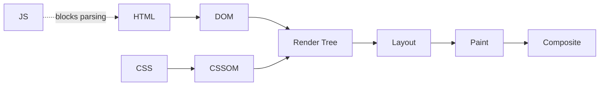

# Performance Optimization

## Performance Budgets

| Metric | Target |
| --- | --- |
| Total page weight | <500KB compressed |
| HTTP requests | <50 |
| JavaScript bundle | <200KB gzipped |
| Time to Interactive | <3.5s |
| First Contentful Paint | <1.8s |
| Critical CSS | <14KB |

Core Web Vitals - Google's key metrics for user experience and search ranking.

| Metric | Measures | Good | Poor |
| --- | --- | --- | --- |
| **LCP** (Largest Contentful Paint) | Render time of largest visible element | ≤2.5s | >4s |
| **INP** (Interaction to Next Paint) | Responsiveness to interactions | ≤200ms | >500ms |
| **CLS** (Cumulative Layout Shift) | Visual stability during load | ≤0.1 | ≥0.25 |

---

## Rendering Optimization

### Critical Rendering Path

Browser steps: HTML parsing → DOM → CSSOM → Render tree → Layout → Paint → Composite.

CSS is render-blocking; scripts block parsing unless `async`/`defer`.



```javascript
// Inline critical CSS for above-fold content
const criticalCSS = `
    .header { display: flex; background: #fff; }
    .hero { min-height: 100vh; }
`;

// Defer non-critical CSS
<link rel="preload" href="/styles/main.css" as="style"
      onload="this.onload=null;this.rel='stylesheet'">
<noscript><link rel="stylesheet" href="/styles/main.css"></noscript>
```

### Layout Thrashing

Occurs when the browser recalculates layout repeatedly because reads and writes interleave.

```javascript
// Bad - read/write alternating causes repeated reflows
elements.forEach(element => {
    const height = element.offsetHeight;    // Read (triggers layout)
    element.style.height = (height + 10) + 'px'; // Write
});

// Good - batch reads then batch writes
const heights = Array.from(elements).map(el => el.offsetHeight);
elements.forEach((element, i) => {
    element.style.height = (heights[i] + 10) + 'px';
});
```

| Category | Layout-Triggering Properties |
| --- | --- |
| Dimensions | width, height, padding, margin, border |
| Position | top, right, bottom, left |
| Metrics | offsetWidth, offsetHeight, getBoundingClientRect |

### Paint and Composite

Only animate `transform` and `opacity` — they skip layout and paint, running on the GPU.

```css
/* Good - GPU-accelerated */
.animated { transform: translateX(100px); opacity: 0.5; }

/* Bad - triggers layout */
.animated { width: 200px; left: 100px; background-color: red; }

/* Promote to own layer for complex animations */
.hero { will-change: transform; }
```

---

## Network Optimization

### HTTP Caching

| Resource Type | Cache Policy | Max Age |
| --- | --- | --- |
| HTML | No-cache (validate) | 0, must-revalidate |
| CSS/JS (versioned) | Long-term | 1 year |
| Images (versioned) | Long-term | 1 year |
| API responses | Short | 60–300 seconds |
| User-specific data | No cache | 0 |

```http
Cache-Control: max-age=3600, s-maxage=86400, stale-while-revalidate=60
ETag: "abc123"
Vary: Accept-Encoding
```

**Service Worker stale-while-revalidate:**

```javascript
self.addEventListener('fetch', (event) => {
    event.respondWith(
        caches.open(CACHE_NAME).then(async (cache) => {
            const cached = await cache.match(event.request);
            const fetchPromise = fetch(event.request).then(response => {
                cache.put(event.request, response.clone());
                return response;
            });
            return cached || fetchPromise;
        })
    );
});
```

### Resource Hints

```html
<!-- Preload critical resources -->
<link rel="preload" href="/scripts/main.js" as="script">
<link rel="preload" href="/fonts/inter.woff2" as="font" crossorigin>

<!-- DNS prefetch for third-party domains -->
<link rel="dns-prefetch" href="https://api.example.com">

<!-- Preconnect to origins -->
<link rel="preconnect" href="https://cdn.example.com" crossorigin>

<!-- Prefetch likely next pages -->
<link rel="prefetch" href="/dashboard" as="document">
```

### Script Loading

```html
<!-- Default (blocks parsing) -->
<script src="main.js"></script>

<!-- Async - downloads in parallel, executes immediately -->
<script src="analytics.js" async></script>

<!-- Defer - executes after HTML parsing -->
<script src="app.js" defer></script>

<!-- Module (implicitly deferred) -->
<script type="module" src="module.js"></script>
```

### Image Optimization

| Format | Best For |
| --- | --- |
| WebP | General use (lossy/lossless) |
| AVIF | Next-gen, better compression |
| SVG | Icons and graphics |

```html
<!-- Responsive with srcset -->


<!-- Explicit dimensions prevent CLS -->


<!-- Format fallback -->
<picture>
    <source srcset="image.avif" type="image/avif">
    <source srcset="image.webp" type="image/webp">
    
</picture>
```

---

## JavaScript Performance

### Code Splitting

```javascript
// Static import (bundled upfront)
import HeavyComponent from './HeavyComponent';

// Dynamic import (loaded on demand)
const HeavyComponent = () => import('./HeavyComponent');

// React.lazy with Suspense
const Dashboard = lazy(() => import('./Dashboard'));

function App() {
    return (
        <Suspense fallback={<Loading />}>
            <Routes>
                <Route path="/dashboard" element={<Dashboard />} />
            </Routes>
        </Suspense>
    );
}
```

### Memory Leaks

```javascript
// Forgotten event listener
class Component {
    constructor() {
        this.handler = this.handleResize.bind(this);
        window.addEventListener('resize', this.handler);
    }
    destroy() {
        window.removeEventListener('resize', this.handler); // required cleanup
    }
}

// Closure retaining large data
function createLeak() {
    const largeData = new Array(1000000);
    return () => console.log(largeData[0]); // holds reference
}
let fn = createLeak();
fn();
fn = null; // release
```

### Breaking Up Long Tasks

```javascript
// Bad - blocks main thread
function processLargeArray(data) {
    for (const item of data) heavyProcessing(item);
}

// Good - chunked with setTimeout
function processLargeArray(data) {
    const CHUNK_SIZE = 100;
    let index = 0;

    function processChunk() {
        const end = Math.min(index + CHUNK_SIZE, data.length);
        for (; index < end; index++) heavyProcessing(data[index]);
        if (index < data.length) setTimeout(processChunk, 0);
    }

    setTimeout(processChunk, 0);
}

// Using requestIdleCallback
function processWithIdleCallback(tasks) {
    let index = 0;

    function doWork(deadline) {
        while (index < tasks.length && deadline.timeRemaining() > 1) {
            heavyProcessing(tasks[index++]);
        }
        if (index < tasks.length) requestIdleCallback(doWork);
    }

    requestIdleCallback(doWork);
}
```

---

## Bundle Optimization

### Tree Shaking

```javascript
// webpack.config.js
module.exports = {
    mode: 'production',
    optimization: {
        usedExports: true,
        sideEffects: false,
        splitChunks: {
            chunks: 'all',
            cacheGroups: {
                vendor: { test: /[\\/]node_modules[\\/]/, name: 'vendors', chunks: 'all' }
            }
        }
    }
};

// package.json
{ "sideEffects": false }
```

---

## Performance Monitoring

### Performance API

```javascript
// Navigation timing
const nav = performance.getEntriesByType('navigation')[0];
console.log('DNS:', nav.domainLookupEnd - nav.domainLookupStart);
console.log('Page Load:', nav.loadEventEnd - nav.navigationStart);

// LCP
const lcpEntries = performance.getEntriesByType('largest-contentful-paint');
console.log('LCP:', lcpEntries.at(-1)?.startTime);

// CLS
let clsValue = 0;
new PerformanceObserver((list) => {
    for (const entry of list.getEntries()) {
        if (!entry.hadRecentInput) clsValue += entry.value;
    }
}).observe({ type: 'layout-shift', buffered: true });
```

### Lighthouse CI

```javascript
// lighthouse-ci.config.js
module.exports = {
    ci: {
        collect: { numberOfRuns: 3, url: ['http://localhost:3000'] },
        assert: {
            assertions: {
                'categories:performance': ['error', { minScore: 0.9 }],
                'first-contentful-paint': ['error', { maxNumericValue: 2000 }],
                'interactive': ['error', { maxNumericValue: 3500 }]
            }
        }
    }
};
```

---

## Quick Wins Checklist

| Optimization | Impact | Effort |
| --- | --- | --- |
| Enable gzip/brotli compression | High | Low |
| Optimize images (WebP, sizing) | High | Medium |
| Implement HTTP caching | High | Low |
| Defer non-critical JS | Medium | Low |
| Minify CSS/JS | Medium | Low |
| Remove unused CSS | Medium | Medium |
| Code splitting | High | Medium |
| Service worker caching | High | Medium |
| Lazy loading | Medium | Low |
