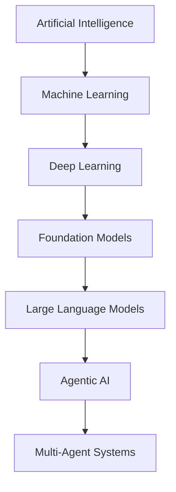

# Artificial Intelligence

**Artificial Intelligence** is the engineering discipline of building systems that perform tasks normally requiring human cognition — perception, reasoning, learning, planning, and language. It is not one technique but a nested stack, each layer built on the one below. Deep learning is documented here because no guide in this chapter owns it alone; the layers above and below have their own.

## In This Section

| Guide | What it covers |
| --- | --- |
| **[Machine Learning Foundations](01-machine-learning.md)** | The learning paradigms, and the vocabulary of model, training, inference, and generalization that every layer above inherits |
| **[Large Language Models (LLM)](02-llm.md)** | Transformer mechanics, the training lifecycle from pre-training to alignment, the inference controls you tune at call time, and techniques such as RAG and tool calling |
| **[Agentic AI](03-agents.md)** | The anatomy of an agent, the established agent patterns, the boundaries autonomy has to respect, and multi-agent topologies |

## The Layered Map

| Layer | What it is | Defining idea |
| --- | --- | --- |
| **Artificial Intelligence** | Any system exhibiting intelligent behavior | Goal-directed problem solving |
| **Machine Learning (ML)** | Systems that improve from data rather than explicit rules | Learn a function from examples |
| **Deep Learning (DL)** | ML with many-layered neural networks | Learn representations automatically |
| **Foundation Models** | Large models pre-trained on broad data, adaptable to many tasks | Transfer learning at scale |
| **Large Language Models (LLM)** | Foundation models for text and sequence prediction | Next-token prediction over language |
| **Agentic AI** | An LLM that plans, acts via tools, and observes results in a loop | Autonomy through the perceive-decide-act cycle |
| **Multi-Agent Systems (MAS)** | Multiple coordinating agents solving a shared goal | Division of labor and communication |

## Deep Learning

**Deep Learning** uses neural networks with many layers that learn hierarchical representations directly from raw data, removing the need for hand-crafted features. It is the layer between [machine learning](01-machine-learning.md) and the foundation models that [large language models](02-llm.md) are built from.

| Concept | Definition |
| --- | --- |
| **Neuron** | A weighted sum of inputs passed through a non-linear activation |
| **Layer** | A group of neurons; stacking them is what makes a network deep, and depth is what buys hierarchical features |
| **Activation Function** | The non-linearity — ReLU, GELU, sigmoid — without which any stack of layers collapses into a single linear map |
| **Backpropagation** | The algorithm that computes the gradient of the error with respect to each weight, by applying the chain rule backward through the network |
| **Gradient Descent** | Iterative weight update in the direction that reduces the error, with SGD and Adam the usual variants |
| **Loss Function** | The scalar measure of prediction error that training minimizes |
| **Regularization** | Techniques such as dropout and weight decay that curb overfitting |
| **Embedding** | A dense vector representation that places semantically similar inputs close together in geometric space |

| Architecture | Best suited for |
| --- | --- |
| **MLP** (feed-forward) | Tabular data and general function approximation |
| **CNN** (convolutional) | Images and spatial data |
| **RNN / LSTM** | Sequences; largely superseded by transformers for language |
| **Transformer** | Sequences via attention, and the foundation of modern LLMs |
| **Diffusion** | Generative images and audio, by iterative denoising |

## Glossary

Terms that cut across the whole chapter. Vocabulary belonging to one layer is defined in that layer's guide.

| Concept | Definition |
| --- | --- |
| **AGI** | Artificial General Intelligence — the hypothetical point at which one system matches human breadth across arbitrary tasks |
| **Alignment** | Making a model's behavior match the intent and values of the people deploying it |
| **Hallucination** | Fluent, confident output that is not true, produced with no signal distinguishing it from output that is |
| **MCP** | Model Context Protocol — an open standard for connecting models to tools and data sources |
| **MoE** | Mixture of Experts — routing each token through a subset of the network so capacity can grow faster than the cost of running it |
| **Quantization** | Reducing the numeric precision of weights to shrink a model and speed it up, at some cost in accuracy |
| **Vector Database** | A store optimized for nearest-neighbor search over dense vectors, which is what makes retrieval practical at scale |

## Perspectives

| Lens | View |
| --- | --- |
| **Capability** | LLMs are pattern predictors, not reasoners with grounded truth — treat output as a draft to verify, not an oracle |
| **Engineering** | Favor deterministic workflows, and introduce autonomy only where the task genuinely demands it. Measure, log, and evaluate as you would any other system |
| **Reliability** | Non-determinism, hallucination, and prompt sensitivity make evaluation a first-class engineering concern rather than a research one |
| **Economics** | Cost scales with tokens and model size, so caching, smaller models, and tight context control are the core optimizations |
| **Safety and Ethics** | Bias, privacy, misuse, and alignment risks all grow with autonomy — keep a human in the loop for consequential actions |
| **Scaling** | The Bitter Lesson: general methods that leverage compute and data tend to win over hand-crafted, domain-specific cleverness |
| **Human Role** | The model accelerates; the human directs, judges, and owns the outcome |

## References

The whole chapter draws on this list. The guides in this section link here rather than repeating it.

### Foundational Papers

| Title | URL |
| --- | --- |
| **Deep Learning** (LeCun, Bengio, Hinton, *Nature* 2015) | [nature.com/articles/nature14539](https://www.nature.com/articles/nature14539) |
| **Attention Is All You Need** (the transformer) | [arxiv.org/abs/1706.03762](https://arxiv.org/abs/1706.03762) |
| **BERT** | [arxiv.org/abs/1810.04805](https://arxiv.org/abs/1810.04805) |
| **Language Models are Few-Shot Learners** (GPT-3) | [arxiv.org/abs/2005.14165](https://arxiv.org/abs/2005.14165) |
| **Chain-of-Thought Prompting** | [arxiv.org/abs/2201.11903](https://arxiv.org/abs/2201.11903) |
| **Training Language Models to Follow Instructions with Human Feedback** (InstructGPT, RLHF) | [arxiv.org/abs/2203.02155](https://arxiv.org/abs/2203.02155) |
| **ReAct: Synergizing Reasoning and Acting** | [arxiv.org/abs/2210.03629](https://arxiv.org/abs/2210.03629) |
| **Toolformer: Language Models Can Teach Themselves to Use Tools** | [arxiv.org/abs/2302.04761](https://arxiv.org/abs/2302.04761) |
| **Retrieval-Augmented Generation** | [arxiv.org/abs/2005.11401](https://arxiv.org/abs/2005.11401) |

### Guides and Documentation

| Resource | URL |
| --- | --- |
| **The Bitter Lesson** (Rich Sutton) | [incompleteideas.net/IncIdeas/BitterLesson.html](http://www.incompleteideas.net/IncIdeas/BitterLesson.html) |
| **Deep Learning Book** (Goodfellow, Bengio, Courville) | [deeplearningbook.org](https://www.deeplearningbook.org/) |
| **Building Effective Agents** (Anthropic) | [anthropic.com/engineering/building-effective-agents](https://www.anthropic.com/engineering/building-effective-agents) |
| **Anthropic Documentation** | [docs.anthropic.com](https://docs.anthropic.com/) |
| **OpenAI Documentation** | [platform.openai.com/docs](https://platform.openai.com/docs) |
| **Hugging Face Documentation** | [huggingface.co/docs](https://huggingface.co/docs) |
| **Prompt Engineering Guide** (DAIR.AI) | [promptingguide.ai](https://www.promptingguide.ai/) |
| **Model Context Protocol** | [modelcontextprotocol.io](https://modelcontextprotocol.io/) |
