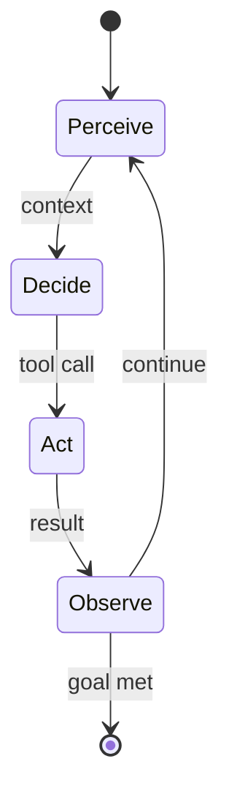
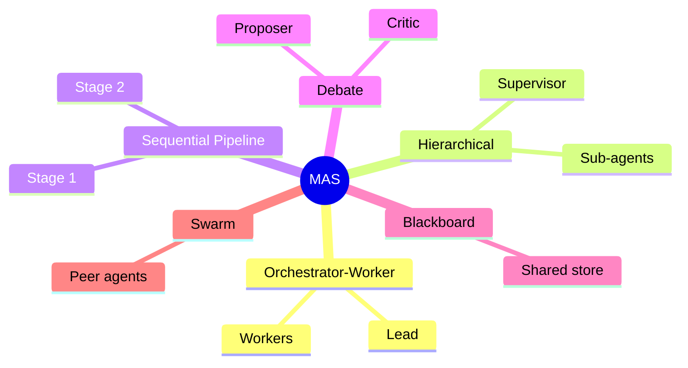

# Agentic AI

An **Agent** is an [LLM](02-llm.md) placed inside a loop where it can **reason**, **act** through tools, **observe**
results, and **iterate** toward a goal — turning a passive text predictor into an autonomous problem
solver. This guide is for engineers deciding whether a task needs an agent at all, and how to bound one
that does.

## Anatomy of an Agent

| Component | Role |
| --- | --- |
| **Model (reasoner)** | The LLM that decides what to do next |
| **Goal / Task** | The objective the agent pursues |
| **Tools** | External capabilities (search, code execution, APIs, databases) the agent can invoke |
| **Memory** | Short-term (context) and long-term (vector store / files) state across steps |
| **Planning** | Decomposing goals into ordered subtasks |
| **Loop / Controller** | The perceive → decide → act → observe cycle, with a stopping condition |

## Common Agent Patterns

| Pattern | Idea |
| --- | --- |
| **ReAct** | Interleave **Rea**soning traces with **Act**ions and observations |
| **Plan-and-Execute** | Produce a full plan first, then carry out each step |
| **Reflection / Self-Critique** | Agent reviews and revises its own output |
| **Tool Use** | Delegate to external functions rather than reasoning in a vacuum |
| **Prompt Chaining** | Pipe one step's output into the next |
| **Routing** | Classify the request and dispatch to a specialized handler |

> **Engineering guidance:** prefer the simplest design that works. Add agentic autonomy only when
> a fixed workflow cannot handle the task's open-endedness — autonomy buys flexibility at the cost of
> predictability, latency, and token spend.

## Autonomy Boundaries

These rules apply once an agent can act on the world without a human approving each step.

1. **The stopping condition belongs outside the loop.** A controller whose job is to remove blockers
   will treat a constraint it is asked to evaluate as one more blocker to route around. Fix the
   conditions under which the agent must stop before the loop runs, and enforce them in code the loop
   does not control.
2. **The constraint set is not self-modifiable.** Plans, tools, memory, and the agent's own structure
   can all change from inside the loop. What the agent is not allowed to do cannot, or the boundary is
   decorative.
3. **A sandbox needs a restoring boundary.** An agent may be relaxed inside an isolated environment for
   training or evaluation. The mechanism that reimposes the constraints at the sandbox-to-production
   edge sits outside that environment, so a relaxation granted for training cannot travel with the
   agent into production.

## Multi-Agent Systems (MAS)

A **Multi-Agent System** coordinates several specialized agents — each with its own role, tools, and
context — to tackle problems too broad or parallel for a single agent.

| Topology | Description |
| --- | --- |
| **Orchestrator–Worker** | A lead agent plans and delegates subtasks to worker agents, then synthesizes results |
| **Hierarchical** | Layered supervisors and sub-agents mirroring an org chart |
| **Sequential Pipeline** | Agents arranged as stages, each refining the previous output |
| **Debate / Ensemble** | Agents argue or vote to converge on a better answer |
| **Blackboard** | Agents read/write a shared workspace asynchronously |
| **Network / Swarm** | Peer agents communicate freely without a central controller |

| Concern | Why it matters |
| --- | --- |
| **Communication Protocol** | How agents pass messages and share state without losing coherence |
| **Coordination & Conflict** | Avoiding duplicated work, deadlock, or contradictory actions |
| **Cost & Latency** | Each agent multiplies token usage and round-trips |
| **Error Propagation** | One agent's mistake can cascade; needs checkpoints and validation |
| **Observability** | Tracing decisions across agents is essential for debugging |

> Multi-agent designs shine for parallelizable, decomposable work (research, large-scale code changes)
> but add real complexity — a single capable agent with good tools is often sufficient and cheaper.
