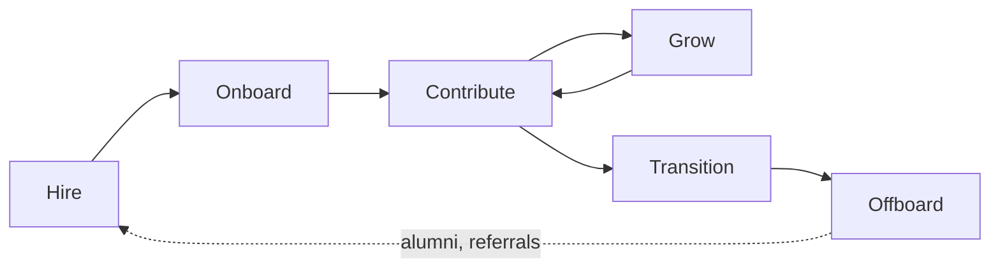

# People Management

People management is the discipline of **building and sustaining the team that delivers the work** — hiring the right people, growing them, giving them clarity and feedback, and keeping the team healthy enough to keep going.

It is the *People* dimension of [Engineering Management](01-delivery-management.md). Management allocates and sequences work; people management makes sure there is a capable, motivated team to allocate it to. A manager who optimizes only for delivery borrows capacity from this dimension and pays it back as attrition.

Related: [Team Lead](02-team-lead.md) · [Engineering Management](01-delivery-management.md) · [Development Process](../04-development-process/00-development-process.md) · [Methodology](../01-methodology/00-methodology.md)

---

## In This Section

| Doc | What it covers |
| --- | --- |
| [Team Lead](02-team-lead.md) | The team lead role — responsibilities, way of working, and the hybrid Scrum workflow |

---

## Scope

| Area | Question it answers | Primary artifact |
| --- | --- | --- |
| **Staffing** | Do we have the right people and skills? | Role definitions, hiring plan, skill matrix |
| **Onboarding** | How fast does a new person become productive? | Onboarding checklist, first-90-days plan |
| **Alignment** | Does each person know what "good" means for them? | Expectations, goals, definition of done |
| **Growth** | Is each person getting better at something? | Career ladder, growth plan, learning budget |
| **Feedback** | Does each person know where they stand? | 1:1 notes, review cycles, feedback given |
| **Health** | Can this pace be sustained? | On-call load, unplanned work, sentiment, attrition |

The six are sequential in a person's experience and simultaneous in a manager's week.

---

## Core Concepts

**`Expectation`** := The observable behavior and output level a person is accountable for, at their level.

> `Expectation := Level × Scope × Observable behavior`

*NOTE*: An expectation nobody has stated cannot be missed — it can only be resented.

---

**`Feedback`** := An observation about specific behavior and its effect, delivered close in time to the behavior.

> `Feedback := Situation + Behavior + Impact`

*NOTE*: Feedback describes what happened. Judgement of the person is not feedback.

---

**`Growth`** := A durable increase in the scope a person can handle without supervision.

> `Growth := Δ(Autonomy) at constant quality`

---

**`Autonomy Level`** := How much decision authority a person holds in one specific area (see the delegation ladder in [Engineering Management](01-delivery-management.md)).

*NOTE*: Autonomy is per-area, not per-person. A staff engineer can be level 5 in architecture and level 2 in incident command.

---

**`Motivation`** := The internal driver that makes discretionary effort available — commonly autonomy, mastery, and purpose.

*NOTE*: Managers cannot supply motivation. They can remove what destroys it.

---

**`Psychological Safety`** := The shared belief that raising a problem, an error, or a dissenting view carries no personal cost.

*NOTE*: The measurable signal is whether bad news travels upward early. If it only arrives at the deadline, safety is absent.

---

**`Retention Risk`** := The probability a person leaves within a period, weighted by the cost of replacing them.

> `Retention Risk := P(leaving) × Replacement cost`

---

**`Bus Factor`** := The number of people who must become unavailable before a system or process stalls.

*NOTE*: A bus factor of 1 is a delivery risk recorded as a people problem.

---

## The Employee Lifecycle

| Stage | Manager's job | Success signal |
| --- | --- | --- |
| **Hire** | Define the role by the gap it fills; run a consistent, evidence-based loop | The scorecard predicted the first six months |
| **Onboard** | Give context, a buddy, and a small real task in week one | First meaningful merge within days, not weeks |
| **Contribute** | Set expectations, remove friction, give feedback continuously | The person knows what "good" means without asking |
| **Grow** | Match assignments to the next level's scope, not the current one | Autonomy rises while quality holds |
| **Transition** | Promote, move, or reassign before frustration forces the issue | Internal moves outnumber surprise resignations |
| **Offboard** | Capture knowledge, exit honestly, keep the relationship | Handover exists; the person would return |

**Key property:** every stage is cheaper than the one before it fails into. Onboarding well is cheaper than re-hiring.

---

## Roles

Titles vary by company; the *accountabilities* do not. Confusion here is a common source of dropped work.

| Role | Owns | Does not own |
| --- | --- | --- |
| **Engineer (IC)** | Their own delivery and craft | Team scope, priorities |
| **Tech Lead** | Technical direction of a team's work | Careers, compensation, performance |
| **Team Lead** | Day-to-day flow, unblocking, local process | Usually not compensation or headcount |
| **Engineering Manager** | People, performance, hiring, headcount, delivery | Detailed technical decisions |
| **Staff / Principal** | Technical scope across teams | Line management |

Two rules: **one accountable person per accountability**, and **the person who runs someone's 1:1s is the person who owns their growth**. If those split across two people, say so explicitly and agree who gives which feedback.

---

## 1:1s

The single highest-leverage recurring activity in people management.

| Property | Default |
| --- | --- |
| Frequency | Weekly, or bi-weekly for senior and stable reports |
| Length | 30 minutes |
| Agenda owner | The report — the manager brings a backup agenda |
| Cancellation | Reschedule, never cancel |
| Record | Shared running notes with actions and owners |

**It is not a status meeting.** Status belongs on the board. Use the time for friction, growth, feedback, and things not said in public channels.

A rotating focus keeps it from decaying into small talk:

| Week | Focus |
| --- | --- |
| 1 | What is blocked or frustrating right now |
| 2 | Feedback both directions |
| 3 | Growth and career direction |
| 4 | Team, process, and how the manager can do better |

---

## Feedback and Performance

Feedback is continuous; reviews only summarize it.

| Type | Timing | Setting |
| --- | --- | --- |
| **Reinforcing** | Immediately | Public, when the person is comfortable with it |
| **Corrective** | Within a day or two | Private, always |
| **Developmental** | 1:1s, ongoing | Private, tied to the next level's expectations |
| **Formal review** | Per cycle | Written, no new information |

Use **Situation → Behavior → Impact**, then agree on the change. Skip the "compliment sandwich" — it obscures the message and teaches people to distrust praise.

### Handling Underperformance

Address it early and explicitly; ambiguity is unkind to everyone.

1. **Name the gap** — specific expectation, specific observed behavior, specific difference.
2. **Rule out the system first** — unclear expectations, missing context, wrong task fit, a personal situation, or a broken process cause more underperformance than lack of ability.
3. **Agree a written plan** — what changes, by when, how it will be measured.
4. **Support and check in** — weekly, with written evidence either way.
5. **Decide** — improved, reassigned, or exited. Do not let step 4 run indefinitely.

**Nothing in a formal review should ever be a surprise.** If it is, the manager failed at step 1, not the report.

---

## Growth

Growth is assigned, not granted. A person grows by doing work slightly above their current level with a safety net.

| Lever | How to use it |
| --- | --- |
| **Stretch assignment** | Give the next level's scope now; review more closely, not less often |
| **Ownership** | Hand over a system, a ritual, or an area end to end |
| **Pairing and review** | Deliberate pairing across skill gaps; reviews as teaching, not gatekeeping |
| **Teaching** | Have them explain, document, or onboard someone — it forces mastery |
| **External input** | Conferences, courses, open source — the weakest lever, so do not rely on it alone |

Write down the target level's expectations and the evidence gathered so far. A promotion case assembled the week it is needed is a case that fails.

**Promotion follows demonstrated scope.** Promote for what someone is already doing, not for what they might do.

---

## Team Health

Health metrics **lead** delivery metrics — they degrade first, and they are the early warning for the DORA and flow numbers in [Engineering Management](01-delivery-management.md).

| Signal | What it reveals | Watch for |
| --- | --- | --- |
| **Attrition (regretted)** | Whether good people want to stay | Any cluster in one team or one manager |
| **On-call load** | Operational burden per person | Pages outside hours; the same name every time |
| **Unplanned-work share** | Whether commitments are realistic | Sustained above the reserve |
| **Working hours pattern** | Sustainability | Late-night and weekend commits becoming normal |
| **Bus factor per system** | Concentration risk | Any system at 1 |
| **1:1 sentiment** | Everything the metrics miss | Energy dropping over consecutive weeks |
| **Time to first contribution** | Onboarding quality | Trending up as the team grows |

Measure the **system**, not individuals. Individual output metrics get gamed and destroy the trust the rest of this depends on.

---

## Best Practices

- **Hold the 1:1.** A cancelled 1:1 says the person is lower priority than whatever replaced it.
- **State expectations in writing.** Level, scope, and what "good" looks like — before the work, not during the review.
- **Give feedback within days.** Feedback delayed to the review cycle is a complaint, not feedback.
- **Delegate outcomes, not steps.** Match autonomy to demonstrated competence in that specific area.
- **Let people fail safely.** Reversible mistakes are the cheapest training available.
- **Rotate the unglamorous work.** On-call, support, and release duty go to everyone, including the seniors.
- **Fix the system before blaming the person.** Most repeated individual failures are process failures with a name attached.
- **Grow a successor.** If you cannot take two weeks off, you have a bus-factor problem of your own.
- **Be honest early.** Bad news delivered early is a decision; delivered late it is a failure.
- **Protect focus time.** Deep work is the job; meetings are overhead that must justify itself.

---

## Anti-patterns

| Anti-pattern | Why it fails | Correction |
| --- | --- | --- |
| Cancelling 1:1s when busy | Signals the person is optional; problems surface later and bigger | Reschedule within the same week |
| 1:1 as status update | Duplicates the board, wastes the only private channel | Status on the board; 1:1 for friction and growth |
| Saving feedback for review season | Removes the chance to correct course | Continuous feedback; reviews summarize only |
| Promoting the best coder to manager by default | Different job, different skills; loses an engineer and gains a poor manager | Dual ladder — IC track with equal ceiling |
| Hero culture | Single points of failure and burnout | Pair, rotate, document |
| Vague underperformance handling | Unfair to the person and to the team carrying them | Name the gap, write a plan, set a date |
| Measuring individuals by output metrics | Gaming, distrust, and no useful signal | Measure the system |
| Hiring for "culture fit" | Selects for sameness; suppresses dissent | Hire for values alignment and skill gap |
| Onboarding as document dump | Context does not transfer by reading | Buddy plus a small real task in week one |
| Treating retention as an HR problem | The causes are manager, work, and growth | Manager owns retention risk per person |

---

## Checklists

**Weekly:**

- [ ] Every 1:1 held, not cancelled
- [ ] Feedback given on at least one specific thing observed this week
- [ ] Blocked people have an owner and a next action
- [ ] New joiners checked in on separately

**Per cycle:**

- [ ] Growth plans reviewed against evidence collected
- [ ] Health signals reviewed — on-call, unplanned work, hours pattern
- [ ] Bus factor checked for systems that changed hands
- [ ] Retro actions about people and process actually done

**When someone joins:**

- [ ] Role, level, and expectations written down before day one
- [ ] Accounts, access, and environment ready on day one
- [ ] Buddy assigned; first 1:1 scheduled in week one
- [ ] A small, real, shippable task in week one
- [ ] 30/60/90-day checkpoints in the calendar

**When someone leaves:**

- [ ] Knowledge handover written, not just walked through
- [ ] Ownership of systems and rituals reassigned by name
- [ ] Access revoked on the last day
- [ ] Honest exit conversation held and the cause recorded
- [ ] Team told directly, before the rumor
