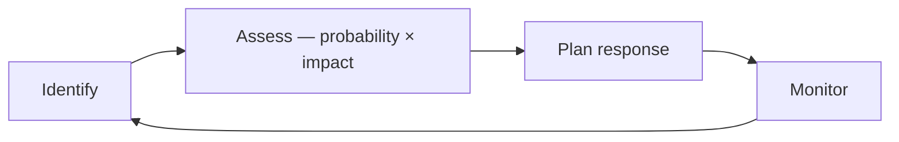

# Engineering Management

Management turns **goals into delivered outcomes** through people, process, and priorities, under constraints of time, capacity, and quality. This guide covers the vocabulary an engineering manager plans with, the loops that connect strategy to feedback, and the metrics that show whether the loops are working. Leadership sets direction and motivates; management allocates, sequences, and controls — a working engineering manager does both.

Related: [Methodology](../01-methodology/00-methodology.md) · [Scrum](../01-methodology/03-scrum.md) · [Development Process](../04-development-process/00-development-process.md) · [Team Lead](02-team-lead.md)

## Scope

| Dimension | Question it answers | Primary artifact |
| --- | --- | --- |
| **Product** | What are we building and why? | Roadmap, backlog |
| **Delivery** | When will it ship, and at what risk? | Plan, milestones, release train |
| **People** | Who does it, and are they growing? | Assignments, 1:1s, growth plans |
| **Process** | How does work flow end to end? | Workflow, definition of done |
| **Technical** | Is the system sustainable? | Architecture decisions, tech-debt budget |

A manager who covers only *delivery* produces burnout; only *people* produces drift. All five must be held at once.

## Core Concepts

| Concept | Definition |
| --- | --- |
| **Goal** | Desired end state, stated without naming a solution |
| **Objective** | Measurable outcome scoped to a period, qualified against the [SMART](../01-methodology/00-methodology.md#smart-goals) criteria |
| **Scope** | Set of work items accepted as in-bounds for an Objective *The cheapest planning variable to change; time and quality are not* |
| **Capacity** | Effort realistically available in a period, once meetings, support, and leave are taken out *Always below headcount multiplied by working hours* |
| **Priority** | Total ordering of work items by value against cost and risk *If everything is priority one, nothing is* |
| **Commitment** | Promise made with known scope, known capacity, and accepted risk *Without capacity data it is a wish* |
| **Risk** | Uncertain event that would affect an Objective, sized as probability multiplied by impact |
| **Dependency** | Work whose completion is required by other work, inside or outside the team *Cross-team ones sit outside the team's control, so track them explicitly* |
| **Constraint** | Fixed boundary — budget, deadline, compliance, headcount — that planning must respect rather than optimize away |

## Management Flow

| Stage | Input | Output | Cadence |
| --- | --- | --- | --- |
| **Strategy** | Business goals, market, constraints | Themes, success metrics | Quarterly / annually |
| **Roadmap** | Themes | Sequenced initiatives with rough sizing | Quarterly |
| **Backlog** | Initiatives, bugs, tech debt, requests | Ordered, refined items | Continuous |
| **Plan** | Backlog and capacity | Sprint or cycle commitment | Per sprint / cycle |
| **Execution** | Commitment | Working increments | Daily |
| **Delivery** | Increments | Released, measured change | Per release |
| **Feedback** | Metrics, retro, user signal | Corrections to backlog and strategy | Per cycle |

**Key property:** the loop must close. A roadmap that is never corrected by feedback is a forecast presented as a plan.

## Planning Horizons

Plan with decreasing precision as the horizon extends. Precision beyond the evidence is waste.

| Horizon | Period | Granularity | Confidence |
| --- | --- | --- | --- |
| **Strategic** | 6–12 months | Themes, outcomes | Directional |
| **Tactical** | 1–3 months | Initiatives, epics | Sized, not scheduled |
| **Operational** | 1–4 weeks | Stories, tasks | Committed |
| **Daily** | 1 day | Sub-tasks, blockers | Certain |

## Delivery Phases

The phases a solution passes through are defined once, as the SDLC, in [Development Process](../04-development-process/00-development-process.md). Management does not need a second lifecycle; it needs the one phase that lifecycle does not name, because its work is about the team rather than the product.

| Phase | Activities |
| --- | --- |
| **Pre-production setup** | Staffing the team and covering the required skills; provisioning environments, tooling, and access; agreeing the workflow, the definition of done, and the escalation path |

Complete it before implementation starts. Work that begins without it produces decisions no one can point to later — an undefined done, an unowned environment, an unagreed escalation path.

## Prioritization

Pick one framework and apply it consistently; mixing frameworks produces arguments, not order.

| Framework | Formula / Rule | Best for |
| --- | --- | --- |
| **RICE** | `(Reach × Impact × Confidence) / Effort` | Product backlogs with comparable items |
| **WSJF** | `Cost of Delay / Job Duration` | Scaled delivery, competing epics |
| **MoSCoW** | Must / Should / Could / Won't | Fixed-date releases, scope negotiation |
| **Eisenhower** | Urgent × Important quadrants | Personal and interrupt-driven work |
| **Cost of Delay** | Value lost per period of delay | Deciding sequence, not selection |

**Reserve capacity explicitly.** Planned feature work, tech debt and maintenance, and interrupt-driven support each need a named share of the cycle. Set the shares from the team's own measured unplanned-work share, and revise them when that measurement moves. Without an explicit reserve, unplanned work silently consumes the commitment and every sprint "fails".

## Estimation

- Estimate **relatively** (points, sizes) rather than in hours; relative sizing stays stable when the person doing the work changes.
- Estimate as a **range**, not a point value, and carry the range through to the plan instead of collapsing it early.
- Forecast from **historical throughput** (items completed per cycle), not from summed estimates.
- Re-estimate only when new information arrives, never to fit a desired date.
- Treat unestimatable work as a **spike**: timebox it, produce knowledge, then estimate.

**Anti-pattern:** negotiating estimates downward. It changes the number, not the work.

## Risk Management

| Response | When to use |
| --- | --- |
| **Avoid** | Impact unacceptable, alternative path exists |
| **Mitigate** | Reduce probability or impact (spike, prototype, phased rollout) |
| **Transfer** | Another party is better positioned (vendor, insurance, platform team) |
| **Accept** | Cost of response exceeds expected loss — record the decision |

Keep the risk list short and live. Each entry: description, probability, impact, owner, response, review date. A risk without an owner is not managed.

## Decision Making

| Decision type | Approach |
| --- | --- |
| **Reversible, low impact** | Delegate. Decide fast, correct later |
| **Reversible, high impact** | Decide with input, set an explicit review point |
| **Irreversible** | Slow down. Gather data, write it down, review with peers |

Use a single accountable decider per decision (`DACI`: Driver, Approver, Contributors, Informed). Consensus is a nice outcome, not a decision procedure.

**Record decisions.** Every non-trivial technical decision gets an ADR: context, options, decision, consequences. See [Architecture](../02-architecture/00-architecture.md).

## Delegation

Delegate the **outcome**, not the steps. Match the level of autonomy to demonstrated competence in that specific area:

| Level | Instruction | Use when |
| --- | --- | --- |
| 1 | "Do exactly this" | New to the domain |
| 2 | "Investigate, report back, I decide" | Learning |
| 3 | "Recommend an option, then act on approval" | Growing |
| 4 | "Decide and act, tell me afterwards" | Competent |
| 5 | "Own this area" | Expert |

Delegating at too low a level stalls growth; too high a level sets people up to fail. Autonomy level is per-area, not per-person.

## Communication Cadence

| Ritual | Frequency | Purpose | Failure mode to avoid |
| --- | --- | --- | --- |
| **Standup** | Daily | Surface blockers | Status theater for the manager |
| **1:1** | Weekly / bi-weekly | Growth, friction, feedback | Canceled when busy; turned into status |
| **Planning** | Per cycle | Commit scope to capacity | Committing beyond capacity |
| **Review / Demo** | Per cycle | Show working software | Slides instead of software |
| **Retrospective** | Per cycle | Improve the process | Repeated actions never done |
| **Stakeholder update** | Weekly, written | Alignment, expectation control | Only communicating bad news late |

What these events *are*, and the timeboxes the Scrum Guide sets for them, is covered in [Scrum](../01-methodology/03-scrum.md); the table above covers only how often a manager runs them and how each one fails.

**Default to written and asynchronous.** Meetings are for decisions and disagreements, not for information transfer.

## Metrics

Measure the **system**, not individuals. Individual metrics get gamed and destroy trust.

**Delivery performance (DORA):**

| Metric | Signal |
| --- | --- |
| Deployment frequency | Batch size and pipeline health |
| Lead time for change | End-to-end flow efficiency |
| Change failure rate | Quality of the delivery process |
| Time to restore | Operational resilience |

**Flow:**

| Metric | Signal |
| --- | --- |
| Throughput | Items completed per period — the basis for forecasting |
| Cycle time | Start to done for one item; watch the distribution, not the mean |
| WIP | Work started but not finished; the primary lever on cycle time |
| Flow efficiency | Active time divided by total time |
| Blocked time | Where dependencies are hurting |

**Health:** attrition, on-call load, unplanned-work share, and 1:1 sentiment. These lead the delivery metrics — they degrade first.

> Little's Law: `Cycle Time = WIP / Throughput`. To go faster, lower WIP before adding people.

## Best Practices

- **Limit WIP.** Finishing beats starting. Cap in-progress items per person.
- **Make work visible.** One board, one source of truth. Untracked work cannot be managed.
- **Small batches.** Smaller changes ship faster, break less, and are easier to review.
- **Protect the reserve.** Defend capacity for tech debt and interrupts; do not let it be borrowed against.
- **Write things down.** Decisions, plans, and status in durable text — not in meetings or chat threads.
- **Escalate early.** A risk raised three weeks out is a decision; the same risk raised on the deadline is a failure.
- **Separate the estimate from the commitment.** An estimate is data; a commitment is a choice made with that data.
- **Give feedback continuously.** Nothing in a performance review should be a surprise.
- **Change one process thing at a time.** Otherwise you cannot attribute the effect.
- **Manage the interfaces.** Most delay lives between teams, not inside them.

## Anti-Patterns

| Anti-pattern | Why it fails | Correction |
| --- | --- | --- |
| Adding people to a late project | Onboarding cost exceeds short-term gain | Cut scope instead |
| Fixed scope, fixed date, and fixed team | Only quality can absorb variance | Make scope the variable |
| Estimates as commitments | Punishes honest estimation | Forecast with ranges and throughput |
| Planning for full utilization | Any variability turns into queueing delay | Plan below full utilization and keep the slack |
| Status meetings for information transfer | Expensive, synchronous, low bandwidth | Written async updates |
| Hero culture | Single points of failure, burnout | Pair, rotate, document |
| Retro actions never executed | Retros become ritual | Take on only as many actions as the next cycle can finish, each with an owner and a date |
| Managing individuals by metrics | Gaming, distrust | Measure the system |

## Checklists

**Before committing to a plan:**

- [ ] Objective stated as an outcome, with a success metric
- [ ] Scope is ordered, not just listed
- [ ] Capacity computed from actual availability, not from headcount
- [ ] Dependencies identified with named owners and dates
- [ ] Top risks listed with responses
- [ ] Reserve for interrupts and tech debt is intact
- [ ] Definition of done agreed
- [ ] Stakeholders know what is *not* in scope

**Weekly:**

- [ ] Board reflects reality
- [ ] Blocked items have an owner and a next action
- [ ] Risk list reviewed
- [ ] Stakeholder update sent
- [ ] 1:1s held, not canceled

**Per cycle:**

- [ ] Throughput and cycle time reviewed against forecast
- [ ] Retro run; previous actions verified as done
- [ ] Backlog re-prioritized against new information
- [ ] Unplanned-work share checked against the reserve
