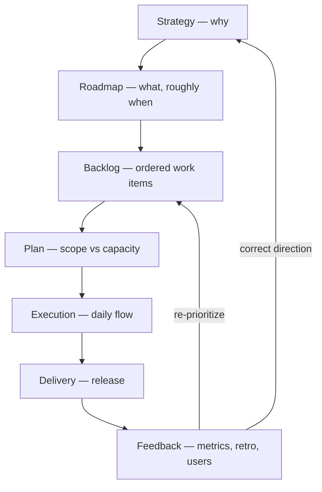
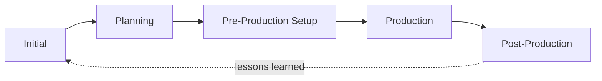
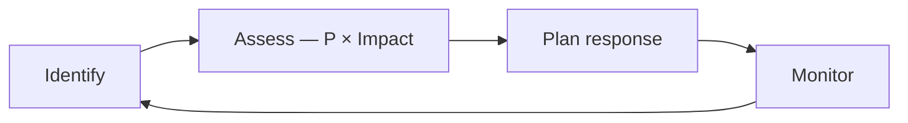

# Engineering Management

Management is the discipline of turning **goals into delivered outcomes** through people, process, and priorities — under constraints of time, capacity, and quality.

It is not the same as leadership: leadership sets direction and motivates; management allocates, sequences, and controls. A working engineering manager does both.

Related: [Methodology](../01-methodology/14-methodology.md) · [Scrum](../01-methodology/10-scrum.md) · [Development Process](../04-development/12-Development-Process.md) · [Team Lead](02-team-lead.md)

---

## Scope

| Dimension | Question it answers | Primary artifact |
| --- | --- | --- |
| **Product** | What are we building and why? | Roadmap, backlog |
| **Delivery** | When will it ship, and at what risk? | Plan, milestones, release train |
| **People** | Who does it, and are they growing? | Assignments, 1:1s, growth plans |
| **Process** | How does work flow end to end? | Workflow, definition of done |
| **Technical** | Is the system sustainable? | Architecture decisions, tech-debt budget |

A manager who covers only *delivery* produces burnout; only *people* produces drift. All five must be held at once.

---

## Core Concepts

**`Goal`** := A desired end state, stated without a solution.

> `Goal := end state, solution-free`

---

**`Objective`** := A `SMART`-qualified, measurable outcome scoped to a period.

> `Objective := SMART(Goal) at Period`

---

**`Scope`** := The set of work items accepted as in-bounds for an `Objective`.

> `Scope := {WorkItem} ⊆ Objective`

*NOTE*: Scope is the only variable that is cheap to change. Time and quality are not.

---

**`Capacity`** := Realistically available effort in a period, after meetings, support, and leave.

> `Capacity := headcount × focus-factor × period`

*NOTE*: Focus factor is typically 0.6–0.7, never 1.0.

---

**`Priority`** := A total ordering of work items by value per unit of cost and risk.

> `Priority := sort(WorkItem) by value / (cost × risk)`

*NOTE*: If everything is priority one, nothing is.

---

**`Commitment`** := A promise made with known scope, known capacity, and accepted risk.

> `Commitment := Scope ≤ Capacity, with Risk accepted`

*NOTE*: A commitment made without capacity data is a wish.

---

**`Risk`** := An uncertain event with impact on `Objective`, characterized by probability and cost.

> `Risk := P(event) × Impact`

---

**`Dependency`** := Work whose completion is required by other work, inside or outside the team.

*NOTE*: Cross-team dependencies are the dominant cause of schedule slip. Track them explicitly.

---

**`Constraint`** := A fixed boundary — budget, deadline, compliance, headcount — that planning must respect rather than optimize away.

---

## Management Flow

| Stage | Input | Output | Cadence |
| --- | --- | --- | --- |
| **Strategy** | Business goals, market, constraints | Themes, success metrics | Quarterly / annually |
| **Roadmap** | Themes | Sequenced initiatives with rough sizing | Quarterly |
| **Backlog** | Initiatives, bugs, tech debt, requests | Ordered, refined items | Continuous (weekly grooming) |
| **Plan** | Backlog + capacity | Sprint or cycle commitment | Per sprint / cycle |
| **Execution** | Commitment | Working increments | Daily |
| **Delivery** | Increments | Released, measured change | Per release |
| **Feedback** | Metrics, retro, user signal | Corrections to backlog and strategy | Per cycle |

**Key property:** the loop must close. A roadmap that is never corrected by feedback is a forecast presented as a plan.

---

## Planning Horizons

Plan with decreasing precision as the horizon extends. Precision beyond the evidence is waste.

| Horizon | Period | Granularity | Confidence |
| --- | --- | --- | --- |
| **Strategic** | 6–12 months | Themes, outcomes | Directional |
| **Tactical** | 1–3 months | Initiatives, epics | Sized, not scheduled |
| **Operational** | 1–4 weeks | Stories, tasks | Committed |
| **Daily** | 1 day | Sub-tasks, blockers | Certain |

---

## Delivery Phases

| Phase | Activities |
| ------- | ------------ |
| **Initial** | Identifying context; defining customer problems; analyzing situation; acquiring domain knowledge; refining terminology; marketing research; defining strategy; business analysis |
| **Planning** | Product design and innovation; architecture vision; proof of model; challenging from viewpoints; choosing platforms/paradigms/technologies; estimation; risk assessment |
| **Pre-Production Setup** | Team staffing; infrastructure setup; defining processes and procedures |
| **Production** | Crafting/implementation; system integration; task coordination; research; problem solving; QA; security; optimization; documentation |
| **Post-Production** | Deployment; training; maintenance and support; tracking/measuring; adoption and evolution; lessons learned |

## Prioritization

Pick one framework and apply it consistently; mixing frameworks produces arguments, not order.

| Framework | Formula / Rule | Best for |
| --- | --- | --- |
| **RICE** | `(Reach × Impact × Confidence) / Effort` | Product backlogs with comparable items |
| **WSJF** | `Cost of Delay / Job Duration` | Scaled delivery, competing epics |
| **MoSCoW** | Must / Should / Could / Won't | Fixed-date releases, scope negotiation |
| **Eisenhower** | Urgent × Important quadrants | Personal and interrupt-driven work |
| **Cost of Delay** | Value lost per period of delay | Deciding sequence, not selection |

**Reserve capacity explicitly.** A workable default split per cycle:

| Category | Share |
| --- | --- |
| Planned feature work | 60–70% |
| Tech debt and maintenance | 15–20% |
| Support, incidents, interrupts | 10–20% |

Without an explicit reserve, unplanned work silently consumes the commitment and every sprint "fails".

---

## Estimation

- Estimate **relatively** (points, sizes), not in hours — relative sizing is more stable across people.
- Estimate as a **range or distribution**, not a point value. Report `p50` and `p85`.
- Forecast from **historical throughput** (items completed per cycle), not from summed estimates.
- Re-estimate only when new information arrives, never to fit a desired date.
- Treat unestimatable work as a **spike**: timebox it, produce knowledge, then estimate.

**Anti-pattern:** negotiating estimates downward. It changes the number, not the work.

---

## Risk Management

| Response | When to use |
| --- | --- |
| **Avoid** | Impact unacceptable, alternative path exists |
| **Mitigate** | Reduce probability or impact (spike, prototype, phased rollout) |
| **Transfer** | Another party is better positioned (vendor, insurance, platform team) |
| **Accept** | Cost of response exceeds expected loss — record the decision |

Keep a short, live risk list (5–10 items). Each entry: description, probability, impact, owner, response, review date. A risk without an owner is not managed.

---

## Decision Making

| Decision type | Approach |
| --- | --- |
| **Reversible, low impact** | Delegate. Decide fast, correct later. |
| **Reversible, high impact** | Decide with input, set an explicit review point. |
| **Irreversible** | Slow down. Gather data, write it down, review with peers. |

Use a single accountable decider per decision (`DACI`: Driver, Approver, Contributors, Informed). Consensus is a nice outcome, not a decision procedure.

**Record decisions.** Every non-trivial technical decision gets an ADR: context, options, decision, consequences. See [Architecture](../02-architecture/00-architecture.md).

---

## Delegation

Delegate the **outcome**, not the steps. Match the level of autonomy to demonstrated competence in that specific area:

| Level | Instruction | Use when |
| --- | --- | --- |
| 1 | "Do exactly this" | New to the domain |
| 2 | "Investigate, report back, I decide" | Learning |
| 3 | "Recommend an option, then act on approval" | Growing |
| 4 | "Decide and act, tell me afterwards" | Competent |
| 5 | "Own this area" | Expert |

Delegating at too low a level stalls growth; too high a level sets people up to fail. Autonomy level is per-area, not per-person.

---

## Communication Cadence

| Ritual | Frequency | Purpose | Failure mode to avoid |
| --- | --- | --- | --- |
| **Standup** | Daily, ≤15 min | Surface blockers | Status theater for the manager |
| **1:1** | Weekly / bi-weekly, 30 min | Growth, friction, feedback | Cancelled when busy; turned into status |
| **Planning** | Per cycle | Commit scope to capacity | Committing beyond capacity |
| **Review / Demo** | Per cycle | Show working software | Slides instead of software |
| **Retrospective** | Per cycle | Improve the process | Repeated actions never done |
| **Stakeholder update** | Weekly, written | Alignment, expectation control | Only communicating bad news late |

**Default to written and asynchronous.** Meetings are for decisions and disagreements, not for information transfer.

---

## Metrics

Measure the **system**, not individuals. Individual metrics get gamed and destroy trust.

**Delivery performance (DORA):**

| Metric | Signal |
| --- | --- |
| Deployment frequency | Batch size and pipeline health |
| Lead time for change | End-to-end flow efficiency |
| Change failure rate | Quality of the delivery process |
| Time to restore | Operational resilience |

**Flow:**

| Metric | Signal |
| --- | --- |
| Throughput | Items completed per period — the basis for forecasting |
| Cycle time | Start → done for one item; watch the distribution, not the mean |
| WIP | Work started but not finished; the primary lever on cycle time |
| Flow efficiency | Active time / total time — usually shockingly low |
| Blocked time | Where dependencies are hurting |

**Health:** attrition, on-call load, unplanned-work share, and 1:1 sentiment. These lead the delivery metrics — they degrade first.

> Little's Law: `Cycle Time = WIP / Throughput`. To go faster, lower WIP before adding people.

---

## Best Practices

- **Limit WIP.** Finishing beats starting. Cap in-progress items per person.
- **Make work visible.** One board, one source of truth. Untracked work cannot be managed.
- **Small batches.** Smaller changes ship faster, break less, and are easier to review.
- **Protect the reserve.** Defend capacity for tech debt and interrupts; do not let it be borrowed against.
- **Write things down.** Decisions, plans, and status in durable text — not in meetings or chat threads.
- **Escalate early.** A risk raised three weeks out is a decision; the same risk raised on the deadline is a failure.
- **Separate the estimate from the commitment.** An estimate is data; a commitment is a choice made with that data.
- **Give feedback continuously.** Nothing in a performance review should be a surprise.
- **Change one process thing at a time.** Otherwise you cannot attribute the effect.
- **Manage the interfaces.** Most delay lives between teams, not inside them.

---

## Anti-patterns

| Anti-pattern | Why it fails | Correction |
| --- | --- | --- |
| Adding people to a late project | Onboarding cost exceeds short-term gain | Cut scope instead |
| Fixed scope + fixed date + fixed team | Only quality can absorb variance | Make scope the variable |
| Estimates as commitments | Punishes honest estimation | Forecast with ranges and throughput |
| Utilization targets near 100% | Queueing theory — latency explodes | Target ~80%, keep slack |
| Status meetings for information transfer | Expensive, synchronous, low bandwidth | Written async updates |
| Hero culture | Single points of failure, burnout | Pair, rotate, document |
| Retro actions never executed | Retros become ritual | Cap at 1–2 actions with owners and dates |
| Managing individuals by metrics | Gaming, distrust | Measure the system |

---

## Checklists

**Before committing to a plan:**

- [ ] Objective stated as an outcome, with a success metric
- [ ] Scope is ordered, not just listed
- [ ] Capacity computed with a realistic focus factor
- [ ] Dependencies identified with named owners and dates
- [ ] Top risks listed with responses
- [ ] Reserve for interrupts and tech debt is intact
- [ ] Definition of done agreed
- [ ] Stakeholders know what is *not* in scope

**Weekly:**

- [ ] Board reflects reality
- [ ] Blocked items have an owner and a next action
- [ ] Risk list reviewed
- [ ] Stakeholder update sent
- [ ] 1:1s held, not cancelled

**Per cycle:**

- [ ] Throughput and cycle time reviewed against forecast
- [ ] Retro run; previous actions verified as done
- [ ] Backlog re-prioritized against new information
- [ ] Unplanned-work share checked against the reserve
