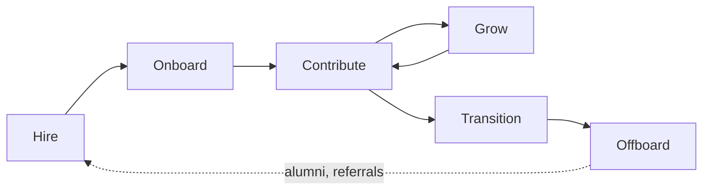

# Roles and the Employee Lifecycle

Before anyone can run a useful 1:1 or write a growth plan, two structural questions have to be settled: who is accountable for what, and where in their time at the company this person currently stands. Both change rarely, and both are assumed by everything in [Growing and Keeping People](04-growing-and-keeping-people.md), so they are worth writing down once rather than re-deciding per person.

Related: [Engineering Management](01-delivery-management.md) · [Team Lead](02-team-lead.md) · [Knowledge Sharing](05-knowledge-sharing.md)

## Scope

The people side of management splits into six areas. The first two are settled by structure — by the roles defined below and by the lifecycle stage a person is in — and the other four are worked continuously in [Growing and Keeping People](04-growing-and-keeping-people.md).

| Area | Question it answers | Primary artifact |
| --- | --- | --- |
| **Staffing** | Do we have the right people and skills? | Role definitions, hiring plan, skill matrix |
| **Onboarding** | How fast does a new person become productive? | Onboarding checklist, first-90-days plan |
| **Alignment** | Does each person know what "good" means for them? | Expectations, goals, definition of done |
| **Growth** | Is each person getting better at something? | Career ladder, growth plan, learning budget |
| **Feedback** | Does each person know where they stand? | 1:1 notes, review cycles, feedback given |
| **Health** | Can this pace be sustained? | On-call load, unplanned work, sentiment, attrition |

The six are sequential in a person's experience and simultaneous in a manager's week.

## Roles

Titles vary by company; the *accountabilities* do not. Confusion here is a common source of dropped work.

| Role | Owns | Does not own |
| --- | --- | --- |
| **Engineer (IC)** | Their own delivery and craft | Team scope, priorities |
| **Tech Lead** | Technical direction of a team's work | Careers, compensation, performance |
| **Team Lead** | Day-to-day flow, unblocking, local process | Usually not compensation or headcount |
| **Engineering Manager** | People, performance, hiring, headcount, delivery | Detailed technical decisions |
| **Staff / Principal** | Technical scope across teams | Line management |

Two rules: **one accountable person per accountability**, and **the person who runs someone's 1:1s is the person who owns their growth**. If those split across two people, say so explicitly and agree who gives which feedback.

## The Employee Lifecycle

| Stage | Manager's job | Success signal |
| --- | --- | --- |
| **Hire** | Define the role by the gap it fills; run a consistent, evidence-based loop | The scorecard predicted the first six months |
| **Onboard** | Give context, a buddy, and a small real task in week one | First meaningful merge within days, not weeks |
| **Contribute** | Set expectations, remove friction, give feedback continuously | The person knows what "good" means without asking |
| **Grow** | Match assignments to the next level's scope, not the current one | Autonomy rises while quality holds |
| **Transition** | Promote, move, or reassign before frustration forces the issue | Internal moves outnumber surprise resignations |
| **Offboard** | Capture knowledge, exit honestly, keep the relationship | Handover exists; the person would return |

**Key property:** every stage is cheaper than the one before it fails into. Onboarding well is cheaper than re-hiring.

The offboard stage is where an unexamined [Bus Factor](04-growing-and-keeping-people.md#core-concepts) turns into lost work, so treat handover as a deliverable with a reviewer rather than a conversation — the practices that keep the number above one are in [Knowledge Sharing](05-knowledge-sharing.md).

## Anti-patterns

| Anti-pattern | Why it fails | Correction |
| --- | --- | --- |
| Promoting the best coder to manager by default | Different job, different skills; loses an engineer and gains a poor manager | Dual ladder — IC track with equal ceiling |
| Hiring for "culture fit" | Selects for sameness; suppresses dissent | Hire for values alignment and skill gap |
| Onboarding as document dump | Context does not transfer by reading | Buddy plus a small real task in week one |

## Checklists

**When someone joins:**

- [ ] Role, level, and expectations written down before day one
- [ ] Accounts, access, and environment ready on day one
- [ ] Buddy assigned; first 1:1 scheduled in week one
- [ ] A small, real, shippable task in week one
- [ ] 30/60/90-day checkpoints in the calendar

**When someone leaves:**

- [ ] Knowledge handover written, not just walked through
- [ ] Ownership of systems and rituals reassigned by name
- [ ] Access revoked on the last day
- [ ] Honest exit conversation held and the cause recorded
- [ ] Team told directly, before the rumor
