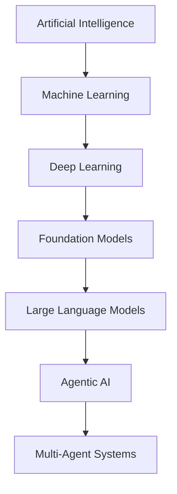

# Artificial Intelligence

**Artificial Intelligence (AI)** is the engineering discipline of building systems that perform tasks
normally requiring human cognition — perception, reasoning, learning, planning, and language.

Modern AI is not one technique but a nested stack: broad **AI** contains **machine learning**,
which contains **deep learning**, which today powers **large language models** that, when wrapped in
loops with tools and memory, become **agents** — and agents composed together form **multi-agent systems**.

## The Layered Map

| Layer | What it is | Defining idea |
| ------- | ------------ | --------------- |
| **Artificial Intelligence** | Any system exhibiting intelligent behavior | Goal-directed problem solving |
| **Machine Learning (ML)** | Systems that improve from data rather than explicit rules | Learn a function from examples |
| **Deep Learning (DL)** | ML with many-layered neural networks | Learn representations automatically |
| **Foundation Models** | Large models pre-trained on broad data, adaptable to many tasks | Transfer learning at scale |
| **Large Language Models (LLM)** | Foundation models for text/sequence prediction | Next-token prediction over language |
| **Agentic AI** | An LLM that plans, acts via tools, and observes results in a loop | Autonomy through the perceive–decide–act cycle |
| **Multi-Agent Systems (MAS)** | Multiple coordinating agents solving a shared goal | Division of labor and communication |

---

## Machine Learning Foundations

**Machine Learning (ML)** is the branch of AI where behavior is learned from data rather than written
as explicit rules.

The learning paradigms and the core training/inference concepts live in their own guide:
[Machine Learning Foundations](22-machine-learning.md).

---

## Deep Learning

**Deep Learning** uses neural networks with many layers that learn hierarchical representations directly
from raw data, removing the need for hand-crafted features.

| Concept | Definition |
| --------- | ------------ |
| **Neuron / Unit** | A weighted sum of inputs passed through a non-linear activation |
| **Layer** | A group of units; depth (stacking layers) enables hierarchical features |
| **Activation Function** | Non-linearity (ReLU, GELU, sigmoid) enabling complex function approximation |
| **Backpropagation** | Algorithm computing gradients of loss w.r.t. each weight via the chain rule |
| **Gradient Descent** | Iterative weight update in the direction that reduces loss (SGD, Adam) |
| **Loss Function** | Scalar measure of prediction error to be minimized |
| **Regularization** | Techniques (dropout, weight decay) that curb overfitting |
| **Embedding** | A dense vector representation capturing semantic similarity in geometric space |

| Architecture | Best suited for |
| -------------- | ----------------- |
| **MLP** (feed-forward) | Tabular and general function approximation |
| **CNN** (convolutional) | Images and spatial data |
| **RNN / LSTM** | Sequences (legacy; superseded by transformers for most NLP) |
| **Transformer** | Sequences via attention; foundation of modern LLMs |
| **Diffusion** | Generative images/audio by iterative denoising |

---

## Large Language Models (LLM)

An **LLM** is a transformer-based model trained on vast text corpora to predict the next **token**,
acquiring broad knowledge and language ability as an emergent side effect of that single objective.

Mechanics, training lifecycle, inference controls, and usage techniques live in their own guide:
[Large Language Models](22-llm.md).

---

## Glossary

| Term | Meaning |
| ------ | --------- |
| **AGI** | Artificial General Intelligence — hypothetical human-level breadth of capability |
| **Alignment** | Ensuring an AI's behavior matches human intent and values |
| **Attention** | Mechanism weighing the relevance of tokens to one another |
| **Backpropagation** | Gradient computation across network layers via the chain rule |
| **Context Window** | Max tokens a model can process in one call |
| **CoT** | Chain-of-Thought — explicit step-by-step reasoning |
| **Embedding** | Dense vector encoding meaning for similarity search |
| **Fine-tuning** | Further training a model on task-specific data |
| **Foundation Model** | Large general model adaptable to many downstream tasks |
| **Hallucination** | Plausible but factually incorrect model output |
| **Inference** | Generating predictions from a trained model |
| **LLM** | Large Language Model |
| **MCP** | Model Context Protocol — open standard for connecting models to tools/data |
| **MoE** | Mixture of Experts — activate a subset of parameters per token for efficiency |
| **Parameter** | A learned weight in a neural network |
| **Quantization** | Reducing weight precision to shrink and speed up models |
| **RAG** | Retrieval-Augmented Generation |
| **RLHF** | Reinforcement Learning from Human Feedback |
| **Token** | Sub-word unit of text |
| **Transformer** | Attention-based architecture underpinning modern LLMs |
| **Vector Database** | Store optimized for nearest-neighbor search over embeddings |
| **Zero-/Few-Shot** | Solving tasks with none / a few in-context examples |

---

## Perspectives

| Lens | View |
| ------ | ------ |
| **Capability** | LLMs are powerful pattern predictors, not reasoners with grounded truth — treat output as a draft to verify, not an oracle |
| **Engineering** | Favor deterministic workflows; introduce autonomy only where the task genuinely demands it. Measure, log, and evaluate like any other system |
| **Reliability** | Non-determinism, hallucination, and prompt sensitivity make testing and evaluation (evals) first-class engineering concerns |
| **Economics** | Cost scales with tokens and model size; caching, smaller models, and tight context control are core optimizations |
| **Safety & Ethics** | Bias, privacy, misuse, and alignment risks grow with autonomy — keep humans in the loop for consequential actions |
| **Scaling** | "The Bitter Lesson": general methods that leverage compute and data tend to win over hand-crafted, domain-specific cleverness |
| **Human Role** | Best results come from human–AI collaboration: the model accelerates, the human directs, judges, and owns the outcome |

---

## References

### Foundational Papers

| Title | URL |
| --- | --- |
| Deep Learning (LeCun, Bengio, Hinton, *Nature* 2015) | <https://www.nature.com/articles/nature14539> |
| Attention Is All You Need (Transformer) | <https://arxiv.org/abs/1706.03762> |
| BERT | <https://arxiv.org/abs/1810.04805> |
| Language Models are Few-Shot Learners (GPT-3) | <https://arxiv.org/abs/2005.14165> |
| Chain-of-Thought Prompting | <https://arxiv.org/abs/2201.11903> |
| Training LMs to Follow Instructions with Human Feedback (InstructGPT/RLHF) | <https://arxiv.org/abs/2203.02155> |
| ReAct: Synergizing Reasoning and Acting | <https://arxiv.org/abs/2210.03629> |
| Toolformer: Language Models Can Teach Themselves to Use Tools | <https://arxiv.org/abs/2302.04761> |
| Retrieval-Augmented Generation (RAG) | <https://arxiv.org/abs/2005.11401> |

### Guides and Documentation

| Resource | URL |
| --- | --- |
| The Bitter Lesson (Rich Sutton) | <http://www.incompleteideas.net/IncIdeas/BitterLesson.html> |
| Deep Learning Book (Goodfellow, Bengio, Courville) | <https://www.deeplearningbook.org/> |
| Building Effective Agents (Anthropic) | <https://www.anthropic.com/engineering/building-effective-agents> |
| Anthropic Documentation | <https://docs.anthropic.com/> |
| OpenAI Documentation | <https://platform.openai.com/docs> |
| Hugging Face Documentation | <https://huggingface.co/docs> |
| Prompt Engineering Guide (DAIR.AI) | <https://www.promptingguide.ai/> |
| Model Context Protocol (MCP) | <https://modelcontextprotocol.io/> |
