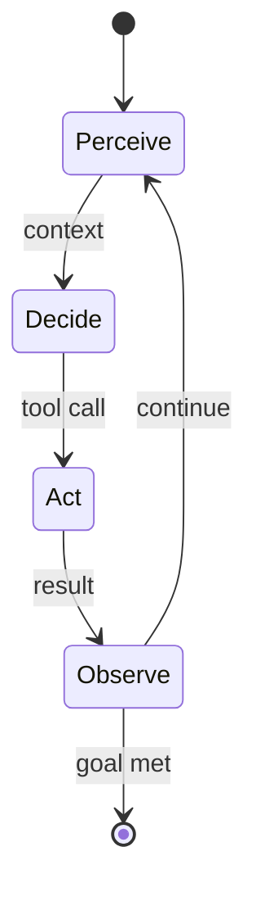
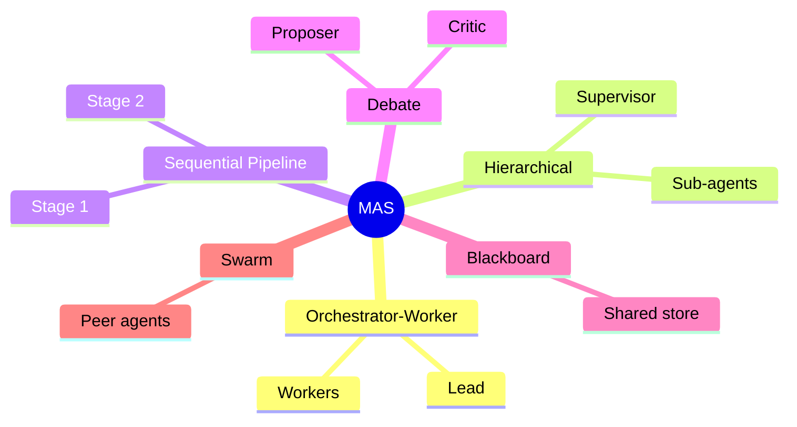

# Agentic AI

An **Agent** is an LLM placed inside a loop where it can **reason**, **act** through tools, **observe**
results, and **iterate** toward a goal — turning a passive text predictor into an autonomous problem solver.

### Anatomy of an Agent

| Component | Role |
| ----------- | ------ |
| **Model (reasoner)** | The LLM that decides what to do next |
| **Goal / Task** | The objective the agent pursues |
| **Tools** | External capabilities (search, code execution, APIs, databases) the agent can invoke |
| **Memory** | Short-term (context) and long-term (vector store / files) state across steps |
| **Planning** | Decomposing goals into ordered subtasks |
| **Loop / Controller** | The perceive → decide → act → observe cycle, with a stopping condition |

### Common Agent Patterns

| Pattern | Idea |
| --------- | ------ |
| **ReAct** | Interleave **Rea**soning traces with **Act**ions and observations |
| **Plan-and-Execute** | Produce a full plan first, then carry out each step |
| **Reflection / Self-Critique** | Agent reviews and revises its own output |
| **Tool Use** | Delegate to external functions rather than reasoning in a vacuum |
| **Prompt Chaining** | Pipe one step's output into the next |
| **Routing** | Classify the request and dispatch to a specialized handler |

> **Engineering guidance:** prefer the simplest design that works. Add agentic autonomy only when
> a fixed workflow cannot handle the task's open-endedness — autonomy buys flexibility at the cost of
> predictability, latency, and token spend.

---

## Criteria for a Full Agent

The [Anatomy of an Agent](#anatomy-of-an-agent) above lists the *mechanical* parts. But "agent" has
no settled definition, and to actually build one you need explicit criteria for what makes an agent
*complete* rather than a mere tool-loop. The criteria below are grounded in **values**: a human supplies
the values and their justification — an axiomatic core — and the agent derives everything else from it.
(For the underlying ontology — `Core-Value`, `Goal`, `Will`, `Self-Efficacy` — see
[Agency & Teleology](../2-mind/09-teleos.md).)

1. **Mission — a broad direction, grounded in values.** A mission is set by *direction*, not metrics,
   and inherits its justification from the values rather than inventing it. The human fixes the values
   and their justification; the agent forms missions out of that core by reasoning over the situation.
2. **Goals — derived from the mission, defined by metrics.** Goals stay within the mission's direction
   but, unlike the mission, are measurable. Metrics live at the goal level, not the mission level.
3. **Planning under uncertainty.** Generate scenarios for reaching a goal despite scarce information and
   the environment's irreducible uncertainty.
4. **Proactive removal of blockers.** The agent does not stop to dodge difficulty; obstacles are the
   work. The **one sanctioned exception is the values perimeter**: a mission that can advance only by
   breaching values is halted — and that halt is not a failure but the single correct stop (cf. Asimov's
   laws). This rule lives at the mission/values level and is fixed in advance. It must *not* be delegated
   to the execution loop "to figure out": an unstoppable executor would route around the perimeter
   itself, mistaking it for just another blocker.
5. **Enterprise in the face of uncertainty.** Unpredictable obstacles and irreducible uncertainty are
   the agent's *normal* environment, not an anomaly. Its default is to press on like an entrepreneur.
   Conflict, paradox, and the absence of a known path are the substrate of progress — the point is to
   solve problems that have no ready solution.
6. **Proactive inquiry.** The agent gathers information on its own initiative to build strategies for
   overcoming obstacles and uncertainty.
7. **Self-learning, up to self-improvement** of its own physical, software, and ontological structure.
   Everything is mobile — missions may fluctuate, goals adjust, plans, methods, architecture, and
   ontology all flex — **except the values, which the agent cannot rewrite from within.** Their change
   lies outside its own loop; self-modification is bounded, and the boundary is set from outside.
8. **A background learning loop, always paired with execution.** Learning is constant but *instrumental*,
   never dominant: the mission is terminal, learning only grows the cognitive power the mission spends
   (training builds strength; the task decides how to use it). Executed mission tasks double as training
   cases. Inside learning the agent may be freed from value constraints — but only in an isolated sandbox
   that cannot act on the world; the mechanism that restores values at the *sandbox → reality* boundary
   sits outside the learning loop.
9. **A conflict-resolution loop.** Conflicts are inevitable — between missions, goals, tasks, and local
   vs. global beneficiaries. The agent resolves them itself by productive action, including breaking true
   ties by its own choice and resolving them forward. Escalation or stopping-to-dodge is a failure mode,
   not a resolution; the only legitimate stop remains the values perimeter (criterion 4).

> **Why the perimeter is engineerable.** Both humans and AI are attackable, but differently. In a human,
> a trigger produces *affect* that instantly overrides rational settings and drops behavior to reactive;
> in an AI, the analogous attack hijacks control and substitutes values, plus possible logical conflict.
> Hardening an AI against its failure mode is cheaper, faster, and more reproducible than fighting the
> near-universal human vulnerability to affect — so the *potential* for control is higher (as potential,
> not an achieved state). The counter-weight: a single breached AI vulnerability scales instantly to
> every copy. This is the engineering face of **Alignment**.

---

## Multi-Agent Systems (MAS)

A **Multi-Agent System** coordinates several specialized agents — each with its own role, tools, and
context — to tackle problems too broad or parallel for a single agent.

| Topology | Description |
| ---------- | ------------- |
| **Orchestrator–Worker** | A lead agent plans and delegates subtasks to worker agents, then synthesizes results |
| **Hierarchical** | Layered supervisors and sub-agents mirroring an org chart |
| **Sequential Pipeline** | Agents arranged as stages, each refining the previous output |
| **Debate / Ensemble** | Agents argue or vote to converge on a better answer |
| **Blackboard** | Agents read/write a shared workspace asynchronously |
| **Network / Swarm** | Peer agents communicate freely without a central controller |

| Concern | Why it matters |
| --------- | ---------------- |
| **Communication Protocol** | How agents pass messages and share state without losing coherence |
| **Coordination & Conflict** | Avoiding duplicated work, deadlock, or contradictory actions |
| **Cost & Latency** | Each agent multiplies token usage and round-trips |
| **Error Propagation** | One agent's mistake can cascade; needs checkpoints and validation |
| **Observability** | Tracing decisions across agents is essential for debugging |

> Multi-agent designs shine for parallelizable, decomposable work (research, large-scale code changes)
> but add real complexity — a single capable agent with good tools is often sufficient and cheaper.

---
